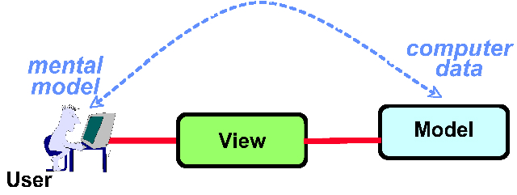
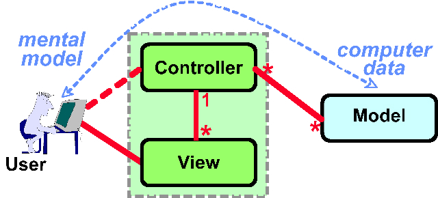

# The DCI Architecture: A New Vision of Object-Oriented Programming  
# DCI 架构：面向对象编程的新设想
by Trygve Reenskaug and James O. Coplien
March 20, 2009

## Summary
面向对象编程是一种用来将程序员与最终用户拥有相同视角的在计算机代码：这对程序的可用性以及理解都是有好处的。虽然对象可以很好地描述结构，但它们无法有效的描述系统行为。 DCI 是一种（新的）设想，旨在描述最终用户对角色模型及其之间的交互（行为）的认知。

## 对象主要是关于人和他们的心理模型，而不是多态性、耦合性和凝聚力。

面向对象编程源于Doug Englebart将计算机视为人类思维延伸的设想。Alan Kay 的 Dynabook 设想通常被认为是现代个人笔记本电脑的鼻祖，也许是这一设想的缩影：一台真正的个人电脑，几乎类似一个个人的伴侣，是自我的延伸。后来他又创造了一种语言Smalltalk，将这一设想带入到源代码中。事实上，面向对象编程先驱的目标是在代码中获得最终用户的心理模型。今天，我们留下了这些设想的遗产，即交互式图形界面的蓬勃发展以及面向对象语言在全球编程中的主导地位。

当用户使用GUI（图形用户界面）时，他或她会做两件事：<i>思考和行动</i>。为了人与机器之间的顺畅交互，计算机的“心理”模型（也是程序员的心理模型）和最终用户的心理模型必须以某种思维融合的方式相互协调。最后，用户在界面端所做的任何工作都会操作代码中的对象。如果程序提供有关用户操作如何影响程序状态的准确实时反馈，则可以减少用户错误和意外。一个好的 GUI 提供这样的服务。使用交互式程序就像医生试图通过患者的支气管导航探针：就像你看不到程序内存中的物体一样，你也看不到患者体内的实际探针。您需要程序结构或支气管探头的一些外部表示方法来指导您与程序的交互。

### 我们比较擅长结构与思维的融合
面向对象设计和模型-视图-控制器（MVC）框架都（广泛的）支持这一设想。MVC 的目标是提供让最终用户觉得从（自己的）大脑到计算机“大脑”（其内存和处理器）的想法是（完全）一致的。

在某些界面中，这种对应关系是显而易见的：如果您在PowerPoint®幻灯片上创建一个圆圈，则您脑海中的圆圈将直接映射到其在计算机内存中的表示形式。电子表格分类账的行和列映射到电子表格程序中就是屏幕中的行和列，而这些行和列又映射到程序中的数据结构。文本编辑器页面上的单词既反映了我们的书面文档模型，也反映了计算机存储文本的模型。结构化的对象方法使这种对齐成为可能，人类思维迅速与计算机的结构概念保持一致。

#### MVC是关于人和他们的心理模型的，而不是观察者模式
大多数程序员认为 MVC 是观察者模式的几个实例的花哨组合。大部分编程环境都提供了 MVC 基类，可以扩展这些基类以同步模型、视图和控制器的状态。（模型、视图和控制器实际上是那些可由用户所提供的对象来扮演的角色 — 稍后我们将详细讨论角色）。所以这只是一种管家技术（housekeeping technique），是吧？ 这样来看他就是机械的角度触发。我们将这种透视称为“模型-视图-控制器”。更深入地说，该框架的存在是为了将信息的表示与用户交互分开。再这种请胯下，我们称之为“模型-视图-控制器-用户”，描述工作中的所有四个重要参与者 - 简称MVC-U。

它可以很好地帮助我们更准确的定义其他术语。MVC-U就是在计算机数据与最终用户头脑中的东西之间建立联系。数据是信息的表示;在计算机中，我们经常将它们表示为比特。但是这些bit本身没有任何意义：它们只有在用户之间发生交互时才有意义。最终用户的头脑可以解释这些数据;然后它们成为信息。信息是我们用于解释数据的术语。信息是（描述/展现）最终用户心理模型的关键元素。

此映射首先在最终用户接近交互式界面时发生，使用它来建立绘制界面的数据与其业务领域模型之间的关系。一个设计良好的程序可以很好地包含数据模型中的信息模型，或者至少提供这样做的错觉。如果软件可以做到这一点，那么用户就会觉得计算机内存是他或她的思维的扩展。如果不是，那么“翻译”过程必须补偿这种不匹配。在代码中进行转换是很尴尬的（如果编码人员知道最终用户的认知模型，则没有必要做这个事情）。对于最终用户来说，在他们的脑海中实时进行这个映射过程是痛苦的、尴尬的、令人困惑的和容易出错的。将这两个模型统一起来则称之为直接操作的暗示（<i>direct manipulation metaphor</i>）：最终用户实际上是在操纵内存中的对象，这些对象反映了他们脑海中的理解。

图1.直接操作

#### The Direct Manipulation Metaphor （直接操作隐喻 ？？？ 能否翻译成 所见即所得）

图2.模型-视图-控制器-用户

### ... but in spite of capturing structure, OO fails to capture behavior
### ... 但是 尽管描绘了结构，OO仍无法描述行为

### Where did we go wrong?
### 我们哪里做错了？

## Back into the Users' Head
## 重返用户的头脑中

#### Data: representing the user's mental model of things in their world

#### Roles: a (not so) new concept of action that also lives in users' heads

## Whole objects, each with two kinds of know-how

### Roles working together: Contexts and Interactions

#### Nested Contexts

### Traits as the design trick to combine characteristics and purpose

## Properties of DCI

### Other bits

### DCI fulfilling a bit of history

## End notes

## Acknowledgments

### Talk back!

### About the authors