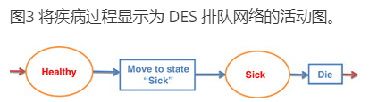

# 离散事件仿真生机勃勃！

S Brailsford
School of Management, University of Southampton, Southampton, UK

> 原文： https://www.tandfonline.com/doi/full/10.1057/jos.2013.13#

在2010年OR社会仿真研讨会上，有一个活跃的小组讨论，题为“离散事件仿真已死，基于代理的仿真万岁！”，随后被写成仿真杂志的立场文件（Siebers et al，2010）。本文将持续讨论，并引用马克吐温的话，认为离散事件仿真（DES）死亡的谣言被大大夸大了。毫无疑问，最近主流手术室社区对使用基于代理的建模的兴趣激增，但本文表明，基于代理的仿真（ABS）的许多引用的好处可以通过使用传统的DES方法来实现。这些论点通过几个例子来说明，其中DES已成功用于解决“ABS类型”问题。

## 1	Introduction
2010年OR社会仿真研讨会的亮点之一是小组讨论，由兰开斯特大学的Michael Pidd主持，主题是“离散事件仿真已死，基于代理的仿真万岁！该主题由诺丁汉大学的Peer-Olaf Sieber提出，其他小组成员是来自美国能源部伊利诺伊州阿贡实验室复杂自适应系统仿真中心的SW10主讲人Charles Macal，来自西苏格兰大学的Jeremy Garnett和来自dseConsulting Ltd.的David Buxton。该小组讨论随后被写成论文并发表在《仿真杂志》（JoS）上（Siebers et al， 2010）。从那时起，这个话题继续引起人们的兴趣。2011 年 3 月在萨里大学社会仿真研究中心举行的 OR 学会仿真特别兴趣小组会议上，讨论继续进行（与一些相同的小组成员一起），并且在 2011 年冬季仿真会议上进行了类似的小组讨论，扩展到跨范式建模（Heath 等人，2011 年）。

几乎没有必要为JoS的读者描述离散事件仿真（DES）的方法，因为JoS（读者）的范围，取自该杂志的网站，是提供...在快速发展的离散事件仿真（http://www.palgrave-journals.com/jos/index.html）领域提供单一的可访问研究和实践。对于许多操作研究人员来说，“仿真”是DES的代名词，这种方法已经在MSc OR课程中教授了几十年。即使是可以追溯到 1960 年代的系统动力学，也没有在主流手术室社区中如此受欢迎。然而，对于运营研究人员来说，基于代理的仿真（ABS）甚至不如系统动力学熟悉，尽管过去几年计算机科学和社会科学建模社区的兴趣日益浓厚。Charles Macal自己在SW10（Macal，2010）上发表的主题论文为该主题提供了很好的介绍：另见Macal and North （2009） 。以下两段简要介绍了ABS，并改编自Charles Macal对Heath等人（2011）的贡献。

ABS用于仿真由相互作用，自治实体或“代理”组成的复杂系统（Epstein和Axtell，1996，Bonabeau，2001）。代理是一个自包含且唯一可识别的个体，它存在于环境中，并且是自主和自我导向的。代理的行为由不同复杂性和抽象性的算法描述，从简单的确定性 if-then 规则到高度复杂的刺激-反应映射的抽象和随机表示。代理具有一个内部状态，表示与其在模型中的当前情况相关联的基本属性。代理的状态是动态的：代理的经验累积并记录在其内存中。ABS 模型的状态是所有代理的集合状态，结合环境状态。状态是代理模型的关键元素，因为代理的行为基于且仅基于其状态（？？行为是否还要基于环境？？？不光是自身状态，或者是下一个部分内容？？？）。

代理与其环境交互，但它们也具有社交属性，并且与其他代理具有动态交互。ABS模型通常由网络表示，指定代理如何交互，交换信息和竞争资源。例如，代理可能会在地理位置上移动并争夺空间。代理的行为可以是适应性的，可以是目标导向的，也可以只是被动的。典型的 ABS 模型有三个元素：（1） 一组代理，包括其属性和行为，（2） 一组代理关系和交互方法（定义代理与谁以及如何交互的底层拓扑），以及 （3） 代理的环境。模型开发人员必须在计算机软件中识别、建模和编程这些元素，以创建 ABS 模型。

ABS的一个关键特征是，模型可以表现出“紧急”行为，这是整个系统的属性，而不是任何单个代理的属性。图14.1显示了简洁的视觉说明，由南安普敦大学电子与计算机科学学院复杂系统仿真研究所的Seth Bullock提供。在这里，单个点只有一个基本属性，即黑色或白色，但是这些线在打印页面环境中放置许多点后作为系统属性出现。

 

最著名的ABS模型之一甚至没有使用计算机来实现仿真。谢林（1971）在棋盘上开发了他最初的社会隔离模型，使用跳棋来代表代理人。在此模型中，代理位于网格上的正方形中。每个代理最多可以有八个相邻代理（因为某些相邻的方块可能为空，或者代理可能位于边正方形中）。代理有两个非常简单的属性。首先是它们的颜色：就像图14.1中的布洛克点一样，它们是两种不同的颜色（在图14.2的例子中是黑色和灰色）。第二个属性是他们容忍邻居与自己不同的颜色。例如，代理可能希望最多有三个不同颜色的邻居。该模型首先随机定位网格上的所有代理，然后以离散的时间步长向前移动。在时间T，如果一个灰色代理有两个或更少的黑人邻居，那么它会感觉很舒服，并在下一个时间步停留在原地。但是，如果它有三个或更多黑色邻居，它将在时间 T + 1 移动到随机选择的空方块。图 14.2 显示了带有黑色和灰色代理的 100 x 100 网格随时间推移的演变：白色方块为空。这个数字是由南安普敦大学的博士生Elisabeth zu Erbach Schoenberg制作的，他由我和Seth Bullock共同指导。

 

谢林模型令人震惊（或者可能只是令人惊讶）的事情是，这种个人偏好必须多么小，才能出现尖锐的隔离模式。在图14.2中，“容差水平”为50%。谢林用这一点来说明贫民窟是如何在城市中发生的，所有居民——作为个人——都会声称自己是宽容和开放的，只有非常温和的偏好住在“像他们一样”的人隔壁。贫民窟的存在是一个城市的新兴特征，其人口作为个人，可能对种族或宗教隔离的想法感到完全震惊。

ABS的吸引力是显而易见的：正如Charles Macal在SW10小组讨论中所说，“基于代理的模型可以明确地仿真现实世界中出现的个体行为和交互所产生的复杂性”（Siebers et al， 2010）。因此，社会学家、心理学家、经济学家、物理学家、生物学家和计算机科学家都使用ABS来探索关于现实世界系统级现象的想法和假设也就不足为奇了，这可以通过其组成部分的行动和行为来解释。这方面的一个例子是Billari的结婚戒指模型（Billari等人，2007），其中基于代理的模型用于“从合理的微观层面假设开始解释宏观层面的婚姻模式”（Billari等人，2007，第60页）。该模型假设婚姻伙伴关系的形成是个体主体之间社会互动的结果，这些主体位于同名的“环”上，这是一个二维空间，其中x轴代表社会距离，y轴代表年龄。线 X=max 由 y 轴标识，因此模型空间确实是一个闭环。在擂台上彼此靠近的经纪人年龄相近，在社交上也很接近。随着年龄的增长，来自Billari所说的“相关他人”的同伴压力增加，他们在他们的“邻居”中寻找可用的伴侣，这只是他们二维宇宙中的一个矩形。随着未婚代理人所在社区中越来越多的人自己已婚，那么经纪人对这种同伴压力的感受会更加强烈。这确实是一个合理的假设，基于人们二十多岁时的常见经验！该模型试图通过仿真配偶可用性和婚姻可取性的影响来证明个体主体之间的微观互动与人群中宏观层面的婚姻模式之间的联系，婚姻的可取性受到主体社交网络中相关其他人的影响。结果表明，该模型可以再现在现实世界中在人口水平上观察到的相同的婚姻统计概率。

## 2 Two sides of different coins
从上面的描述中可以清楚地看出，获取和惠益分享与DES有很多共同之处。DES 模型还由一组在环境中相互交互的实体组成。当然，DES 模型中的环境始终包括某种基于流程的系统，其中实体排队等待“服务”（广义定义）和/或竞争资源。但是，它可以比这更通用，正如我们将在后面的例子中展示的那样。DES 中的实体与 ABS 中的代理一样，具有确定它们在系统中的行为以及它们如何与环境和彼此交互的属性或特征。例如，如果第一个实体的优先级高于第二个实体，则一个实体可能会替换队列中的另一个实体，或者如果环境条件发生变化，一个实体可能会选择备用路径。

然而，谢林的例子也说明了ABS和DES之间的关键区别，Jeremy Garnett在SW10小组讨论（Siebers et al，2010）中对Sante Fe研究所在1990年代工作的评论中很好地总结了这一点。加内特说这项工作包括

...ABS的一些最著名的应用，如“生命游戏”，“植绒”，粘菌和谢林分离。这些例子具有很大的学术意义;特别是，它们似乎指向普遍的、基本的自然理论。但是，它们非常理论化，并且没有一个是基于实际实现的。因此，它们与手术室的实践相关性有限;OR通常不关心发现自然的基本理论。（Siebers 等人，2010 年，第 208 页）

实际上不是：OR主要关注在现实世界中解决问题。虽然物理学家和社会学家对自然的基本理论非常感兴趣，但大多数具有实际意识的操作研究人员从现实世界的问题开始，然后试图找到解决它的最佳务实方法。在我看来，在ABS被证明对此有用之前，它不会被OR从业者社区广泛接受。学术界对此类模型感兴趣的动机是不言而喻的——开发它们非常有趣，屏幕上的图形可视化可能令人着迷，而且通常很漂亮。此外，它们似乎确实暗示了关于现实世界的基本事实，这应该是有用的——我们都认为谢林模型应该告诉我们一些关于种族或宗教歧视的微妙而深刻的东西，可以用来影响政府政策。然而，尽管有大量真正有趣的学术出版物，但仍然很少有真正的实际应用的例子（行人流建模除外），其中ABS模型可以明确地证明在现实世界的决策中发挥了作用。

行人流ABS建模可以说是如此成功，因为这种模型中的代理行为非常简单且没有争议。代理基本上只有一个目标，即尽快前往他们选择的目的地。此外，在1989年希尔斯伯勒等重大人群灾难之后，所有新的大型公共建筑（如音乐厅和体育场馆）的安全法规现在要求设计师仿真场地的紧急疏散。许多规划师和体育场建筑师已经看到了这种仿真的好处，并将这些模型用于更常规的情况。人流模型也广泛用于公共交通，例如铁路和地铁站的设计。然而，商业行人流模型开发通常作为咨询进行，因为它具有一次性定制的性质，并且在开发基于CAD的场地布局的现实模型时需要高度专业化的专业知识。提供这种产品的咨询公司的一个例子是Legion（www.legion.com）。

尽管其方法的某些方面有上述相似之处，但是非常清楚的事情是ABS和DES完全不是一回事。梳理这些差异的问题之一是学科差异：套用另一位幽默作家的话，但这次是爱尔兰作家，1 ABS 和 DES 就像英国和美国一样——被一种共同的语言隔开。甚至仿真一词对工程师、生物学家、社会科学家或运筹研究人员来说也意味着不同的东西。大多数（但不是全部）ABS模型都包含某种空间拓扑或地理：在早期模型中，代理主要位于网格上，但如今谷歌地图或谷歌地球通常提供更令人印象深刻的背景（尽管在概念上与谢林的棋盘相同）。大多数（但不是全部）ABS 模型都包含某种网络体系结构来描述代理之间的关系。很少有DES模型具有空间方面，尽管有些模型有空间方面，很少有DES模型包含网络结构（尽管有些模型有）。因此，作为DES的长期用户，我认为DES是ABS的一个适当子集：任何DES模型都可以表示为ABS，但是有些ABS模型超出了DES中的标准功能，需要额外的建模结构，这些构造不是DES工具包的一部分。我在SW12上向观众提出的挑战是找到这两种陈述的反例。

但是，如果我们愿意承认DES是ABS的一个适当子集，那么自然会出现以下问题：DES在什么条件下就足够了，在什么条件下我们需要ABS的全部功能？SW10讨论承认，ABS软件实施远远落后于DES的软件实施。用户可以使用大量非常用户友好的 DES 工具，使建模者无需编写代码即可开发和运行模型。但是，为了开发ABS模型，编程技能是绝对需要的，通常是编写Java代码的能力。最著名的ABS工具Repast（http://repast.sourceforge.net，2011年11月11日访问）和Netlogo（http://ccl.northwestern.edu/netlogo/，2011年11月11日访问）基本上是学术软件，目前唯一可用的商业软件包Anylogic（http://www.xjtek.com/，2011年11月11日访问）仍然要求用户能够用Java编程，尽管有一个很好的拖放界面用于模型结构开发。这是一个主要缺点。当然，根据我自己的经验，能够用任何语言（或希望学习如何）编写计算机的OR理学硕士学生的数量逐年下降。因此，在这种情况发生变化并且我们有一个“代理的Simul8”之前，DES OR从业者用户社区的数量将大大超过ABS，并且可以使用DES包来仿真ABS方法的必要方面的建模解决方案将继续非常有用。

## 3	Challenges for DES
在最初的SW10小组讨论中，我是观众，并且是提出作为DES用户的问题的人，我是否一直在不知不觉（无辜地）使用ABS。我描述了我开发的艾滋病模型的一个例子，尽管实际上我实际上并不是在谈论Siebers et al（2010）中引用的1992年模型，而是后来的模型（Rauner et al，2005），其中实体被链接起来，以仿真撒哈拉以南非洲艾滋病毒母婴传播的影响。“linked lives”的概念在很大程度上是一门社会科学，类似于ABS的结构，然而这个模型是在Ruth Davies的POST软件（Davies and Davies，1994）中实现的，并且是DES的核心。

在SW10小组讨论和主题演讲中，Charles Macal列出了以下问题特征，使该问题成为ABS应用的良好候选者。在本节中，我们现在考虑其中的一些功能，并将提供示例（主要但不完全来自我自己以前的工作），其中DES很好地处理了该（这些）特定问题。

	当问题具有作为代理的自然表示时 - 当目标是对不同人群中个体的行为进行建模时。
	当代理与其他代理建立关系时，尤其是动态关系 - 代理关系形成并消散，例如结构化联系，社交网络。
	当单个代理对其行为进行空间或地理空间观察很重要时（例如，代理在景观上移动）。
	当智能体学习或适应或人群适应很重要时。
	当代理人参与战略行为，并在做出决定时预测其他代理人的反应时。
	当对合作、勾结或组建组织的代理人进行建模时。
	当过去不是未来的预测指标时（例如，当前不存在的新市场）。
	何时扩展到任意级别很重要，即可扩展性。
	当过程结构变化需要是模型的结果，而不是模型的输入时（例如，代理决定下一步要去哪个过程） 
(Siebers et al, 2010, p 205).

### 3.1	当目标是对不同人群中个体的行为进行建模时
40 多年来，医疗保健一直是使用 DES 的丰富应用领域。OR文献包含数百甚至数千个用于诊所，急诊科（ED），手术室，重症监护室和医院床位容量管理的DES模型示例。这些是排队系统的经典示例，患者流模型是主流的DES。然而，DES也被用于医疗保健中，以仿真患者在某些疾病阶段的进展。这些临床或“自然史”模型需要将疾病过程概念化为一组队列，并将从一个阶段过渡到下一个阶段作为一项活动。例如，考虑一个简单的三态模型{健康，生病，死亡}。作为 DES 模型，状态“正常”将建模为活动“移动到状态生病”的队列，状态“生病”将建模为活动“死亡”的队列。这在图 14.3 中显示为活动图，其中黑色箭头表示进出系统的入口和出口点。这是Siebers et al （2010）引用的艾滋病模型（Brailsford等人，1992）的概念模型。

自然史模型通常用于评估某些拟议干预措施的成本效益，例如筛查糖尿病视网膜病变（Davies等人，2000年）或心脏病的预防性治疗（Cooper等人，2008年）。在这些模型中，根据定义，患者群体非常多样化，患者实体通常会被赋予大量的临床属性，如年龄、性别、诊断日期、合并症（存在其他疾病）以及可能的社会经济属性，如婚姻状况或与医院的距离。所有这些因素都会影响模型中实体发生的情况。然而，人类行为也会影响疾病进展。如果患者不服用，任何药物都不会有效，可能是因为他们不喜欢它的副作用;如果人们不去接受筛查，可能是因为他们害怕结果，或者因为很难（甚至只是不方便）去15英里外的医院，任何筛查计划都不会有效。在DES模型中包括患者行为是Bernd Schmidt早期论文的关键目标（Brailsford和Schmidt，2003）。本文描述了在糖尿病患者群体中纳入健康相关行为（决定是否参加视网膜病变筛查）的效果。最近与Jenni Sykes和Paul Harper在乳腺癌筛查方面的工作（Brailsford等人，2012）使用了健康心理学的结构，计划行为理论（Ajzen，1991），以评估不同筛查政策的有效性，其中个别女性参加筛查的决定不仅仅是由固定的概率决定的， 而是在心理属性方面明确建模。鉴于媒体正在就乳房X光检查的好处和过度治疗的风险进行辩论，这项工作特别及时（http://www.bbc.co.uk/news/health-20135892，2012年10月30日访问）。

这样的模型无疑突破了DES的界限，但它们绝对是传统的DES，因为运筹人员会理解它，并且都发表在主流OR期刊上。

### 3.2	当代理与其他代理具有动态关系时
第3节第一部分中提到的艾滋病模型（Rauner等人，2005年）就是一个例子。该模型是用Pascal编码的，基于Ruth Davies的仿真引擎POST-面向患者的仿真技术（Davies和Davies，1994）。POST背后的想法是，医疗保健系统中的患者同时经历多个活动，如果发生状态更改，其中一些活动可能会中断，并且标准DES软件无法轻松处理并行或中断的活动。例如，患者可能正在“等待”通过健康状态过渡（如第 3.1 节所述在 DES 中建模），但也可能实际上是在等待医院门诊预约或手术。例如，如果患者出现急性症状，那么患者可能需要入院，门诊预约需要取消，并且可能无法进行计划的手术。在开机自检中，这一逻辑的技术实现是通过使用指针来实现的，指针是一种编码设备，能够快速识别和可能重新安排与该实体相关的所有未来活动。然而，在Rauner等人的论文中，我们能够使用相同的想法来调整“实体记录”以包括指向其他实体的指针。在这种情况下，一个女性实体与她的孩子有关，因此我们能够仿真母亲自己的艾滋病毒状况和健康状况影响其孩子的健康状况的事实。

该模型的目的是评估预防传播的预防策略，特别是回答非洲，特别是坦桑尼亚的奶瓶喂养是福还是祸的问题，本文的数据来自坦桑尼亚。如果一名妇女是艾滋病毒阳性，她就有可能通过母乳喂养将病毒传播给婴儿。另一方面，安全的奶瓶喂养依赖于清洁水和设备的良好供应。在非洲的许多农村地区，可能缺乏这种疾病，因此奶瓶喂养增加了腹泻的死亡风险，腹泻是发展中国家的主要杀手。这两种风险之间的偏差取决于许多个人因素，例如母亲的感染阶段，母乳喂养的时间长短和抑制传播的药物的可用性，以及清洁水和清洁设备的可用性。因此，更像ABS的模型动作都发生在影响实体行为的环境中。“乳房还是奶瓶”的问题取决于当地的基础设施、水质等，这意味着婴儿腹泻的死亡风险可能超过感染艾滋病的风险。该模型的目的是确定建议妇女用奶瓶喂养的条件。

当然，为了开发 POST 模型，仍然需要能够编写 Pascal 代码。事实上，要在像 Simul8 这样的软件包中开发这样的模型需要大量的定制编码，并且可能会扩展到突破 Visual Logic 的功能。尽管如此，这个模型无疑是一个 DES，它确实捕获了实体的动态关系。婴儿出生，死亡;妇女怀孕，经历怀孕的三个三个月并生下新生儿;母亲重新喂养或奶瓶喂养婴儿;母亲可能在子宫内、分娩期间或通过母乳喂养将艾滋病毒传染给子女;兄弟姐妹可以通过家庭中的接近将病毒传播给彼此。

### 3.3	当单个代理的行为具有空间方面（需求）时
这里介绍了三个行人流模型，都是由南安普敦的理学硕士生开发的，作为他们暑期论文项目的一部分。所有三个模型都使用Simul8（www.simul8.com）来仿真物理位置周围的人流。其中一个（www.simul8.com）在SW06上提出，但该领域的第一项工作实际上是在3年前由Jane McMurdie（McMurdie, 2002）进行的。麦克默迪的模型代表了海布里足球场东看台大厅周围的人流脚注2.Simul8模型表示人们聚集或排队的地方，例如食品店，酒吧，投注店和厕所，并显示了当通过不同旋转栅门进入的人数发生变化时拥堵情况如何变化。每个位置的面积（以平方米为单位）是已知的，因此每个“队列”中的人数可以用来计算大厅每个不同部分的拥堵程度。该模型的目的是研究在开球准备期间打开或关闭各种旋转栅门的影响。

丹尼尔·斯图宾斯（Daniel Stubbins）为南安普敦大学的一栋建筑开发了一个模型，并展示了如何用它来仿真发生火灾时的紧急疏散。该模型非常详细，包括建筑计划，大学时间表，与每个讲座的学生人数和员工工作时间有关的数据。疏散子模型使用心理和社会行为参数来仿真人们在不同情况下的行为方式，并通过楼梯和门口等瓶颈。该模型用于调查政策和结构变化对建筑物的可能影响。目的是展示拟议设计更改对入口门厅的影响以及保持地下室门永久解锁的效果。虽然这个模型实际上借鉴了ABS，Dirk Helbing的共享软件行人逃生恐慌，但ABS方面是单独运行的，结果硬连线（通过Excel）到Simul8模型中。因此，该模型比 Highbury 模型更复杂，并且由于需要从 Excel 读取数据而运行时间相当长，但基本建模方法是 DES。尽管从模型中成功地获得了有用的结果，但用于创建模型的技术并非没有问题。模型的复杂性、冗长的施工时间和较长的运行时间可能使得使用标准 DES 包对于规模更大的项目来说是一个不明智的选择，但该模型表明，在紧急情况下，可以使用标准 DES 工具对建筑物的复杂行人出口进行建模。丹尼尔是OR协会的May Hicks奖的亚军之一。
第三个模型由大卫·斯通于2011年为伦敦的一个主要旅游景点开发。出于安全原因，无法命名实际位置，也无法以图形方式显示模型布局，但读者可以通过客户主管是Yeoman Warder的事实来猜测它在哪里。该模型表示网站布局，并显示了当访客数量达到一定水平时使用单向流系统的效果。与其他两个模型一样，David的模型使用了学生版Simul8的标准设施，但成功地捕获了从一个位置移动到另一个位置的空间方面，以及随着给定区域中实体数量的增加而拥堵的影响。在大卫和简的模型中，人们不仅从A走到B，而且还在B上花费一定的时间，在某些情况下包括一些实际的排队 - 例如，在Highbury模型中的快餐店吃喝，或者参加导游，或者只是在旅游景点闲逛拍照。排队、上菜和饮食活动显然是使用 DES 非常自然地建模的。在Simul8中，从A到B的步行被建模为“虚拟”活动（工作中心），并在屏幕上直观地描绘，以显示任何拥堵。
当然，这些模型都无法与Legion这样的复杂工具竞争，但它们都包含了类似代理的行为，即希望以特定速度从A到B，这允许不同的实体类型而变化。在每种情况下，模型都叠加在建筑师的CAD图上，或者在旅游景点的情况下，从互联网上下载的站点地图上，这使模型具有客户满意的视觉吸引力。至关重要的是，这三个都是由理学硕士学生（诚然，三名优秀学生！）使用现成的DES软件包的学生版本开发的 - 在3个月内，成本仅为Legion等产品的一小部分。

### 3.4	当代理人从事战略行为时

DES 基于实体竞争资源的排队系统的概念。在 DES 中，可以通过多种方式实现有关在有选择时加入哪个队列的路由决策，这些方式既反映单个实体的特征，又反映系统状态。Simul8软件包含超过六种这样的方法，包括简单的旋转（如发一手牌），最短的队列和复杂的“基于标签”的路由，可以使用用户定义的概率分布和Visual Basic编码的决策规则。这样的路由决策算作 DES 还是 ABS 是值得商榷的！

例如，使用 Simul8 在威尔士择期膝关节手术的背景下对患者选择进行建模。每个患者在医院之间的选择不受某种固定概率分布的支配，而是由每个人在观察系统状态时做出的个体决定决定，该决定是根据每个位置的预期等待时间来衡量的。因此，这种模式下的患者知道彼此的选择，甚至可能试图玩弄系统以获得更快的治疗。其他因素会影响患者的选择，例如到医院的旅行距离和该单位的声誉。患者选择是英国国家卫生服务的一个热门话题，迄今为止主要由健康经济学家研究，经常使用离散选择实验方法，要求患者相互权衡服务的不同特定属性，从而能够得出关于人们偏好的统计有效结论。

通过在 Visual Basic for Applications 中对所有这些主观、客观和系统因素的复杂数学函数进行编码，对个人的路由决策（患者选择）进行建模。该模型用于确认经济学的博弈理论结果，称为“无政府状态的代价”，它比较了中央控制和分布式系统之间的全球效率。Roughgarden考虑了道路网络上的路线决策，并表明，与中央控制器为他们做出所有决策的情况相比，当个别司机做出自己的自私决定时，整个人口的总行驶时间更大。奈特等人的模型表明，增加选择实际上会导致整个卫生系统的平均患者等待时间增加。

即使是DES最狂热的崇拜者也可能认为使用ABS工具开发这种患者选择模型更自然。事实上，ABS的支持者可能会有理由争辩说，这种“游戏”环境，自私的个人为自己的个人利益行事，正在呼唤ABS。但是，有必要在此类模型中嵌入 DES 以捕获排队方面 — 毕竟，这是此模型目的的核心。

### 3.5	当过去不是未来的预测指标时
这是一个棘手的领域。从某种意义上说，如果过去是未来的预测指标，那么我们根本不需要仿真：我们可以使用“黑匣子”统计预测方法，并完全基于对历史数据的分析来做出决策。任何仿真模型都会或多或少地打开黑匣子，并试图解开系统组成部分之间的关系，使这些关系明确，以便探索和更好地理解系统行为的驱动因素。ABS和DES都试图预测如果事情发生变化会发生什么——它们只是黑匣子的打开方式不同，从底部或顶部。在DES中，建模者预先指定所有系统规则，然后让个人进入其中，从上面像上帝一样向下看，看看接下来会发生什么。在ABS中，没有“系统规则”，只有个人行为。

所有动态模型都内置了关于模型随时间演变方式的假设。这些假设可能基于历史数据，或专家意见，或纯粹的猜测，具体取决于建模者对现实世界系统的了解。在ABS中，这些假设是自下而上的：我们不会对系统施加全局规则，但我们仍然必须为代理定义个人行为，并根据必须编码到模型中的算法来描述这些行为。这些行为基于关于个体如何对来自其他因素或环境的刺激做出反应的假设。即使在一个全新的环境中，我们也必须告诉计算机代理在特定情况下的行为。当然，在此之后，我们设置模型运行，看看会发生什么。

在 DES 中，假设与活动硬连线，并且必须将实体遵循特定路线或花费特定时间执行某些活动的条件编码到模型中。在这种情况下，我们是在系统上强加全局规则，但是当我们设置模型运行时，我们只是让各个实体决定它们会发生什么，这反过来又会影响系统的全局状态。

例如，考虑医院急诊室如何应对重大不可预见的灾难（例如福岛核电站爆炸）的模型。在ABS和DES中，我们需要仿真患者和医院工作人员在极端压力条件下的行为方式。工作人员必须处理可怕的创伤和工作量的压力，这是他们以前从未经历过的，与正常患者相比，患者的行为肯定会有所不同。无论我们是否使用ABS或DES，我们都必须假设个人对这些特殊情况的反应方式，以便对ED的表现进行建模。例如，分诊现在意味着决定哪些患者得到治疗，哪些患者不接受治疗——在战场条件下，受伤最严重的患者实际上比生存机会更高的患者获得的优先级更低。在ABS中，对医生关于值得尝试拯救哪些患者的决定进行建模意味着将个人反应的规则（这将是患者病情，医生的个人特征和资源可用性的函数）编程到代理本身中，而在DES中，完全相同的规则被编程到“分类”活动中。

这种模型在国防领域是熟悉的领域，其中大规模DES模型通常用于战争游戏，以评估不同的军事战略。无论使用何种建模方法，DES和ABS都可以告诉我们在这种情况下组织ED的最佳方式，但在这两种情况下，仍然有必要假设人类在不可预见的情况下的行为。

## 4.结论：这一切都取决于...
这是举世公认的真理，学者们喜欢争论，尤其是关于没有人可以最终证明对错的问题。ABS和DES本质上是同一回事，还是完全不同的，或者一个是否是另一个的适当子集，这个问题可能会引起与运筹学和管理科学之间的差异一样多的学术辩论。这份立场文件代表了作者的特殊观点，几乎可以肯定包含几个自相矛盾的地方！然而，对于运营研究人员来说，重要的是我们开发的仿真模型能够解决现实世界中的实际问题。我们被要求处理的大多数现实世界问题都具有由 建模的患者选择问题的部分或全部特征。这些“混乱”的问题涉及人类在面对不确定性时的行为和决策（并不总是理性的），在一个系统中，经常有许多利益相关者的目标相互冲突;质量和服务绩效指标可能难以定义、达成一致或排名;资源通常是稀缺的，因此必须采用某种配给机制;出于公平和公正的原因，可能存在一个基本的资源排队系统，其中必须将优先权分配给某些个人;整个系统可能是高度政治化的。此外，显然还有许多其他考虑因素，例如建模师（和客户）的偏好，对建模范式的技能和熟悉程度，项目可用的时间和金钱，以及软件，数据和利益相关者输入的可用性。DES或ABS是否更适合这些混乱的现实世界问题仍然是一个有争议的问题。SW12的讨论是活跃的，固执己见的，非常愉快，但肯定没有导致任何结论。除非有人开发出一个可以无可争议地证明不可能代表为DES的ABS模型，或者相反，一个不能表示为ABS的DES模型，否则陪审团似乎将一直处于不利地位。
