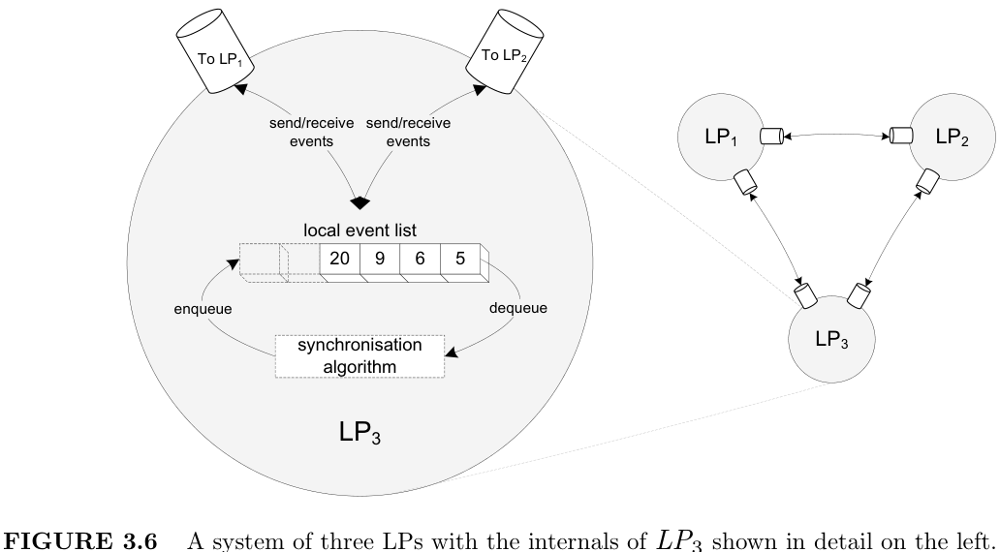
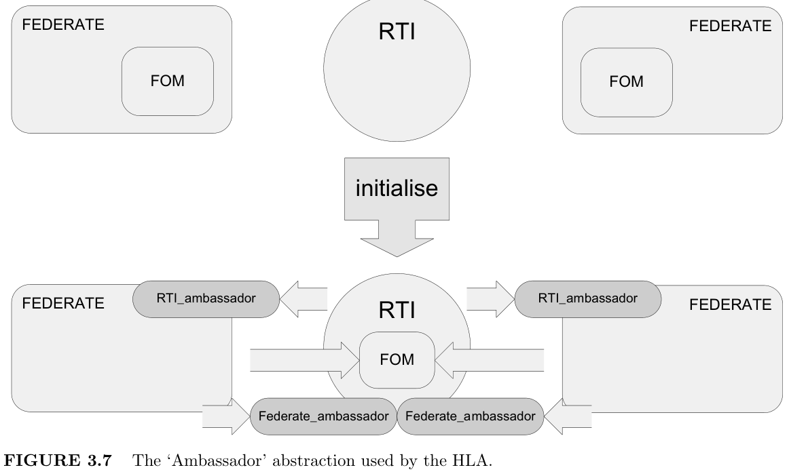
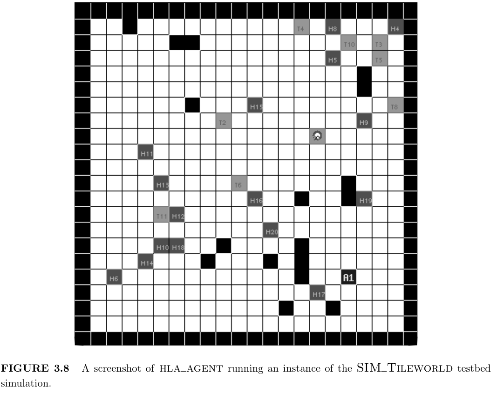
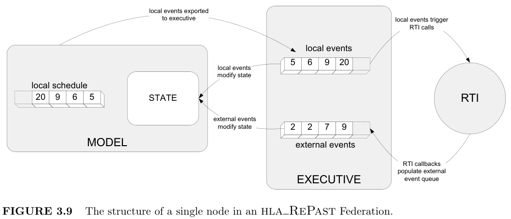
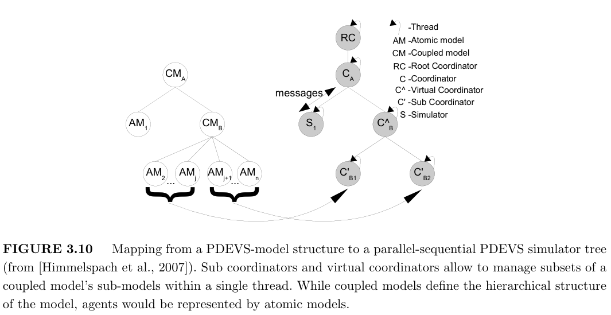
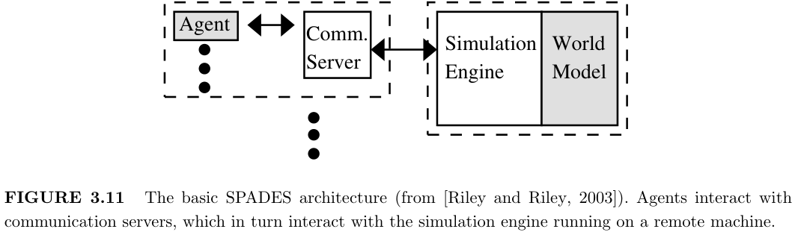
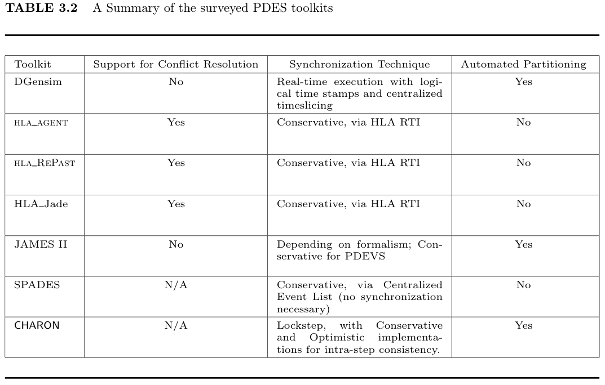
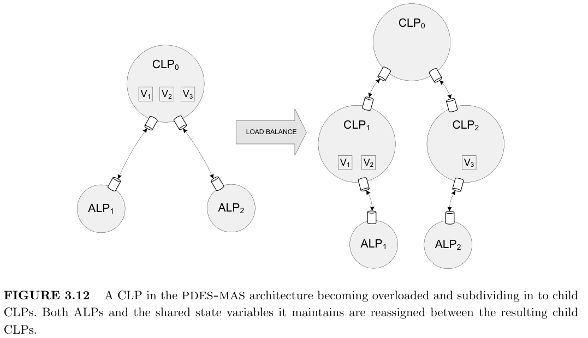

# Chapter 3 用于多智能体系统的仿真引擎
> Simulation Engines for Multi-Agent Systems
 
## 3.1 Introduction

> Multi-agent systems (MAS) are often extremely complex and it can be difficult to formally verify their properties. As a result, design and implementation remains largely experimental, and experimental approaches are likely to remain important for the foreseeable future. Simulation is therefore the only viable method to rigorously study their properties and analyze their emergent behavior.

多智能体系统 （MAS） 通常非常复杂，并且很难正式验证其属性。因此，设计和实现在很大程度上仍然是实验性的，而实验方法在可预见的未来可能仍然很重要。因此，仿真是严格研究其特性并分析其紧急行为的唯一可行方法。

> Over the last two decades, a wide range of MAS toolkits and testbeds have been developed and applied in different domains. A number of surveys of these systems have appeared in the literature in recent years, e.g., [Serenko and Detlor, 2002; Gilbert and Bankes, 2002; Tobias and Hofmann, 2004; Mangina; Railsback et al., 2006]. However, these have tended to focus on the high level support that these toolkits offer for the process of agent specification and model creation. In contrast this chapter focuses on the simulation engines integrated in to these toolkits to facilitate the execution of the resulting MAS models. In this context a simulation engine is taken to be any virtual machine which provides controlled execution of the model.

在过去的二十年里，已经开发了广泛的 MAS 工具包和测试平台，并将其应用于不同的领域。近年来，文献中出现了对这些系统的许多调查，例如，[Serenko 和 Detlor，2002 年;Gilbert 和 Bankes，2002 年;Tobias 和 Hofmann，2004 年;曼吉娜;Railsback et al.， 2006]。但是，这些往往侧重于这些工具包为 agent 规范和模型创建过程提供的高级支持。相比之下，本章重点介绍集成到这些工具包中的仿真引擎，以促进生成的 MAS 模型的执行。在此上下文中，仿真引擎被视为提供模型受控执行的任何虚拟机。

> This chapter is organized as follows: Section 3.2 first discusses what types of MAS model - in terms of the architecture of an individual agent and the mechanisms by which it interacts with its environment - are executed using these engines; section 3.3 then surveys the engines used by the currently available toolkits in the context of these observations about MAS model types; Sections 3.4 and 3.5 then explore recent and future research in to distributed simulation engines which aim to provide both scalability and interoperability to MAS simulation models.

本章的组织方式如下：
- 第 3.2 节首先讨论了使用这些引擎执行哪些类型的 MAS 模型 - 就单个代理的架构以及它与环境交互的机制而言;
- 然后，第 3.3 节在关于 MAS 模型类型的观察的背景下调查了当前可用的工具包使用的引擎;
- 然后，第 3.4 节和第 3.5 节探讨了分布式仿真引擎的最新和未来研究，这些引擎旨在为 MAS 仿真模型提供可扩展性和互操作性。

## 3.2 Multi-Agent System Architectures
> Toolkits for building MAS are generally targeted at one of three types of application:

用于构建 MAS 的工具包通常针对以下三种类型的应用程序之一：

> 1. <b> MAS for studying Complexity</b>. Examples are social models (e.g., Schelling’s segregation model [Schelling, 1971], or Ormerod’s low-dimensional paradigm [Ormerod, 2007]), artificial life (e.g., Axtell’s Sugarscape [Epstein and Axtell, 1996] or Reynold’s Boids [Reynolds, 1987] models) or logistics (e.g., Traffic Simulations [Burmeister et al., Feb 1997]). Such models use very simple agents which engage in little, if any, planning or coordination. The models are interpreted usually via some quantitative (average life expectancy, average queuing time, etc.) or qualitative (emergent segregation patterns, emergent flocking, etc.) observation at the macro-level of the population itself.

1. 研究复杂性的 MAS。例如社会模型（例如，Schelling 的隔离模型 [Schelling， 1971]，或 Ormerod 的低维范式 [Ormerod， 2007]）、人工生命（例如，Axtell 的 Sugarscape [Epstein 和 Axtell， 1996] 或 Reynold's Boids [Reynolds， 1987] 模型）或物流（例如，交通仿真 [Burmeister et al.， Feb 1997]）。此类模型使用非常简单的代理，这些代理很少（如果有的话）进行规划或协调。这些模型通常通过在种群本身的宏观层面进行一些定量（平均预期寿命、平均排队时间等）或定性（紧急隔离模式、紧急植群等）观察来解释。

> 2. <b>MAS for studying Distributed Intelligence.</b> Examples range from planning (e.g., Blocksworld [Fahlman, 1973], Tileworld [Pollack and Ringuette, 1990]), to more cognitively ‘accurate’ social simulations (as advocated by researchers such as Nigel Gilbert [Gilbert, 2005], John Doran [Doran, 2001] or Ron Sun [Sun, 2001]) all the way up to research in to human cognition itself (such as the work of the CoSY project [Hawes et al., 2007], or of researchers like Aaron Sloman [Sloman and Logan, 1999] or Mattias Scheutz [Scheutz and Logan, 2001]). Such models use internally complex, situated, communicating agents, and are often designed to study the behavior of one particular cognitive formalism such as SOAR [Wray and Jones, 2005], ACT-R [Taatgen et al., 2005] or BDI [Rao and Georgeoff, 1995].

2. MAS 用于研究分布式智能。例子范围从规划（例如，Blocksworld [Fahlman， 1973]、Tileworld [Pollack and Ringuette， 1990]）到更认知“准确”的社会仿真（如 Nigel Gilbert [Gilbert， 2005]、John Doran [Doran， 2001] 或 Ron Sun [Sun， 2001] 等研究人员所倡导的那样），一直到人类认知本身的研究（例如 CoSY 项目的工作 [Hawes et al..， 2007 年]，或者像 Aaron Sloman [Sloman 和 Logan， 1999] 或 Mattias Scheutz [Scheutz 和 Logan， 2001] 这样的研究人员。这种模型使用内部复杂的、定位的、通信的代理，并且通常旨在研究一种特定认知形式主义的行为，例如 SOAR [Wray 和 Jones， 2005]、ACT-R [Taatgen et al.， 2005] 或 BDI [Rao and Georgeoff， 1995]。 

> 3. Development of Software MAS. These toolkits provide support for building software agents such as those described by Wooldridge & Jennings [Jennings et al., 1998], Franklin & Gaesser [Franklin and Graesser, 1996] or as implied by the FIPA [Foundation for Intelligent Physical Agents FIPA] or KQML [Finin et al., 1994] standards. Typical applications are Semantic Web agents, Beliefs-Desires-Intentions (BDI) agents in expert systems, or agents for network meta-management (e.g., load-balancing or service discovery). Many of these toolkits include a pre-deployment environment for debugging or verification of the implemented MAS which may be considered equivalent to a simulation engine.

3. 软件 MAS 的开发。这些工具包为构建软件代理提供了支持，如Wooldridge & Jennings [Jennings et al.， 1998]， Franklin & Gaesser [Franklin and Graesser， 1996]所描述的那些，或者FIPA [智能物理代理基金会FIPA] 或KQML [Finin et al.， 1994] 标准所暗示的那些。典型应用包括语义 Web 代理、专家系统中的信念-愿望-意图 （BDI） 代理或网络元管理代理（例如，负载平衡或服务发现）。其中许多工具包包括一个预部署环境，用于调试或验证已实施的 MAS，这可能被认为等同于仿真引擎。

> These different target applications have an obvious impact on the modeling facilities offered by a toolkit in order to develop MAS models. However, they also have implications for the type of simulation engine that will be used (and usually packaged along with the toolkit itself) to execute the models.

这些不同的目标应用程序对工具包提供的建模工具有明显的影响，以便开发 MAS 模型。但是，它们也对将用于执行模型的仿真引擎类型（通常与工具包本身一起打包）产生影响。

> The first two types provide an execution environment which would be most widely recognizable as a simulation engine. That is, a virtual machine with a notion of logical time advancing in discrete steps. This reflects the fact that, with these applications parameterization, repeatability and introspection are key to understanding the model’s behavior, whether this be at a micro- or macro-level.

前两种类型提供了一个执行环境，该环境将被广泛识别为仿真引擎。也就是说，具有逻辑时间概念的虚拟机以离散步骤前进。这反映了这样一个事实，即在这些应用程序中，参数化、可重复性和内省是理解模型行为的关键，无论是在微观层面还是宏观层面。

> In contrast the types of execution environment which support development platforms
for software agents are primarily concerned with controlled emulation of a real execution
environment (e.g., a computer network). This reflects the fact that such applications are
primarily concerned with debugging or validating the system in some way, while repeatable
or parameterizable behaviors are less of a concern.

相反，支持软件代理开发平台的执行环境类型主要关注真实执行环境（例如，计算机网络）的受控仿真。这反映了这样一个事实，即此类应用程序主要关注以某种方式调试或验证系统，而可重复或可参数化的行为则不太重要。

> On this basis, the remainder of this chapter will focus on the type of execution environments which genuinely constitute simulation engines. This being those found in toolkits supporting the experimental development of multi-agent models as in types 1 and 2 above.

在此基础上，本章的其余部分将重点介绍真正构成仿真引擎的执行环境类型。这是在支持上述类型 1 和 2 中的多代理模型实验开发的工具包中发现的那些。

## 3.3 Discrete Event Simulation Engines for MAS / 用于 MAS 的离散事件仿真引擎

> MAS Simulation toolkits, in the interests of robustness, repeatability and micro-scale analysis of the model, generally conceive of the model as a discrete system, transitioning through time in discrete steps. Toolkits of this type are discussed in this Section, but first it is important to establish the common paradigm - independent from MAS modeling specifically - which is generally used to simulate discrete systems: Discrete Event Simulation.

MAS Simulation 工具包，为了实现模型的稳健性、可重复性和微观尺度分析，通常将模型视为一个离散系统，以离散步骤随时间过渡。本节将讨论这种类型的工具包，但首先重要的是要建立通常用于仿真离散系统的通用范式 - 专门独立于 MAS 建模：离散事件仿真。

### 3.3.1 The Discrete Event Simulation Paradigm / 离散事件仿真范式

> Discrete Event Simulation (DES) [Fishman, 1978] is a common paradigm for the simulation
of discrete (or discretized) systems. DES is a special case of the more general approach of
Discrete Time simulations (such as a Time-Stepped approach) in which state transitions
occur instantaneously rather than continuously with time. Under the DES paradigm these
transitions do not occur as a linearly spaced sequence of steps, but occur instead at instants
in time at which a transition has semantic significance. This is a more flexible paradigm
(which is, of course, capable of simulating a Time-Stepped approach via a linearly spaced
sequence of events).

离散事件仿真 （DES） [Fishman， 1978] 是离散（或离散化）系统仿真的常见范例。DES 是更通用的离散时间仿真方法（例如时间步进方法）的一种特例，其中状态转换是瞬间发生的，而不是随时间连续发生。在 DES 范式下，这些转换不是作为线性间隔的步骤序列发生的，而是发生在转换具有语义意义的时刻。这是一种更灵活的范式（当然，它能够通过线性间隔的事件序列来仿真 Time-Stepped 方法）。

> DES engines are generally implemented as a queue of events (commonly implemented as
a heap) each having a logical timestamp. A loop iterates over the queue, at each iteration
dequeuing and executing the event with the lowest timestamp. This event may cause some
transition in the system and, crucially, may also insert more events in to the queue to
be executed in the future. Generally events encapsulate a small amount of state and are
passed to event handlers which can perform conditional branching over the model’s state
at the time of execution to implement complex dynamic behavior. This paradigm is more
flexible than a standard Time-Stepped approach as the speed of system transition is entirely
dictated by the system being modeled. This allows, for example, both long- and short-cycle
phenomena to be modeled concurrently and efficiently within a single model.

DES 引擎通常作为事件队列（通常作为堆实现）实现，每个事件都有一个逻辑时间戳。循环遍历队列，在每次迭代时取消出列并执行具有最低时间戳的事件。此事件可能会导致系统中出现一些转换，并且至关重要的是，还可能在队列中插入更多事件以备将来执行。通常，事件封装少量状态并传递给事件处理程序，事件处理程序可以在执行时对模型的状态执行条件分支，以实现复杂的动态行为。这种范式比标准的 Time-Stepped 方法更灵活，因为系统转换的速度完全由正在建模的系统决定。例如，这允许在单个模型中同时有效地对长周期和短周期现象进行建模。

> An example of the mechanics of a standard sequential DES engine are given in Figure 3.1.
In this example an event at time 2 is dequed which represents the arrival of a truck at a
postal sorting depot. When the handler for the event is invoked, depending on the state
of the sorting depot, an event which represents the beginning of the mail sorting process
may begin, or may continue if it is already in progress. The delay between the two events
(from time 2 to time 7) may represent the overhead in starting the sorting process from
cold which the model wishes to represent.

图 3.1 给出了标准顺序 DES 引擎的机制示例。在此示例中，时间 2 的事件被出队，它表示卡车到达邮政分拣站。调用事件的处理程序时，根据分拣库的状态，表示邮件分拣过程开始的事件可能会开始，或者如果它已经在进行中，则可能会继续。两个事件之间的延迟（从时间 2 到时间 7）可能表示模型希望表示的从 cold 开始排序过程的开销。

> FIGURE 3.1 The operation of a standard sequential DES engine. The example application is one of a model of a postal sorting depot. Note that an event with time T may be scheduled regardless of the existence in the schedule of events with time > T , however an event may never be scheduled in the past (the time of the latest processed event).

图 3.1 标准顺序 DES 引擎的运行。示例应用程序是邮政分拣站的模型之一。请注意，无论>时间 T 的事件计划中是否存在，都可以计划时间为 T 的事件，但事件可能永远不会在过去（最新处理事件的时间）进行计划。

### 3.3.2 A Survey of MAS Simulation Toolkits / MAS 仿真工具包调查

> This Section surveys the simulation engines integrated in to many of the most popular and influential toolkits for building MAS simulations. This survey is not exhaustive due to the unavailability of technical detail for some popular, closed-source toolkits (eg. NetLogo), however it does provide a good coverage of the various engineering options when implementing a DES engine for MAS models.

本节调查了集成到许多最流行和最有影响力的工具包中用于构建 MAS 仿真的仿真引擎。
由于无法获得一些流行的闭源工具包的技术细节，因此该调查并不详尽（例如。NetLogo），
但是，在为 MAS 模型实施 DES 引擎时，它确实很好地涵盖了各种工程选项。

#### LEE
> The LEE (Latent Energy Environment) toolkit [Menczer and Belew, 1993] is implemented in C and targets research on evolutionary complex systems. Its underlying assumptions regarding the structure of agents, their actions, and their environment are therefore highly specific: Agents consist of a user-defined neural network that uses sensor information and the internal state to trigger actions. Agents may only interact with their environment, which is a two-dimensional toroidal grid. Each cell of the grid may contain consumable elements that provide the agents with energy. This model of a multi-agent system is combined with a genetic algorithm approach that allows individual agents to proliferate or die. A replenishment function is used to generate new consumable elements and place them on the grid, while a reaction table defines which elements react with each other, so that agents can combine elements to increase their energy consumption. The simulation is executed in a Time-Stepped manner. At every step, each agent has a certain chance of being executed. This ‘virtual concurrency’ mechanism was devised to model the parallel execution of agents in an unbiased serial way. The LEE has been successfully applied to model the co-evolution of motor-sensor systems [Dagorn et al., 2000]. Figure 3.2 shows a screenshot of the LEE graphical user interface (GUI).
> 

LEE （Latent Energy Environment） 工具包 [Menczer 和 Belew， 1993] 用 C 语言实现，针对进化复杂系统的研究。因此，它对代理的结构、操作和环境的基本假设是非常具体的：代理由用户定义的神经网络组成，该网络使用传感器信息和内部状态来触发操作。代理只能与其环境交互，环境是二维环形网格。网格的每个单元都可以包含为代理提供能量的消耗元件。这种多代理系统模型与允许单个代理增殖或死亡的遗传算法方法相结合。补充功能用于生成新的消耗元素并将其放置在网格上，而反应表定义哪些元素相互反应，以便代理可以组合元素以增加其能耗。仿真以 Time-Stepped 方式执行。在每一步中，每个代理都有一定的执行机会。这种 “虚拟并发” 机制旨在以无偏见的串行方式对代理的并行执行进行建模。LEE 已成功应用于仿真电机传感器系统的协同进化 [Dagorn et al.， 2000]。图 3.2 显示了 LEE 图形用户界面 （GUI） 的屏幕截图。

#### JAMES II
> JAMES II (Java-based Agent Modeling Environment for Simulation) [Himmelspach and
Uhrmacher, 2007] has become a general-purpose modeling and simulation system over the
years, but nevertheless provides several functions that are tailored to the needs of agent
modeling and simulation. In JAMES II, agents need to be modeled in a formalism of the
user’s choice. The system provides various extensions of the DEVS [Zeigler et al., 2000] formalism
 (e.g., ml-DEVS [Uhrmacher et al., 2007]), to support multi-level modeling, dynamic
structures, broadcasting, and the integration of external processes like planners or complete
agents [Himmelspach and Uhrmacher, 2004]. Other supported formalisms are StateCharts,
Petri Nets, Cellular Automata, and several process algebras, e.g., Space-π. The latter could
in principle be used to model large sets of simple, reactive agents situated within a 3-
dimensional environment (e.g., the ’swarm’ of Euglena cells in [John et al., 2008]).

JAMES II（基于 Java 的智能体建模仿真环境）[Himmelspach 和 Uhrmacher，2007 年] 多年来已成为一个通用的建模和仿真系统，但仍然提供了多种功能，以满足智能体建模和仿真的需求。在 JAMES II 中，代理需要以用户选择的形式进行建模。该系统提供了 DEVS [Zeigler et al.， 2000] 形式的各种扩展（例如，ml-DEVS [Uhrmacher et al.， 2007]），以支持多级建模、动态结构、广播以及外部流程（如规划器或完整代理）的集成 [Himmelspach and Uhrmacher， 2004]。其他支持的形式是 StateCharts、Petri Nets、Cellular Automata 和几个过程代数，例如 Space-π。后者原则上可用于仿真位于 3 维环境中的大量简单反应性代理（例如，[John et al.， 2008] 中的裸藻细胞“群”）。

> It is also possible to run a simulation in paced mode, i.e., in sync with the wallclock time. This is useful for testing an existing agent software within a controlled environment [Gierke et al., 2006]. Under these circumstances, JAMES II could also be viewed as a real-time execution engine, consisting of the model simulated by JAMES II on the one hand, and some external processes on the other.

也可以在 paced 模式下运行仿真，即与挂钟时间同步。这对于在受控环境中测试现有代理软件非常有用 [Gierke et al.， 2006]。在这种情况下，JAMES II 也可以被视为一个实时执行引擎，一方面由 JAMES II 仿真的模型组成，另一方面由一些外部过程组成。

> When using DEVS to model agents, however, there is no notion of space, i.e., situational
agent models require an explicit, user-defined model of the environment. As DEVS is a
discrete-event formalism, all DEVS simulation algorithms provided by the system are essentially 
discrete-event simulators, with varying performance profiles and capabilities, e.g.,
regarding the model’s structure and the mode of execution (sequential/distributed). The
scheduling of the agents depends on the model and has to be defined by the user. The models 
themselves are implemented as Java subclasses or as XML files containing Java code.
More details on JAMES II can be found in Section 3.4.3. A screenshot of the JAMES II
GUI showing a 2D visualization is shown in Figure 3.3.

然而，当使用 DEVS 对智能体进行建模时，没有空间的概念，即情境智能体模型需要一个明确的、用户定义的环境模型。由于 DEVS 是一种离散事件形式，因此系统提供的所有 DEVS 仿真算法本质上都是离散事件仿真器，具有不同的性能配置文件和功能，例如，关于模型的结构和执行模式（顺序/分布式）。代理的调度取决于模型，必须由用户定义。模型本身作为 Java 子类或包含 Java 代码的 XML 文件实现。有关 JAMES II 的更多详细信息，请参见 Section 3.4.3。图 3.3 显示了 JAMES II GUI 的 2D 可视化屏幕截图。

#### SeSAm

> SeSAm (Shell for Simulated Agent Systems) [Kl¨ugl and Puppe, 1998; Kl¨ugl et al., 2006] is
a full-fledged simulation system for multi-agent systems, written in Java. It has a powerful
graphical user interface that allows to model multi-agent systems without programming.
In SeSAm, agents are embedded in a two- or three-dimensional grid. Agents are defined
by sensors and effectors, as well as an internal function to select the appropriate action.
The simulator proceeds in discrete time steps. There is, however, a plugin that enables
the system to process models in a discrete-event manner. SeSAm has been widely used in
research and teaching, often for modeling social systems like the behavior of honey bees or
consumers in a supermarket. A screenshot of the SeSAm GUI is shown in Figure 3.4.

SeSAm（仿真代理系统的外壳）[kl ̈ugl 和 Puppe，1998 年;Kl ̈ugl et al.， 2006] 是一个用 Java 编写的用于多智能体系统的成熟仿真系统。它具有强大的图形用户界面，无需编程即可对多代理系统进行建模。在 SeSAm 中，代理嵌入在二维或三维网格中。代理由传感器和效应器以及用于选择适当操作的内部功能定义。仿真器以离散的时间步长进行。但是，有一个插件使系统能够以离散事件方式处理模型。SeSAm 已广泛用于研究和教学，通常用于对社会系统进行建模，例如蜜蜂或超市中消费者的行为。SeSAm GUI 的屏幕截图如图 3.4 所示。

#### RePast

> RePast (Recursive Porus Agent Simulation Toolkit) [Project; North et al., 2006] is a free,
open-source toolkit with implementations in multiple languages, the most popular of these
being the pure Java version. RePast borrows heavily from and is targeted at similar models
to the Swarm framework (see below). RePast implements a full Discrete Event Scheduler
(DES), allowing the scheduling of events in the form of BasicAction instances which can
execute arbitrary code, including the scheduling of future events in the schedule. RePast’s
particular schedule implementation includes facilities for automatically rescheduling events
with some frequency and for the randomization of the order of execution of logically concurrent
events, the latter facility being another example of virtual concurrency as mentioned
above in the case of LEE. Although, from the modeling perspective, RePast provides several
components (such as 2D or 3D grids, networks and GIS (Geographic Information System)
environments) which are generally useful for modeling social phenomena as Multi-Agent
systems, no assumptions are made inside the engine about the structure or behavior of the
model. Figure 3.5 shows a screenshot of the RePast GUI controls being used to manage a
GIS-based MAS simulation.

RePast （递归 Porus 代理仿真工具包） [项目;North et al.， 2006] 是一个免费的开源工具包，具有多种语言的实现，其中最受欢迎的是纯 Java 版本。RePast 大量借鉴了 Swarm 框架，并针对与 Swarm 框架类似的模型（见下文）。RePast 实现了一个完整的离散事件调度程序 （DES），允许以 BasicAction 实例的形式调度事件，这些实例可以执行任意代码，包括调度中的未来事件。RePast 的特定计划实现包括用于以一定频率自动重新安排事件和随机化逻辑并发事件执行顺序的工具，后者是上述 LEE 案例中虚拟并发的另一个示例。尽管从建模的角度来看，RePast 提供了几个组件（例如 2D 或 3D 网格、网络和 GIS（地理信息系统）环境），这些组件通常可用于将社会现象建模为多代理系统，但引擎内部没有对模型的结构或行为做出假设。图 3.5 显示了用于管理基于 GIS 的 MAS 仿真的 RePast GUI 控件的屏幕截图。

#### Swarm

> Swarm [The Swarm Development Group; Minar et al., 1996] is a free, open-source toolkit
implemented in the Objective-C language. In terms of Swarm as an execution engine, it is
very similar to RePast (see above) in that it implements a Discrete Event Scheduler which
is populated explicitly by the model with events executing arbitrary code (including event
(re-)scheduling). The DES extensions offered by RePast (automatic rescheduling, virtual
concurrency, etc.) are also present in almost identical form here. Swarm encapsulates all
this functionality, as well as data visualization, execution control and data analysis in the
‘swarms’ metaphor. The ‘Model Swarm’ represents the state and populates the schedule,
whilst ‘Observer Swarms’ can insert or extract data from the model and perform analysis
and visualization.

#### MAML
> MAML (The Multi-Agent Modeling Language) [Guly´as et al., 1999; Guly´as] is a high-
level modeling formalism for the creation of Multi-Agent models in the vein of the RePast
and Swarm toolkits. MAML explicitly compiles in to Swarm code and shares many of the
abstractions used by that toolkit. MAML adds a higher degree of structure to its models,
particularly with regard to the planning and interaction of the agents in the model. This
moves MAML slightly further away from the pure Discrete Event System of Swarm/RePast
and toward a more Time-Stepped model in which agents run largely on a loop, though still
with the ability to explicitly interact with the schedule itself in a standard Discrete Event
manner.

#### SIM AGENT

> sim agent [Sloman and Poli, 1996] is an architecture-neutral agent toolkit developed
as a series of libraries written in the Pop-11 programming language. It can be used to
simulate many different types of MAS, such as software agents on the internet or physical
agents in an environment. An agent is described in the toolkit by a series of rule-based
modules which define its capabilities, e.g., sensing, planning etc. The execution mode of
the modules can be varied, including options for firing sets of satisfied rules sequentially or
concurrently and with specified resources. The system also provides facilities to populate
the agent’s environment with user-defined active and passive objects (and other agents).
The execution model is Time-Stepped and each step operates in logical phases: sensing,
internal processing and action execution, where the internal processing may include a variety
of logically concurrent activities, e.g., perceptual processing, motive generation, planning,
decision making, learning etc.
> 
> In the first phase an agent executes its sensing procedures and updates its internal memory
to reflect changes in its environment and any messages it receives. The next phase involves
decision making and action selection. The contents of the agent’s database together with the
new facts created in phase one are matched against the conditions of the condition-action
rules which constitute the agent’s rule system. Finally the agents send any messages and
perform the actions queued in the previous phase. These external actions will typically cause
the agent to enter a new state (e.g., change its location) or manipulate the environment
and hence sense new data.

#### CHARON
> CHARON [Alur, 2008] is a toolkit comprising a language, compiler and simulation engine
designed to model continuous/discrete hybrid systems. These are systems which are modeled
in a continuous manner, using a set of analog variables, but whose holistic behavior switches
in a discrete manner between a set of ‘modes’. CHARON uses the agent abstraction to
describe such systems, generally modeling it as a hierarchy of interacting agents with shared
analog variables triggering mode changes based on a set of invariants. CHARON itself is a
language used to describe these modes, invariants and hierarchies. CHARON code can be
compiled to standard Java code which is then executed by a simulation engine.
> 
> This engine progresses the system in a timestepped manner, with continuous steps being
executed as timeslices using numerical integration, and discrete steps being executed as
the tests of invariants in between continuous steps. In this sense the sequential CHARON
engine can be seen as a simple timestepped engine which models continuous variables in
a discrete manner. A parallel implementation has also been devised which is described in
Section 3.4.3.

### 3.3.3 Taxonomy of Discrete Event Simulation Toolkits / 离散事件仿真工具包的分类法

> Table 3.1 gives a summary of the surveyed discrete event toolkits. The toolkits are characterized by the execution engine (Discrete Event, Time-Stepped, etc.) which they employ and by the assumptions this engine makes about the structure of the model (if any).
>

表 3.1 给出了所调查的离散事件工具包的摘要。工具包的特征在于它们使用的执行引擎（离散事件、时间步进等）以及该引擎对模型结构所做的假设（如果有）。

> From this summary one interesting observation is that toolkits which seek to prescribe some structure to the MAS being modeled also tend to constrict execution to a Time-Stepped model. Though the phrase ‘prescribe some structure’ seems to imply a lack of flexibility it could equally be given a positive connotation. Toolkits such as sim agent provide a clear design template within which several cognitive architectures and agent designs can be implemented, without the need for re-implementation of ‘boilerplate’ code.

从这个总结中，一个有趣的观察结果是，试图为正在建模的 MAS 规定一些结构的工具包也倾向于将执行限制在时间步长模型中。尽管“规定一些结构”这句话似乎暗示着缺乏灵活性，但它同样可以被赋予积极的含义。sim 代理等工具包提供了一个清晰的设计模板，可以在其中实现多个认知架构和代理设计，而无需重新实现“样板”代码。

> Indeed, it appears from this that there is a gap in the current design space for a toolkit
which both provides/prescribes some structure for implementing agents but also provides
a full Discrete Event scheduling implementation for the model’s execution. It is possible
that the two goals are not complementary in that prescribing structure to an agent also
implies the prescription of how and how frequently an agent is called on to sense, think,
act, communicate, etc.

事实上，从这一点来看，当前设计空间中存在一个工具包的差距，该工具包既为实现代理提供/规定一些结构，又为模型的执行提供完整的离散事件调度实现。这两个目标可能不互补，因为对代理人的规定结构也意味着规定代理人如何以及多久被要求去感知、思考、行动、交流等。

## 3.4 Parallel Simulation Engines for MAS / 用于 MAS 的并行仿真引擎

> A parallelized form of Discrete Event Simulation (DES, discussed in Section 3.3.2 above)
was formally introduced by Chandy and Misra in [Chandy and Misra, 1981] as the PDES
paradigm. In common with general parallel execution algorithms, PDES was primarily
concerned with making very large (in terms of required memory and required CPU-time)
computations tractable, rather than concerns of interoperability between simulation models
(see Section 3.4.2 below).

离散事件仿真的并行形式（DES，在上面的第 3.3.2 节中讨论）由 Chandy 和 Misra 在 [Chandy 和 Misra， 1981] 中正式引入，作为 PDES 范式。与一般的并行执行算法一样，PDES 主要关注使非常大（就所需内存和所需 CPU 时间而言）计算易于处理，而不是关注仿真模型之间的互操作性（请参阅下面的第 3.4.2 节）。

> In PDES the simulation model is decomposed in to many <I> Logical Processes </I> (LPs) which
each represent a closed subsystem. Each LP is internally driven by a standard DES scheduling 
algorithm, however it can also send and receive events to and from other LPs, this
representing interactions between the subsystems. Incoming external events are integrated
in to the local DES schedule and executed in the standard way, possibly scheduling future
local or external events. This system is shown in Figure 3.6.
> 
> 

在 PDES 中，仿真模型被分解为许多逻辑进程 （LP），每个逻辑进程代表一个封闭的子系统。每个 LP 在内部都由标准 DES 调度算法驱动，但它也可以与其他 LP 发送和接收事件，这表示子系统之间的交互。传入的外部事件被集成到本地 DES 计划中，并以标准方式执行，可能会安排未来的本地或外部事件。该系统如图 3.6 所示。

> In this context a synchronization algorithm is required to ensure that events are still
processed in timestamp order, this condition is known as the local causality constraint.
This can be trivially guaranteed in a sequential DES environment, but is far from trivial
in a parallel environment. Several such algorithms have been proposed [Paul F. Reynolds,
1988] though the two main families remain those based on Chandy and Misra’s original
conservative scheme (in which an LP does not execute an event with timestamp t unless
it can guarantee no external event will be received with timestamp < t) and the later
optimistic scheme (in which an LP executes events in an unconstrained manner but also
has the ability to rollback executed events with timestamp t′ if an external event with
timestamp t is received such that t < t′) derived from Jefferson’s general-purpose Timewarp
concurrency algorithm [Jefferson, 1985].

在这种情况下，需要同步算法来确保事件仍按时间戳顺序处理，这种情况称为本地因果关系约束。这在顺序 DES 环境中可以很容易地保证，但在并行环境中远非微不足道。已经提出了几种这样的算法 [Paul F. Reynolds， 1988]，尽管两个主要系列仍然是基于 Chandy 和 Misra 的原始保守方案（其中 LP 不执行时间戳为 t 的事件，除非它可以保证不会收到时间戳为 < t 的外部事件）和后来的乐观方案（其中 LP 以不受约束的方式执行事件，但也能够回滚已执行的事件时间戳 t′ 如果接收到时间戳为 t 的外部事件，使得 t < t′） 源自 Jefferson 的通用 Timewarp 并发算法 [Jefferson， 1985]。

### 3.4.2 The High Level Architecture and Simulation Interoperability / 高级架构和仿真互操作性

> The High Level Architecture (HLA) is a simulation interoperability standard and framework 
specification developed by the U.S. Department of Defense which aims to facilitate
interoperation between independently developed simulation models in a single simulation
[US Defence Modelling and Simulation Office, 1998; IEEE, 2000].

高级架构 （HLA） 是由美国国防部制定的仿真互操作性标准和框架规范，旨在促进单个仿真中独立开发的仿真模型之间的互操作 [美国国防建模和仿真办公室，1998 年;IEEE，2000 年]。

> The HLA is a protocol based around the notion of the ‘federation’. An individual federate
in a given federation is an instance of some simulation executive, which is currently
modeling a portion of the larger simulation (this is roughly analogous to an LP in the standard
PDES model). The federates may be written in different languages and may run on
different machines. The federates in a federation communicate through a central ‘Runtime
Infrastructure’ (RTI) by issuing timestamped events which in some way modify the global
state and synchronize their local schedules with the global schedule through one of the
RTI’s time management services. These services are instances of one of the standard PDES
synchronization mechanisms described in Section 3.4.1 above.

HLA 是基于“联合”概念的协议。给定联合中的单个联合是某个仿真执行程序的实例，该执行程序当前正在对较大仿真的一部分进行建模（这大致类似于标准 PDES 模型中的 LP）。联合体可以用不同的语言编写，并且可以在不同的计算机上运行。联合中的联合通过中央“运行时基础设施”（RTI） 进行通信，通过发出带时间戳的事件，这些事件以某种方式修改全局状态，并通过 RTI 的时间管理服务之一将其本地计划与全局计划同步。这些服务是上文第 3.4.1 节中描述的标准 PDES 同步机制之一的实例。

> Each federate shares in the global model through a common semantic understanding of
the data delivered to it by the RTI. The structure of this data is defined in a ‘Federation
Object Model’ (FOM), while the actual interpretation of this data is the responsibility of
the federate itself. This semantic independence of data in the HLA provides the basis for
model interoperation. Within a given FOM the classes of objects which are to be used in a
specific federation are defined by a name (unique within the hierarchy) and a set of un-typed
attributes.

每个联合体通过对 RTI 交付给它的数据的通用语义理解来共享全局模型。此数据的结构在“联合对象模型”（FOM） 中定义，而此数据的实际解释由联合本身负责。HLA 中数据的这种语义独立性为模型互操作提供了基础。在给定的 FOM 中，要在特定联合中使用的对象类由名称（在层次结构中唯一）和一组 un-typed 属性定义。

> At run-time the federate interfaces with the RTI through the use of an RTI ambassador
instance. This object provides access to the remote invocation services provided by the HLA
specification. In a similar way, the federate itself must provide an implementation of the
Federate Ambassador interface, which accepts callbacks from the RTI to notify of events
pertinent to this federate. This coupling process is depicted in Figure 3.7.

在运行时，联合体通过使用 RTI 代表实例 (RTI ambassador instance) 与 RTI 交互。此对象提供对 HLA 规范提供的远程调用服务的访问。以类似的方式，联合体本身必须提供 Federate Ambassador 接口的实现，该接口接受来自 RTI 的回调，以通知与此联合体相关的事件。这个耦合过程如图 3.7 所示。

### 3.4.3 A Survey of Parallel MAS Simulation Toolkits / 并行 MAS 仿真工具包调查

> Parallel and Distributed simulation technologies offer many important tools to MAS modeling, 
both in terms of increasing the complexity of feasible models and in terms of facilitating
the controlled interoperation of existing models. However, both the tasks of decomposing a
MAS model in to distinct computational units and of defining the semantics of interaction
amongst different MAS models are non-trivial.

并行和分布式仿真技术为 MAS 建模提供了许多重要工具，无论是在增加可行模型的复杂性方面，还是在促进现有模型的受控互操作方面。然而，将 MAS 模型分解为不同的计算单元和定义不同 MAS 模型之间交互的语义的任务都非同小可短。

> Several research projects have aimed to open up these important technologies to MAS
models, exploring these challenges in the process. They are surveyed in the following Section.

几个研究项目旨在向 MAS 模型开放这些重要技术，并在此过程中探索这些挑战。他们将在以下部分进行调查。

#### Gensim and DGensim

> DGensim (Distributed Gensim) [Anderson, 2000], developed in Allegro Common Lisp
(ACL) under Linux, is an extension of the original Gensim and the authors state that the
motivation for development was to increase the fidelity of the original Gensim. The authors
also point out other motivations for distribution: the gain in computational power; greater
experimental control; and reduced timesharing overhead. The major change in DGensim is
concerned with physical organization and the execution layer. DGensim divides the simulation 
onto n node processors, n − 1 of which execute internals of agents and an agent
manager. The remaining processor executes the environment manager. When the simulation 
starts each agent process starts its agent manager which connects to the environment
manager via a port. When the environment manager is started it contacts the agent managers 
and sends agent code to them. The agent manager is also sent limited environmental
information from the environment manager.

DGensim （Distributed Gensim） [Anderson， 2000] 在 Linux 下用 Allegro Common Lisp （ACL） 开发，是原始 Gensim 的扩展，作者指出开发的动机是提高原始 Gensim 的保真度。作者还指出了分发的其他动机：计算能力的提高;更好的实验控制;以及减少分时开销。DGensim 中的主要变化与物理组织和执行层有关。DGensim 将仿真划分到 n 个节点处理器上，其中 n − 1 个处理器执行代理的内部和一个代理管理器。其余处理器执行环境管理器。当仿真开始时，每个代理进程都会启动其代理管理器，该代理管理器通过端口连接到环境管理器。当环境管理器启动时，它会联系代理管理员并将代理代码发送给他们。代理管理器还会从环境管理器向代理管理器发送有限的环境信息。

> In the original Gensim, changes made by agents are processed on an agent-by-agent basis
cyclically. This has the undesired effect that the results of certain agents actions become
apparent before others in any one cycle. Agents have local views of their environment which
are maintained by perception agents. Each perception agent registers with the environment
manager stating how frequently it requires sensory information. The local DGensim agent
then senses its environment through its own perception agent. In DGensim agents send their
decisions (which are timestamped) asynchronously to an action monitoring agent inside
the environment manager. It is the job of the action monitoring agent to re-order the
incoming decisions using the associated timestamps. Although agents make their decisions
asynchronously in DGensim the environment manager is a time-driven simulation. While
agents can make decisions at any point, the result of the decision will not be processed by
the environment until the environment’s simulation time reaches the timestamp associated
with that particular decision.

在原始 Gensim 中，代理所做的更改是逐个代理循环处理的。这会产生不良影响，即在任何一个周期中，某些代理操作的结果会先于其他代理操作变得明显。代理具有其环境的本地视图，这些视图由感知代理维护。每个感知代理都向环境管理器注册，说明它需要感官信息的频率。然后，本地 DGensim 代理通过其自己的感知代理感知其环境。在 DGensim 中，代理将其决策（带有时间戳）异步发送到环境管理器内的操作监控代理。操作监控代理的工作是使用关联的时间戳对传入的决策重新排序。尽管代理在 DGensim 中异步做出决策，但环境管理器是一个时间驱动的仿真。虽然代理可以随时做出决策，但在环境的仿真时间达到与该特定决策关联的时间戳之前，环境不会处理决策的结果。

> The model in DGensim is susceptible to network delays, it is possible that an agent
decision might be delayed enough to affect the sensory actions in the future, i.e., network
delay could break the local causality constraint. Small delays are accounted for by a window
of safety, which is the time step used by the environment manager. That is if an agent
decision is processed and a slight delay occurs, as long as it is received within the same
time step the action monitoring agent will rearrange the action into the correct order. If
the delay is sufficiently long that the action is received in a future time step then the
solution is slightly more complex. DGensim offers various alternatives in this case, firstly an
action can be invalidated as though it never occurred. The second option is to process the
event as though it had occurred when it was received rather than when it was sent. Although
neither of these alternatives are ideal the authors prefer this option to using some method of
rollback. The third and final option involves the agents regularly transmitting their actions
and the environment processing them upon receiving a full set. DGensim also allows each
action to have an associated time period, i.e., the number of units of simulation time an
action takes to execute. This avoids agents executing too quickly internally and losing
sensory information. The authors do point out that the mechanisms DGensim provides for
dealing with delay are not ideal. For their own experiments they use a small dedicated
network and hence delays are rare and so not an issue.

DGensim 中的模型容易受到网络延迟的影响，代理决策可能会延迟到足以影响未来的感官动作，即网络延迟可能会打破局部因果约束。小的延迟由安全窗口考虑，这是环境管理器使用的时间步长。也就是说，如果处理了代理决策并且发生了轻微的延迟，只要在同一时间步长内收到该决策，操作监控代理就会将操作重新排列为正确的顺序。如果延迟足够长，以至于在未来的时间步长中接收到操作，则解决方案会稍微复杂一些。DGensim 在这种情况下提供了多种选择，首先，一个动作可以被无效，就好像它从未发生过一样。第二个选项是处理事件，就好像它是在收到事件时发生的，而不是在发送事件时发生的事件。尽管这两种选择都不是理想的，但作者更喜欢此选项，而不是使用某种回滚方法。第三个也是最后一个选项涉及代理定期传输他们的操作，并在收到一整套操作后由环境处理它们。DGensim 还允许每个操作都有一个关联的时间段，即执行操作所需的仿真时间单位数。这避免了代理在内部执行得太快而丢失感官信息。作者确实指出，DGensim 提供的用于处理延迟的机制并不理想。对于他们自己的实验，他们使用一个小型专用网络，因此延迟很少见，因此不是问题。

> In DGensim perception occurs at a point between the agent decision making components
and the environment. Most of the agents’ perception is performed on the agent node by the
agents’ manager. The agent manager receives a description of objects when sensing. It is
up to it to filter the relevant information. This setup is conceptually more appealing and
also has the added benefit of spreading the computationally intensive task of perception
across multiple machines. However, because the filtering is done on the receiving end the
transmission overhead is large. To overcome this agent managers contain some basic views
of objects. The environment then conveys information to the agents by sending information
regarding particular changes to the state.

在 DGensim 中，感知发生在代理决策组件和环境之间的某个点。代理的大部分感知是由代理的 Manager 在 Agent 节点上执行的。代理管理器在感应时接收对象的描述。由它来过滤相关信息。这种设置在概念上更具吸引力，并且还具有将感知的计算密集型任务分散到多台机器上的额外好处。但是，由于筛选是在接收端完成的，因此传输开销很大。为了克服这个问题，代理管理器 包含了一些对象的基本视图。然后，环境通过发送有关状态的特定更改的信息来将信息传达给代理。

#### HLA_Agent

> HLA_Agent [Lees et al., 2002, 2003, 2004] is an extension of the SIM_AGENT [Sloman and
Poli, 1996] toolkit developed at Birmingham University (see Section 3.3.2) which allows
sim agent simulations to be distributed across a network using the HLA (see Section
3.4.2).

HLA_Agent [Lees et al.， 2002， 2003， 2004] 是伯明翰大学开发的 SIM_AGENT [Sloman and Poli， 1996] 工具包的扩展（参见第 3.3.2 节），它允许使用 HLA 在网络中分发 sim 代理仿真（参见第 3.4.2 节）。

> In SIM_AGENT each HLA federate corresponds to a single SIM_AGENT process and is responsible 
both for simulating the local objects forming its own part of the global simulation,
and for maintaining proxy objects which represent objects of interest being simulated by
other federates. The SIM_AGENT toolkit has been adapted in four different areas for use
with HLA:

SIM_AGENT每个 HLA 联合对应于单个 SIM_AGENT 进程，并且负责仿真构成其自身全局仿真部分的局部对象，并负责维护表示其他联合正在仿真的感兴趣对象的代理对象。SIM_AGENT 工具包已在四个不同的领域进行了调整，以用于 HLA：

> 1. Extended SIM_AGENT to hold federate and federation information.
> 2. Object creation, deletion and attribute updates are transparently forwarded to
   the RTI.
> 3. Modified the scheduler so that only local (non-proxy) objects are executed on
   the local machine. The scheduler now also processes all callbacks created by the
   RTI calls made in step two (above), i.e., callbacks from object creation, deletion
   and attribute updates.
> 4. Added startup and synchronization code which is required to initialize the
     HLA_Agent simulation.

1. 扩展了 SIM_AGENT 以保存联合和联合信息。
2. 对象创建、删除和属性更新以透明方式转发到 RTI。
3. 修改了调度程序，以便仅在本地计算机上执行本地（非代理）对象。调度程序现在还处理由第 2 步（上述）中进行的 RTI 调用创建的所有回调，即来自对象创建、删除和属性更新的回调。
4. 添加了初始化 HLA_Agent 仿真所需的启动和同步代码。

> HLA_Agent uses external calls to C functions and a series of FIFO queues written in
C to communicate with the RTI. This enables SIM_AGENT to request callbacks when it is
able, removing the need to deal with asynchronous callbacks directly. All necessary RTI and
federate ambassador calls are wrapped within a C style function, which in effect provides
an implementation of the RTI in Pop-11.

HLA_Agent 使用对 C 函数的外部调用和一系列用 C 编写的 FIFO 队列与 RTI 通信。这使 SIM_AGENT 能够在可用时请求回调，而无需直接处理异步回调。所有必要的 RTI 和联合代表调用都包装在 C 样式函数中，该函数实际上在 Pop-11 中提供了 RTI 的实现。

> SIM_AGENT works in time-stepped cycles, with each agent sensing, thinking and acting
at each cycle. With the modifications to SIM_AGENT a cycle of HLA_Agent now consists of
5 stages. The main simulation loop is outlined below:
> 1. Wait for synchronization with other federates.
> 2. For each object or agent in the scheduler list which is not a proxy:
>    1. Run the agent’s sensors on each of the objects in the scheduler list. By
        convention, sensor procedures only access the publicly available data held
        in the slots of an object, updated in step 5.
>    2. Transfer messages from other agents from the input message buffer into the
        agent’s database.
>    3. Run the agent’s rule-system to update the agent’s internal database and
        determine which actions the agent will perform at this cycle (if any). This
        may update the agent’s internal database, e.g., with information about the
        state of the environment at this cycle or the currently selected action(s) etc.
> 3. Once all the agents have been run on this cycle, the scheduler processes the
     message and action queues for each agent, transfers outgoing messages to the
     input message buffers of the recipient(s) for processing at the next cycle, and
     runs the actions to update objects in the environment and/or the publicly visible
     attributes of the agent. This can trigger further calls to the RTI to propagate
     new values.
> 4. We then process the object discovery and deletion callbacks for this cycle. For all
     new objects created by other federates at this cycle we create a proxy. If other
     federates have deleted objects, we delete our local proxies.
> 5. Finally, we process the attribute update callbacks for this cycle, and use this
     information to update the slots of the local objects and proxies simulated at this
     federate. The updates performed at this stage are not forwarded to the RTI as
     these would otherwise trigger further callbacks.
> 6. Repeat.

SIM_AGENT以时间步长的周期工作，每个代理在每个周期中感知、思考和行动。对 SIM_AGENT 进行修改后，HLA_Agent 周期现在由 5 个阶段组成。主要的仿真循环概述如下：

1. 等待与其他联合体同步。
2. 对于调度程序列表中不是代理的每个对象或代理：
   1. 在计划程序列表中的每个对象上运行代理的传感器。按照惯例，传感器程序仅访问对象插槽中保存的公开可用数据，在步骤 5 中更新。
   2. 将来自其他代理程序的消息从输入消息缓冲区传输到代理程序的数据库中。
   3. 运行代理的 rule-system 以更新代理的内部数据库，并确定代理在此周期将执行哪些操作（如果有）。这可能会更新代理的内部数据库，例如，包含有关此周期的环境状态或当前所选操作等的信息。
3. 在此周期上运行所有代理后，调度程序将处理每个代理的消息和操作队列，将传出消息传输到收件人的输入消息缓冲区，以便在下一个周期进行处理，并运行操作以更新环境中的对象和/或代理的公开可见属性。这可以触发对 RTI 的进一步调用以传播新值。
4. 然后，我们处理此周期的对象发现和删除回调。对于在此周期中其他联合创建的所有新对象，我们将创建一个代理。如果其他联合已删除对象，我们将删除本地代理。
5. 最后，我们处理此循环的属性更新回调，并使用此信息更新在此联合中仿真的本地对象和代理的插槽。在此阶段执行的更新不会转发到 RTI，否则会触发进一步的回调。
6. 重复。

> HLA_Agent has been tested using the SIM_Tileworld testbed on Linux clusters with
varying numbers of nodes, a screenshot of a running instance of this system is shown in
Figure 3.8. In the SIM_Tileworld federation, the environment is usually simulated by a
single federate and the agents are distributed in one or more federates over the nodes of
the cluster. In [Lees et al., 2004] results show the system obtaining performance increase
for lightweight and heavyweight agents. The system achieves best speed up with the CPU
intensive (heavyweight) agents. The results also show however that communication overhead
becomes a dominating factor with relatively small numbers of nodes.
> 

HLA_Agent 已在具有不同节点数的 Linux 集群上使用 SIM_Tileworld 测试台进行了测试，图 3.8 显示了该系统正在运行的实例的屏幕截图。在 SIM_Tileworld 联合中，环境通常由单个联合体仿真，并且代理体分布在集群节点上的一个或多个联合体中。在 [Lees et al.， 2004] 中，结果表明系统为轻量级和重量级代理获得了性能提升。该系统使用 CPU 密集型（重量级）代理实现最佳加速。然而，结果还表明，通信开销成为节点数量相对较少的主导因素。

#### HLA_RePast

> HLA_RePast is another HLA enabled agent toolkit developed at the University of Birmingham 
[Minson and Theodoropoulos, 2004]. It is based on the RePast agent toolkit which
is extended for HLA compliance. The key difference between HLA_RePast and HLA_Agent
is that HLA_RePast is based on a discrete event agent simulation whereas HLA_Agent is
time-stepped. RePast itself was developed for large-scale social simulations of agents and it
provides a collection of tools and structures useful for agent simulation. More information
on RePast can be found in Section 3.3.2.

HLA_RePast是伯明翰大学开发的另一个支持 HLA 的代理工具包 [Minson 和 Theodoropoulos，2004]。它基于 RePast 代理工具包，该工具包针对 HLA 合规性进行了扩展。HLA_RePast 和 HLA_Agent 之间的主要区别在于，HLA_RePast 基于离散事件代理仿真，而 HLA_Agent 是时间步进的。RePast 本身是为代理的大规模社交仿真而开发的，它提供了一系列可用于代理仿真的工具和结构。有关 RePast 的更多信息，请参见 Section 3.3.2。

> HLA_RePast is implemented as middleware between the sequential RePast executive (a
standard heap-based DES engine - see Section 3.3) and the HLA’s RTI executive. Each
RePast instance now has two event queues, one populated with local events and one with
external events. This is a simplified form of the LP abstraction discussed in Section 3.4.
This design is depicted in Figure 3.9.
> 

HLA_RePast 作为顺序 RePast 执行程序（基于堆的标准 DES 引擎 - 参见第 3.3 节）和 HLA 的 RTI 执行程序之间的中间件实现。现在，每个 RePast 实例都有两个事件队列，一个填充了本地事件，另一个填充了外部事件。这是 Section 3.4 中讨论的 LP abstraction 的简化形式。这种设计如图 3.9 所示。

> Complications to this design arise due to the slightly unusual structure of RePast as a
DES platform.

由于 RePast 作为 DES 平台的结构略微不寻常，因此这种设计的复杂性出现了。

> RePast has no constraints on the number of state updates which can occur on a single
event. It is possible to implement an entire simulation as a single event. While this offers
great flexibility, it adds complexity to the HLA integration. The HLA_RePast system therefore 
constrains the traditional RePast event system so that it is possible for the system to
observe state transitions and propagate these throughout the HLA federation.

RePast 对单个事件中可以发生的状态更新数量没有限制。可以将整个仿真实现为单个事件。虽然这提供了极大的灵活性，但也增加了 HLA 集成的复杂性。因此，HLA_RePast 系统限制了传统的 RePast 事件系统，以便系统可以观察状态转换并将这些转换传播到整个 HLA 联合中。

> To pass state changes between RePast and the RTI HLA_RePast defines a PublicObject
and PublicVariable class. These classes and their children have wrapped primitives which
forward appropriate calls to the RTI. On the receiving side HLA_RePast processes the HLA
callbacks by updating local proxies which model the equivalent variables and objects at the
sender. Proxies are created upon receipt of object discovery notification and modeled using
the HLA_RePast RemoteObject class. The PublicVariable and PublicObject classes are
also used by HLA_RePast to automatically generate an appropriate FOM which can be
passed to the RTI at startup.

为了在 RePast 和 RTI 之间传递状态更改，HLA_RePast定义了 PublicObject 和 PublicVariable 类。这些类及其子类已包装基元，这些基元将适当的调用转发到 RTI。在接收方，HLA_RePast 通过更新本地代理来处理 HLA 回调，这些代理对发送方的等效变量和对象进行建模。代理是在收到对象发现通知时创建的，并使用 HLA_RePast RemoteObject 类进行建模。HLA_RePast 还使用 PublicVariable 和 PublicObject 类自动生成适当的 FOM，该 FOM 可以在启动时传递给 RTI。

> HLA_RePast uses the notion of exclusive variables for conflict resolution. More specifically 
any variable defined as exclusive in HLA_RePast can only be owned (in the HLA
sense) by at most one federate per time stamp. The middleware achieves this by only granting 
one HLA ownership request per timestamp on exclusive variables. Deletion is performed
by embedded code within the Java memory reclamation system. However, this relies on the
assumption that the model and Java view of an object’s life-cycle are consistent. Development 
of a more flexible method of deletion is listed as further work.

HLA_RePast 使用独占变量的概念来解决冲突。更具体地说，在 HLA_RePast 中定义为独占的任何变量最多只能由一个 federate 每个时间戳拥有（在 HLA 意义上）。中间件通过对独占变量的每个时间戳仅授予一个 HLA 所有权请求来实现这一点。删除由 Java 内存回收系统中的嵌入式代码执行。但是，这依赖于对象的生命周期的模型和 Java 视图是一致的假设。开发更灵活的删除方法被列为进一步的工作。

> One of the key goals for HLA_RePast is that the integration be as transparent as pos-
sible, so it should be possible with little work to use existing RePast simulations with the
HLA_RePast middleware. For this reason HLA_RePast uses a conservative synchroniza-
tion algorithm as this prevents the need for implementation of rollback algorithms within
the user model. To do this RePast implements a new class which inherits from the existing
scheduler class, this new scheduler only executes events at time t if it is possible to ensure
no future events will arrive with time < t. This guarantee is satisfied by using an HLA time
advance to time t − 1 with a lookahead of one.

HLA_RePast 的主要目标之一是集成尽可能透明，因此应该可以毫不费力地将现有的 RePast 仿真与 HLA_RePast 中间件一起使用。因此，HLA_RePast 使用保守的同步算法，因为这样就不需要在用户模型中实现回滚算法。为此，RePast 实现了一个继承自现有调度程序类的新类，如果可以确保没有未来的事件会随着时间 < t 到达，这个新的调度程序仅在时间 t 执行事件。通过使用时间 t − 1 的 HLA 时间提前和前瞻 1 来满足此保证。

> The results in [Minson and Theodoropoulos, 2004] are arrived at using a RePast implementation 
of the Tileworld testbed. The results found in this context are qualitatively
similar to those of HLA_AGENT. Namely that, when decomposing the system around its
agents, the best scalability can be achieved when an agent is computationally-bound (i.e.,
does a large amount of ‘thinking’ or other computation that produces only internal events,
in comparison to a small amount of ‘acting’ or other actions which produce external events).

[Minson 和 Theodoropoulos，2004] 中的结果是使用 Tileworld 测试平台的 RePast 实现得出的。在这种情况下发现的结果与 HLA_AGENT 的结果在质量上相似。也就是说，当围绕其代理分解系统时，当代理受计算约束时（即，与少量的“行动”或其他产生外部事件的动作相比，进行大量的“思考”或其他仅产生内部事件的计算）时，可以实现最佳可扩展性。

> HLA_RePast has also been used as a testbed application for running distributed simulations 
in a Grid environment. The HLA_Grid_RePast project [Zhang et al., 2005; Theodoropoulos 
et al., 2006] ran a federated simulation between sites in Singapore and Birmingham,
UK using grid services to provide RTI connectivity.

HLA_RePast 还被用作在网格环境中运行分布式仿真的测试平台应用程序。HLA_Grid_RePast 项目 [Zhang et al.， 2005;Theodoropoulos et al.， 2006] 在新加坡和英国伯明翰的站点之间运行了联合仿真，使用网格服务提供 RTI 连接。

#### HLA JADE

> In [Wang et al., 2003a] a system is presented which integrates HLA with the JADE (Java
Agent DEvelopment) [Bellifemine et al., 1999] agent platform. JADE provides FIPA com-
patible middleware for agent development and testing. The system is composed of a series
of JADE instances running on different machines. Each instance of JADE (which may have
multiple agents) interfaces with the RTI through a <I>gateway federate</I>. The gateway federate
is responsible for translating output from JADE into specific RTI calls. The gateway federate 
also handles any callbacks received from the RTI through the federate ambassador.
Each gateway federate resides on the same JVM (Java Virtual Machine) as the JADE
instance, this avoids any extra overhead due to Java RMI calls. Each federate is conservatively 
synchronized with two timesteps per simulation cycle. Various extensions have been
applied to this system. These include methods for interest management[Wang et al., 2003b]
to reduce bandwidth-utilization based on the DDM (Data Distribution Management) services 
of HLA. There are also schemes for conflict resolution[Wang et al., 2004b] and agent
communication[Wang et al., 2004a].

在 [Wang et al.， 2003a] 中，提出了一个将 HLA 与 JADE（Java 代理开发）[Bellifemine et al.， 1999] 代理平台集成的系统。JADE 为代理开发和测试提供 FIPA 兼容的中间件。该系统由一系列在不同机器上运行的 JADE 实例组成。JADE 的每个实例（可能有多个代理）都通过网关联合与 RTI 连接。网关联合负责将 JADE 的输出转换为特定的 RTI 调用。网关联合还处理通过联合代表从 RTI 接收的任何回调。每个网关联合都驻留在与 JADE 实例相同的 JVM （Java 虚拟机） 上，这避免了由于 Java RMI 调用而导致的任何额外开销。每个联合每个仿真周期保守地同步两个时间步。已对该系统应用了各种扩展。这些方法包括基于 HLA 的 DDM（数据分发管理）服务的利益管理方法[Wang et al.， 2003b]，以降低带宽利用率。还有冲突解决方案[Wang et al.， 2004b] 和代理通信[Wang et al.， 2004a]。

#### JAMES II

> As already mentioned in Section 3.3.2, JAMES II is a Java-based general-purpose simulation
system that provides several tools for MAS simulation, e.g., support for the parallel DEVS
(PDEVS) modeling formalism. A distributed simulation of a PDEVS model in JAMES II
begins with the distribution of models and associated simulators (atomic) or coordinators
(coupled), which execute the model, across the nodes (Figure 3.10). Each node within the
simulation executes a copy of the JAMES II program. A single node is defined as the master
server, which manages all other nodes available for simulation. A client starts a simulation
by sending the model to the master server.
> 

如第 3.3.2 节所述，JAMES II 是一个基于 Java 的通用仿真系统，它为 MAS 仿真提供了多种工具，例如，支持并行 DEVS （PDEVS） 建模形式。JAMES II 中 PDEVS 模型的分布式仿真从模型和相关仿真器（原子）或协调器（耦合）的分布开始，它们在节点之间执行模型（图 3.10）。仿真中的每个节点都执行 JAMES II 程序的副本。单个节点被定义为主服务器，它管理可用于仿真的所有其他节点。客户端通过将模型发送到主服务器来启动仿真。

> The master server determines an appropriate partition of the simulation across the simulation 
servers [Ewald et al., 2006b]. Then it sends the model, the partition information, and
the addresses of the simulation servers to a single simulation server. This single simulation
server hosts the root coordinator and propagates sub-partitioning information to simulation 
servers hosting the corresponding sub-coordinators (or simulators), which in turn will
continue to distribute it recursively. Upon completion of the distribution, each child node
(starting with the leaves) informs its parent that the distribution is complete. Eventually
this is propagated back through to the head node and then on to the master node, which
then initiates the execution of the simulation.

主服务器确定跨仿真服务器的仿真的适当分区 [Ewald et al.， 2006b]。然后，它将模型、分区信息和仿真服务器的地址发送到单个仿真服务器。这个单一的 simulation server 托管 root coordinator 并将子分区信息传播到托管相应 sub-coordinator （或 simulators） 的 simulation 服务器，而 sub-coordinator 又将继续递归地分发它。分配完成后，每个子节点（从叶子开始）都会通知其父节点分配已完成。最终，这会传播回头节点，然后传播回主节点，然后主节点启动仿真的执行。

> The distribution of such PDEVS model trees implies a hierarchical communication scheme
between nodes, which simplifies movement of agents between models. However, conservative
PDEVS simulation only processes events in parallel if they occur at exactly the same time
stamp, so usually only some parts of the model can be executed concurrently. Moreover,
the synchronization protocol of PDEVS involves a considerable amount of communication,
which may lead to a significant slow-down when simulating large sets of heavily interacting
agents. To alleviate the former problem, a load balancing scheme that distributes PDEVS-models 
according to their inherent parallelism has been developed [Ewald et al., 2006c].

此类 PDEVS 模型树的分布意味着节点之间的分层通信方案，这简化了模型之间代理的移动。但是，保守的 PDEVS 仿真仅在事件发生在完全相同的时间戳时并行处理事件，因此通常只有模型的某些部分可以并发执行。此外，PDEVS 的同步协议涉及大量的通信，这可能会导致在仿真大量高度交互的代理时显着减慢。为了缓解前一个问题，已经开发了一种负载平衡方案，该方案根据 PDEVS 模型的固有并行性分配 PDEVS 模型 [Ewald et al.， 2006c]。

#### SPADES

> SPADES [Riley and Riley, 2003; Riley, 2003]is a conservative parallel discrete event simulation 
engine designed for modeling Robocup teams. It uses a <I>Software-in-the-loop</I> methodology 
for modeling agent thinking time, which assumes a sense-think-act cycle for agents and
that the time it takes an agent to think is non-negligible.

黑桃 [Riley 和 Riley，2003 年;Riley， 2003] 是一个保守的并行离散事件仿真引擎，专为 Robocup 团队建模而设计。它使用<I> Software-in-the-loop </I>来仿真代理的思考时间，该方法假设代理的感知-思考-行动周期，并且代理思考所需的时间是不可忽略的。

> SPADES adopts the PDES paradigm for synchronization, though it does allow some out-of-order 
event processing. Agent communication in SPADES is done using a communication
server on each processor which contains agents (see Figure 3.11). The agents communicate
with the communication server via Unix pipes, allowing the agents to be written in any
language which supports pipes. The world model is then created by the user code linking to
the simulation engine library, resulting in the simulation engine and world model running
in the same process. SPADES provides a series of C++ classes which world model objects
inherit from to interact with the simulation engine.

SPADES 采用 PDES 范例进行同步，尽管它确实允许一些无序事件处理。SPADES 中的 Agent 通信是通过每个包含 Agent 的处理器上的通信服务器完成的（参见图 3.11）。代理通过 Unix 管道与通信服务器通信，允许用任何支持 pipes 的语言编写代理。然后，链接到仿真引擎库的用户代码创建世界模型，从而使仿真引擎和世界模型在同一进程中运行。SPADES 提供了一系列 C++ 类，世界模型对象从这些类继承以与仿真引擎交互。

> From the agent’s perspective the interaction with the communication server is a three
stage process:
> 1. Receive sensation
> 2. Action selection (including sending actions to communication server)
> 3. Send completion message when all actions are sent

从代理的角度来看，与通信服务器的交互是一个三个阶段的过程：
1. 接收感觉
2. 操作选择（包括将操作发送到通信服务器）
3. 发送所有操作时发送完成消息

> In SPADES agent sensing is done in a ‘pushing’ manner, in that all updates to the
world model are sent via the communication server to all agents. This means an event
created by agent A on machine M (e.g., moving an object) will have to be sent to all other
communication servers and then on to all other agents regardless of whether the event is
relevant. This type of scheme involves a large communication overhead, especially in highly
dynamic simulations where the world model is constantly being updated. Agents are only
able to act upon receipt of a message (this being analogous to the general assumptions in the
original PDES literature in which LPs are considered as fairly deterministic systems which
only act in response to some stimulus), therefore agents have a special action request time
<I> notify </I> which can be sent asynchronously. If an agent wants to send an action independently
of a stimulus message it can send a <I> request time notify </I> and respond to it appropriately.

在 SPADES 中，代理感应以 “推送” 的方式完成，因为世界模型的所有更新都通过通信服务器发送到所有代理。这意味着代理 A 在机器 M 上创建的事件（例如，移动对象）必须发送到所有其他通信服务器，然后再发送到所有其他代理，无论该事件是否相关。这种类型的方案涉及大量的通信开销，尤其是在世界模型不断更新的高度动态仿真中。代理只能在收到消息时采取行动（这类似于原始 PDES 文献中的一般假设，其中 LP 被认为是相当确定的系统，仅在响应某些刺激时起作用），因此代理有一个特殊的动作请求时间通知，可以异步发送。如果代理想要独立于刺激消息发送操作，它可以发送请求、时间通知并适当地响应它。

> For PDES synchronization, SPADES uses the centralized event list approach whereby
when an event is scheduled it is sent to a master process. In this centralized approach the
master process has global knowledge of the event queues and so can easily determine the
minimum virtual time stamp of any future message. This approach has major drawbacks in
terms of communication overhead and hence scalability. Having all events sent to a single
master process will create a serious communication bottleneck as the number of agents
and hence events increases. Riley and Riley do point out that for their purposes (modeling
Robocup teams) they have kept the number of agents small and so they haven’t noticed
any severe overhead.

> In experiments with the SPADES engine, an agent simulation is used where each agent is
represented as a ball in a two dimensional world. Each sensation the agent receives contains
the positions of all the other agents in the world. The only action event the agents can
perform is to request a particular velocity vector. The simulation has two types of agent:
the wanderers, who move randomly, and the chasers, who set their velocity vector toward
nearest wanderer. Using the Ferrari cluster at Georgia Tech, the experiment was performed
on 1 to 13 machines, with 2 to 26 agents. To emulate varied processing requirements in the
different agents, an internal delay loop of 1.0ms (fast agents) and 9.0ms (slow agents) was
used.

> With the faster agents, the maximum speed up achieved is about a factor of 1.8 compared
to a single machine. This is achieved with 14 agents and 9 machines. It seems with the
faster agents the communication overhead starts to dominate at around 5 processors (for
26 agents). With the slower agents speed up is better, achieving a maximum speed up of
5.5 times faster than the single processor case. However, again the communication overhead
becomes apparent. With the slower agents at around the 10 processor stage the speed up
achieved by adding additional processors seems to tail off. Again these results suggest that
simulations involving heavyweight agents which spend a long time ‘thinking’ compared to
‘acting’ scale better when parallelized.

#### Charon

> CHARON [Alur, 2008] (see Section 3.3.2) is implemented in sequential form as a timestepped
engine. [Hur and Lee, 2002] propose and evaluate two approaches to parallelization of this
engine, one using conservative synchronization and one using optimistic. CHARON is already
a highly modularized system and hence appropriate for parallelisation, with each processor 
modeling a set of modules. The main issue is in ensuring that the mode transitions
within modules still operate with respect to the continuous shared variables and their 
invariants now that these are split across several processors and continuous steps executed in
parallel.

> In the conservative implementation, each processor completes a single timeslice in lockstep
with the rest of the simulation. Within this slice, a complicated 7-phase barrier process
ensures the triggering of discrete transitions is still correct with respect to the continuous
behavior of each module. This implementation, the authors report, incurs a communication
overhead far in excess of any speedup gained by parallel execution for most models.

> In the optimistic implementation, each timeslice is again lock-stepped across all processors. 
However, in this case each processor computes the triggering of discrete mode
transitions by remote modules by optimistically approximating their outputs. If these 
approximations are always correct the entire system can execute in parallel with only minor
computational overhead and only a single barrier operation per-timestep. When an approximation 
is incorrect, the effected module will need to rollback its processing for that timestep
after the barrier is complete and re-compute, possibly triggering a rollback for other connected 
modules. For the models tested, this approach offered far superior speedups than
the conservative approach.

### 3.4.4 Taxonomy of Parallel DES Toolkits for MAS

> Table 3.2 gives a summary of the surveyed parallel DES toolkits.
> 

## 3.5 Issues for Future Research
 
### 3.5.1 Scalability of Parallel Engines / 并行引擎的可扩展性

> As discussed in Section 3.4, parallel approaches to DES decompose a simulation model in to
disjoint subsystems, each of which is encapsulated by an LP: an air traffic control system is
decomposed in to a set of airport LPs; a postal network is decomposed in to a set of sorting
offices; and so on. Logical interactions between these subsystems are then represented by
their LPs explicitly sending and receiving events.

如第 3.4 节所述，DES 的并行方法将仿真模型分解为不相交的子系统，每个子系统都由一个 LP 封装：一个空中交通管制系统被分解为一组机场 LP;邮政网络被分解为一组分拣办公室;等等。然后，这些子系统之间的逻辑交互由它们的 LP 显式发送和接收事件来表示。

> Parallel implementations of MAS simulations are therefore unusual in that they generally
partition the population of agents amongst the LPs leaving a large amount of shared state
(shared resources, communication media, physical space, etc.) which agent LPs both observe
(read) and modify (write) concurrently. When they are executed in a parallel environment,
this property of MAS simulations leads to multiple engineering challenges which are the
subject of current ongoing research.

因此，MAS 仿真的并行实现是不寻常的，因为它们通常在 LP 之间划分代理群体，留下大量共享状态（共享资源、通信媒体、物理空间等），代理 LP 同时观察（读取）和修改（写入）。当它们在并行环境中执行时，MAS 仿真的这一特性会导致多个工程挑战，这是当前正在进行的研究的主题。 

#### Shared State and Data Distribution / 共享状态和数据分发

> When data items in a simulation need to be read and written by several LPs concurrently,
the mechanisms for making these data available in a distributed setting can be non-trivial.
This issue of data distribution - at which nodes are data stored and under what circumstances 
is communication between nodes necessary? - already has a rich research corpus in
the fields of Distributed Memory models, Distributed Virtual Environments and elsewhere.
The parallel engines surveyed in Section 3.4.3 all took the approach of fully replicating all
shared state at all simulation nodes. One node is generally responsible for continual maintenance 
of the environment (eg. for modeling state change over time) but all nodes replicate
the current state of the shared data items. In this situation much of the communication
spent updating data items is wasted if only a small proportion of the items are accessed by
the simulation process at each LP.

当仿真中的数据项需要由多个 LP 同时读取和写入时，使这些数据在分布式设置中可用的机制可能非常重要。数据分配问题 - 数据存储在哪些节点，在什么情况下需要节点之间的通信？- 在分布式内存模型、分布式虚拟环境等领域已经拥有丰富的研究语料库。Section 3.4.3 中调查的并行引擎都采用了在所有仿真节点上完全复制所有共享状态的方法。一个节点通常负责环境的持续维护（例如，用于建模状态随时间的变化），但所有节点都会复制共享数据项的当前状态。在这种情况下，如果每个 LP 的仿真过程只访问一小部分项目，则更新数据项所花费的大部分通信都会被浪费。

> Interest Management (IM) is a field of research associated with both Distributed Simulation 
[Morse, 2000; Tacic and Fujimoto, 1998; Rak et al., 1997] and with Distributed
Virtual Environments (DVEs) [Abrams et al., 1998; Barrus et al., 1996; Morgan et al.].
IM seeks to distribute information about data items in a distributed system such that the
locality inherent in the access patterns can be exploited to reduce the total communication
and computation load of the system. Such an approach is particularly appropriate to MAS
simulations in which agents are physically situated and therefore have a limited perceptual
range.

兴趣管理 （IM） 是与分布式仿真相关的研究领域 [Morse， 2000;Tacic 和 Fujimoto，1998 年;Rak et al.， 1997] 和分布式虚拟环境 （DVE） [Abrams et al.， 1998;Barrus et al.， 1996;Morgan 等人]。IM 寻求在分布式系统中分发有关数据项的信息，以便可以利用访问模式中固有的位置来减少系统的总通信和计算负载。这种方法特别适用于 MAS 仿真，其中代理位于物理位置，因此感知范围有限。

> The exploitation of this property using IM has been explored by the PDES-MAS project
at the Universities of Birmingham and Nottingham, UK [Logan and Theodoropoulos, 2001;
Lees et al., 2006; Ewald et al., 2006a; Oguara et al., 2005]. The PDES-MAS architecture
assumes two classes of LP, an <I> Agent Logical Process </I> (ALP) which simulates the actions of
an agent in the environment, and a <I> Communication Logical Process </I> (CLP) which maintains
some set of the data items representing the shared state of the simulation. Events passed
between ALPs and CLPs take the form of individual reads and writes of individual shared
state variables. When a write occurs the value of the variable is updated at the CLP 
responsible for that variable. When a read occurs, the event travels to the relevant CLP, 
retrieves the value, and travels back to the issuing ALP.

英国伯明翰大学和诺丁汉大学的 PDES-MAS 项目已经探索了使用 IM 开发这一特性 [Logan 和 Theodoropoulos，2001 年;Lees et al.， 2006;Ewald 等人，2006a;Oguara et al.， 2005]。PDES-MAS 架构假设两类 LP，一种是仿真环境中代理程序操作的代理逻辑进程 （ALP），另一种是维护代表仿真共享状态的一组数据项的通信逻辑进程 （CLP）。在 ALP 和 CLP 之间传递的事件采用单个共享状态变量的单独读取和写入的形式。发生写入时，变量的值将在负责该变量的 CLP 上更新。当读取发生时，事件将传输到相关的 CLP，检索值，然后返回发出的 ALP。

> This paradigm allows the PDES-MAS architecture to reduce irrelevant communication as
a result of updates to shared state. However, the CLP now becomes a bottleneck as the
single end point for all read and write operations. To ameliorate this problem, a CLP can
subdivide assigning both its attached ALPs and the variables it currently maintains to the
new child CLPs. The process of subdivision and reassignment is depicted in Figure 3.12.

此范例允许 PDES-MAS 体系结构减少由于共享状态更新而导致的不相关通信。但是，CLP 现在成为所有读取和写入操作的单一端点，成为瓶颈。为了改善这个问题，CLP 可以细分，将其附加的 ALP 和当前维护的变量分配给新的子 CLP。细分和重新分配的过程如图 3.12 所示。

> This process of subdivision and reassignment creates a tree with ALP accesses emanating
from the leaf ALPs and traversing the tree to the destination CLPs. In this scenario, the
access patterns of an ALP and the distribution of variables to CLPs will drastically effect
both the average latency for shared state access and the overall communication burden
on the CLP network. The PDES-MAS framework uses heuristic methods for assignment and
online migration of variables between CLPs to both achieve load balance across the network
and affect interest management.

此细分和重新分配过程会创建一个树，其中 ALP 访问从叶 ALP 发出，并遍历树到目标 CLP。在这种情况下，ALP 的访问模式和变量到 CLP 的分布将极大地影响共享状态访问的平均延迟和 CLP 网络上的整体通信负担。PDES-MAS 框架使用启发式方法在 CLP 之间分配和在线迁移变量，以实现整个网络的负载平衡并影响利益管理。

> Similar approaches to online adaptation to access patterns for scalability have been taken
in the work of Minson and Theodoropoulos [Minson and Theodoropoulos, 2005]. This
framework uses heuristic techniques to choose between two forms of update processing:
push-processing sends an update message when a variable is written (similar to most toolkits 
surveyed in Section 3.4.3); pull-processing sends a request message when a variable is
read (similar to the PDES-MAS architecture). This technique is extended in [Minson and
Theodoropoulos, 2007] to support range-query operations similar to those encountered in
MAS simulations or DVEs.

在 Minson 和 Theodoropoulos [Minson 和 Theodoropoulos， 2005] 的工作中，已经采取了类似的在线适应访问模式以实现可扩展性的方法。该框架使用启发式技术在两种形式的更新处理之间进行选择：推送处理在写入变量时发送更新消息（类似于 Section 3.4.3 中调查的大多数工具包）;pull-processing 在读取变量时发送请求消息（类似于 PDES-MAS 体系结构）。该技术在 [Minson 和 Theodoropoulos， 2007] 中得到了扩展，以支持类似于 MAS 仿真或 DVE 中遇到的范围查询操作。

> This area of research in to adaptive, scalable data distribution techniques for parallel
MAS simulations and similar application areas is the subject of considerable ongoing work.

这个研究领域是针对并行 MAS 仿真和类似应用领域的自适应、可扩展数据分发技术，是大量正在进行的工作的主题。

#### Shared State and Conflict Resolution / 共享状态和冲突解决

> When a simulation model, such as a MAS model, involves the concurrent modification
of shared resources, it is necessary to define the semantics by which this concurrency is
controlled to produce correct and repeatable results. For instance, in the TileWorld MAS
testbed, Tile objects are a shared state resource which can be modified (picked up) concurrently 
by multiple agents. However, the actual effects carry model-specific semantics (a tile
should only be successfully picked up by one of the many agents that attempt to do so).

当仿真模型（如 MAS 模型）涉及共享资源的并发修改时，有必要定义控制此并发的语义，以产生正确且可重复的结果。例如，在 TileWorld MAS 测试平台中，Tile 对象是一个共享的状态资源，可以被多个代理同时修改（拾取）。但是，实际效果带有特定于模型的语义（图块只能由尝试这样做的众多代理之一成功拾取）。

> Since different models may need to represent different semantics for different types of
shared resource, it is not possible to define a single policy by which all concurrent 
modifications can be resolved. The HLA_AGENT project (see Section 3.4.3) defined a special type of
exclusive variable which constrained the ability to modify a variable to a single LP per-time
step. HLA_RePast extended these semantics further by adding cumulative variables which
could be concurrently modified by several LPs, but only using modifications relative to the
current value, never absolute assignments.

由于不同的模型可能需要为不同类型的共享资源表示不同的语义，因此无法定义一个可以解决所有并发修改的单个策略。HLA_AGENT 项目（参见 Section 3.4.3）定义了一种特殊类型的独占变量，该变量将修改变量的能力限制为每个时间步长的单个 LP。HLA_RePast 通过添加累积变量进一步扩展了这些语义，这些变量可以由多个 LP 同时修改，但仅使用相对于当前值的修改，而不是绝对赋值。

> Clearly each new model may require semantics which are not covered by those offered by
a given library. Techniques for providing an extensible solution to this problem remain the
subject of future research.

显然，每个新模型都可能需要给定库提供的语义未涵盖的语义。为此问题提供可扩展解决方案的技术仍然是未来研究的主题。

### 3.5.2 Other Areas

#### Instrumentation and visualization for MAS / MAS 的检测和可视化

> To visualize data of a simulation run requires that the data is observed from the simulated
model in the first place. Methods of model instrumentation, i.e., the association of observers
with certain parts of the model, have already been proposed (e.g., [Dalle and Mrabet, 2007]),
but in the context of MAS simulation the problem even aggravates: since agents may be
created at any time during the simulation, a MAS model would have to be continuously
re-instrumented after changing its state, and the user would need to specify the entities to
be observed via generic rules. Furthermore, agents can have complex states, of which only
a very small part may be of interest. The user should be able to choose which entities and
their sub-states shall be observed. This would decrease the amount of unnecessarily stored
result data and hence could speed up simulation significantly.

要可视化仿真运行的数据，需要首先从仿真模型中观察数据。已经提出了模型插桩的方法，即观察者与模型的某些部分的关联（例如，[Dalle 和 Mrabet，2007]），但在 MAS 仿真的上下文中，问题甚至加剧了：由于在仿真期间可能随时创建代理，因此 MAS 模型在更改其状态后必须不断重新插桩， 用户需要指定要通过通用规则观察的实体。此外，代理可以具有复杂的状态，其中只有很小一部分可能值得关注。用户应该能够选择应观察哪些实体及其子状态。这将减少不必要存储的结果数据量，从而可以显著加快仿真速度。

#### Symbiotic Simulation for MAS / MAS 的共生仿真

> Another important recent development in the area of simulation is Symbiotic Simulation, a
class of (Dynamic Data Driven Application Systems (DDDAS) [Darema, 2005]).

仿真领域另一个重要的近期发展是共生仿真，这是一类（动态数据驱动应用系统 （DDDAS） [Darema， 2005]）。

> This is a method where data from a system is absorbed into a simulation of the system
in order to continually adapt the model to the reality, if necessary making changes to the
assumptions on which it is based. The aim of this data-driven adaptation of the model is
to gradually increase the reliability of its forecasts. At the same time the states predicted
by the simulation can be potentially used to steer the observed system as well as the data
selection process.

这是一种将系统数据吸收到系统仿真中，以便不断使模型适应现实的方法，如有必要，可以更改其所基于的假设。这种数据驱动的模型改编的目的是逐渐提高其预测的可靠性。同时，仿真预测的状态可用于指导观察到的系统以及数据选择过程。

> Symbiotic simulation is increasingly being deployed in simulations of social or socio-technical 
systems where the presence of MAS models present new challenges. Issues such
as the assimilation of qualitative data for cognitively-rich agent models, automated consistency 
checking and semantic matching of MAS events and states with data are at the
heart of research on DDDAS for social-technical simulations. This is the primary aim of the
AIMSS project at Birmingham, UK∗[Kennedy et al., 2007b,a; Kennedy and Theodoropou-
los, 2006a,b, 2005; Darema, 2005].

共生仿真越来越多地部署在社会或社会技术系统的仿真中，其中 MAS 模型的存在带来了新的挑战。诸如为认知丰富的代理模型同化定性数据、自动一致性检查以及 MAS 事件和状态与数据的语义匹配等问题是用于社会技术仿真的 DDDAS 研究的核心。这是英国伯明翰 AIMSS 项目的主要目标∗[Kennedy et al.， 2007b，a;Kennedy 和 Theodoropou- los， 2006a，b， 2005;Darema，2005 年]。

> Symbiotic simulation imposes new requirements on the underlying simulation engine. To
support the data-driven adaptation of the model the simulation engine should incorporate
mechanisms for the preemption of the simulation and the update of the simulation state and
rules. This issue becomes more challenging in the case of parallel MAS simulation engines
where model adaptation can lead to synchronization inconsistencies. For model-driven data
selection, the simulation engine needs to provide support for the configuration of the data
analysis and learning tools.

共生仿真对底层仿真引擎提出了新的要求。为了支持模型的数据驱动适应，仿真引擎应包含仿真抢占和仿真状态和规则更新的机制。在并行 MAS 仿真引擎的情况下，这个问题变得更具挑战性，因为模型适应可能导致同步不一致。对于模型驱动的数据选择，仿真引擎需要为数据分析和学习工具的配置提供支持。

