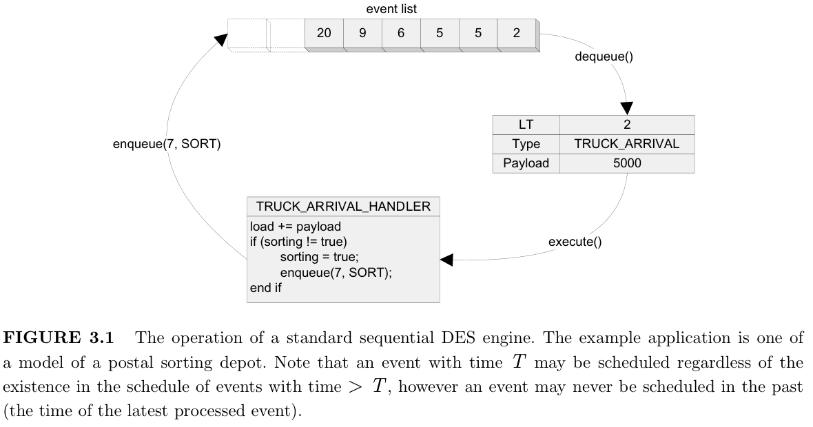
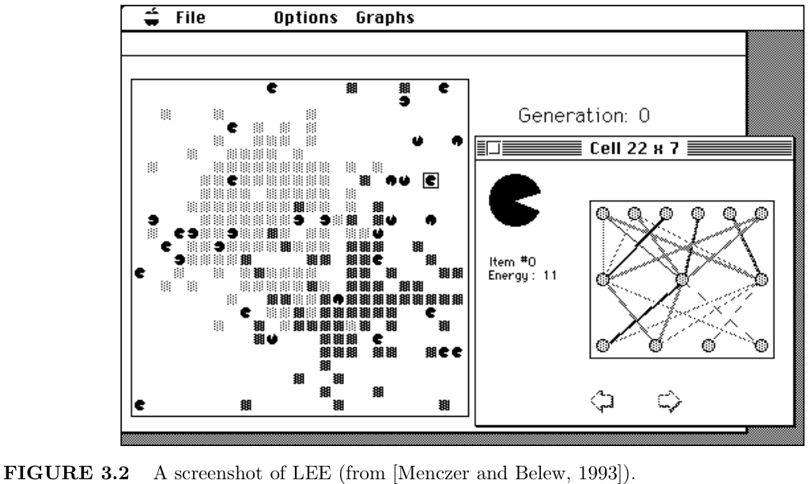
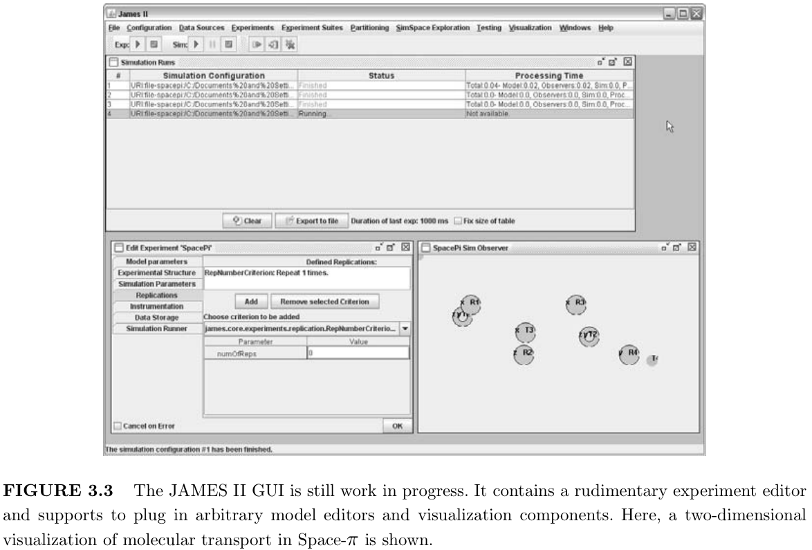
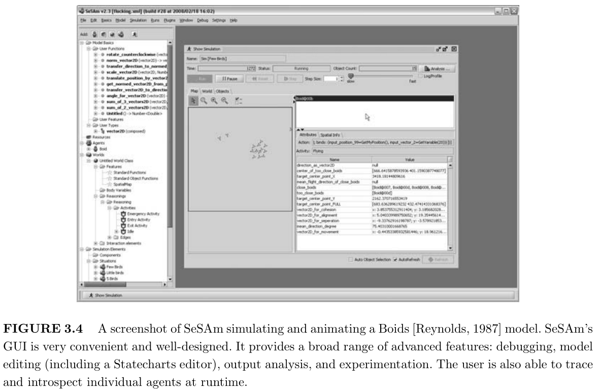
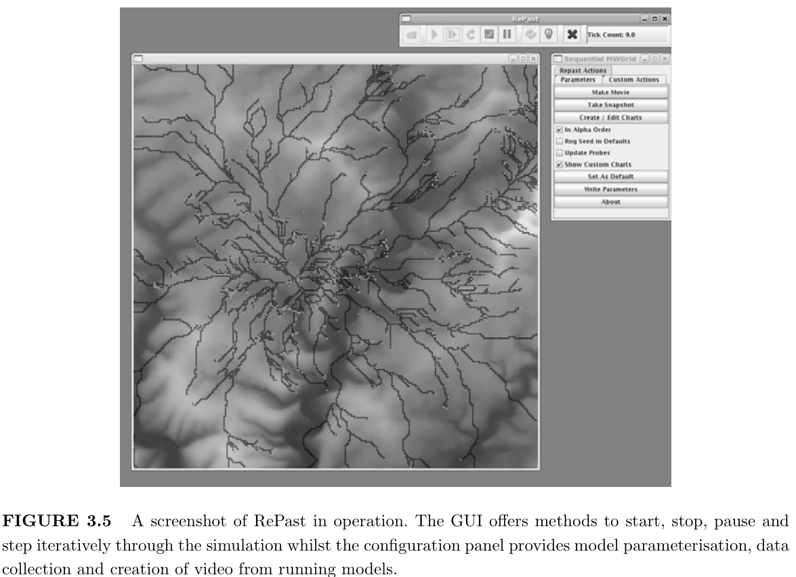
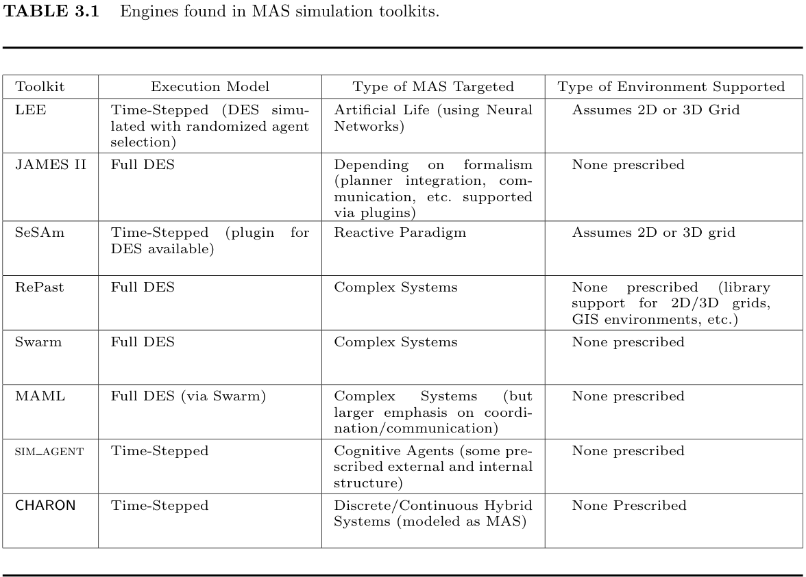

# Chapter 3 用于多智能体系统的仿真引擎
> Simulation Engines for Multi-Agent Systems
 
## 3.1 Introduction

> Multi-agent systems (MAS) are often extremely complex and it can be difficult to formally verify their properties. As a result, design and implementation remains largely experimental, and experimental approaches are likely to remain important for the foreseeable future. Simulation is therefore the only viable method to rigorously study their properties and analyze their emergent behavior.

多智能体系统 （MAS） 通常非常复杂，并且很难正式验证其属性。因此，设计和实现在很大程度上仍然是实验性的，而实验方法在可预见的未来可能仍然很重要。因此，仿真是严格研究其特性并分析其紧急行为的唯一可行方法。

> Over the last two decades, a wide range of MAS toolkits and testbeds have been developed and applied in different domains. A number of surveys of these systems have appeared in the literature in recent years, e.g., [Serenko and Detlor, 2002; Gilbert and Bankes, 2002; Tobias and Hofmann, 2004; Mangina; Railsback et al., 2006]. However, these have tended to focus on the high level support that these toolkits offer for the process of agent specification and model creation. In contrast this chapter focuses on the simulation engines integrated in to these toolkits to facilitate the execution of the resulting MAS models. In this context a simulation engine is taken to be any virtual machine which provides controlled execution of the model.

在过去的二十年里，已经开发了广泛的 MAS 工具包和测试平台，并将其应用于不同的领域。近年来，文献中出现了对这些系统的许多调查，例如，[Serenko 和 Detlor，2002 年;Gilbert 和 Bankes，2002 年;Tobias 和 Hofmann，2004 年;曼吉娜;Railsback et al.， 2006]。但是，这些往往侧重于这些工具包为 agent 规范和模型创建过程提供的高级支持。相比之下，本章重点介绍集成到这些工具包中的仿真引擎，以促进生成的 MAS 模型的执行。在此上下文中，仿真引擎被视为提供模型受控执行的任何虚拟机。

> This chapter is organized as follows: Section 3.2 first discusses what types of MAS model - in terms of the architecture of an individual agent and the mechanisms by which it interacts with its environment - are executed using these engines; section 3.3 then surveys the engines used by the currently available toolkits in the context of these observations about MAS model types; Sections 3.4 and 3.5 then explore recent and future research in to distributed simulation engines which aim to provide both scalability and interoperability to MAS simulation models.

本章的组织方式如下：
- 第 3.2 节首先讨论了使用这些引擎执行哪些类型的 MAS 模型 - 就单个代理的架构以及它与环境交互的机制而言;
- 然后，第 3.3 节在关于 MAS 模型类型的观察的背景下调查了当前可用的工具包使用的引擎;
- 然后，第 3.4 节和第 3.5 节探讨了分布式仿真引擎的最新和未来研究，这些引擎旨在为 MAS 仿真模型提供可扩展性和互操作性。

## 3.2 Multi-Agent System Architectures
> Toolkits for building MAS are generally targeted at one of three types of application:

用于构建 MAS 的工具包通常针对以下三种类型的应用程序之一：

> 1. <b> MAS for studying Complexity</b>. Examples are social models (e.g., Schelling’s segregation model [Schelling, 1971], or Ormerod’s low-dimensional paradigm [Ormerod, 2007]), artificial life (e.g., Axtell’s Sugarscape [Epstein and Axtell, 1996] or Reynold’s Boids [Reynolds, 1987] models) or logistics (e.g., Traffic Simulations [Burmeister et al., Feb 1997]). Such models use very simple agents which engage in little, if any, planning or coordination. The models are interpreted usually via some quantitative (average life expectancy, average queuing time, etc.) or qualitative (emergent segregation patterns, emergent flocking, etc.) observation at the macro-level of the population itself.

1. 研究复杂性的 MAS。例如社会模型（例如，Schelling 的隔离模型 [Schelling， 1971]，或 Ormerod 的低维范式 [Ormerod， 2007]）、人工生命（例如，Axtell 的 Sugarscape [Epstein 和 Axtell， 1996] 或 Reynold's Boids [Reynolds， 1987] 模型）或物流（例如，交通模拟 [Burmeister et al.， Feb 1997]）。此类模型使用非常简单的代理，这些代理很少（如果有的话）进行规划或协调。这些模型通常通过在种群本身的宏观层面进行一些定量（平均预期寿命、平均排队时间等）或定性（紧急隔离模式、紧急植群等）观察来解释。

> 2. <b>MAS for studying Distributed Intelligence.</b> Examples range from planning (e.g., Blocksworld [Fahlman, 1973], Tileworld [Pollack and Ringuette, 1990]), to more cognitively ‘accurate’ social simulations (as advocated by researchers such as Nigel Gilbert [Gilbert, 2005], John Doran [Doran, 2001] or Ron Sun [Sun, 2001]) all the way up to research in to human cognition itself (such as the work of the CoSY project [Hawes et al., 2007], or of researchers like Aaron Sloman [Sloman and Logan, 1999] or Mattias Scheutz [Scheutz and Logan, 2001]). Such models use internally complex, situated, communicating agents, and are often designed to study the behavior of one particular cognitive formalism such as SOAR [Wray and Jones, 2005], ACT-R [Taatgen et al., 2005] or BDI [Rao and Georgeoff, 1995].

2. MAS 用于研究分布式智能。例子范围从规划（例如，Blocksworld [Fahlman， 1973]、Tileworld [Pollack and Ringuette， 1990]）到更认知“准确”的社会模拟（如 Nigel Gilbert [Gilbert， 2005]、John Doran [Doran， 2001] 或 Ron Sun [Sun， 2001] 等研究人员所倡导的那样），一直到人类认知本身的研究（例如 CoSY 项目的工作 [Hawes et al..， 2007 年]，或者像 Aaron Sloman [Sloman 和 Logan， 1999] 或 Mattias Scheutz [Scheutz 和 Logan， 2001] 这样的研究人员。这种模型使用内部复杂的、定位的、通信的代理，并且通常旨在研究一种特定认知形式主义的行为，例如 SOAR [Wray 和 Jones， 2005]、ACT-R [Taatgen et al.， 2005] 或 BDI [Rao and Georgeoff， 1995]。 

> 3. Development of Software MAS. These toolkits provide support for building software agents such as those described by Wooldridge & Jennings [Jennings et al., 1998], Franklin & Gaesser [Franklin and Graesser, 1996] or as implied by the FIPA [Foundation for Intelligent Physical Agents FIPA] or KQML [Finin et al., 1994] standards. Typical applications are Semantic Web agents, Beliefs-Desires-Intentions (BDI) agents in expert systems, or agents for network meta-management (e.g., load-balancing or service discovery). Many of these toolkits include a pre-deployment environment for debugging or verification of the implemented MAS which may be considered equivalent to a simulation engine.

3. 软件 MAS 的开发。这些工具包为构建软件代理提供了支持，如Wooldridge & Jennings [Jennings et al.， 1998]， Franklin & Gaesser [Franklin and Graesser， 1996]所描述的那些，或者FIPA [智能物理代理基金会FIPA] 或KQML [Finin et al.， 1994] 标准所暗示的那些。典型应用包括语义 Web 代理、专家系统中的信念-愿望-意图 （BDI） 代理或网络元管理代理（例如，负载平衡或服务发现）。其中许多工具包包括一个预部署环境，用于调试或验证已实施的 MAS，这可能被认为等同于模拟引擎。

> These different target applications have an obvious impact on the modeling facilities offered by a toolkit in order to develop MAS models. However, they also have implications for the type of simulation engine that will be used (and usually packaged along with the toolkit itself) to execute the models.

这些不同的目标应用程序对工具包提供的建模工具有明显的影响，以便开发 MAS 模型。但是，它们也对将用于执行模型的仿真引擎类型（通常与工具包本身一起打包）产生影响。

> The first two types provide an execution environment which would be most widely recognizable as a simulation engine. That is, a virtual machine with a notion of logical time advancing in discrete steps. This reflects the fact that, with these applications parameterization, repeatability and introspection are key to understanding the model’s behavior, whether this be at a micro- or macro-level.

前两种类型提供了一个执行环境，该环境将被广泛识别为模拟引擎。也就是说，具有逻辑时间概念的虚拟机以离散步骤前进。这反映了这样一个事实，即在这些应用程序中，参数化、可重复性和内省是理解模型行为的关键，无论是在微观层面还是宏观层面。

> In contrast the types of execution environment which support development platforms
for software agents are primarily concerned with controlled emulation of a real execution
environment (e.g., a computer network). This reflects the fact that such applications are
primarily concerned with debugging or validating the system in some way, while repeatable
or parameterizable behaviors are less of a concern.

相反，支持软件代理开发平台的执行环境类型主要关注真实执行环境（例如，计算机网络）的受控仿真。这反映了这样一个事实，即此类应用程序主要关注以某种方式调试或验证系统，而可重复或可参数化的行为则不太重要。

> On this basis, the remainder of this chapter will focus on the type of execution environments which genuinely constitute simulation engines. This being those found in toolkits supporting the experimental development of multi-agent models as in types 1 and 2 above.

在此基础上，本章的其余部分将重点介绍真正构成模拟引擎的执行环境类型。这是在支持上述类型 1 和 2 中的多代理模型实验开发的工具包中发现的那些。

## 3.3 Discrete Event Simulation Engines for MAS / 用于 MAS 的离散事件仿真引擎

> MAS Simulation toolkits, in the interests of robustness, repeatability and micro-scale analysis of the model, generally conceive of the model as a discrete system, transitioning through time in discrete steps. Toolkits of this type are discussed in this Section, but first it is important to establish the common paradigm - independent from MAS modeling specifically - which is generally used to simulate discrete systems: Discrete Event Simulation.

MAS Simulation 工具包，为了实现模型的稳健性、可重复性和微观尺度分析，通常将模型视为一个离散系统，以离散步骤随时间过渡。本节将讨论这种类型的工具包，但首先重要的是要建立通常用于模拟离散系统的通用范式 - 专门独立于 MAS 建模：离散事件仿真。

### 3.3.1 The Discrete Event Simulation Paradigm / 离散事件仿真范式

> Discrete Event Simulation (DES) [Fishman, 1978] is a common paradigm for the simulation
of discrete (or discretized) systems. DES is a special case of the more general approach of
Discrete Time simulations (such as a Time-Stepped approach) in which state transitions
occur instantaneously rather than continuously with time. Under the DES paradigm these
transitions do not occur as a linearly spaced sequence of steps, but occur instead at instants
in time at which a transition has semantic significance. This is a more flexible paradigm
(which is, of course, capable of simulating a Time-Stepped approach via a linearly spaced
sequence of events).

离散事件仿真 （DES） [Fishman， 1978] 是离散（或离散化）系统仿真的常见范例。DES 是更通用的离散时间仿真方法（例如时间步进方法）的一种特例，其中状态转换是瞬间发生的，而不是随时间连续发生。在 DES 范式下，这些转换不是作为线性间隔的步骤序列发生的，而是发生在转换具有语义意义的时刻。这是一种更灵活的范式（当然，它能够通过线性间隔的事件序列来模拟 Time-Stepped 方法）。

> DES engines are generally implemented as a queue of events (commonly implemented as
a heap) each having a logical timestamp. A loop iterates over the queue, at each iteration
dequeuing and executing the event with the lowest timestamp. This event may cause some
transition in the system and, crucially, may also insert more events in to the queue to
be executed in the future. Generally events encapsulate a small amount of state and are
passed to event handlers which can perform conditional branching over the model’s state
at the time of execution to implement complex dynamic behavior. This paradigm is more
flexible than a standard Time-Stepped approach as the speed of system transition is entirely
dictated by the system being modeled. This allows, for example, both long- and short-cycle
phenomena to be modeled concurrently and efficiently within a single model.

DES 引擎通常作为事件队列（通常作为堆实现）实现，每个事件都有一个逻辑时间戳。循环遍历队列，在每次迭代时取消出列并执行具有最低时间戳的事件。此事件可能会导致系统中出现一些转换，并且至关重要的是，还可能在队列中插入更多事件以备将来执行。通常，事件封装少量状态并传递给事件处理程序，事件处理程序可以在执行时对模型的状态执行条件分支，以实现复杂的动态行为。这种范式比标准的 Time-Stepped 方法更灵活，因为系统转换的速度完全由正在建模的系统决定。例如，这允许在单个模型中同时有效地对长周期和短周期现象进行建模。

> An example of the mechanics of a standard sequential DES engine are given in Figure 3.1.
In this example an event at time 2 is dequed which represents the arrival of a truck at a
postal sorting depot. When the handler for the event is invoked, depending on the state
of the sorting depot, an event which represents the beginning of the mail sorting process
may begin, or may continue if it is already in progress. The delay between the two events
(from time 2 to time 7) may represent the overhead in starting the sorting process from
cold which the model wishes to represent.

图 3.1 给出了标准顺序 DES 引擎的机制示例。在此示例中，时间 2 的事件被出队，它表示卡车到达邮政分拣站。调用事件的处理程序时，根据分拣库的状态，表示邮件分拣过程开始的事件可能会开始，或者如果它已经在进行中，则可能会继续。两个事件之间的延迟（从时间 2 到时间 7）可能表示模型希望表示的从 cold 开始排序过程的开销。

> FIGURE 3.1 The operation of a standard sequential DES engine. The example application is one of a model of a postal sorting depot. Note that an event with time T may be scheduled regardless of the existence in the schedule of events with time > T , however an event may never be scheduled in the past (the time of the latest processed event).

图 3.1 标准顺序 DES 引擎的运行。示例应用程序是邮政分拣站的模型之一。请注意，无论>时间 T 的事件计划中是否存在，都可以计划时间为 T 的事件，但事件可能永远不会在过去（最新处理事件的时间）进行计划。

### 3.3.2 A Survey of MAS Simulation Toolkits / MAS 仿真工具包调查

> This Section surveys the simulation engines integrated in to many of the most popular and influential toolkits for building MAS simulations. This survey is not exhaustive due to the unavailability of technical detail for some popular, closed-source toolkits (eg. NetLogo), however it does provide a good coverage of the various engineering options when implementing a DES engine for MAS models.

本节调查了集成到许多最流行和最有影响力的工具包中用于构建 MAS 模拟的仿真引擎。
由于无法获得一些流行的闭源工具包的技术细节，因此该调查并不详尽（例如。NetLogo），
但是，在为 MAS 模型实施 DES 引擎时，它确实很好地涵盖了各种工程选项。

#### LEE
> The LEE (Latent Energy Environment) toolkit [Menczer and Belew, 1993] is implemented in C and targets research on evolutionary complex systems. Its underlying assumptions regarding the structure of agents, their actions, and their environment are therefore highly specific: Agents consist of a user-defined neural network that uses sensor information and the internal state to trigger actions. Agents may only interact with their environment, which is a two-dimensional toroidal grid. Each cell of the grid may contain consumable elements that provide the agents with energy. This model of a multi-agent system is combined with a genetic algorithm approach that allows individual agents to proliferate or die. A replenishment function is used to generate new consumable elements and place them on the grid, while a reaction table defines which elements react with each other, so that agents can combine elements to increase their energy consumption. The simulation is executed in a Time-Stepped manner. At every step, each agent has a certain chance of being executed. This ‘virtual concurrency’ mechanism was devised to model the parallel execution of agents in an unbiased serial way. The LEE has been successfully applied to model the co-evolution of motor-sensor systems [Dagorn et al., 2000]. Figure 3.2 shows a screenshot of the LEE graphical user interface (GUI).
> 

LEE （Latent Energy Environment） 工具包 [Menczer 和 Belew， 1993] 用 C 语言实现，针对进化复杂系统的研究。因此，它对代理的结构、操作和环境的基本假设是非常具体的：代理由用户定义的神经网络组成，该网络使用传感器信息和内部状态来触发操作。代理只能与其环境交互，环境是二维环形网格。网格的每个单元都可以包含为代理提供能量的消耗元件。这种多代理系统模型与允许单个代理增殖或死亡的遗传算法方法相结合。补充功能用于生成新的消耗元素并将其放置在网格上，而反应表定义哪些元素相互反应，以便代理可以组合元素以增加其能耗。模拟以 Time-Stepped 方式执行。在每一步中，每个代理都有一定的执行机会。这种 “虚拟并发” 机制旨在以无偏见的串行方式对代理的并行执行进行建模。LEE 已成功应用于模拟电机传感器系统的协同进化 [Dagorn et al.， 2000]。图 3.2 显示了 LEE 图形用户界面 （GUI） 的屏幕截图。

#### JAMES II
> JAMES II (Java-based Agent Modeling Environment for Simulation) [Himmelspach and
Uhrmacher, 2007] has become a general-purpose modeling and simulation system over the
years, but nevertheless provides several functions that are tailored to the needs of agent
modeling and simulation. In JAMES II, agents need to be modeled in a formalism of the
user’s choice. The system provides various extensions of the DEVS [Zeigler et al., 2000] formalism
 (e.g., ml-DEVS [Uhrmacher et al., 2007]), to support multi-level modeling, dynamic
structures, broadcasting, and the integration of external processes like planners or complete
agents [Himmelspach and Uhrmacher, 2004]. Other supported formalisms are StateCharts,
Petri Nets, Cellular Automata, and several process algebras, e.g., Space-π. The latter could
in principle be used to model large sets of simple, reactive agents situated within a 3-
dimensional environment (e.g., the ’swarm’ of Euglena cells in [John et al., 2008]).

JAMES II（基于 Java 的智能体建模模拟环境）[Himmelspach 和 Uhrmacher，2007 年] 多年来已成为一个通用的建模和模拟系统，但仍然提供了多种功能，以满足智能体建模和模拟的需求。在 JAMES II 中，代理需要以用户选择的形式进行建模。该系统提供了 DEVS [Zeigler et al.， 2000] 形式的各种扩展（例如，ml-DEVS [Uhrmacher et al.， 2007]），以支持多级建模、动态结构、广播以及外部流程（如规划器或完整代理）的集成 [Himmelspach and Uhrmacher， 2004]。其他支持的形式是 StateCharts、Petri Nets、Cellular Automata 和几个过程代数，例如 Space-π。后者原则上可用于模拟位于 3 维环境中的大量简单反应性代理（例如，[John et al.， 2008] 中的裸藻细胞“群”）。

> It is also possible to run a simulation in paced mode, i.e., in sync with the wallclock time. This is useful for testing an existing agent software within a controlled environment [Gierke et al., 2006]. Under these circumstances, JAMES II could also be viewed as a real-time execution engine, consisting of the model simulated by JAMES II on the one hand, and some external processes on the other.

也可以在 paced 模式下运行模拟，即与挂钟时间同步。这对于在受控环境中测试现有代理软件非常有用 [Gierke et al.， 2006]。在这种情况下，JAMES II 也可以被视为一个实时执行引擎，一方面由 JAMES II 模拟的模型组成，另一方面由一些外部过程组成。

> When using DEVS to model agents, however, there is no notion of space, i.e., situational
agent models require an explicit, user-defined model of the environment. As DEVS is a
discrete-event formalism, all DEVS simulation algorithms provided by the system are essentially 
discrete-event simulators, with varying performance profiles and capabilities, e.g.,
regarding the model’s structure and the mode of execution (sequential/distributed). The
scheduling of the agents depends on the model and has to be defined by the user. The models 
themselves are implemented as Java subclasses or as XML files containing Java code.
More details on JAMES II can be found in Section 3.4.3. A screenshot of the JAMES II
GUI showing a 2D visualization is shown in Figure 3.3.

然而，当使用 DEVS 对智能体进行建模时，没有空间的概念，即情境智能体模型需要一个明确的、用户定义的环境模型。由于 DEVS 是一种离散事件形式，因此系统提供的所有 DEVS 仿真算法本质上都是离散事件模拟器，具有不同的性能配置文件和功能，例如，关于模型的结构和执行模式（顺序/分布式）。代理的调度取决于模型，必须由用户定义。模型本身作为 Java 子类或包含 Java 代码的 XML 文件实现。有关 JAMES II 的更多详细信息，请参见 Section 3.4.3。图 3.3 显示了 JAMES II GUI 的 2D 可视化屏幕截图。

#### SeSAm

> SeSAm (Shell for Simulated Agent Systems) [Kl¨ugl and Puppe, 1998; Kl¨ugl et al., 2006] is
a full-fledged simulation system for multi-agent systems, written in Java. It has a powerful
graphical user interface that allows to model multi-agent systems without programming.
In SeSAm, agents are embedded in a two- or three-dimensional grid. Agents are defined
by sensors and effectors, as well as an internal function to select the appropriate action.
The simulator proceeds in discrete time steps. There is, however, a plugin that enables
the system to process models in a discrete-event manner. SeSAm has been widely used in
research and teaching, often for modeling social systems like the behavior of honey bees or
consumers in a supermarket. A screenshot of the SeSAm GUI is shown in Figure 3.4.

SeSAm（模拟代理系统的外壳）[kl ̈ugl 和 Puppe，1998 年;Kl ̈ugl et al.， 2006] 是一个用 Java 编写的用于多智能体系统的成熟模拟系统。它具有强大的图形用户界面，无需编程即可对多代理系统进行建模。在 SeSAm 中，代理嵌入在二维或三维网格中。代理由传感器和效应器以及用于选择适当操作的内部功能定义。模拟器以离散的时间步长进行。但是，有一个插件使系统能够以离散事件方式处理模型。SeSAm 已广泛用于研究和教学，通常用于对社会系统进行建模，例如蜜蜂或超市中消费者的行为。SeSAm GUI 的屏幕截图如图 3.4 所示。

#### RePast

> RePast (Recursive Porus Agent Simulation Toolkit) [Project; North et al., 2006] is a free,
open-source toolkit with implementations in multiple languages, the most popular of these
being the pure Java version. RePast borrows heavily from and is targeted at similar models
to the Swarm framework (see below). RePast implements a full Discrete Event Scheduler
(DES), allowing the scheduling of events in the form of BasicAction instances which can
execute arbitrary code, including the scheduling of future events in the schedule. RePast’s
particular schedule implementation includes facilities for automatically rescheduling events
with some frequency and for the randomization of the order of execution of logically concurrent
events, the latter facility being another example of virtual concurrency as mentioned
above in the case of LEE. Although, from the modeling perspective, RePast provides several
components (such as 2D or 3D grids, networks and GIS (Geographic Information System)
environments) which are generally useful for modeling social phenomena as Multi-Agent
systems, no assumptions are made inside the engine about the structure or behavior of the
model. Figure 3.5 shows a screenshot of the RePast GUI controls being used to manage a
GIS-based MAS simulation.

RePast （递归 Porus 代理模拟工具包） [项目;North et al.， 2006] 是一个免费的开源工具包，具有多种语言的实现，其中最受欢迎的是纯 Java 版本。RePast 大量借鉴了 Swarm 框架，并针对与 Swarm 框架类似的模型（见下文）。RePast 实现了一个完整的离散事件调度程序 （DES），允许以 BasicAction 实例的形式调度事件，这些实例可以执行任意代码，包括调度中的未来事件。RePast 的特定计划实现包括用于以一定频率自动重新安排事件和随机化逻辑并发事件执行顺序的工具，后者是上述 LEE 案例中虚拟并发的另一个示例。尽管从建模的角度来看，RePast 提供了几个组件（例如 2D 或 3D 网格、网络和 GIS（地理信息系统）环境），这些组件通常可用于将社会现象建模为多代理系统，但引擎内部没有对模型的结构或行为做出假设。图 3.5 显示了用于管理基于 GIS 的 MAS 模拟的 RePast GUI 控件的屏幕截图。

#### Swarm

> Swarm [The Swarm Development Group; Minar et al., 1996] is a free, open-source toolkit
implemented in the Objective-C language. In terms of Swarm as an execution engine, it is
very similar to RePast (see above) in that it implements a Discrete Event Scheduler which
is populated explicitly by the model with events executing arbitrary code (including event
(re-)scheduling). The DES extensions offered by RePast (automatic rescheduling, virtual
concurrency, etc.) are also present in almost identical form here. Swarm encapsulates all
this functionality, as well as data visualization, execution control and data analysis in the
‘swarms’ metaphor. The ‘Model Swarm’ represents the state and populates the schedule,
whilst ‘Observer Swarms’ can insert or extract data from the model and perform analysis
and visualization.

#### MAML
> MAML (The Multi-Agent Modeling Language) [Guly´as et al., 1999; Guly´as] is a high-
level modeling formalism for the creation of Multi-Agent models in the vein of the RePast
and Swarm toolkits. MAML explicitly compiles in to Swarm code and shares many of the
abstractions used by that toolkit. MAML adds a higher degree of structure to its models,
particularly with regard to the planning and interaction of the agents in the model. This
moves MAML slightly further away from the pure Discrete Event System of Swarm/RePast
and toward a more Time-Stepped model in which agents run largely on a loop, though still
with the ability to explicitly interact with the schedule itself in a standard Discrete Event
manner.

#### SIM AGENT

> sim agent [Sloman and Poli, 1996] is an architecture-neutral agent toolkit developed
as a series of libraries written in the Pop-11 programming language. It can be used to
simulate many different types of MAS, such as software agents on the internet or physical
agents in an environment. An agent is described in the toolkit by a series of rule-based
modules which define its capabilities, e.g., sensing, planning etc. The execution mode of
the modules can be varied, including options for firing sets of satisfied rules sequentially or
concurrently and with specified resources. The system also provides facilities to populate
the agent’s environment with user-defined active and passive objects (and other agents).
The execution model is Time-Stepped and each step operates in logical phases: sensing,
internal processing and action execution, where the internal processing may include a variety
of logically concurrent activities, e.g., perceptual processing, motive generation, planning,
decision making, learning etc.
> 
> In the first phase an agent executes its sensing procedures and updates its internal memory
to reflect changes in its environment and any messages it receives. The next phase involves
decision making and action selection. The contents of the agent’s database together with the
new facts created in phase one are matched against the conditions of the condition-action
rules which constitute the agent’s rule system. Finally the agents send any messages and
perform the actions queued in the previous phase. These external actions will typically cause
the agent to enter a new state (e.g., change its location) or manipulate the environment
and hence sense new data.

#### CHARON
> CHARON [Alur, 2008] is a toolkit comprising a language, compiler and simulation engine
designed to model continuous/discrete hybrid systems. These are systems which are modeled
in a continuous manner, using a set of analog variables, but whose holistic behavior switches
in a discrete manner between a set of ‘modes’. CHARON uses the agent abstraction to
describe such systems, generally modeling it as a hierarchy of interacting agents with shared
analog variables triggering mode changes based on a set of invariants. CHARON itself is a
language used to describe these modes, invariants and hierarchies. CHARON code can be
compiled to standard Java code which is then executed by a simulation engine.
> 
> This engine progresses the system in a timestepped manner, with continuous steps being
executed as timeslices using numerical integration, and discrete steps being executed as
the tests of invariants in between continuous steps. In this sense the sequential CHARON
engine can be seen as a simple timestepped engine which models continuous variables in
a discrete manner. A parallel implementation has also been devised which is described in
Section 3.4.3.

### 3.3.3 Taxonomy of Discrete Event Simulation Toolkits / 离散事件仿真工具包的分类法

> Table 3.1 gives a summary of the surveyed discrete event toolkits. The toolkits are characterized by the execution engine (Discrete Event, Time-Stepped, etc.) which they employ and by the assumptions this engine makes about the structure of the model (if any).
>

表 3.1 给出了所调查的离散事件工具包的摘要。工具包的特征在于它们使用的执行引擎（离散事件、时间步进等）以及该引擎对模型结构所做的假设（如果有）。

> From this summary one interesting observation is that toolkits which seek to prescribe some structure to the MAS being modeled also tend to constrict execution to a Time-Stepped model. Though the phrase ‘prescribe some structure’ seems to imply a lack of flexibility it could equally be given a positive connotation. Toolkits such as sim agent provide a clear design template within which several cognitive architectures and agent designs can be implemented, without the need for re-implementation of ‘boilerplate’ code.

从这个总结中，一个有趣的观察结果是，试图为正在建模的 MAS 规定一些结构的工具包也倾向于将执行限制在时间步长模型中。尽管“规定一些结构”这句话似乎暗示着缺乏灵活性，但它同样可以被赋予积极的含义。sim 代理等工具包提供了一个清晰的设计模板，可以在其中实现多个认知架构和代理设计，而无需重新实现“样板”代码。

> Indeed, it appears from this that there is a gap in the current design space for a toolkit
which both provides/prescribes some structure for implementing agents but also provides
a full Discrete Event scheduling implementation for the model’s execution. It is possible
that the two goals are not complementary in that prescribing structure to an agent also
implies the prescription of how and how frequently an agent is called on to sense, think,
act, communicate, etc.

事实上，从这一点来看，当前设计空间中存在一个工具包的差距，该工具包既为实现代理提供/规定一些结构，又为模型的执行提供完整的离散事件调度实现。这两个目标可能不互补，因为对代理人的规定结构也意味着规定代理人如何以及多久被要求去感知、思考、行动、交流等。

## 3.4 Parallel Simulation Engines for MAS / 用于 MAS 的并行仿真引擎

