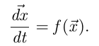
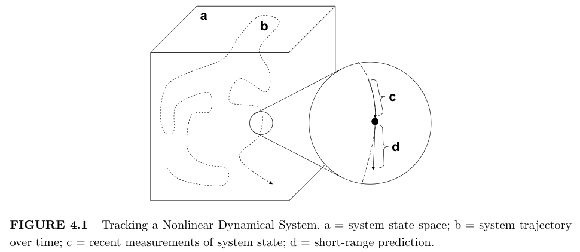
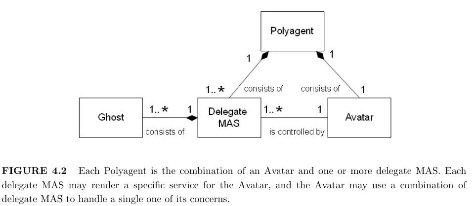

# Chapter 4 Polyagents: Simulation for Supporting Agents’ Decision Making
***

# 4.1 Introduction

> People often support decisions by thinking through the consequences of alternative courses
of action-in effect, by simulating them mentally. In fact, one of the major uses of simulations
is as decision-support aids.

人们通常通过思考替代行动方案的后果来支持决策——实际上是通过在心理上模拟它们。
事实上，模拟的主要用途之一是作为决策支持辅助工具。

> Software agents can also use simulation to guide their decisions. That is, they may run
a model of the world to see what might happen under various decision alternatives, then
make the decision that leads to the most desirable outcome. Such simulation can be either
equation-based or agent-based. Our focus here is on agent-based simulation,∗ in which
software agents representing the domain entities are situated in a representation of the
environment and interact with the environment and with one another, acting out a possible
trajectory of the future. The agent responsible for making a decision activates an 
agent-based simulation of the domain, and chooses an action based on the evolution of that
simulation.

软件代理还可以使用仿真来指导他们的决策。也就是说，他们可能会运行一个世界模型，看看在各种决策选择下会发生什么，
然后做出导致最理想结果的决定。这种模拟可以基于方程或基于代理。我们在这里的重点是基于代理的模拟，∗
其中代表域实体的软件代理位于环境的表示中，并与环境交互，并相互交互，从而执行未来可能的轨迹。
负责做出决策的代理激活基于代理的域模拟，并根据该模拟的演变选择操作。

> This approach to decision-making is complementary to a number of other decision mechanisms. 
By way of contrast, consider several such mechanisms that are popular in research on AI and autonomous agents.

这种决策方法是对许多其他决策机制的补充。相比之下，考虑一下在 AI 和自主代理研究中流行的几种此类机制。

> **Derivational** methods, such as rule-based reasoning and theorem proving, derive 
consistent conclusions from axioms and inference rules such as modus ponens or modus tolens.
These methods require translating the domain into a set of well-formed symbolic expressions
with truth values that are amenable to formal manipulation. This translation process, an
aspect of knowledge engineering, can be time-consuming and error-prone.

推导方法，例如基于规则的推理和定理证明，从公理和推理规则（如 modus ponens 或 modus tolens）中得出一致的结论。
这些方法需要将领域转换为一组格式良好的符号表达式，这些表达式具有适合正式操作的真值。此翻译过程是知识工程的一个方面，
可能非常耗时且容易出错。

> **Constraint-based** methods also work with sets of statements about the domain, but
in this case the emphasis is on finding values for variables in these statements that satisfy
certain conditions, rather than on deriving new statements from them. Constraint-based
methods fall into two broad categories. Constraint satisfaction seeks a set of assignments to
the variables that makes all of the statements true, while constraint optimization associates a
cost function with conflicts among statements and seeks a set of assignments that minimizes
the overall cost.

基于约束 (constraint-based) 的方法也适用于有关域的语句集，但在这种情况下，重点是在这些语句中查找满足特定条件的变量的值，
而不是从中派生新语句。基于约束的方法分为两大类。约束满足寻求对变量的一组赋值，使所有语句都为真，
而约束优化将成本函数与语句之间的冲突相关联，并寻求一组使总体成本最小化的赋值。

> Both derivational and constraint-based methods favor a static world, in which the truth
values of the statements on which they rely can be assumed to remain constant. By contrast, 
**game theoretic** methods explicitly model the interaction between two adversarial
reasoners. They evaluate the distinct strategy choices on each side, but require enumeration
in advance of all possible choices, and make two assumptions about the adversaries that
may not be true: that the adversaries know the payoffs of the various options, and that they
make their decisions rationally. Iterated game-theoretic methods can be viewed as a version
of simulation, but one that focuses on the players’ strategies and minimizes the impact of
the environment.

派生方法和基于约束的方法都有利于静态世界，在静态世界中，可以假设它们所依赖的语句的真值保持不变。
相比之下，博弈论方法明确地模拟了两个对抗性推理者之间的互动。他们评估每一方的不同策略选择，
但需要在所有可能的选择之前列举，并对对手做出两个可能不正确的假设：对手知道各种选择的回报，并且他们理性地做出决策。
迭代博弈论方法可以被视为模拟的一个版本，但它侧重于玩家的策略并最大限度地减少环境的影响。

> These approaches are valuable tools in the decision-maker’s kit. But they have certain
fundamental limitations that agent-based simulation can avoid.

这些方法是决策者工具包中的宝贵工具。但它们具有基于代理的模拟可以避免的某些基本限制。

> 1. **Spatial irreducibility** recognizes the intractability of logical analysis of spatial
     constraints on a domain-independent, purely qualitative representation of space
     or shape [Forbus et al., 1987, 1991]. While sophisticated representations of spatio-
     temporal information are available (e.g., [Parent et al., 1999; Tryfona et al.,
     2003]), relevant reasoning about geometrically constrained problems still requires
     direct measurements on a spatial model. Such reasoning is much more natural
     using a simulation whose environment embeds the required topological structure.
> 2. **Process irreducibility** [Hopcroft and Ullman, 1979] means that for systems
     beyond a certain (very low [Wolfram, 2002]) level of complexity, direct emulation
     is the most efficient approach to predicting their evolution. Formal logical systems
     are rife with intractability barriers [Garey and Johnson, 1979] that require either
     restricting their application to small problems or weakening the expressiveness of
     the underlying logical formalism. Simulation works with an iconic representation
     of the domain rather than a symbolic one, and avoids the formal logical operations
     that lead to intractability.
> 3. **Dynamic uncertainty** means that nonlinear interactions among domain enti-
     ties can generate uncertainty, even if the states and configuration of the entities
     are precisely known. Two successive runs of the same system may not yield the
     same outcome. The problem is not external noise or nondeterminism, but the
     sensitive dependence of an iterated nonlinear system on initial conditions. Clas-
     sical reasoning methods are either deterministic or propagate the uncertainty in
     the inputs through to the outputs. Simulation can emulate the generation of dy-
     namic uncertainty and estimate its impact, if it includes an explicit model of how
     the environment actively integrates the actions of various entities [Michel, 2004].

1. **空间不可约性**认识到空间约束的逻辑分析对空间或形状的独立于域的、纯粹定性表示的棘手性 
    [Forbus et al.， 1987， 1991]。虽然时空信息的复杂表示是可用的
    （例如，[Parent et al.， 1999;Tryfona et al.， 2003]），
    但关于几何约束问题的相关推理仍然需要对空间模型进行直接测量。
    使用环境嵌入所需拓扑结构的模拟，这种推理要自然得多。
2. **过程不可约性** [Hopcroft and Ullman， 1979] 意味着对于超过一定（非常低 [Wolfram， 2002]）复杂度水平的系统，
   直接仿真是预测其演变的最有效方法。形式逻辑系统充满了棘手的障碍 [Garey and Johnson， 1979]，
   这些障碍要求将它们的应用限制在小问题上，或者削弱底层逻辑形式主义的表达能力。
   Simulation 使用域的标志性表示而不是符号表示，并避免了导致棘手的正式逻辑操作。
3. **动态不确定性**意味着领域主体之间的非线性相互作用会产生不确定性，即使实体的状态和配置是精确已知的。
   同一系统的两次连续运行可能不会产生相同的结果。问题不在于外部噪声或不确定性，
   而在于迭代非线性系统对初始条件的敏感依赖性。经典推理方法要么是确定性的，要么是将输入中的不确定性传播到输出。
   如果模拟包括一个关于环境如何积极整合各种实体行动的明确模型，那么模拟可以模拟动态不确定性的产生并估计其影响 
   [Michel，2004]。

> These issues make simulation a valuable tool for decision-making. The agent facing a
decision runs a simulation of the domain, and consults its results to inform the choice that
it makes.

这些问题使仿真成为有价值的决策工具。面临决策的代理运行域的模拟，并查阅其结果以告知它所做的选择。

> This chapter describes a particular construct for multi-agent modeling, the polyagent,
that encapsulates the technique of simulation-based decision-making. The construct is highly
imitative, drawing from concepts from a number of disciplines, including computer science,
biology, and physics. In the next section, we define the polyagent. In Section 4.3, we describe
its use in several application domains. In Section 4.4, we outline directions for further
research, and conclude in Section 4.5, summarizing the multidisciplinary inspirations for
the polyagent.

本章介绍了一种用于多智能体建模的特定结构，即 polyagent，它封装了基于仿真的决策技术。该结构是高度模仿的，
借鉴了许多学科的概念，包括计算机科学、生物学和物理学。在下一节中，我们将定义 polyagent。
在 Section 4.3 中，我们描述了它在几个应用领域中的使用。在第 4.4 节中，我们概述了进一步研究的方向，
并在第 4.5 节中总结了多试剂的多学科灵感。

## 4.2 The Polyagent Model

> In spite of the benefits of simulation as a decision tool, it faces a significant challenge. This
section articulates this challenge, motivates two basic principles involved in the construct,
then outlines in detail the polyagent architecture and the environment in which it operates,
and discusses related research.

尽管仿真作为决策工具具有优势，但它面临着重大挑战。本节阐明了这一挑战，激发了构建中涉及的两个基本原则，
然后详细概述了 polyagent 架构及其运行环境，并讨论了相关研究。

### 4.2.1 A Challenge for Simulation-Based Decision Making

> Simulation faces an important challenge compared with more traditional decision 
mechanisms. The logical formalisms on which those mechanisms are based impart a certain
generality to their conclusions. A run of a simulation is just that, a single run, with no
way to generalize it. Particularly if the simulation permits the generation of dynamic 
uncertainty, multiple runs must be made to sample the possible outcomes of the scenario. The
necessary number of runs is much higher than one might initially think.

与更传统的决策机制相比，仿真面临着一个重要的挑战。这些机制所基于的逻辑形式主义赋予了它们的结论一定的普遍性。
模拟的运行就是一次运行，没有办法对其进行推广。特别是如果模拟允许生成动态不确定性，则必须进行多次运行以对场景
的可能结果进行采样。所需的运行次数比人们最初想象的要高得多。

> Imagine *n + 1* entities in discrete time. At each step, each entity interacts with one of the
other *n*. Thus at time *t* its interaction history *h(t)* is a string in *nt*. Its behavior is a function
of *h(t)*. This toy model generalizes many domains, including predator-prey systems, combat,
innovation, diffusion of ideas, and disease propagation.

想象一下离散时间中的 *n + 1* 个实体。在每个步骤中，每个实体都与其他 *n* 中的一个实体交互。
因此，在时间 *t* ，它的交互历史 *h(t)* 是 *nt* 中的字符串。它的行为是 *h(t)* 的函数。
这个玩具模型概括了许多领域，包括捕食者-猎物系统、战斗、创新、思想传播和疾病传播。

> It would be convenient if a few runs of such a system told us all we need to know, but
this is not likely to be the case, for three reasons.

如果这样一个系统的运行几次就能告诉我们所有我们需要知道的事情，那会很方便，但情况不太可能，原因有三。

> 1. We may have imperfect knowledge of the agents’ internal states or details of the
     environment (for example, in a predator-prey system, the carrying capacity of
     the environment). If we change our assumptions about these unknown details,
     we can expect the agents’ behaviors to change.
> 2. The agents may behave non-deterministically, either because of noise in their
     perceptions, or because they use a stochastic decision algorithm.
> 3. Even if the agents’ reasoning and interactions are deterministic and we have 
     accurate knowledge of all state variables, nonlinearities in decision mechanisms or
     interactions can result in overall dynamics that are formally chaotic, so that tiny
     differences in individual state variables can lead to arbitrarily large divergences
     in agent behavior. A nonlinearity can be as simple as a predator’s hunger threshold 
     for eating a prey or a prey’s energy threshold for mating. This process is
     responsible for the generation of dynamic uncertainty.

1. 我们对代理的内部状态或环境细节（例如，在捕食者-猎物系统中，环境的承载能力）可能不完全了解。
   如果我们改变对这些未知细节的假设，我们可以预期代理的行为会发生变化。
2. 代理的行为可能是不确定的，要么是因为他们感知中的噪声，要么是因为他们使用随机决策算法。
3. 即使智能体的推理和交互是确定性的，并且我们对所有状态变量都有准确的了解，
   决策机制或交互中的非线性也可能导致整体动态在形式上是混乱的，因此单个状态变量的微小差异
   可能导致智能体行为出现任意大的分歧。非线性可以像捕食者吃掉猎物的饥饿阈值或猎物交配的能量阈值一样简单。
   这个过程负责产生动态不确定性。

> An equation-based model typically deals with aggregate observables across the population. 
In the predator-prey example, such observables might be predator population, prey
population, average predator energy level, or average prey energy level, all as functions of
time. No attempt is made to model the trajectory of an individual entity. This aggregation
can leads to serious errors in the results of such a model [Shnerb et al., 2000].

基于方程的模型通常处理总体中的聚合可观察对象。在捕食者-猎物示例中，此类可观察对象可能是捕食者种群、猎物种群、
平均捕食者能量水平或平均猎物能量水平，所有这些都是时间的函数。未尝试对单个实体的轨迹进行建模。
这种聚合会导致这种模型的结果出现严重错误 [Shnerb et al.， 2000]。

> An ABM explicitly describes the trajectory of each agent. In a given run of a predator-prey 
model (for example), depending on the random number generator, predator 23 and
prey 14 may or may not meet at time 354. If they do meet and predator 23 eats prey 14,
predator 52 cannot later encounter prey 14, but if they do not meet, predator 52 and prey
14 might meet later. If predator 23 happens to meet prey 21 immediately after eating prey
14, it will not be hungry, and so will not eat prey 21, but if it did not first encounter prey
14, it will consume prey 21. And so forth. A single run of the model can capture only one
set of many possible interactions among the agents.

ABM 明确描述了每个代理的轨迹。例如，在捕食者-猎物模型的给定运行中，根据随机数生成器，捕食者 23 和
猎物 14 可能在时间 354 相遇，也可能不会相遇。如果它们真的相遇并且捕食者 23 吃掉了猎物 14，
捕食者 52 以后就不能遇到猎物 14，但如果它们没有相遇，捕食者 52 和猎物 14 可能会在以后相遇。
如果捕食者 23 碰巧在吃了猎物 14 后立即遇到了猎物 21，它不会饿，所以不会吃猎物 21，
但如果它没有第一次遇到猎物 14，它会吃掉猎物 21。等等。模型的一次运行只能捕获代理之间许多可能的交互中的一组。

> In our general model, during a run of length *τ* , each entity will experience one of *nτ*
possible histories. (This estimate is of course worst case, since domain constraints may make
many of these histories inaccessible.) The population of *n + 1* entities will sample *n + 1* of
these possible histories. It is often the case that the length of a run is orders of magnitude
larger than the number of modeled entities (*τ >> n*).

在我们的一般模型中，在长度为 *τ* 的运行期间，每个实体将经历 *nτ* 个可能的历史之一。
（这个估计当然是最坏的情况，因为域约束可能会使许多这些历史记录无法访问。 *n + 1* 个实体的总体将
对这些可能的历史记录中的 *n + 1* 进行采样。通常情况下，运行的长度比建模实体的数量 (*τ >> n*) 大几个数量级。

> Multiple runs with different random seeds offer only a partial solution. Each run only
samples one set of possible interactions. For large populations and scenarios that permit
multiple interactions on the part of each agent, the number of runs needed to sample the
possible alternative interactions thoroughly can quickly become prohibitive. In the 
application described in Section 4.3.3, n ∼ 50 and τ ∼ 10,000, so the sample of the space of
possible entity histories actually sampled by a single run is vanishingly small. We would
need on the order of τ runs to generate a meaningful sample, and executing that many runs
is out of the question.

具有不同随机种子的多个运行仅提供部分解决方案。每个运行仅对一组可能的交互进行采样。
对于允许每个代理进行多次交互的大量群体和场景，对可能的替代交互进行全面采样所需的运行次数很快就会变得令人望而后畏。
在第 4.3.3 节中描述的应用程序中，n ∼ 50 和 τ ∼ 10,000，因此单次运行实际采样的可能实体历史空间的样本非常小。
我们需要按 τ 次运行的顺序来生成有意义的样本，而执行那么多次运行是不可能的。

> We need a way to capture the outcome of multiple possible interactions among agents
in a few runs of a system. Polyagents are one solution to this problem. In essence, each
agent uses a lower-level multi-agent system representing itself to explore alternative futures
in guiding its decisions.

我们需要一种方法来捕获系统几次运行中代理之间多种可能交互的结果。Polyagent 是解决此问题的一种解决方案。
从本质上讲，每个代理都使用代表自己的较低级别的多代理系统来探索替代未来来指导其决策。

### 4.2.2 Two Big Ideas

> The next few sections explain the polyagent modeling construct. To help motivate it, we
begin by introducing two concepts that it embodies: environmentally-mediated interactions,
and continuous short-length prediction.

接下来的几节介绍了 polyagent 建模结构。为了帮助激励它，我们首先介绍它所体现的两个概念：
环境介导的交互和连续短长度预测。

#### Environmentally-Mediated Interactions / 环境介入与引导的交互作用

> Because of dynamic uncertainty, we need to explore many possible futures. Computational
expense is a major obstacle to such exploration with conventional agent-based models, and
much of this expense is due to the cost of computing direct agent-to-agent interactions.

由于动态的不确定性，我们需要探索许多可能的未来。计算费用是使用传统的基于智能体的模型进行此类探索的主要障碍，
其中大部分费用是由于计算直接智能体到智能体交互的成本。

> Social insects achieve complex coordination tasks with very limited processing resources,
by means of stigmergy [Grass´e, 1959] (coordination through a shared environment rather
than by direct interaction). Many insect species deposit and sense chemicals, known as
pheromones, in their environment. A species might have a vocabulary of several dozen such
chemicals. The strengths of the resulting fields reflect the frequency with which individuals
that deposit them have been at the deposit location, and are sufficient to generate a wide
range of cooperative behaviors among the organisms, including generation of minimal path
networks and construction of complex three-dimensional nests [Parunak, 1997].

群居昆虫通过耻辱 [Grass'e， 1959]（通过共享环境而不是直接互动进行协调）以非常有限的加工资源完成复杂的协调任务。
许多昆虫物种在其环境中沉积和感知化学物质，称为信息素。一个物种可能有几十种此类化学物质的词汇。
所得场的强度反映了将它们沉积在沉积位置的个体的频率，并且足以在生物体之间产生广泛的合作行为，
包括产生最小路径网络和构建复杂的三维巢穴 [Parunak， 1997]。

> Insects construct their pheromone fields using chemicals in a physical environment. We
use a digital pheromone field, consisting of scalar variables localized in a structured digital
environment. This field reflects the likelihood that the class of agent that deposits that
particular flavor is present at a given space-time location. Each agent’s field is generated
by a swarm of representatives, or “ghosts,” that build up the field by their movements and
make their own decisions on the basis of the fields generated by other agents. Thus agents’
decisions take into account a large number of possible interactions in a single run of the
system.

昆虫在物理环境中使用化学物质构建信息素场。我们使用数字信息素场，由定位在结构化数字环境中的标量变量组成。
此字段反映了沉积该特定风味的代理类别存在于给定时空位置的可能性。每个代理的字段都是由一群代表或“幽灵”生成的，
这些代表通过他们的动作构建了字段，并根据其他代理生成的字段做出自己的决定。
因此，代理的决策考虑了系统单次运行中的大量可能的交互。

#### Continuous Short-Range Prediction / 持续短期预测 (微分概念， 或者称为  微分预测)

> Pierre-Simon Laplace was confident that to an observer with enough information about
the present and sufficient computing capability, no detail of the future could remain hidden 
[Laplace, 1820]. His optimism foundered on the sensitivity of nonlinear processes to
initial conditions. Nonlinearities in the dynamics of most realistic systems drive the 
exponential divergence of trajectories originating close to one another.

皮埃尔-西蒙·拉普拉斯 （Pierre-Simon Laplace） 相信，对于一个对现在有足够了解和足够计算能力的观察者来说，
未来的任何细节都无法隐藏 [拉普拉斯，1820 年]。他的乐观主义建立在非线性过程对初始条件的敏感性上。
大多数现实系统动力学中的非线性驱动了彼此靠近的轨迹的指数发散。

> In many applications, we can replace a single long-range prediction with a series of short-
range ones. The difference is between driving a car in the daytime and at night. In the
daytime, one may be able to see several miles down the road. At night, one can only see as
far as the headlamps shine, but since the headlamps move with the car, at any moment the
driver has the information needed to make the next round of decisions.

在许多应用中，我们可以用一系列短程预测代替单个长程预测。区别在于白天和晚上开车。白天，人们可能能够看到几英里外的路。
在晚上，人们只能看到前照灯的照射范围，但由于前照灯随汽车移动，驾驶员随时都有做出下一轮决定所需的信息。

> In physical systems, one typically describes the systems with vector differential equations  
> e.g.,  
> 

在物理系统中，通常使用矢量微分方程来描述系统

> At each moment, we fit a convenient functional form for f to the system’s trajectory in the
recent past, and then extrapolate this fit (Figure 4.1 [Kantz and Schreiber, 1997]). Constant
repetition of this process provides a limited look-ahead into the future. The process can
be applied in reverse as well, allowing us to project from a series of current observations
into the past to recover likely historical antecedents of the current state. This program is
straightforward with a system described numerically. The architecture described in the next
few sections applies it to agent behavior.

在每个时刻，我们将 f 的便捷函数形式拟合到系统近期的轨迹上，然后推断这个拟合（图 4.1 [Kantz 和 Schreiber， 1997]）。
不断重复这个过程提供了对未来的有限预测。这个过程也可以反向应用，使我们能够从一系列当前的观察中投射到过去，
以恢复当前状态的可能历史前因。该程序非常简单，系统以数字形式描述。接下来几节中描述的架构将其应用于代理行为。

> 
> 图 4.1 跟踪非线性动力学系统。a = 系统状态空间;b = 随时间变化的系统轨迹;c = 系统状态的最近测量值;d = 短程预测。

### 4.2.3 The Architecture

> Each polyagent represents a single domain entity. It consists of a single *avatar* that manages
the correspondence between the domain and the polyagent, and a swarm of *ghosts* that
explore alternative behaviors of the domain entity. Sometimes it is useful to consider the
swarm of ghosts in their own right, as a delegate MAS. Let’s discuss each of these concepts
in more detail.

每个 polyagent 代表一个领域的实体。它由一个管理域和多代理之间通信的表象（*avatar*）和， 
一群探索领域实体的替代行为的虚影（*ghosts* ）组成。有时，作为代表 MAS，考虑这群幽灵本身是有用的。
让我们更详细地讨论这些概念中的每一个。

#### Avatar

> The avatar corresponds to the agent representing an entity in a conventional multi-agent
model of the domain. It persists as long as its entity is active, and maintains state information 
reflecting its entity’s state. Its computational mechanisms may range from simple
stigmergic coordination (coordination that is mediated by a shared environment) to sophisticated 
BDI reasoning. A typical polyagent model incorporates multiple polyagents, and
thus multiple avatars.

头像对应于表示域的常规多代理模型中的实体的代理。只要其实体处于活动状态，它就会持续存在，并维护反映其实体状态的状态信息。
其计算机制的范围可以从简单的耻辱性协调（由共享环境介导的协调）到复杂的 BDI 推理。
典型的 polyagent 模型包含多个 polyagent，因此包含多个 avatar。

> The avatar observes its ghosts to decide on its own actions. Depending on the application,
it may simply climb the aggregate pheromone gradient laid down by its ghosts, or evaluate
individual ghost trajectories to select those that maximize some decision criterion. For
example, in a military application, it may select the trajectory offering the least risk, or the
greatest likelihood of success. (The two are often not the same!)

化身观察它的鬼魂来决定自己的行动。根据应用的不同，它可能只是攀爬其幽灵所奠定的聚合信息素梯度，
或者评估单个幽灵轨迹以选择那些最大化某些决策标准的轨迹。例如，在军事应用中，它可能会选择风险最小或成功可能性最大的轨迹。
（两者往往不一样！)

> Avatars may also deposit digital pheromones directly. For example, in a military application, 
an avatar modeling a target will emit a target pheromone that attracts the ghosts
of units seeking to attack that target, even if the target avatar does not use ghosts to plan
its own movements (a situation that occurs when the target is stationary).

Avatars 也可以直接存放数字信息素。例如，在军事应用中，为目标建模的虚拟形象将释放目标信息素，
吸引试图攻击该目标的单位的幽灵，即使目标虚拟形象不使用幽灵来规划自己的行动（当目标静止时发生的情况）。

#### Ghosts

> Each avatar generates a stream of ghost agents, or simply ghosts. Ghosts typically have
limited lifetime, dying off after a fixed period of time or after some defined event to make
room for more ghosts. The avatar controls the rate of generation of its ghosts, and typically
has several ghosts concurrently active.

每个头像都会生成一串 ghost 代理，或者简称为 ghost。鬼魂的生命周期通常有限，会在固定时间后或某些定义事件后死亡，
以便为更多鬼魂腾出空间。头像控制其 ghost 的生成速度，并且通常有几个 ghost 同时处于活动状态。

> Ghosts explore alternative possible behaviors for their avatar and generate a digital
pheromone field recording those possible behaviors for reference by other agents. The field is
a function of both location and time, increasing as ghosts make their deposits and decreasing
through a constant background evaporation that removes obsolete information. Each
ghost chooses its actions stochastically based on a weighted (not necessarily linear) 
“combining function” of the strengths of the various pheromone flavors in its immediate vicinity,
and deposits its own pheromone to record its presence. A ghost’s “program” consists of
its combining function, the vector of weights defining its sensitivity to various pheromone
flavors, and any other parameters in its combining function. The ghost simply climbs the
gradient defined by the output of the combining function.

鬼魂探索其化身的替代可能行为，并生成一个数字信息素字段，记录这些可能的行为，供其他代理参考。
该字段是位置和时间的函数，随着幽灵的沉积而增加，并通过不断的背景蒸发而减少，从而去除过时的信息。
每个幽灵都根据其附近各种信息素口味的强度的加权（不一定是线性的）“组合函数”随机选择其行动，
并存放自己的信息素来记录它的存在。幽灵的“程序”由其组合函数、定义其对各种信息素口味敏感度的权重向量
以及其组合函数中的任何其他参数组成。ghost 只是爬上由 combining 函数的输出定义的梯度。

> Having multiple ghosts multiplies the number of interactions that a single run of the
system can explore. Instead of one trajectory for each avatar, we now have one trajectory
for each ghost. If each avatar has k concurrent ghosts, we explore k trajectories concurrently.
But the multiplication is in fact greater than this.

拥有多个 ghost 会使系统单次运行可以探索的交互数成倍增加。我们现在为每个 ghost 提供一条轨迹，而不是每个头像一个轨迹。
如果每个头像都有 k 个并发的 ghost，我们就会同时探索 k 个轨迹。但乘法实际上比这更大。

> The digital pheromone field supports three functions [Brueckner, 2000; Parunak, 2003]:
> 1. It *aggregates* deposits from individual agents, fusing information across multiple
     agents and through time. In some of our implementations of polyagents, avatars
     deposit pheromone; in other, ghosts do. Aggregation of pheromones enables a
     single ghost to interact with multiple other ghosts at the same time. It does not
     interact with them directly, but only with the pheromone field that they generate,
     which is a summary of their individual behaviors.
> 2. It evaporates pheromones over time. This dynamic is an innovative alternative
     to traditional truth maintenance in artificial intelligence. Traditionally, 
     knowledge bases remember everything they are told unless they have a reason to forget
     something, and expend large amounts of computation in the NP-complete problem 
     of reviewing their holdings to detect inconsistencies that result from changes
     in the domain being modeled. Ants immediately begin to forget everything they
     learn, unless it is continually reinforced. Thus inconsistencies automatically 
     remove themselves within a known period.
> 3. It propagates pheromones to nearby places, disseminating information.

数字信息素场支持三种功能 [Brueckner， 2000;Parunak，2003 年]：

1. 它汇总了来自各个代理的存款，融合了多个代理和时间之间的信息。在我们的一些 polyagents 实现中，
   avatar 会沉积信息素;在另一些地方，鬼魂会。信息素的聚集使单个 ghost 能够同时与多个其他 ghost 交互。
   它不会直接与它们相互作用，而只与它们产生的信息素场相互作用，这是它们个体行为的总结。
2. 它会随着时间的推移蒸发信息素。这种动态是人工智能中传统真相维护的创新替代方案。
   传统上，知识库会记住他们被告知的所有内容，除非他们有理由忘记某些内容，并在审查其馆藏的 NP 完备问题中花费大量计算，
   以检测因正在建模的领域的变化而导致的不一致。蚂蚁立即开始忘记它们学到的一切，除非它不断得到强化。
   因此，不一致会在已知时间段内自动消除。
3. 它将信息素传播到附近的地方，传播信息。

> This third dynamic (propagation) enables each ghost to sense multiple other agents. If
*n* avatars deposit pheromones, each ghost’s actions are influenced by up to n other agents
(depending on the propagation radius), so that we are exploring in effect *n ∗ k* interactions
for each entity, or *n2 ∗ k* interactions overall. If individual ghosts deposit pheromones, the
number of interactions being explored is even greater, on the order of *kn*. Of course, the
interactions are not played out in the detail they would be in a conventional multi-agent
model. But our empirical experience is that they are reflected with a fidelity that is entirely
adequate for the problems we have addressed.

这第三个动态 （传播） 使每个 ghost 都能感知多个其他代理。如果 *n*  个化身沉积了信息素，
则每个幽灵的行为会受到多达 *n*  个其他代理的影响（取决于传播半径），因此我们正在探索每个实体的实际 *n ∗ k* 次交互，
或总体上 *n2 ∗ k* 次交互。如果单个鬼魂沉积信息素，则被探索的相互作用数量甚至更大，约为 *kn* 量级。
当然，交互并不像在传统的多智能体模型中那样详细地进行。
但是我们的实证经验是，它们以完全足以解决我们所解决的问题的忠实度反映出来。

> Pheromone-based interaction not only multiplies the number of interactions that we are
exploring, but also enables extremely efficient execution. In one application, we support
24,000 ghosts concurrently, faster than real time, on a 1 GHz Wintel laptop.

基于信息素的交互不仅使我们正在探索的交互数量成倍增加，而且还实现了极其高效的执行。
在一个应用程序中，我们在 1 GHz Wintel 笔记本电脑上同时支持 24,000 个 Ghost，速度比实时更快。

> The avatar can do several things with its ghosts, depending on the application.
> - It can activate its ghosts when it wants to explore alternative possible futures,
    modulating the rate at which it issues new ghosts to determine the number of
    alternatives it explores. It initializes the ghosts’ weight vectors to define the
    breadth of alternatives it wishes to explore.
> - It can evolve its ghosts to learn the best parameters for a given situation. It
    monitors the performance of past ghosts against some fitness parameter, and then
    breeds the most successful to determine the parameters of the next generation.
> - It can review the behavior of its swarm of ghosts to produce a unified estimate of
    how its own behavior is likely to evolve and what the range of likely variability
    is.

头像可以用它的鬼魂做几件事，具体取决于应用程序。
- 当它想要探索其他可能的未来时，它可以激活它的幽灵，调节它发出新幽灵的速度，
  以确定它探索的替代方案的数量。它初始化 ghost 的权重向量，以定义它希望探索的替代方案的广度。
- 它可以进化它的幽灵来学习给定情况下的最佳参数。它根据某些适应度参数监测过去鬼魂的表现，
  然后培育最成功的鬼魂以确定下一代的参数。
- 它可以审查其鬼群的行为，以统一估计自己的行为可能如何演变以及可能的可变范围是多少。

#### Delegate MAS / 委托 MAS

> The avatar-ghost relationship encapsulates the notion of an agent’s using simulation to
inform its decisions. An avatar’s ghosts are in fact conducting a simulation of the domain
to inform the avatar’s next decision. The swarm of ghosts is a multi-agent system in its
own right. Because it performs a service for its avatar, it can be described as a “delegate
MAS” [Holvoet and Valckenaers, 2006a,b]. Figure 4.2 summarizes the unification of the
polyagent and delegate MAS model, discussed in more detail elsewhere [Parunak et al.,
2007c].
> 
> 图 4.2 每个 Polyagent 是一个 Avatar 和一个或多个委托 MAS 的组合。每个委托 MAS 可以为 Avatar 提供特定服务，
> 而 Avatar 可以使用委托 MAS 的组合来处理其单个关注点。

avatar-ghost 关系概括了代理使用模拟来告知其决策的概念。虚拟形象的鬼魂实际上是在对域进行模拟，
以告知虚拟形象的下一步决定。幽灵群本身就是一个多代理系统。因为它为其头像执行服务，
所以它可以被描述为“代表 MAS”[Holvoet 和 Valckenaers，2006a，b]。
图 4.2 总结了多代理和委托 MAS 模型的统一，在其他地方有更详细的讨论 [Parunak et al.， 2007c]。

### 4.2.4 The Environment

> The stigmergic coordination among ghosts requires an environment within which they have
a well-defined location at any time. The importance of the environment is not limited
to swarming agents. Even more complex agents are limited by the active role that the
environment plays in integrating their actions, and inattention to this detail can lead to
erroneous results [Michel, 2004]. In addition, the topology of the environment enables agents
to limit their interactions to a subset of other agents, and thus to avoid the computationally
explosive task of interacting with all other agents.

鬼魂之间的激励性协调需要一个环境，让他们在任何时候都有一个明确的位置。环境的重要性不仅限于蜂拥而至的代理。
即使是更复杂的代理也会受到环境在整合其行为中发挥的积极作用的限制，而忽视这些细节可能会导致错误的结果 
[Michel， 2004]。此外，环境的拓扑结构使代理能够将其交互限制在其他代理的子集上，
从而避免与所有其他代理交互的计算爆炸性任务。

> The simplest environment for stigmergic agents is a manifold, such as the surface of the
earth. This is the environment in which the biological antecedents of stigmergy first devel-
oped. It offers a number of benefits, including uniformity in the structure of the topology
seen locally by agents (typically, a lattice), and the existence of a well-defined metric.

激励的代理最简单的环境是多种多样的，例如地球表面。这是激励性生物学前因最初发展的环境。
它提供了许多好处，包括代理在本地看到的拓扑结构的一致性（通常是晶格），以及存在定义明确的度量。

> Manifolds are natural environments for polyagents, but by no means the only feasible
topologies. The factory scheduling applications discussed in Section 4.3.1 use a process
graph, in which the nodes are process steps and the links indicate the order in which
they may be performed. In such a structure, different nodes may have different numbers
of successors, so that an agent’s local view of the topology changes from one node to
the next. In addition, there may be no well-defined metric on such a graph. In spite of
these shortcomings, our experience shows that polyagents can function effectively on such
a structure.

歧管是多介质的自然环境，但绝不是唯一可行的拓扑。Section 4.3.1 中讨论的 Factory Scheduling 应用程序使用流程图，
其中节点是流程步骤，链接指示它们的执行顺序。在这种结构中，不同的节点可能具有不同数量的后继节点，
因此代理的拓扑本地视图从一个节点更改为下一个节点。此外，此类图表上可能没有明确定义的指标。
尽管存在这些缺点，但我们的经验表明，多试剂可以在这种结构上有效发挥作用。

> In our current implementation, the environment consists of a “book” of pheromone maps,
one for each time step of interest. Thus the strength of the pheromone from an avatar’s
ghosts at a given location on a given page reflects the collective estimate of the avatar’s
ghosts that the avatar will be at that location at that time. In some applications, this period
includes the recent past as well as the future through which prediction is desired. As ghosts
move ahead in time, they advance from one page to the next. All agents share a single
book, since the pheromone maps are the only means available for ghosts of different agents
to interact with one another.

在我们当前的实现中，环境由一本信息素图“书”组成，每个感兴趣的时间步长一张。因此，在给定页面上的给定位置，
头像的鬼魂的信息素强度反映了头像在那个时候将在该位置对头像的鬼魂的集体估计。在某些应用程序中，
此期间包括需要预测的近期过去和未来。随着幽灵在时间上向前移动，它们会从一个页面前进到下一个页面。
所有代理共享一本书，因为信息素图是不同代理的幽灵相互交互的唯一可用方式。

### 4.2.5 Related Work

....

