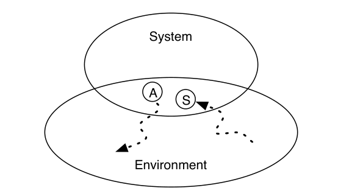
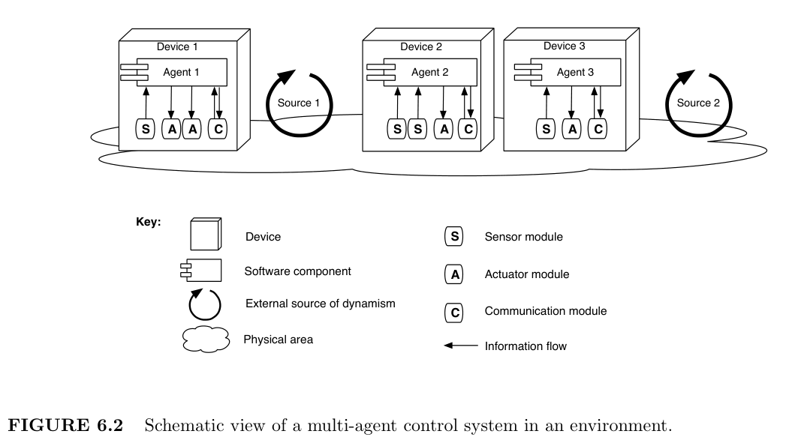
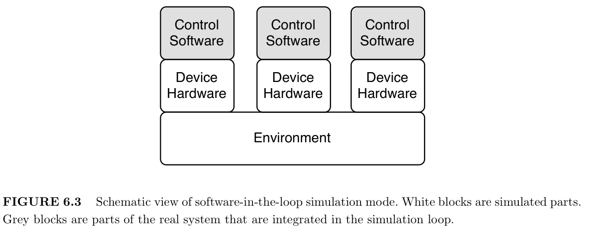

# Chapter 6 On the Role of Software Architecture for Simulating Multi-Agent Systems
***

这个论文主要是控制系统仿真，更接近 

## 6.1 Introduction

> A control system is a software system connected to an underlying environment. The 
environment is the part of the external world with which the control system interacts, and
in which the effects of the control system will be observed [Jackson, 1997]. The task of a
control system is to ensure that particular functionalities are achieved in the environment.
A multi-agent control system is a control system of which the software is a multi-agent
system, i.e. a system that consists of a number of autonomous software components, called
agents, that collaborate to achieve a common goal. Examples of multi-agent control systems
include manufacturing control systems [Verstraete et al., 2006; Brueckner, 2000], collective
robotic systems [Gu and Hu, 2004; Varshavskaya et al., 2004; Bredenfeld et al., 2006], traf-
fic control systems [Wang, 2005; Roozemond, 1999; Dresner and Stone, 2005] and sensor
networks [Sinopoli et al., 2003; DeLima et al., 2006].

控制系统是连接到底层环境的软件系统。环境是控制系统与之交互的外部世界的一部分，其中将观察到控制系统的效果 
[Jackson， 1997]。控制系统的任务是确保在环境中实现特定功能。多智能体控制系统是一种控制系统，
其中的软件是一个多智能体系统，即由许多自主软件组件（称为智能体）组成的系统，这些组件协同工作以实现共同目标。
多智能体控制系统的例子包括制造控制系统 [Verstraete et al.， 2006;Brueckner，2000]，
集体机器人系统[Gu和胡，2004;Varshavskaya 等人，2004 年;Bredenfeld et al.， 2006]， 
交通控制系统 [Wang， 2005;Roozemond， 1999;Dresner 和 Stone，2005 年]和
传感器网络 [Sinopoli 等人，2003 年;DeLima et al.， 2006]。

> Simulation can be used to support the development of multi-agent control systems. Simulation 
offers a safe and cost-effective way for studying, evaluating and configuring the
behavior of a multi-agent control system in a simulated setting [Himmelspach et al., 2003].
In this chapter, we focus on software-in-the-loop simulations for multi-agent control systems
in dynamic environments. This family of simulations has the following characteristics: (1)
the environment to-be-simulated is dynamic. In a dynamic environment, the operating conditions 
of a multi-agent control system are continuously changing; (2) the control software
of the real multi-agent control system is embedded in the simulation.

仿真可用于支持多智能体控制系统的开发。仿真为在模拟环境中研究、评估和配置多智能体控制系统的行为提供了一种安全且
经济高效的方法 [Himmelspach et al.， 2003]。在本章中，我们重点介绍动态环境中多智能体控制系统的软件在环仿真。
这一系列模拟具有以下特征：
- （1） 要模拟的环境是动态的。在动态环境中，多智能体控制系统的运行条件不断变化;
- （2） 将真实多智能体控制系统的控制软件嵌入到仿真中。

> Developing software-in-the-loop simulations of multi-agent control systems in dynamic
environments is complex. The system-to-be-simulated comprises two parts: a dynamic 
environment on the one hand and a multi-agent control system embedded in that environment
on the other hand. We illustrate two main challenges when building simulations for such
systems:

在动态环境中开发多智能体控制系统的软件在环仿真非常复杂。待仿真系统包括两部分：
一方面是动态环境，另一方面是嵌入在该环境中的多智能体控制系统。
我们说明了为此类系统构建仿真时面临的两个主要挑战：

> - *Simulating dynamic environments is complex*. In a dynamic environment an agent
cannot determine the outcome of its actions a priori [Ferber and M¨uller, 1996;
Helleboogh et al., 2005]. Other activities that are happening in the environment
can have a significant impact on the outcome of actions. Consider a robot that
was instructed to start driving north. In a dynamic environment, the action of
the robot can be affected in different ways. For example, another machine could
move into the path of the first robot, blocking it or pushing it aside. Or the
robot’s path could deviate from the intended path due to jitter in the hardware.
Or the robot could run out of energy, causing its movement to stop prematurely.
Even a combination of these phenomena could occur. When simulating dynamic
environments, it is non-trivial to reproduce the variety of possibly cascading
interactions that may occur and the precise way these interactions have an impact
on the actions.

- 模拟动态环境很复杂。在动态环境中，代理无法先验地确定其行为的结果 [Ferber 和 M ̈uller， 
1996;Helleboogh et al.， 2005]。环境中发生的其他活动可能会对操作的结果产生重大影响。
考虑一个被指示开始向北行驶的机器人。在动态环境中，机器人的动作可能会受到不同方式的影响。
例如，另一台机器可能会移动到第一个机器人的路径上，阻挡它或将其推到一边。或者，由于硬件中的抖动，
机器人的路径可能会偏离预期路径。或者机器人可能会耗尽能量，导致其运动过早停止。甚至这些现象的组
合也可能发生。在模拟动态环境时，重现可能发生的各种可能的级联交互以及这些交互对操作产生影响的确切方式并非易事。

> - *Integrating the software of a real multi-agent control system in a simulation is
complicated*. The devices on which the multi-agent control system is deployed
in the real world determine how fast the control software can execute and 
consequently how much time it takes the software to react to changes in the 
environment. However, the characteristics of the computer platform on which the
simulation is executed, can differ significantly from the devices on which the 
control software is deployed in the real world. Moreover, a simulation can be executed
faster or slower than real time. It is non-trivial to reproduce the real-world timing
characteristics of a multi-agent control system in a simulation [Uhrmacher and
Kullick, 2000; Anderson, 1997].

- 在仿真中集成真实的多智能体控制系统的软件很复杂。在现实世界中部署多智能体控制系统的设备决定了控制软件的执行速度，
从而决定了软件对环境变化做出反应所需的时间。然而，执行仿真的计算机平台的特性可能与现实世界中部署控制软件的设备有很大不同。
此外，模拟的执行速度可能比实时更快或更慢。在模拟中再现多智能体控制系统的真实世界时序特性并非易事 
[Uhrmacher 和 Kullick，2000 年;Anderson， 1997]。

> Special-purpose modeling constructs and simulation platforms incorporate a large body
of expertise on building software-in-the-loop simulations of multi-agent control system in
dynamic environments. In simulation platforms this expertise is primarily reified in terms
of reusable code libraries and frameworks. In our own research, we have built up knowledge
and best practices in several cases, including simulations of the Packet-World [Weyns et al.,
2005a], Lego Mindstorms robots [Borgers, 2006], traffic control systems [Weyns et al., 2007]
and Automated Guided Vehicles [Helleboogh et al., 2006]. We experienced that we could
reuse a lot of expertise across these cases. Nevertheless, a substantial part of this expertise
was reused implicitly, as explicit reuse of code libraries and frameworks was rather limited.

专用建模结构和仿真平台融合了在动态环境中构建多智能体控制系统的软件在环仿真的大量专业知识。
在仿真平台中，这种专业知识主要通过可重用的代码库和框架来具体化。在我们自己的研究中，
我们已经在几个案例中积累了知识和最佳实践，包括模拟 Packet-World [Weyns et al.， 2005a]、
Lego Mindstorms 机器人 [Borgers， 2006]、交通控制系统 [Weyns et al.， 2007] 和
自动导引车 [Helleboogh et al.， 2006]。我们体验到，我们可以在这些案例中重用大量专业知识。
尽管如此，这些专业知识的很大一部分被隐式重用，因为代码库和框架的显式重用相当有限。

> In this chapter, we put forward a software architecture for a simulation platform targeted
at software-in-the-loop simulation of multi-agent control systems in dynamic environments.
This software architecture explicitly documents the knowledge and practice incorporated in
a simulation platform in the form of a reusable artifact, clearly distinguished from the code
of the simulation platform. More than reusable code libraries and software frameworks, a
software architecture captures the essence of a complex software system by identifying key
stakeholder concerns and by explicitly specifying how software needs to be structured and
behave to address the concerns. The software architecture integrates the essential architectural 
building blocks for such a simulation platform and explicitly documents the rationale
and tradeoffs that underpin its design. Software architecture provides a systematic way to
capture and share expertise that was acquired across several cases in a form that has proven
its value for software development.

在本章中，我们提出了一种仿真平台的软件架构，旨在对动态环境中的多智能体控制系统进行软件在环仿真。
此软件架构以可重用工件的形式明确记录了仿真平台中包含的知识和实践，与仿真平台的代码明显区分开来。
除了可重用的代码库和软件框架之外，软件架构还通过识别关键利益相关者关注的问题并明确指定软件需要
如何构建和行为来解决这些问题，从而捕捉到复杂软件系统的本质。软件架构集成了此类仿真平台的基本架构构建块，
并明确记录了支撑其设计的基本原理和权衡。软件架构提供了一种系统的方式来捕获和共享在多个案例中获得的专业知识，
其形式已证明其对软件开发的价值。

> This chapter is structured as follows. After presenting some essential background in 
Section 6.2, we introduce an industrial case in Section 6.3, i.e. a AGV transportation 
system that comprises a multi-agent control system for controlling automated guided 
vehicles (AGVs) that transport loads in a warehouse. This case will be used as an illustration
throughout this chapter. In Section 6.4, we summarize our previous work on special-purpose
modeling constructs for modeling software-in-the-loop simulations of multi-agent control
systems in dynamic environments, and we apply these modeling constructs to describe a
simulation model for the AGV transportation system. In Section 6.5, we describe the software 
architecture for a simulation platform that supports these special-purpose modeling
constructs. We document the architecture and explain how important functional and quality
requirements are achieved. In Section 6.6, we evaluate a simulation platform that implements
this architecture and that was used for conducting simulations of the AGV transportation
system. In Section 6.7 we discuss related work on software-in-the-loop simulations of 
multi-agent control systems in dynamic environments. Finally, we point out directions for future
research and we draw conclusions in Section 6.8.

本章的结构如下。在第 6.2 节介绍了一些基本背景之后，我们在第 6.3 节中介绍了一个工业案例，
即 AGV 运输系统，该系统包括一个多代理控制系统，用于控制在仓库中运输货物的自动导引车 （AGV）。
本章将以此案例为例。在第 6.4 节中，我们总结了我们之前关于特殊用途建模结构的工作，
用于对动态环境中多智能体控制系统的软件在环仿真进行建模，并应用这些建模结构来描述 AGV 运输系统的仿真模型。
在 Section 6.5 中，我们描述了支持这些特殊用途建模结构的仿真平台的软件架构。我们记录了架构，
并解释了如何实现重要的功能和质量要求。在第 6.6 节中，我们评估了一个实现此架构的仿真平台，
该平台用于对 AGV 运输系统进行仿真。在 6.7 节中，我们讨论了动态环境中多智能体控制系统的软件在环仿真的相关工作。
最后，我们指出了未来研究的方向，并在 Section 6.8 中得出结论。

## 6.2 Background

> In this section, we describe the necessary background information. We focus on 
> (1) the relation between a system and its environment, 
> (2) the characteristics of multi-agent control systems, and 
> (3) software-in-the-loop simulation.

在本节中，我们将介绍必要的背景信息。我们专注于 （1） 系统与其环境之间的关系，
（2） 多智能体控制系统的特性，以及 （3） 软件在环仿真（software-in-the-loop simulation）。

### 6.2.1 A System and Its Environment

> Software systems are designed to satisfy particular functional and quality requirements.
These requirements are issued by the group of stakeholders involved. For systems that 
interact with the external world via sensors and actuators, these requirements do not directly
concern the software system [Jackson, 1997]. The requirements primarily concern the environment 
in which the system will be installed [Hayes et al., 2003]. The task of a system is
to ensure that particular functionalities are achieved in the environment.

软件系统旨在满足特定的功能和质量要求。这些要求由所涉及的利益相关者组发布。对于通过传感器和执行器与外部世界交互的系统，
这些要求与软件系统没有直接关系 [Jackson， 1997]。这些要求主要涉及系统安装的环境 [Hayes et al.， 2003]。
系统的任务是确保在环境中实现特定功能。

> Jackson defines the environment as the part of the external world with which the system
interacts, and in which the effects of the system will be observed and evaluated [Jackson,
1997]. The distinction between the environment and the system is partly a distinction
between what is given and what is to be constructed.

Jackson 将环境定义为系统与之交互的外部世界的一部分，
并在其中观察和评估系统的效果 [Jackson， 1997]。
环境和系统之间的区别在一定程度上是给定的和将要构建的之间的区别。

> Figure 6.1 depicts the relation between a system and its environment. The system interacts 
with the environment by means of shared phenomena that are directly accessible via
sensors and actuators. However, influencing phenomena that are private to the environment
can only be done in an indirect manner: using sensors and actuators, the system tries to
bring about causal chains to observe and affect private phenomena in the environment.

FIGURE 6.1
The system and its environment [Jackson, 1997].

图 6.1 描述了系统与其环境之间的关系。该系统通过共享现象与环境交互，这些现象可通过传感器和执行器直接访问。
然而，影响环境私有现象只能以间接方式完成：使用传感器和执行器，系统试图建立因果链来观察和影响环境中的私有现象。

> As an example, consider a car’s cruise control system. The environment of the system
consists of the car, its driver, the atmospheric conditions, the road the car drives on, etc.
The cruise control system interacts with its environment through a sensor that can be used
to observe the car’s speed and an actuator that can be used to adjust the car’s throttle.
The requirements of the cruise control system are expressed in terms of phenomena in its
environment. For example, the cruise control system should ensure that the car drives at
a constant speed across the road. The cruise control system can only affect the car’s speed
indirectly, i.e. by relying on a causal chain between manipulations of the throttle actuator
and alterations in the speed of the car.

例如，考虑汽车的巡航控制系统。系统的环境包括汽车、驾驶员、大气条件、汽车行驶的道路等。
巡航控制系统通过可用于观察汽车速度的传感器和可用于调节汽车油门的执行器与其环境进行交互。
巡航控制系统的要求以其环境中的现象来表示。例如，巡航控制系统应确保汽车以恒定速度驶过马路。
巡航控制系统只能间接地影响汽车的速度，即依赖于油门执行器的操作和汽车速度变化之间的因果链。

> Today, the environments in which software systems have to operate are typically dynamic 
[Issarny et al., 2007]. A dynamic environment is an environment that changes frequently. 
In a dynamic environment, the operating conditions of a system are continuously
changing. For example, the environment of the cruise control system is dynamic: the road
may go uphill or downhill, turbulence or wind may arise that causes additional or reduced
drag. These phenomena affect the causal chains by means of which the cruise control system
affects the environment. For example, in case the road goes uphill, changing the throttle
will affect the car’s speed in a different manner compared to the case that the road goes
downhill.

今天，软件系统必须运行的环境通常是动态的 [Issarny et al.， 2007]。动态环境是经常变化的环境。
在动态环境中，系统的运行条件不断变化。例如，巡航控制系统的环境是动态的：道路可能会上坡或下坡，
可能会出现湍流或风，从而导致额外或减少的阻力。这些现象影响因果链，巡航控制系统通过这些因果链影响环境。
例如，如果道路上坡，与道路下坡的情况相比，改变油门将以不同的方式影响汽车的速度。

> As a dynamic environment can significantly affect the software system, it is generally
considered good practice to capture properties and assumptions regarding the environment
in an explicit model [Jackson, 1997; Hayes et al., 2003]. Such a model of the environment
includes assumptions about the frequency and nature of the changes in the environment,
the accuracy and latency of sensors and actuators, the assumptions about the causal chain
from activation of an actuator to the changes in the actual environment, etc. Such a model
describes essential characteristics and assumptions about the environment that must be
checked for proper deployment of the system.

由于动态环境可以显著影响软件系统，因此通常认为在显式模型中捕获有关环境的属性和假设是一种很好的做法 
[Jackson， 1997;Hayes et al.， 2003]。这种环境模型包括有关环境变化的频率和性质、
传感器和执行器的准确性和延迟的假设、关于从执行器激活到实际环境变化的因果链的假设等。
此类模型描述了有关环境的基本特征和假设，必须检查这些特征和假设才能正确部署系统。

### 6.2.2 Characteristics of Multi-Agent Control Systems / 多智能体控制系统的特点

> A multi-agent control system is a distributed software application that continuously and
autonomously acts in, and reacts to, an underlying environment. Examples of multi-agent
control systems include manufacturing control systems [Verstraete et al., 2006; Brueckner,
2000], collective robotic systems [Gu and Hu, 2004; Varshavskaya et al., 2004; Bredenfeld
et al., 2006], traffic control systems [Wang, 2005; Roozemond, 1999; Dresner and Stone,
2005] and sensor networks [Sinopoli et al., 2003; DeLima et al., 2006]. Figure 6.2 gives a
schematic overview of a multi-agent control system in an environment.
> 
> 图 6.2 环境中多智能体控制系统的示意图。

多代理控制系统是一种分布式软件应用程序，可持续、自主地在底层环境中进行操作并做出反应。
多智能体控制系统的例子包括制造控制系统 [Verstraete et al.， 2006;Brueckner，2000]，
集体机器人系统[Gu和胡，2004;Varshavskaya 等人，2004 年;Bredenfeld et al.， 2006]，
交通控制系统 [Wang， 2005;Roozemond， 1999;Dresner 和 Stone，2005 年]和传感器网络 
[Sinopoli 等人，2003 年;DeLima et al.， 2006]。
图 6.2 给出了环境中多智能体控制系统的示意图概述。

> A multi-agent control system consists of several agents. Agents are autonomous software
components that are distributed in the environment and that cooperate to solve a particular
problem in the environment. In Figure 6.2, three agents are depicted: Agent 1, Agent 2
and Agent 3.

多智能体控制系统由多个智能体组成。代理是分布在环境中的自主软件组件，它们协同工作以解决环境中的特定问题。
在图 6.2 中，描绘了三个代理：代理 1、代理 2 和代理 3。

> The agents of a multi-agent control system are deployed on particular devices in the 
environment. A device consists of a software and a hardware part. The software part is one
of the agents that constitutes the multi-agent control system, whereas the hardware part
comprises sensor, actuator and communication modules. An agent can use the sensor, 
actuator and communication modules of its device to interact with the environment. Figure 6.2
depicts three devices in the environment: Device 1, Device 2 and Device 3.

多代理控制系统的代理部署在环境中的特定设备上。设备由软件和硬件部分组成。软件部分是构成多智能体控制系统的智能体之一，
而硬件部分包括传感器、执行器和通信模块。代理可以使用其设备的传感器、执行器和通信模块与环境进行交互。
图 6.2 描述了环境中的三个设备：设备 1、设备 2 和设备 3。

> The environment of a multi-agent control system is the part of the external world in which
the problem resides and in which the effects of the control system, once installed and set
in operation, will be observed [Hayes et al., 2003]. Typically, a multi-agent control system
operates in a dynamic environment, i.e. an environment where other sources of dynamism
are present, e.g., other systems, processes or even humans. These sources of dynamism
are external to the multi-agent control system. Figure 6.2 depicts two external sources of
dynamism present in the environment: Source 1 and Source 2. The operation of external
sources of dynamism can have a significant impact on a multi-agent control system.

多智能体控制系统的环境是问题所在的外部世界的一部分，一旦安装并运行，将观察到控制系统的效果 [Hayes et al.， 2003]。
通常，多智能体控制系统在动态环境中运行，即存在其他动态来源的环境，例如，其他系统、流程甚至人类。
这些动态来源位于多智能体控制系统的外部。图 6.2 描述了环境中存在的两个外部动态源：源 1 和源 2。
外部动态源的运行可能会对多代理控制系统产生重大影响。

> Designing and testing a multi-agent control system is complex as it requires an integrated
approach that takes into account the environment in which the application is situated [Hu
and Zeigler, 2005]. A multi-agent control system should take into account dynamism originating 
from other systems, processes or humans in the environment and react appropriately
to their presence.

设计和测试多智能体控制系统很复杂，因为它需要一种考虑到应用程序所处环境的集成方法 [胡 和 Zeigler，2005]。
多智能体控制系统应考虑来自环境中其他系统、流程或人类的动态性，并对它们的存在做出适当的反应。

### 6.2.3 Software-in-the-Loop Simulation Mode

> Software-in-the-loop simulation mode denotes simulations in which the software of the real
control system is embedded in the simulation loop. Software-in-the-loop simulation mode
is depicted in Figure 6.3. The simulation contains parts of the real system, i.e. the control
software, together with simulated parts, i.e. the device hardware and the environment.
The executable code of the real control system is directly embedded in the simulation. In
software-in-the-loop simulation mode, the software of the real control system is deployed
on simulated devices that reside within a simulated environment with simulated sources of
dynamism.
> 
> 图 6.3 软件在环仿真模式的示意图。白色块是模拟零件。灰块是集成在仿真循环中的真实系统的一部分。

软件在环仿真模式表示将真实控制系统的软件嵌入到仿真回路中的仿真。软件在环仿真模式如图 6.3 所示。
仿真包含真实系统的部分，即控制软件，以及仿真部分，即设备硬件和环境。真实控制系统的可执行代码直接嵌入到仿真中。
在软件在环仿真模式下，真实控制系统的软件部署在仿真设备上，这些设备驻留在具有仿真动态源的仿真环境中。

> Software-in-the-loop simulation is typically used during the late stages of application
development, i.e., after the software of the multi-agent control system (or parts thereof) has
been implemented. Software-in-the-loop simulation enables experimenting with the agents
of a multi-agent control system on simulated devices before deployment on real devices.
Software-in-the-loop simulation is extensively used for the development of control systems
for robots. For example, software-in-the-loop simulations enable testing the robustness and
fault-tolerance of control systems for robots [Br¨aunl et al., 2006; Finkenzeller et al., 2003]
or can facilitate parameter estimation of a control systems for robots [Velez and Agudelo,
2006].

软件在环仿真通常在应用程序开发的后期阶段使用，即在多智能体控制系统（或其部分）的软件实施之后。
软件在环仿真支持在实际设备上部署之前，在模拟设备上对多代理控制系统的代理进行试验。软件在环仿真广泛用于机器人控制系统的开发。
例如，软件在环仿真可以测试机器人控制系统的稳健性和容错能力 [Br ̈aunl et al.， 2006;Finkenzeller et al.， 2003] 
或可以促进机器人控制系统的参数估计 [Velez 和 Agudelo， 2006]。

## 6.3 AGV Transportation System

## 6.4 Modeling Multi-Agent Control Applications in Dynamic Environments / 在动态环境中对多智能体控制应用程序进行建模

## 6.5 Architecture of the Simulation Platform

