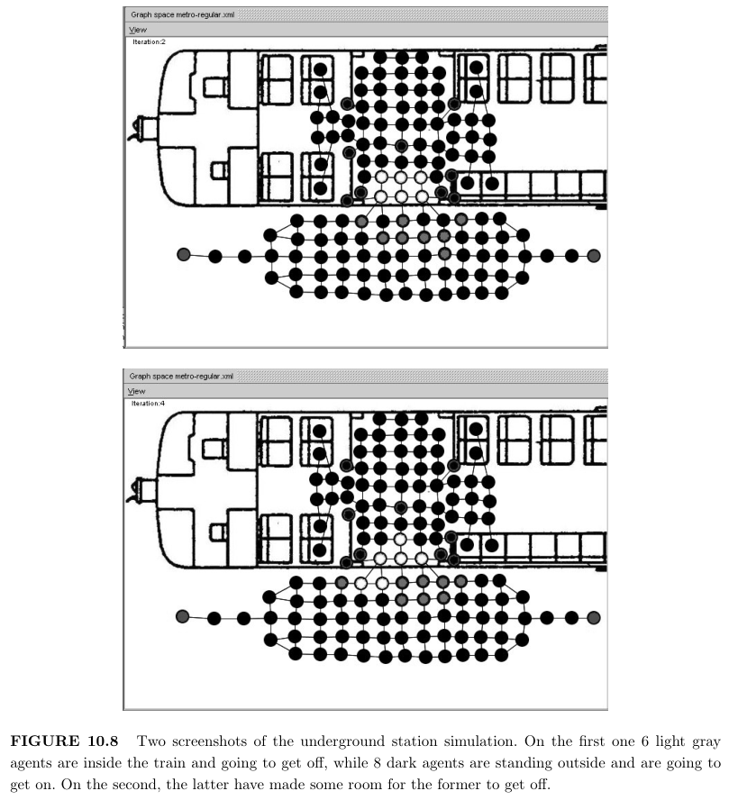

# Chapter 10 Crowd Behavior Modeling: From Cellular Automata to Multi-Agent Systems
群体行为建模：从元胞自动机到多智能体系统

## 10.1 Introduction

> Crowds of pedestrians are complex entities from different points of view, starting from
the difficulty in providing a satisfactory definition of the term “crowd”. “(Too) many people 
in (too) little space” [Kruse, 1986] is a pedestrian crowd definition aggregating several
disciplinary interpretations, and the range of this definition sites its fuzzy borders in the 
traditional opposition between humanistic and scientific cultures in these studies. The range
of individual and collective behaviors that take place in a crowd, the composite mix of
competition for the shared space but also collaboration due to, not necessarily explicit but
shared, social norms, the possibility to detect self-organization and emergent phenomena;
they are all indicators of the intrinsic complexity of a crowd. Nonetheless, the relevance of
human behavior, and especially of the movements of pedestrians in a built environment in
normal and extraordinary situations (e.g., evacuation), and its implications for the activities
of architects, designers and urban planners are apparent (see, e.g., [Batty, 2001] and [Willis
et al., 2004]), especially given recent dramatic episodes such as terrorist attacks, riots and
fires, but also due to the growing issues in facing the organization and management of pub-
lic events (ceremonies, races, carnivals, concerts, parties/social gatherings, and so on) and
in designing naturally crowded places (e.g., stations, arenas, airports). Crowd models and
simulators are thus increasingly being investigated in the scientific context, sold by firms∗,
and used by decision makers. In fact, even if research on this topic is still quite lively and
far from a complete understanding of the complex phenomena related to crowds of pedestrians 
in the environment, models and simulators have shown their usefulness in supporting
architectural designers and urban planners in their decisions by creating the possibility to
envision the behavior/movement of crowds of pedestrians in specific designs/environments,
to elaborate what-if scenarios and evaluate their decisions with reference to specific metrics
and criteria.

从不同的角度来看，行人人群是复杂的实体，首先是难以为“人群”一词提供令人满意的定义。“（太多）人在（太）小的空间里”[Kruse， 1986] 是一个行人群体的定义，它汇集了几种学科的解释，这个定义的范围将其模糊的边界定位在这些研究中人文主义和科学文化之间的传统对立中。在人群中发生的个人和集体行为的范围，对共享空间的竞争，以及由于不一定是明确但共享的社会规范而产生的合作的综合组合，检测自组织和涌现现象的可能性;它们都是群体内在复杂性的指标。尽管如此，人类行为的相关性，尤其是行人在正常和特殊情况下（例如疏散）中在建筑环境中的移动，及其对建筑师、设计师和城市规划师活动的影响是显而易见的（参见 [Batty， 2001] 和 [Willis et al.， 2004]），特别是考虑到最近的戏剧性事件，例如恐怖袭击， 骚乱和火灾，但也是由于公共活动（仪式、比赛、狂欢节、音乐会、派对/社交聚会等）的组织和管理以及设计自然拥挤的场所（例如车站、竞技场、机场）面临的问题日益严重。因此，人群模型和模拟器越来越多地在科学背景下进行研究，由公司∗销售，并被决策者使用。事实上，即使关于这个主题的研究仍然相当活跃，并且远未完全理解与环境中行人人群相关的复杂现象，但模型和模拟器已经显示出它们在支持建筑设计师和城市规划者决策方面的作用，因为它创造了设想特定设计/环境中行人人群的行为/运动的可能性。 详细阐述假设场景，并参考特定指标和标准评估其决策。

> The current state of the art in crowd simulation approaches comprises very different types
of models, ranging from a physical approach to the representation of pedestrians (viewed
in terms of particles subject to forces generated by points of reference/interest of the 
environment and by pedestrians themselves; see, e.g., [Helbing et al., 1997]), to a discrete
modeling of the environment in terms of a lattice in which pedestrians are viewed as 
particular states of a cell, in a Cellular Automata (CA) approach (see, e.g., [Schadschneider
et al., 2002]), to agent based approaches (see, e.g., [Kl¨ugl and Rindsf¨user, 2007]), more
clearly separating the representations of the environment and the entities that inhabit it,
acting and interacting according to their perceptive capabilities and behavioral specification.
This significant difference in the ways pedestrians are represented in terms of properties,
internal state, motivations, behaviors, also reflects the growing range of the applications
of the simulators based on these models. The encouraging results obtained by relevant approaches 
to modeling and simulating pedestrians in normal and egress situations [Helbing
et al., 2001] have in fact led to consider, on the one hand, the possibility of extending the
range of applications of these models to other application areas, for instance to simulate
the behaviors of pedestrians in shopping centers (see, e.g., [Kitazawa and Batty, 2004; Dijkstra 
et al., 2007]). On the other hand, the possibility of integrating the current pedestrian
models (i) with more complex interpersonal interaction mechanisms (e.g., from those that
lead people moving in pairs and small groups, to those guiding the spreading of emotional
states [Adamatzky, 2005]), (ii) with models related to additional relevant phenomena (e.g.,
smoke or fires diffusion∗∗), (iii) with more complex perception mechanisms, and in general
with more complex models of pedestrian motivations, goals and agendas [Dijkstra et al.,
2005]. It must be noted that these developments call for field data and (whenever possible),
experimental studies to make models more realistic; however, it must also be noted that
in several of the aforementioned studies the role and relevance of the single pedestrian, of
his/her goals, characteristics, relationships with the others in a given simulation scenario,
are all factors that make the agent-based approach and Multi-Agent Systems (MAS) [Ferber,
1999] a natural way of analyzing, describing and modeling crowds as systems of pedestrians,
with their own features, their environment, the ways they interact with it and with other
pedestrians.

当前最先进的人群模拟方法包括非常不同类型的模型，从表示行人的物理方法（根据受环境的参考点/兴趣点和行人本身产生的力的粒子来看;参见 [Helbing et al.， 1997]），再到根据晶格对环境进行离散建模，其中行人被视为细胞，在元胞自动机（CA）方法中，参见[Schadschneider等人，2002]），到基于代理的方法（参见[Kl ̈ugl和Rindsf ̈user，2007]），更清楚地区分环境和居住在其中的实体的表征，根据它们的感知能力和行为规范进行行动和互动。行人在属性、内部状态、动机、行为方面的表现方式的这种显着差异，也反映了基于这些模型的模拟器的应用范围不断扩大。通过对正常和出口情况下的行人进行建模和模拟的相关方法所获得的令人鼓舞的结果 [Helbing et al.， 2001] 实际上，一方面考虑了将这些模型的应用范围扩展到其他应用领域的可能性，例如模拟购物中心行人的行为（参见， 例如，[Kitazawa 和 Batty，2004 年;Dijkstra et al.， 2007]）。另一方面，将当前的行人模型 （i） 与更复杂的人际互动机制（例如，从引导人们结对和小团体移动的模型，到引导情绪状态传播的模型 [Adamatzky， 2005]），（ii） 与其他相关现象相关的模型（例如，烟雾或火焰扩散∗∗），（iii） 具有更复杂的感知机制， 一般来说，行人动机、目标和议程的模型更复杂 [Dijkstra et al.， 2005]。必须指出的是，这些发展需要实地数据和（尽可能）实验研究，以使模型更加真实;然而，还必须注意的是，在上述几项研究中，单个行人的角色和相关性，他/她的目标、特征、在给定模拟场景中与他人的关系，都是使基于代理的方法和多代理系统 （MAS） [Ferber， 1999] 成为分析、描述和建模人群作为行人系统的自然方式的因素， 拥有自己的特征、环境、与环境以及其他行人互动的方式。

> The MAS approach to the modeling and simulation of complex systems has been applied
in very different contexts, ranging from the study of social systems [Axtell, 2000], to 
biological systems (see, e.g., [Christley et al., 2007]), and it is considered as one of the most
successful perspectives of agent–based computing [Luck et al., 2005], even if this approach
is still relatively young, compared, for instance, to analytical equation-based modeling. The
main aim of this chapter is to introduce a formal and computational framework based on
MAS principles and related guidelines for its adoption to represent and simulate crowds
of pedestrians. The described approach is rooted on basic principles of discrete modeling
approaches based on Cellular Automata, but it clearly separates the active entities (i.e.,
pedestrians) from the environment they inhabit. This approach has two main long term
goals, namely (i) the definition of a MAS model for crowds capable of generating phenomena 
that are currently described by more analytical and CA-based approaches, but that can
also be integrated with more complex models of pedestrian motivations, perceptive capabilities 
and behaviors, as well as with other models related to phenomena that can take place
in the environment, and (ii) to realize an integrated and extensible instrument supporting 
experts in their studies and analysis on crowd phenomena and pedestrian behaviors in
crowded spaces, without requiring particular technical skills, such as proficiency in software
engineering.

MAS 方法用于复杂系统的建模和模拟已被应用于非常不同的环境中，从社会系统的研究 [Axtell， 2000] 到生物系统（参见 [Christley et al.， 2007]），它被认为是基于代理的计算最成功的观点之一 [Luck et al.， 2005]，即使这种方法还相对年轻， 例如，与基于分析方程的建模进行比较。本章的主要目的是介绍一个基于 MAS 原则和相关指南的正式和计算框架，以便采用它来表示和模拟行人人群。所描述的方法植根于基于元胞自动机的离散建模方法的基本原则，但它清楚地将活动实体（即行人）与他们所居住的环境区分开来。这种方法有两个主要的长期目标，即 （i） 为能够产生现象的人群定义 MAS 模型，这些现象目前由更多分析和基于 CA 的方法描述，但也可以与更复杂的行人动机、感知能力和行为模型相结合，以及与环境中可能发生的现象相关的其他模型， （ii） 实现一种集成且可扩展的工具，支持专家对拥挤空间中的人群现象和行人行为进行研究和分析，而无需特定的技术技能，例如精通软件工程。

> This chapter describes the current advancement of this research project covering the 
different aspects of the above mentioned framework. In particular, after an analysis of the
related works in particular within pedestrian dynamics research context, Section 10.3 
introduces Situated Cellular Agents (SCA) [Bandini et al., 2006b], the MAS-based model
adopted for this project. This section also introduces the guidelines of the proposed modeling 
approach and Section 10.4 describes a case study related to the simulation of complex
underground station crowd dynamics. Section 10.5 discusses one of the roles of tools supporting; 
conclusions and future trends of research in this specific application area will end
the chapter.

本章描述了该研究项目的当前进展，涵盖了上述框架的不同方面。特别是，在分析了相关工作，特别是在行人动力学研究背景下，第 10.3 节介绍了定位蜂窝代理 （SCA） [Bandini et al.， 2006b]，该项目采用的基于 MAS 的模型。本节还介绍了所提出的建模方法的指导方针，第 10.4 节描述了与复杂地下车站人群动力学仿真相关的案例研究。第 10.5 节讨论了支持的工具的作用之一;这一特定应用领域的研究结论和未来趋势将结束本章。

## 10.2 Pedestrian Dynamics Context: An Overview / 行人动力学背景：概述

> It is not a simple task to provide a compact yet comprehensive overview of the different 
approaches and models for the representation and simulation of crowd dynamics. In
fact, entire scientific interdisciplinary workshops and conferences are focused on this topic
(see, e.g., the proceedings of the first edition of the International Conference on Pedestrian
and Evacuation Dynamics [Schreckenberg and Sharma, 2001]). However, most approaches
can be classified according to the way pedestrians are represented and managed, and in particular:
> - pedestrians as particles subject to forces of attraction/repulsion;
> - pedestrians as particular states of cells in a CA;
> - pedestrians as autonomous agents, situated in an environment.

对人群动力学表示和模拟的不同方法和模型进行紧凑而全面的概述并不是一项简单的任务。事实上，整个科学跨学科研讨会和会议都集中在这个主题上（例如，参见第一版国际行人和疏散动力学会议的论文集 [Schreckenberg 和 Sharma， 2001]）。但是，大多数方法都可以根据行人的表示和管理方式进行分类，特别是：

- 行人作为受吸引/排斥力影响的粒子;
- 行人作为 CA 中单元的特定状态;
- 行人作为自主代理，位于环境中。

### 10.2.1 Pedestrians as Particles / 作为粒子的行人

> Several models for pedestrian dynamics are based on an analytical approach, representing
pedestrians as particles subject to forces, modeling the interaction between pedestrian and
the environment (and also among pedestrians themselves, in the case of active walker models 
[Helbing et al., 1997]). Forces of attraction lead the pedestrians/particles towards their
destinations (modeling thus their goals), while forces of repulsion are used to represent the
tendency to stay at a distance from other points of the environment. Figure 10.1 shows
a diagram exemplifying the application of this approach to the representation of an intersection 
that is being crossed by three pedestrians. In particular, the velocity of the gray
pedestrian is determined as an aggregation of the influences it is subject to, that are the
attraction to its reference point (the top exit) and the repulsion from the other pedestrians.
This kind of effect was introduced by a relevant and successful example of this modeling
approach, the social force model [Helbing and Moln´ar, 1995]; this approach introduces the
notion of social force, representing the tendency of pedestrians to stay at a certain distance
from one another; other relevant approaches take inspiration from fluid-dynamic [Helbing,
1992] and magnetic forces [Okazaki, 1979] for the representation of mechanisms governing
flows of pedestrians.

行人动力学的几个模型基于分析方法，将行人表示为受力的粒子，模拟行人与环境之间的相互作用（以及行人本身之间的相互作用，在主动步行者模型的情况下 [Helbing et al.， 1997]）。吸引力将行人/粒子引导至目的地（从而对他们的目标进行建模），而排斥力则用于表示与环境的其他点保持一定距离的趋势。图 10.1 显示了一个图表，该图表说明了将这种方法应用于表示三个行人穿过的十字路口。特别是，灰色行人的速度被确定为它所受影响的集合，即对其参考点（顶部出口）的吸引力和来自其他行人的排斥力。这种效果是由这种建模方法的一个相关且成功的例子引入的，即社会力量模型 [Helbing 和 Moln'ar， 1995];这种方法引入了社会力量的概念，代表了行人彼此保持一定距离的倾向;其他相关方法从流体动力学 [Helbing， 1992] 和磁力 [Okazaki， 1979] 中汲取灵感，用于表示控制行人流动的机制。

> While this approach is based on a precise methodology and has provided relevant results,
it represents pedestrian as mere particles, whose goals, characteristics and interactions must
be represented through equations, and thus it is not simple to incorporate heterogeneity
and complex pedestrian behaviors in this kind of model.

虽然这种方法基于精确的方法并提供了相关结果，但它将行人表示为纯粹的粒子，其目标、特征和交互必须通过方程式表示，因此在这种模型中纳入异质性和复杂的行人行为并不简单。

### 10.2.2 Pedestrians as States of CA / 行人作为CA（元胞自动机）的状态

> A different approach to crowd modeling is characterized by the adoption of Cellular Automata (CA) 
[Wolfram, 1986], with a discrete spatial representation and discrete time-steps,
to represent the simulated environment and the entities it comprises. The cellular space thus
includes both a representation of the environment and an indication of its state, in terms
of occupancy of the sites it is divided into, by static obstacles as well as human beings.
Transition rules must be defined in order to specify the evolution of every cell’s state; they
are based on the concept of neighborhood of a cell, a specific set of cells whose state will
be considered in the computation of its transition rule. The transition rule, in this kind
of model, generates the illusion of movement, that is mapped to a coordinated change of
cells state. To make a simple example, an atomic step of a pedestrian is realized through
the change of state of two cells, the first characterized by an “occupied” state that becomes
“vacant”, and an adjacent one that was previously “vacant” and that becomes “occupied”.
Figure 10.2 shows a sample effect of movement generated by the subsequent application of
a transition rule in the cellular space. This kind of application of CA-based models is essentially 
based on previous works adopting the same approach for traffic simulation [Nagel and Schreckenberg, 1992].

另一种不同的人群建模方法的特点是采用元胞自动机 （CA） [Wolfram， 1986]，具有离散的空间表示和离散的时间步长，来表示模拟环境及其包含的实体。因此，细胞空间既包括环境的表示，也包括其状态的指示，就它所划分的地点的占用而言，由静态障碍物和人类划分。必须定义转换规则才能指定每个单元格状态的演变;它们基于单元邻域的概念，单元是一组特定的单元，其状态将在计算其转换规则时考虑。在这种模型中，过渡规则会产生运动的错觉，该错觉映射到细胞状态的协调变化。举个简单的例子，行人的原子步骤是通过两个单元的状态变化来实现的，第一个单元的特征是 “占用 ”状态变成 “空置 ”，相邻的  单元 以前 “空 ”变成 “占用”。图 10.2 显示了随后在细胞空间中应用转换规则产生的运动效应样本。这种基于 CA 的模型应用基本上是基于以前采用相同方法进行交通模拟的工作 [Nagel 和 Schreckenberg， 1992]。

> Local cell interactions are thus the uniform (and only) way to represent the motion of
an individual in the space (and the choice of the destination of every movement step). The
sequential application of this rule to the whole cell space may bring to emergent effects and
collective behaviors. Relevant examples of crowd collective behaviors that were modeled
through CAs are the formation of lanes in bidirectional pedestrian flows [Blue and Adler,
2000a], the resolution of conflicts in multi directional crossing pedestrian flows [Blue and
Adler, 2000b]. In this kind of example, different states of the cells represent pedestrians
moving towards different exits; this particular state activates a particular branch of the
transition rule causing the transition of the related pedestrian to the direction associated
to that particular state. Additional branches of the transition rule manage conflicts in the
movement of pedestrians, for instance through changes of lanes in case of pedestrians that
would occupy the same cell coming from opposite directions.

因此，局部细胞交互是表示空间中个体运动（以及每个运动步骤的目的地选择）的统一（也是唯一）方式。将此规则依次应用于整个细胞空间可能会带来涌现效应和集体行为。通过 CA 建模的人群集体行为的相关示例是在双向人流中形成车道 [Blue 和 Adler， 2000a]，在多向交叉行人流中解决冲突 [Blue 和 Adler， 2000b]。在此类示例中，单元格的不同状态表示行人向不同的出口移动;此特定状态会激活 Transition Rule 的特定分支，从而导致相关行人过渡到与该特定状态关联的方向。过渡规则的其他分支管理行人移动中的冲突，例如，如果行人从相反方向占据同一单元，则通过改变车道。

> It must be noted, however, that the potential need to represent goal driven behaviors
(i.e., the desire to reach a certain position in space) has often led to extend the basic
CA model to include features and mechanisms breaking the strictly locality principle. A
relevant example of this kind of development is represented by a CA based approach to
pedestrian dynamics in evacuation configurations [Schadschneider et al., 2002]. In this case,
the cellular structure of the environment is also characterized by a predefined desirability
level, associated to each cell, that, combined with more dynamic effects generated by the
passage of other pedestrians, guide the transition of states associated to pedestrians.

然而，必须注意的是，表示目标驱动行为（即，到达空间中某个位置的愿望）的潜在需求通常导致扩展基本的 CA 模型以包括打破严格局部原则的特征和机制。这种开发的一个相关例子是以基于 CA 的疏散配置中行人动态方法为代表 [Schadschneider et al.， 2002]。在这种情况下，环境的细胞结构也以与每个细胞相关的预定义意愿水平为特征，该水平与其他行人通过产生的更多动态效应相结合，指导与行人相关的状态的过渡。

### 10.2.3 Pedestrians as Autonomous Agents / 作为自主代理的行人

> Recent developments in this line of research (e.g., [Henein and White, 2005; Dijkstra et al.,
2006]), introduce modifications to the basic CA approach that are so deep that the resulting
models are effectively agent-based and Multi Agent Systems (MAS) models exploiting a cellular 
space representing spatial aspects of agents’ environment. A MAS is a system made up
of a set of autonomous components which interact, for instance according to collaboration
or competition schemes, in order to contribute in realizing an overall behavior that could
not be generated by single entities by themselves. As previously introduced, MAS models
have been successfully applied to the modeling and simulation of several situations characterized 
by the presence of autonomous entities whose action and interaction determines the
evolution of the system, and they are increasingly being adopted also to model crowds of
pedestrians [Batty, 2001; Gloor et al., 2004; Toyama et al., 2006]. All these approaches are
characterized by the fact that the agents encapsulate some form of behavior inspired by the
above described approaches, that is, forms of attractions/repulsion generated by points of
interest or reference in the environment but also by other pedestrians.

这一研究领域的最新发展（例如，[Henein 和 White，2005 年;Dijkstra et al.， 2006]），引入了对基本 CA 方法的修改，这些修改非常深入，以至于生成的模型实际上是基于代理的和多代理系统 （MAS） 模型，利用了代表代理环境空间方面的细胞空间。MAS 是一个由一组自主组件组成的系统，这些组件根据协作或竞争计划进行交互，以便有助于实现单个实体自身无法生成的整体行为。如前所述，MAS 模型已成功应用于多种情况的建模和模拟，其特征是存在自主实体，其操作和交互决定了系统的演变，并且它们也越来越多地被用于对行人人群进行建模 [Batty， 2001;Gloor 等人，2004 年;Toyama et al.， 2006]。所有这些方法的特点是，代理封装了受上述方法启发的某种形式的行为，即由环境中的兴趣点或参考以及其他行人产生的吸引力/排斥形式。

> Other agent based approaches to the modeling of pedestrians and crowds were developed
with the primary goal of providing an effective 3D visualization of the simulated dynamics.
The approaches described in [Musse and Thalmann, 2001] and in [Shao and Terzopoulos,
2007] are characterized by a very composite model of pedestrian behavior, including basic
reactive behaviors as well as a cognitive control layer; moreover, actions available to agents
are not strictly related to their movement, but they also allow forms of direct interaction
among pedestrians and interaction with objects situated in the environment. Another relevant 
approach, described in [Murakami et al., 2003], is less focused on visual effectiveness of
the simulation dynamics, and it supports a flexible definition of the simulation scenario also
without requiring the intervention of a computer programmer. However, these virtual reality 
focused approaches to pedestrian and crowd simulation were not tested in paradigmatic
case studies, modeled adopting analytical approaches or cellular automata and validated
against real data.

开发了其他基于智能体的行人和人群建模方法，其主要目标是提供模拟动态的有效 3D 可视化。[Musse 和 Thalmann， 2001] 和 [Shao and Terzopoulos， 2007] 中描述的方法的特点是行人行为的非常复合模型，包括基本的反应行为以及认知控制层;此外，代理可用的动作并不严格地与他们的运动相关，但它们也允许行人之间进行各种形式的直接互动以及与环境中物体的互动。[Murakami et al.， 2003] 中描述的另一种相关方法不太关注模拟动力学的视觉效果，并且它支持模拟场景的灵活定义，也不需要计算机程序员的干预。然而，这些以虚拟现实为重点的行人和人群模拟方法并未在范式案例研究中进行测试，采用分析方法或元胞自动机进行建模，并根据真实数据进行验证。

## 10.3 Guidelines for Crowds Modeling with Situated Cellular Agents Approach /  使用 Situated Cellular Agents 方法进行群体建模的准则

> The activity of modeling complex simulation scenarios to study crowds and their dynamic
phenomena with a MAS-based approach consists in a complex activity, that generally, at
least requires a deep knowledge of the domain, proficiency in computational modeling (with
specific reference to MAS models), the skills of a programmer, a deep acquaintance with
the simulation platform. Rarely such heterogeneous competences can be found in the same
person. Even in these rare cases, the difficulty of building a software simulation directly
from a domain level theory or model without specific methodologies and implementation
tools, with the risk of hiding the complexity of the overall process, several often necessary
intermediate choices and assumptions. In the following we describe a methodology, a set
of guidelines directed to experts but also to non-experts, developed to tackle these issues
and provide users that wish to create models for pedestrian (and crowds) dynamics with a
formal and computational reference framework. We describe the process of building a model
based on Situated Cellular Agent (SCA) of a system of pedestrians, basically defined by the
specification of three elements: the spatial abstraction in which the simulated entities are
situated, the relevant elements of this structure which are able to shape and influence crowd
behavior, and the behavioral specification of moving entities. Figure 10.3 summarizes the
overall process, in which starting from an abstract scenario, a computational model is built
with the reference guidelines of a formal model. Software tools, designed and developed
according to the same reference framework, can effectively support model implementation
and execution to run specific experiments.
> 

使用基于 MAS 的方法对复杂的模拟场景进行建模以研究人群及其动态现象的活动包括一项复杂的活动，通常至少需要对该领域有深入的了解，熟练的计算建模（特别是 MAS 模型），程序员的技能，对模拟平台有深入的了解。很少能在同一个人身上找到这种异质的能力。即使在这些罕见的情况下，在没有特定方法和实现工具的情况下，直接从领域级理论或模型构建软件仿真也很困难，并且有可能隐藏整个过程的复杂性，几个通常是必要的中间选择和假设。在下文中，我们描述了一种方法，这是一套针对专家和非专家的指南，旨在解决这些问题，并为希望为行人（和人群）动态创建模型的用户提供正式的计算参考框架。我们描述了基于行人系统的定位蜂窝代理 （SCA） 构建模型的过程，基本上由三个要素的规范定义：模拟实体所在的空间抽象、该结构中能够塑造和影响人群行为的相关元素，以及移动实体的行为规范。图 10.3 总结了整个过程，其中从抽象场景开始，使用正式模型的参考指南构建计算模型。根据相同的参考框架设计和开发的软件工具可以有效地支持模型实现和执行以运行特定实验。
 

> The Situated Cellular Agent (SCA) model is a specific class of Multilayered Multi-Agent
Situated System (MMASS) [Bandini et al., 2002] and, among MAS-based approaches to
complex systems modeling, it provides an explicit structured spatial representation of the
agents, environment and space-dependent agent behavioral and interaction mechanisms. A
thorough description of the model is out of the scope of this chapter; the syntax and semantics 
of SCA basic elements will be briefly introduced when required for sake of clarity.
<I>A Situated Cellular Agent </I> is defined by the triple ⟨Space, F, A⟩ where <I>Space</I> models the
environment where the set <I>A</I> of agents is situated, acts autonomously and interacts at-a-distance, 
through the propagation of the set F of fields, and locally through synchronous
reaction operator. Figure 10.4 shows a diagram of the two interaction mechanisms provided
by the model. More precisely Space consists of a set P of sites arranged in a network (i.e.,
an undirected graph of sites).  The structure of the space can be represented as a neighborhood 
function, N : P −→ 2P so that N (p) ⊆ P is the set of sites adjacent to p ∈ P; the
previously introduced Space element is thus the pair ⟨P, N⟩. Focusing instead on the single
basic environmental elements, a site p ∈ P can contain at most one agent and is defined by
the 3–tuple ⟨ap, Fp, Pp⟩ where:

> - ap ∈ A ∪ {⊥} is the agent situated in p (ap = ⊥ when no agent is situated in p that is, p is empty);
> - Fp ⊂ F is the set of fields active in p (Fp = ∅ when no field is active in p);
> - Pp ⊂ P is the set of sites adjacent to p (i.e., N (p)).

定位蜂窝代理 （SCA） 模型是多层多代理定位系统 （MMASS） [Bandini et al.， 2002] 的一类特定类别，在基于 MAS 的复杂系统建模方法中，
它提供了代理、环境和空间依赖代理行为和交互机制的显式结构化空间表示。对该模型的全面描述超出了本章的范围;为了清楚起见，
将在需要时简要介绍 SCA 基本元素的语法和语义。位于蜂窝代理由三元组 ⟨Space， F， A⟩ 定义，其中空间模拟代理集 A 所在的环境，
通过一组场 F 的传播自主行动并在远处交互，并通过同步反应算子在本地进行交互。图 10.4 显示了模型提供的两种交互机制的示意图。
更准确地说，空间由一组排列在网络中的站点 P（即，一个无向的站点图）组成。空间的结构可以表示为邻域函数 N : P −→ 2P，
因此  N (p) ⊆ P 是与 p ∈ P 相邻的站点集;因此，前面介绍的 Space 元素是 ⟨P， N⟩ 对。
相反，关注单个基本环境元素，一个位点 p ∈ P 最多可以包含一个代理，由 3 元组 ⟨ap, Fp, Pp⟩ 定义，其中：
- ap ∈ A ∪ {⊥} 是位于 p 中的代理 (当 p 中没有代理时，ap = ⊥ , 即 p 为空);
- Fp ⊂ F 是 p 中活动的字段集 (当 p 中没有活动字段时， Fp = ∅ );
- Pp ⊂ P 是与 p 相邻的位点集 (i.e., N (p)).

> A SCA agent is defined by the 3–tuple ⟨ s, p, τ ⟩ where τ is the agent type, s ∈ Στ denotes
the agent state and can assume one of the values specified by its type (see below for Στ
definition), and p ∈ P is the site of the Space where the agent is situated. As previously
stated, agent type is a specification of agent state set, perceptive capabilities and behavior.
It is defined by the 3–tuple ⟨Στ, Perceptionτ, Actionτ⟩. Στ defines 
the set of states that agents of type τ can assume. Perceptionτ : 
Στ → [N × Wf1] . . . [N × Wf|F|] is a function
associating to each agent state a vector of pairs representing the receptiveness coefficient
and sensitivity thresholds for that kind of field. Actionτ represents instead the behavioral
specification for agents of type τ. Each SCA agent is thus provided with a set of sensors (i.e.,
defined in terms of perception function) that allows its interaction with the environment
and other agents. At the same time, agents can be the source of fields that diffusing within
the structured SCA space can be perceived by other agents endowed with suitable sensors
(e.g., noise emitted by a talking agent that can be perceived at-a-distance).

SCA 代理由 3 元组 ⟨ s， p， τ ⟩ 定义，其中 τ 是代理类型，s ∈ Στ 表示代理状态，
可以采用其类型指定的值之一（请参见下面的 Στ 定义），p ∈ P 是代理所在的空间的站点。
如前所述，代理类型是代理状态集、感知能力和行为的规范。它由 3 元组 ⟨Στ， Perceptionτ， Actionτ⟩ 定义。
Στ 定义 τ 类型的代理可以承担的状态集。感知τ ： Στ → [N × Wf1] . . . [N × Wf|F|]是一个函数，
它与每个代理状态相关联，一个对向量表示该类型区域的感受系数和灵敏度阈值。Actionτ 表示 τ 类型的代理的行为规范。
因此，每个 SCA 代理都提供了一组传感器（即，根据感知功能定义），允许它与环境和其他代理进行交互。
同时，代理可以是场的源，在结构化的 SCA 空间内扩散的场可以被其他具有适当传感器的代理感知（例如，可以在远处感知的说话代理发出的噪声）。

> The behavior of each type of SCA agent can be specified using a language that defines the following primitives:
> - <I>emit(s, f , p)</I>: to <I>start the diffusion of a field f</I>  from site <I>p</I>, where the agent is situated;
> - <I>react(s, ap1, ap2, . . . , apn, s′)</I>: it allows the specification of a <I>coordinated change of state </I> 
    among adjacent agents. In order to preserve agents’ autonomy, a compatible primitive 
    must be included in the behavioral specification of all the involved agents; 
    moreover when this coordination process takes place, every involved agents may dynamically decide 
    to effectively agree to perform this operation;
> - <I>transport(p, f , q) </I>: it allows one to <I>define agent movement</I> from site p to site q (that must be adjacent and vacant);
> - <I>trigger(s, f , s′)</I>: it specifies that an agent must <I>change its state</I> when it senses 
    a particular condition in its local context (i.e., its own site and the adjacent ones); 
    this operation has the same effect of a reaction, but does not require a coordination with other agents.

可以使用定义以下基元的语言来指定每种类型的 SCA 代理的行为：

- <I>emit(s, f , p)（发出/排出）</I>: 从代理所在的位点 p 开始场 f 的扩散;
- <I>react(s, ap1, ap2, . . . , apn, s′)（反应）</I>: 它允许指定相邻代理之间的协调状态变化。为了保持代理的自主性，必须在所有相关代理的行为规范中包含一个兼容的原语;此外，当此协调过程发生时，每个参与的代理都可以动态地决定有效地同意执行此操作;
- <I>transport(p, f , q)（运输）</I>: 它允许定义代理体从站点 p 到站点 q 的移动（必须是相邻且空置的）;
- <I>trigger(s, f , s′)（触发）</I>: 它指定代理在其本地上下文中感知到特定条件（即其自己的站点和相邻的站点）时必须更改其状态;此操作具有与反应相同的效果，但不需要与其他代理协调。

### 10.3.1 Spatial Infrastructure and Active Elements of the Environment / 空间基础设施和环境中的活跃元素

> SCA agents’ actions take place in a discrete and finite space. In order to obtain an appropriate
<I>abstraction of space</I> suitable for the SCA model, a discrete abstraction of the
space in which the pedestrian dynamics has to be studied must be defined as an undirected
graph: nodes represent the positions that can be occupied by single pedestrians. SCA space
represents thus an abstraction of a walking pavement, but it can be sufficiently detailed to
be considered an approximation of the real environment surface, and it allows a realistic
representation of the movements and paths that individuals would follow. The scale of discretization 
can vary, but according to [Schadschneider et al., 2002] a cell dimension of 40
× 40 cm2 is adequate to represent the typical space occupied by a pedestrian in a dense
crowd. Since <I> active elements of the environment </I> can be perceived and thus influence, or
even determine, the movement of pedestrians, SCA approach suggests representing them
as agents endowed with the ability of emitting a sort of presence field that can be perceived 
by all agents situated on sites reached by its diffusion and endowed with a suitable
perceptive ability (i.e., perception function). Typically the latter are objects of the environment 
which constrain agent movement (e.g., gateways, doors), but also objects that can
transmit some kind of conceptual information (e.g., exit signs or indications). To adopt
field emission–diffusion–perception mechanism as a basic instrument to model at-a-distance
influences between agents, a specific field type must be defined (i.e., diffusion, composition
and comparison functions). This mechanism allows one to represent several types of fields;
for instance, visual and acoustic perception of a signal may be modeled taking into account
the different influence of obstacles in their diffusion (e.g., a sound can pass through a door
even if at reduced intensity). A library of signal types can easily be build to support this 
phase. By selecting a predefined field type the modeler is actually specifying the 4-tuple
<I>⟨Wt, Diffusiont, Comparet, Composet⟩</I>, 
that defines a field type (i.e., the set of values it
can assume, how it diffuses within the spatial structure, how different emissions of the
same field type combine and how to perform comparisons, e.g., to evaluate if a given field
overcomes a threshold when non-numerical values are allowed).

SCA 代理的操作发生在离散和有限的空间中。为了获得适合 SCA 模型的空间抽象，必须将必须研究行人动态的空间的离散抽象定义为无向图：
节点表示单个行人可以占据的位置。因此，SCA 空间代表了人行道的抽象，但它可以足够详细，可以被视为真实环境表面的近似值，
并且它允许真实地表示个人将遵循的运动和路径。离散化的规模可能会有所不同，但根据 [Schadschneider et al.， 2002]
40 × 40 cm2 的像元尺寸足以表示行人在密集人群中占据的典型空间。由于环境的活跃元素可以被感知，
从而影响甚至决定行人的运动，SCA 方法建议将他们表示为具有发射一种存在场的能力的代理，该场可以被位于其扩散到达的地点上的所有代理感知，
并被赋予适当的感知能力（即 perception 函数）。通常，后者是限制主体移动的环境对象（例如，网关、门），
但也可以是可以传递某种概念信息的对象（例如，出口标志或指示）。为了采用场发射-扩散-感知机制作为模拟智能体之间远距离影响的基本工具，
必须定义特定的场类型（即扩散、组合和比较函数）。此机制允许表示多种类型的字段;例如，可以考虑障碍物在其传播中的不同影响
（例如，即使强度降低，声音也可以穿过门）对信号的视觉和听觉感知进行建模。可以轻松构建信号类型库来支持此阶段。
通过选择预定义的字段类型，建模者实际上是在指定定义字段类型的 4 元组
<I>⟨Wt, Diffusiont, Comparet, Composet⟩</I>，
它定义了一个字段类型（即，它可以假设的值集，它如何在空间结构中扩散，同一字段类型的不同发射如何组合以及如何执行比较，
例如，在允许非数值时评估给定字段是否克服阈值）。

> The behavioral specification of an agent representing an active element of the environment
always include the following action:

表示环境活动元素的代理的行为规范始终包括以下操作：

> action      :emit(p, ft)  
> condition   :a = ⟨s, p, τ⟩  
> effect      :added(ft, p)  

> where ft is a field of type t and a = ⟨s, p, τ⟩ specifies that the agent a of type τ is in state
s and occupying site p. The effect of this emit action (i.e., added(f , p)) is a modification
in a set of sites in the space (determined by function Diffusiont) to notify its presence
to other agents. In particular, the set Pe of sites that will be affected by this action is
Pe = { q ∈ P | Diffusiont(p, ft, q) <> 0} (i.e., the set of sites for which the diffusion
function is not the null field). Given q ∈ Pe, the set F′q of fields active in it after the
diffusion will be: 
> - Fq ∪ { ⟨Diffusiont(p, ft, q), Composet, Comparet⟩} 
    if Fq (i.e., the set of fields that were active in the site q before the emission) does not 
    include fields of type t;
> - (Fq − {f′t }) ∪ {⟨Composet(Diffusiont(p, ft, q), w′t), Composet, Comparet⟩}
    where f′t = ⟨w′t, Composet, Comparet⟩ was the unique non null field of type t
    active in q before the emission.

其中 ft 是类型 t 的字段，a = ⟨s， p， τ⟩ 指定类型 τ 的代理 a 处于状态 s 并占据站点 p。
这个发出动作的效果（即 added（f ， p））是对空间中一组位点的修改（由函数 Diffusiont 决定），
以将其存在通知给其他代理。具体而言，将受此操作影响的网站集 Pe 为 
Pe = { q ∈ P |Diffusiont（p， ft， q） <> 0}（即扩散函数不是空场的位点集）。
给定 q ∈ Pe，扩散后其中活动场的集合 F′q 将为：

- 如果  Fq（即发射前在站点 q 中处于活动状态的字段集）不包括 t 类型的字段，则  
  Fq ∪ { ⟨Diffusiont(p, ft, q), Composet, Comparet⟩} ;
- (Fq − {f′t }) ∪ {⟨Composet(Diffusiont(p, ft, q), w′t), Composet, Comparet⟩} 
  其中 f′t = ⟨w′t, Composet, Comparet⟩  是发射前在 q 中激活的 t 类型的唯一非空字段。

> More complex behaviors for active elements of the environment can also be defined if
required, for instance to model active elements whose emission starts or stops only under
specific conditions.

如果需要，还可以为环境的主动元素定义更复杂的行为，例如，对仅在特定条件下开始或停止发射的主动元素进行建模。

### 10.3.2 Pedestrians / 行人

> The modeling of <I>pedestrians</I> populating the environment whose spatial structure and relevant 
elements have been specified as above can take into account the possibility of modeling
non homogeneous systems, where pedestrians with different behavioral specifications, perceptive 
abilities and capabilities can interact thanks to homogeneous interaction mechanisms
specified by SCA (i.e., field emission-diffusion-perception and local reaction). SCA model
in fact supports the definition of heterogeneous agent systems thanks to the notion of agent
type.

对空间结构和相关元素已如上所述指定的环境中的行人进行建模可以考虑对非同质系统进行建模的可能性，其中具有不同行为规格、感知能力和能力的行人可以由于 SCA 指定的同质交互机制（即场发射-扩散-感知和局部反应）而进行交互。由于 agent type 的概念，SCA 模型实际上支持异构代理系统的定义。

> The specification of agent behaviors can for instance represent different preferences of
pedestrians toward one of multiple movement directions but also support more complex
behavioral models in which reasoning, planning, scheduling and other abilities has to be
properly integrated in the model. The basic agent behavioral specification of pedestrians is
based on transport action that is, in the specification of how agents select next destination
site:

例如，代理行为的规范可以表示行人对多个移动方向之一的不同偏好，但也支持更复杂的行为模型，其中推理、计划、调度和其他能力必须适当地集成到模型中。行人的基本代理行为规范基于运输操作，即，在代理如何选择下一个目的地站点的规范中：

> action:     transport(p, q)  
> condition:  a = ⟨s, p, τ⟩, Aq = ⊥, q ∈ Pp, best(s, q)  
> effect:     a = ⟨s, q, τ⟩, Ap = ⊥  

> where a = ⟨s, p, τ⟩ specifies that the agent a (for which the action is specified) is in state
s, is occupying site p, and is of type τ; q ∈ Pp belongs to the set of sites adjacent to p
and best(s, q) is verified if, for state s, ∄r ∈ Pp | utility(s, r) > utility(s, q) ∧ ar = ⊥. A
possible way to define agent behavior, coherently with traditional notion of agents utility in
Artificial Intelligence, can be: utility(s, r) = Σt∈T wt(s)·fval(t, r) where wt(s) 
denotes the weight associated to fields of type t for agents with a given attitude (i.e., the desirability of
that kind of signal represented by or as function of agent state) and fval(t, r) denotes the
value of field of type t in site r. In case of more sites having the same utility value the agent
can make a non deterministic choice among them or adopt other strategies. The effect of
the action is to free site p, and correspondingly change the position of agent a to site q.

其中 a = ⟨s， p， τ⟩ 指定代理 A（为其指定操作）处于状态 s，正在占用站点 p，并且类型为 τ;q ∈ Pp 属于与 p 相邻的站点集，
如果对于状态 s，∄r ∈ Pp |实用程序 （s， r） > 实用程序 （s， q） ∧ ar = ⊥。
与人工智能中代理效用的传统概念相一致的定义代理行为的一种可能方法是：Σt∈T wt(s)·fval(t, r) 
其中 wt(s) 表示与具有给定态度的代理的 t 类型字段相关的权重（即，由代理状态表示或作为代理状态的函数表示的那种信号的可取性）
和 fval（t， r） 表示站点 r 中类型 t 的字段的值。如果更多站点具有相同的效用值，代理可以在它们之间做出非确定性的选择或采用其他策略。
该操作的效果是释放站点 p，并相应地将代理 a 的位置更改为站点 q。

> For each agent type, the modeler can specify fields emitted by the agent and the sensitivity
to fields emitted by other agents. A change in agent’s attitude can be defined either by a
trigger or a react primitive. Both primitives in fact determine an agent state change. The
first option can be used when the change of attitude can be mapped to a specific condition
associated to a field, such as the fact that the current intensity of a signal exceeds a given
threshold (i.e., the agent is close enough to a given point of interest):

对于每种代理类型，建模者可以指定代理发出的字段以及对其他代理发出的字段的敏感度。代理态度的变化可以通过触发器或 React 原语来定义。实际上，这两个基元都确定代理状态更改。当姿态变化可以映射到与场相关的特定条件时，可以使用第一个选项，例如信号的当前强度超过给定阈值的事实（即，代理足够接近给定的兴趣点）：

> action:     trigger(s1, fg, s2)  
> condition:  a = ⟨s1, p, τ⟩, perceive(fg), compare(fg, ft)  
> effect:     a = ⟨s2, p, τ⟩  

> where ft represents the above introduced threshold. The second option, the react primitive,
can be adopted when two agents coordinate themselves to state change:

其中 ft 表示上述引入的阈值。第二个选项，react 原语，当两个代理协调自己进行状态更改时，可以采用：

> action:     react(s1, b, s2)  
> condition:  a = ⟨s1, p, τ1⟩, b = ⟨sb, q, τ2⟩, q ∈ Pp, agreed(b)  
> effect:     a = ⟨s2, p, τ1⟩

> where the <I>agreed(b)</I> specifies that agent b has agreed to perform a coordinated change of
state, a necessary condition for the reaction to take place. It must be noted that a compatible
react action must be specified in another agent (that could be of the same type or not).
The effect of both actions is to change the state of agent a from s1 to s2, but in different
conditions and exploiting different primitives. It must be noted that these are just sample
action specifications, and that additional conditional elements can be defined to better fit
the specific situation.

当 agreed（b） 指定主体 B 已同意执行协调状态变化时，这是反应发生的必要条件。必须注意的是，
必须在另一个代理中指定兼容的 react action（可以是相同类型，也可以是非相同类型）。
这两个操作的效果是将代理体 a 的状态从 s1 更改为 s2，但在不同的条件下并利用不同的基元。
必须注意的是，这些只是示例操作规范，可以定义其他条件元素以更好地适应特定情况。

## 10.4 A Pedestrian Modeling Scenario / 行人建模场景

### 10.4.1 The Scenario

> An underground station is an environment where various crowd behaviors take place. Passengers’ 
behaviors are difficult to predict, because crowd dynamics emerge from interactions
between passengers, and between single passengers and parts of the environment, such as
signals (e.g., current stop indicator), doors, seats and handles. The behavior of passengers
changes noticeably in relation to the different priorities that characterize each phase of their
trips. That means, for instance, that passengers close to each other may display very different 
behaviors because of their distinct aims in that moment. Passengers on board may
have to get off and thus try to reach for the door, while other ones are instead looking
for a seat or standing beside a handle. Moreover when trains stop and doors open very
complex crowd dynamics happen, as people that have to get on the train have to allow the
exit of passengers that are getting off. Passengers have to match their own priority with
the obstacles of the environment, with the intentions of other passengers, and with implicit
behavioral rules that govern the social interaction in those kind of transit stations, in a
mixture of competition and collaboration, to avoid stall situations. Given the complexity of
the overall scenario, we decided to focus on a specific portion of this environment in which
some of the most complex patterns of interaction take place: the part of the platform in the
presence of a standing wagon from which some passengers are attempting to get off while
other waiting travelers are trying to get on.

地铁站是发生各种人群行为的环境。乘客的行为很难预测，因为人群动态来自乘客之间的互动，以及单个乘客与环境的某些部分，
例如信号（例如，当前停止指示器）、门、座椅和把手。乘客的行为会随着他们旅行每个阶段的不同优先事项而发生显着变化。
这意味着，例如，彼此靠近的乘客可能会因为他们在那一刻的不同目标而表现出非常不同的行为。车上乘客可能不得不下车，
从而试图伸手去碰门，而其他人则在寻找座位或站在把手旁边。此外，当火车停下来，车门打开时，会发生非常复杂的人群动态，
因为必须上车的人必须允许下车的乘客离开。乘客必须将自己的优先级与环境障碍、其他乘客的意图以及控制此类中转站社交互动的隐含行为规则相匹配，
在竞争和合作的混合中，以避免停滞情况。考虑到整体场景的复杂性，我们决定关注此环境的特定部分，其中发生了一些最复杂的交互模式：
站台上有一辆站立的货车的部分，一些乘客试图从该车上下车，而其他等待的旅客则试图上车。

### 10.4.2 The Modeling Assumptions / 模型假设

> To build up our simulation we made some behavioral assumptions, now we will make some
brief examples of the kind of behaviors we wanted to capture. Passengers that do not have
to get off at a train stop tend to remain still, if they do not constitute an obstacle to
the passengers that are descending. Passengers will move only to give way to a descending
passenger, to reach some seat that has became available, or to reach a better position like
places at the side of the doors or close to the handles. On the other hand in very crowded
situations it often happens that people that do not have to get off can constitute an obstacle
to the descent of other passengers, and they “are forced to” get off and wait for the moment
to get on the wagon again. Passengers that have to get off have a tendency to go around
still agents to find their route toward the exit, if it is possible. Once the train is almost
stopped the waiting passengers on the platform identify the entrance that is closer to them,
and try to move toward it. If they perceive some passengers bound to get off, they first let
them get off and then get on the wagon.

为了构建我们的模拟，我们做了一些行为假设，现在我们将制作一些我们想要捕获的行为类型的简短示例。
不必在火车站下车的乘客往往会保持静止，如果他们不会对正在下车的乘客构成障碍。乘客只会移动以让路给下车的乘客，
到达一些已经可用的座位，或者到达更好的位置，例如门侧面或靠近把手的地方。另一方面，在非常拥挤的情况下，
经常会发生不必下车的人会成为其他乘客下降的障碍，他们“被迫”下车并等待再次上车的时刻。如果可能的话，
必须下车的乘客往往会绕过工作人员寻找通往出口的路线。一旦火车几乎停下来，站台上等待的乘客会识别离他们更近的入口，
并尝试向入口移动。如果他们察觉到有乘客要下车，就先让他们下车，再上车。

### 10.4.3 The Environment 

> In reference to the modeling approach stated in the previous paragraph, to build an environment 
suitable for SCA platform, first of all we need to define a discrete structure
representing the actual space in which the simulation is set. In our case study we started
from an available diagram of an underground wagon. A discrete abstraction of this map
was defined, devoting to each node the space generally occupied by one standing person, as
shown in Figure 10.5.
> 
> FIGURE 10.5 在支持模拟空间定义的工具中，将环境的一部分离散化，并扩展与货车门相关的字段。

参考上一段所述的建模方法，要构建一个适合 SCA 平台的环境，首先我们需要定义一个离散结构，表示设置仿真的实际空间。
在我们的案例研究中，我们从地下货车的可用图表开始。定义了这张地图的离散抽象，为每个节点分配了一个站立的人通常占据的空间，
如图 10.5 所示。

> The elements of the environment that were considered relevant in determining the crowd
dynamics of this scenario are the following: <I>Station Exits</I>, <I>Doors</I>, <I>Seats</I> and <I>Handles </I> (see
Figure 10.6 for their disposition). Station exits emit fixed fields, constant in intensity and in
emission, that will be exploited by agents headed toward the exit of the station, that perceive
them as attractive. Agent-doors emit another type of field which can guide passengers that
have to get off the wagon, toward the platform, and passengers that are on the platform
and are bound to get in the wagon. Seats may instead have two states: occupied and free.
In the second state they emit a field that indicates their presence, and that is perceived as
attractive by passengers, and they become occupied by reacting with agents that effectively
occupy them. Handles also emit a field type very similar to the one emitted by seats, whose
attractive effect is however less intense.
> 
> 图 10.6 环境中的不动活动元素。

被认为与确定此场景的人群动态相关的环境元素如下：车站出口、门、座椅和把手（它们的配置见图 10.6）。
空间站出口会发出固定的磁场，强度和发射量是恒定的，这些磁场将被前往空间站出口的特工利用，
这些agent认为它们很有吸引力。代理门发出另一种类型的磁场，可以引导必须下车的乘客前往平台，
以及在平台上必然进入车厢的乘客。席位可能有两种状态：occupied 和 free。在第二种状态下，他们发出一个场，
表明他们的存在，并且被乘客认为很有吸引力，他们通过与有效地占据他们的代理人做出反应而被占据。
手柄还会发出与 seats 发出的字段类型非常相似的字段类型，但其吸引人的效果不那么强烈。

### 10.4.4 The Passengers

> The above introduced elements support the definition of agents able to move in this environment 
evaluating the related signals according to their attitudes. We have identified
the following attitudes for agent of type passengers: <I>waiting (w)</I>, <I>passenger (p)</I>, <I>get-off (g)</I>,
<I>seated (s)</I>, <I>exiting (e)</I>. In relation to its attitude, an agent will be sensitive to some fields,
and not to others, and attribute different relevance to the perceived signals. In this way,
the changing of attitude will determine a change of priorities. Attitude w is associated to
an agent that is waiting to enter in the wagon. In this condition, agents perceive the fields
generated by the doors as attractive, but they also perceive as repulsive the fields generated
by passengers that are getting off, in other words those in attitude g. In attitude w the
agent “ignores” (is not sensitive to) the fields generated by other active elements of the environment, 
such as exits’ attractive fields, chairs attractive field and so on. Once inside the
wagon, w agents change their attitude to <I>p (passenger)</I>, through a <I>trigger</I> action activated
by the perception of the maximum intensity of field generated by agent-door type. Agent
in attitude <I>p</I> is attracted by fields generated by seats and handles, and repulsed by fields
related to passengers that are getting off. In attitude <I>g</I> the agent will instead emit a field
warning other agents of its presence, while it is attracted by fields generated by the doors.
Once passed through the wagon door a <I>g</I> agent changes its attitude to <I>e (exiting)</I> and its
priority will become to find the exits of the station. Figure 10.7 summarizes the various
agent attitudes and the allowed transitions among them (that are modeled by means of
<I>trigger or react actions</I>).

上面介绍的元素支持智能体的定义，即能够在这种环境中移动，根据他们的态度评估相关信号。
我们已经确定了乘客类型代理的以下态度：等待 （w）、乘客 （p）、下车 （g）、坐着 （s）、离开 （e）。
就其态度而言，代理者将对某些字段敏感，而对其他字段不敏感，并将不同的相关性归因于感知到的信号。
这样，态度的改变将决定优先事项的变化。态度 w 与等待进入货车的代理相关联。在这种情况下，智能体认为车门产生的场很有吸引力，
但他们也认为下车的乘客产生的场是令人排斥的，换句话说，那些处于姿态 g 的乘客。在态度 w 中，
代理者“忽略”（对环境的其他活动元素）产生的场，例如出口的吸引力场、椅子的吸引力场等。一旦进入货车，
w 代理就会通过触发动作改变他们对 p（乘客）的态度，该动作是由代理门类型产生的最大场强度感知激活的。
姿态 p 中的代理被座椅和手柄生成的场吸引，并被与下车乘客相关的场排斥。
在姿态 g 中，代理将发出一个场，警告其他代理它的存在，同时它被门产生的场所吸引。
一旦通过货车门，g 代理就会改变对 e（出口）的态度，其优先级将变为找到车站的出口。
图 10.7 总结了各种代理态度以及它们之间允许的转换（通过 trigger 或 react 动作建模）。

> Table 10.1 describes instead the sensitiveness of the passenger to various fields in relation
to their attitude. The table’s cells provide also the indication about if the perceived field
is considered attractive or repulsive, as well as the relevance associated to that field type.
This table can be used as a guide for the definition of the utility function associated to the
transport action characterizing passenger agents.
> 

表 10.1 描述了乘客对与其态度相关的各个领域的敏感性。
该表的单元格还指示感知的字段是有吸引力还是令人排斥，以及与该字段类型相关的相关性。
此表可用作与描述客运代理的运输行动相关的效用函数定义的指南。

> It must be noted that all passengers, except those in state g, emit a field of type Presence
that generally has a repulsive effect, but a much lesser one with respect to the one generated
by fields of type Exit pressure emitted by agents in get-off state.

必须注意的是，除了处于状态 g 的乘客外，所有乘客都会发出一个 Presence 类型的字段，
该字段通常具有排斥效果，但相对于由处于起步状态的代理发出的 Exit pressure 类型的字段生成的字段，该字段要小得多。

### 10.4.5 Simulation Results

> A simulator implementing the previously introduced model was realized exploiting the SCA
model: only a subset of the overall introduced model was implemented, and more precisely
active objects of the environment and passenger agents in state w, g, e, p. State s was
omitted, to focus on the conflicts between agents in state w and g, which represent the
most characteristic element of the overall system dynamic.

利用 SCA 模型实现了实现先前引入的模型的模拟器：仅实现了整个引入模型的子集，更准确地说，
环境的活动对象和处于状态 w、g、e、p 的乘客代理。状态 s 被省略，以关注状态 w 和 g 中代理之间的冲突，
这代表了整个系统动态中最具特征的元素。

> Figure 10.8 shows a screen-shot of this simulation system, in which waiting agents move
to generate room for passenger agents that are going to get off the train. The system is 
synchronous, meaning that every agent performs one single action per turn; the turn duration
is about one–fourth of second of simulated time. The goal of a small experimentation as this
one is to qualitatively evaluate the modeling of the scenario and the developed simulator.
The execution and analysis of several simulations shows that the overall system dynamics
and the behavior of the agents in the environment is consistent with a realistic scenario,
and fits with our expectations. To determine this evaluation, we executed over 100 simulations 
in the same starting configuration, which provides 6 passengers located on a metro
train in state g (i.e., willing to get off), and 8 agents that are outside the train in state w
(i.e., waiting to get on). A campaign of tests was necessary since in this specific application
pedestrians perform a non-deterministic choice whenever they can move to different sites
characterized by the same utility value.
> 

图 10.8 显示了此模拟系统的屏幕截图，其中候补代理移动，为即将下火车的乘客代理腾出空间。
该系统是同步的，这意味着每个代理每回合执行一个动作;回合持续时间约为模拟时间的 1-4 秒。
像这样的小型实验的目标是定性地评估场景和开发的模拟器的建模。几次模拟的执行和分析表明，
整体系统动力学和环境中代理的行为与现实场景一致，符合我们的预期。为了确定这一评估，
我们在相同的起始配置中执行了 100 多次模拟，其中提供了 6 名位于状态为 g 的地铁列车上的乘客（即愿意下车），
以及 8 名位于状态为 w 的列车外的座席（即等待上车）。一系列测试是必要的，因为在这个特定的应用中，
行人只要可以移动到具有相同效用值的不同地点，就会执行非确定性选择。

> In all simulations the agents achieved their goals (i.e., get on the train or get out of
the station) in a number of turns between 40 and 60, with an average of about 50 turns.
Nonetheless we noticed some undesired transient effects, and precisely oscillations, “forth
and back” movements and in few simulations static forms providing “groups” facing themselves 
for a few turns, until the groups dispersed because of the movement of a peripheral element. 
These phenomena, which represent minor glitches under the described initial conditions, 
could lead to problems in case of high pedestrian density in the simulated environment.

在所有模拟中，智能体在 40 到 60 轮之间多次实现他们的目标（即上火车或出站），平均约为 50 轮。尽管如此，
我们注意到了一些不需要的瞬态效果，准确地说是振荡、“前后”运动，在少数模拟中，静态形式提供了面向自己的“组”几轮，
直到这些组由于外围元件的运动而分散。这些现象在所述初始条件下表示小毛刺，在模拟环境中行人密度较高的情况下可能会导致问题。

> Instead of modifying the general model, in order to introduce a sort of agent “facing” (not
provided by the SCA model), we allowed agents to keep track of their previous position,
in order to understand if a certain movement is a step back. The utility of this kind of
movement can thus be penalized. Instead, in order to avoid stall situations, the memory of
the past position can also be exploited to penalize immobility, lowering the utility of the site
currently occupied by the agent whenever it was also its previous position. These correctives
were introduced in the behavioral specification of mobile agents, and a new campaign of
tests was performed to evaluate the effect of these modifications in the overall system
dynamics. By introducing these correctives, the occurrence of oscillating agent movement
was drastically reduced, and the penalization of immobility simplified the solution of stall
situations among facing groups. In all simulations the agents were able to achieve their
goals, but the number of turns required to complete agents movement is between 20 and
40, with an average of about 30 turns. The analysis and identification of other significant
parameters to be monitored, in this specific simulation context and in general for crowding
situations, are objects of future developments.

为了引入一种 “faceing” 智能体（不是由 SCA 模型提供），我们没有修改通用模型，而是允许智能体跟踪他们之前的位置，
以便理解某个运动是否是后退。因此，这种运动的效用可能会受到惩罚。相反，为了避免失速情况，也可以利用过去位置的记忆来惩罚不动性，
降低代理当前占据的站点的效用，只要它也是它之前的位置。这些纠正措施被引入移动代理的行为规范中，并执行了一项新的测试活动，
以评估这些修改对整个系统动态的影响。通过引入这些纠正措施，振荡剂运动的发生大大减少，并且对不动的惩罚简化了面对组之间失速情况的解决方案。
在所有模拟中，代理都能够实现他们的目标，但完成代理移动所需的回合数在 20 到 40 之间，平均约为 30 回合。在这种特定的模拟环境中，
以及一般在拥挤的情况下，分析和确定其他需要监测的重要参数是未来发展的目标。

