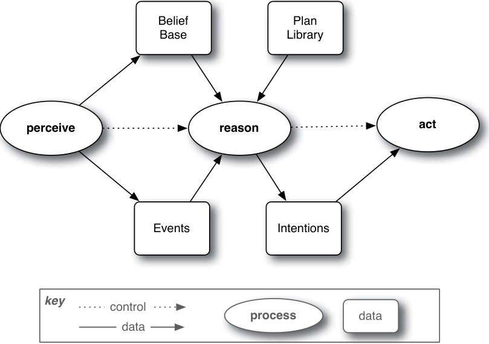
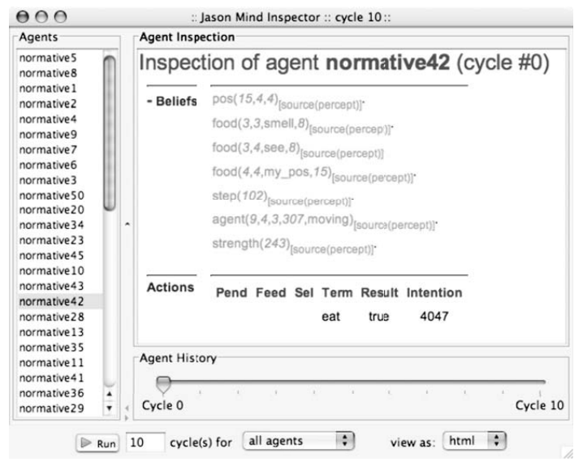
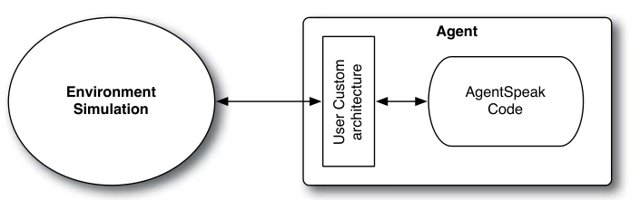
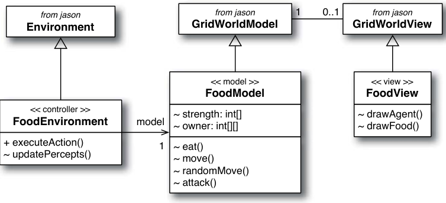
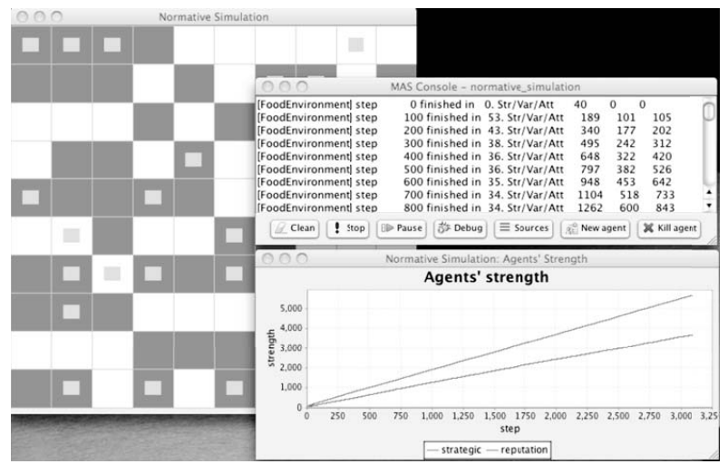

# Chapter 15 Agent-Based Simulation Using BDI Programming in Jason

BDI(belief-desire-intention)

---

## 15.1 Introduction

> Programming languages for multi-agent system have received enormous research attention
in the last few years. Such languages are now very expressive yet with practical interpreters
and reasonably user-friendly platforms for developing multi-agent systems based on such
languages. One advantage of these languages for developing multi-agent systems is that
the language provides constructs for several concepts and abstractions used in designing or
specifying sophisticated multi-agent systems. So not only are these languages suitable for
implementing designs created with agent-oriented software engineering methodologies, but
they are also ideal for developing simulations with cognitive agents. In particular, the use
of such languages gives a direct declarative representation for an agent’s mental states, for
example the beliefs it currently holds about its environment or other agents sharing the
environment (e.g., in a particular simulation) or the goals it is currently trying to achieve,
as well as how the agent has decided to act upon the environment so as to bring about
those goals. As a consequence, human observers of a simulation developed with an agent
programming language can check not only how social phenomena emerge but also what
are the agents’ mental attitudes that emerged at the same time or led to the observed
social phenomena. This is of fundamental importance for future trends in social simulation
aiming at investigating the micro-macro link problem; that is, how social interaction and
organizations affect mental states and vice-versa.

用于多智能体系统的编程语言在过去几年中受到了巨大的研究关注。这些语言现在具有很强的表现力，
但具有实用的解释器和相当用户友好的平台，用于开发基于这些语言的多代理系统。这些语言用于开发多代理系统的一个优点是，
该语言为设计或指定复杂的多代理系统时使用的多个概念和抽象提供了构造。因此，这些语言不仅适合实现使用面向智能体的
软件工程方法创建的设计，而且还非常适合使用认知智能体开发模拟。特别是，使用此类语言为代理的心理状态提供了直接的陈述性表示，
例如它当前对其环境或其他共享环境的代理的信念（例如，在特定的模拟中）或它当前试图实现的目标，
以及代理如何决定对环境采取行动以实现这些目标。因此，使用代理编程语言开发的模拟的人类观察者
不仅可以检查社会现象是如何出现的，还可以检查同时出现或导致观察到的社会现象的代理的心理态度是什么。
这对于旨在研究微观-宏观链接问题的社会模拟的未来趋势具有根本意义;也就是说，社会互动和组织如何影响心理状态，反之亦然。

> Most available platforms for agent-based simulation offer easy to use interfaces so that
scientists can develop agent-based simulation even without much knowledge of programming. 
However, the consequence is that agents developed with those tools are either reactive 
or have very simple behavior. The main contribution of our approach (described in
this chapter) is that it supports the development of agent-based simulations where agents
are potentially much more sophisticated then typically used in current simulations. At the
same time, the use of efficient interpreters for agent programming languages means they
can run in reasonable time, unlike some AI-based approaches where there is, for example,
reasoning from first principles. Although this approach has not been tried extensively yet
for social simulation, it offers a completely new approach for developing agent-based simulations 
where agents have declarative representations of mental attitudes and display rational,
goal-directed behavior.

大多数可用的基于智能体的仿真平台都提供了易于使用的界面，因此即使没有太多的编程知识，科学家也可以开发基于智能体的仿真。
然而，结果是使用这些工具开发的代理要么是反应性的，要么具有非常简单的行为。我们的方法（在本章中描述）
的主要贡献是它支持基于代理的模拟的开发，其中代理可能比当前模拟中通常使用的要复杂得多。同时，使用代理编程语言的
高效解释器意味着它们可以在合理的时间内运行，这与一些基于 AI 的方法不同，例如，需要根据第一原理进行推理。
尽管这种方法尚未在社交模拟中得到广泛尝试，但它为开发基于代理的模拟提供了一种全新的方法，
其中代理具有心理态度的声明性表示，并表现出理性的、目标导向的行为。

> In this chapter, we will concentrate in introducing particularly the use of the Jason agent
platform for (social) simulation. Jason includes an interpreter for an extended version of
the AgentSpeak programming language, which is based on the BDI agent architecture. We
will first summarize the main characteristics of BDI agents and how they are implemented
in Jason and then discuss in detail some of the aspects which are particularly important for
simulation, for example the execution mode where agents can run synchronously (whereas
agents typically run asynchronously, reacting to perceived events by executing plans that
include the achievement of long-term goals), the support for developing environments where
agents are situated, Jason’s “mind inspector”, and the integration with code written in
traditional programming languages. We will also describe various ongoing projects which
aim to add various functionalities to the Jason platform; these in turn will have a significant
impact in the types of simulations that can be developed with Jason. The chapter also
has a running example showing how the various aspects of the platforms could be used in
(social) simulations.

在本章中，我们将重点介绍 Jason 代理平台在（社交）模拟中的使用。Jason 包括一个用于 AgentSpeak 
编程语言扩展版本的解释器，该语言基于 BDI 代理体系结构。我们将首先总结 BDI 代理的主要特征以及它们如何在 Jason 中实现，
然后详细讨论一些对模拟特别重要的方面，例如代理可以同步运行的执行模式（而代理通常异步运行，通过执行包括实现长期目标的
计划来对感知事件做出反应）， 支持开发代理所在的环境、Jason 的“Mind Inspector”，以及与用传统编程语言编写的代码的集成。
我们还将介绍各种正在进行的项目，这些项目旨在为 Jason 平台添加各种功能;这些反过来又会对 Jason 可以开发的模拟类型
产生重大影响。本章还有一个运行示例，展示了如何在（社交）模拟中使用平台的各个方面。

## 15.2 Programming Languages for Multi-Agent Systems

> In recent years, there has been an extremely rapid increase in the amount of research being
done on agent-oriented programming languages, and multi-agent systems techniques that
can be used in the context of an agent programming language. The number and range of
different programming language, tools, and platforms for multi-agent systems that have
appeared in the literature [Bordini et al., 2006] is quite impressive, in particular logic-
based languages [Fisher et al., 2007]. In [Bordini et al., 2005b], some of the languages that
have working interpreters of practical use were presented in reasonable detail. Other languages 
have been discussed in other available surveys, e.g. [Mascardi et al., 2004; Dastani
and Gomez-Sanz, 2006]. Even though we here do not discuss existing agent languages and
platforms, it is worth giving references to some examples of well known agent-oriented
programming and platforms: 3APL [Dastani et al., 2005] (and its recent 2APL variation),
MetateM [Fisher, 2004], ConGolog [de Giacomo et al., 2000], CLAIM [El Fallah Seghrouchni
and Suna, 2005], IMPACT [Dix and Zhang, 2005], Jadex [Pokahr et al., 2005], JADE 
[Bellifemine et al., 2005], SPARK [Morley and Myers, 2004], MINERVA [Leite et al., 2002],
SOCS [Alberti et al., 2005; Toni, 2006], Go! [Clark and McCabe, 2004], STEAM [Tambe,
1997], STAPLE [Kumar et al., 2002], JACK [Winikoff, 2005].

近年来，对面向代理的编程语言和可在代理编程语言上下文中使用的多代理系统技术的研究数量急剧增加。
文献中出现的用于多智能体系统的不同编程语言、工具和平台的数量和范围[Bordini et al.， 2006]令人印象深刻，
特别是基于逻辑的语言[Fisher et al.， 2007]。在 [Bordini et al.， 2005b] 中，
一些具有实际使用的有效解释器的语言被合理地详细地介绍。其他语言在其他可用的调查中已经讨论过，
例如 [Mascardi et al.， 2004;Dastani 和 Gomez-Sanz，2006 年]。尽管我们在这里不讨论现有的代理语言和平台，
但值得参考一些众所周知的面向代理的编程和平台的例子：
- 3APL [Dastani et al.， 2005]（及其最近的 2APL 变体）、
- MetateM [Fisher， 2004]、
- ConGolog [de Giacomo et al.， 2000]、
- CLAIM [El Fallah Seghrouchni 和 Suna， 2005]、
- IMPACT [Dix 和 Zhang， 2005]]、
- Jadex [Pokahr et al.， 2005]、
- JADE [Bellifemine et al.， 2005]、
- SPARK [Morley and Myers， 2004]、
- MINERVA [Leite et al.， 2002]、
- SOCS [Alberti et al.， 2005;Toni，2006 年]，
- Go！[Clark 和 McCabe，2004]、
- STEAM [Tambe，1997]、
- STAPLE [Kumar 等人，2002]、
- JACK [Winikoff，2005]。

> Quite a few of these languages are based on the BDI agent architecture or at least on the
essential notion of goal. Explicit representations of long-term goals that the agent is trying
to achieve are a fundamental requirement for the implementation of a software entity that
displays the kind of behavior that we expect of an “autonomous agent” [Wooldridge, 2002].
It allows agents to take further action when a plan executed to achieve a particular goal
fails to do so (e.g., because the environment where the agent is situated is unpredictable);
it also allows agents to reconsider the goals they committed themselves to achieve if new
opportunities are perceived in the changing environment. For this reason, it seems that,
at least conceptually, agent programming languages subsume the kind of reactive agent
behavior: we can write plans telling an agent how to behave in reaction to something
directly perceived in the environment, but we can also keep track of long-term goals the
agent is trying to achieve, and we can then add mechanisms to help the agent make decisions
on how to balance both types of behavior. On the other hand, reactive agent approaches
rely significantly on aspects of the environments as well as agent behavior; we mention in
Section 15.4.1 that existing approaches for environment modeling can be combined with
Jason, and indeed with other agent languages too (see, e.g., [Ricci et al., 2008]).

这些语言中有相当多基于 BDI 代理体系结构，或者至少基于 goal 的基本概念。
代理者试图实现的长期目标的明确表示是实现软件实体的基本要求，
该软件实体显示我们期望的“自主代理”的行为类型 [Wooldridge， 2002]。
它允许代理在为实现特定目标而执行的计划未能做到这一点时采取进一步的行动（例如，因为代理所在的环境是不可预测的）;
它还允许座席在不断变化的环境中发现新的机会时重新考虑他们承诺实现的目标。
出于这个原因，至少在概念上，代理编程语言似乎包含了反应式代理行为的类型：
我们可以编写计划告诉代理如何对环境中直接感知到的事物做出反应，但我们也可以跟踪代理试图实现的长期目标，
然后我们可以添加机制来帮助代理决定如何平衡这两种类型的行为。
另一方面，反应式代理方法在很大程度上依赖于环境的各个方面以及代理行为;
我们在第 15.4.1 节中提到，现有的环境建模方法可以与 Jason 结合使用，
实际上也可以与其他代理语言结合使用（参见 [Ricci et al.， 2008]）。

> However, it is important to bear in mind that these are just programming languages, they
do not provide any “intelligence” for free. What they do provide are abstractions which help
humans cope with the development of sophisticated (distributed) systems. Most multi-agent
programming platforms will work on top of agent-based middleware (e.g., JADE [Bellifemine
et al., 2005]) that make certain issues of distributed computing fairly transparent for 
developers. Another essential characteristic is that they provide direct mechanisms for agents
to act within an environment, and inter-agent communication uses much higher-level abstractions 
than in classical distributed systems: agents will typically use knowledge-level
communication languages, based on speech-act theory [Austin, 1975] (possibly changing
their mental states as a consequence). The other essential features of agent platforms and
languages are typically related to agents’ mental attitudes. An important aspect in this 
approach to distributed systems is that agents’ mental attitudes are private: no other software
component can directly access the current mental state of an agent.

但是，重要的是要记住，这些只是编程语言，它们并不免费提供任何“智能”。
它们提供的是抽象，可以帮助人类应对复杂（分布式）系统的开发。
大多数多代理编程平台将工作在基于代理的中间件（例如，JADE [Bellifemine et al.， 2005]）之上，
这使得分布式计算的某些问题对开发人员相当透明。另一个基本特征是它们为代理提供了在环境中行动的直接机制，
并且代理间通信使用比经典分布式系统高得多的抽象：代理通常会使用基于言语行为理论的知识级通信语言 
[Austin， 1975]（可能因此改变他们的心理状态）。代理平台和语言的其他基本特征通常与代理的心理态度有关。
这种分布式系统方法的一个重要方面是代理的心理态度是私密的：没有其他软件组件可以直接访问代理的当前心理状态。


## 15.3 Programming Multi-Agent Systems Using Jason

> As one would expect from the discussion above, the most important constructs in agent
programming languages were created precisely for representing mental attitudes. We will
now concentrate on presenting one particular language, the variant of AgentSpeak [Rao,
1996] as interpreted by Jason [Bordini et al., 2007b], to give a flavor of such language
constructs. We will then also discuss important aspects of the interpreter for this language.

正如人们从上面的讨论中所期望的那样，代理编程语言中最重要的结构正是为了表示心理态度而创建的。
我们现在将集中介绍一种特定的语言，即 Jason [Bordini et al.， 2007b] 解释的 AgentSpeak [Rao， 1996] 的变体，
以给出这种语言结构的味道。然后，我们还将讨论这种语言的解释器的重要方面。

### 15.3.1 Language

> The first thing to note about AgentSpeak is that it builds upon logic programming, so
the basic representation units are “predicates”, very much as in languages such as Prolog
(including the convention that identifiers starting with an uppercase character denote logical
variables). In Jason, the main (agent) language constructs are:
> - **beliefs**, which represent information the agent has about the environment, other
    agents, or about itself — the term “belief” is used to emphasize the fact that
    agents might have incorrect and/or incomplete information about the environment
    and other agents;
> - **goals**, which represent state of affairs the agent wishes to bring about (essentially
    things the agent could potentially come to believe if the goal is achieved); and
> - **plans**, which are courses of action that the agent can use to achieve goals or to react
    to perceived changes in the environment.

关于 AgentSpeak 首先要注意的是，它建立在逻辑编程之上，因此基本的表示单元是“谓词”，
与 Prolog 等语言非常相似（包括以大写字符开头的标识符表示逻辑变量的约定）。
在 Jason 中，主要的 （代理） 语言结构是：

- **信念**，代表代理所拥有的关于环境、其他代理或自身的信息——术语“信念”用于强调代理可能拥有
  有关环境和其他代理的错误和/或不完整的信息;
- **目标**，代表代理人希望实现的事态（本质上是如果目标实现，代理人可能会相信的事情）;和
- **计划**，这是代理可以用来实现目标或对感知到的环境变化做出反应的行动方案。

> An example of a belief is `food(2,3)`, which could mean that the agent believes there is
food at `coordinates ⟨2,3⟩`. Another example is `~own(food,2,3) `to mean that the agent
explicitly believes it is not the case that it owns the food at those coordinates.
Another interesting aspects of beliefs, in ***Jason***, is that they can have annotations which
can be used for example to maintain meta-level information about individual beliefs.
In particular, ***Jason*** automatically annotates the source of all information received by
an agent: **percept** is used to denote information received from sensors (i.e., through
perceiving the environment), **self** is used to denote beliefs created by the agent it-
self as “mental notes” (e.g., of things it has done in the past), or an agent name is
used in the representation of information received from other agents. So, for example,
`food(2,3)[source(percept),source(ag2),time(10)]` would mean that the belief, ac-
quired at time 10, that there is food at those coordinates was both perceived by the agent
itself as well as communicated to this agent by agent `ag2`. The representation of a goal (in
particular an achievement goal ) is the same of a belief expect that it is prefixed by the
symbol ‘!’. For example, `!eaten(2,3)` could be used to mean that the agent has the goal
of achieving a state of affairs where the food at those coordinates is believed to have been
eaten.

信念的一个例子是 `food（2,3）`，这可能意味着代理者相信在`(坐标) coordinates⟨2,3⟩` 处有食物。
另一个例子是 `~own（food，2,3）`，表示代理明确认为它不拥有这些坐标的食物。在 ***Jason*** 中，
信念的另一个有趣方面是它们可以有注释，例如，这些注释可用于维护有关个人信念的元级信息。
特别是，***Jason*** 会自动注释代理接收到的所有信息的来源：**percept** 用于表示从传感器接收到的信息
（即通过感知环境），**self** 用于表示代理自我创建的信念，作为“心理笔记”（例如，它过去做过的事情），
或者代理名称用于表示从其他代理接收到的信息。因此，例如，
`food（2,3）[source（percept），source（ag2），time（10）]` 意味着在时间 10 获得的信念，
即在这些坐标上存在食物，既被代理本身感知，也被代理 ag2 传达给这个代理。
目标（特别是成就目标）的表示与信念相同，期望它以符号 '！' 为前缀。例如，`！eaten（2,3）`
可以用来表示代理的目标是实现一种状态，即这些坐标上的食物被认为已被食用。

> The agent behavior is determined by the set of plans that the agent has in its *plan
library*. The agent program specifies the initial state of the belief base, possibly initial goals
of the agent, and also the plans that will be available in the agent’s plan library when the
agent starts running. Interestingly, the agent behavior can change over time if new plans are
acquired (e.g., by communication with other agents). An AgentSpeak plan has the following
general structure:  

代理行为由代理在其*计划库中*的计划集决定。代理程序指定信念基础的初始状态，可能指定代理的初始目标，
以及当代理开始运行时将在代理的计划库中可用的计划。有趣的是，如果购买了新计划（例如，通过与其他代理通信），
代理行为会随着时间的推移而改变。AgentSpeak 计划具有以下一般结构：

> `triggering_event : context <- body.`

> where the *triggering event* is used to specify the types of events the plan is meant to handle
(these are typically changes in mental attitudes, specifically beliefs and goals); the *context*
is used the specify the circumstances under which the plan is thought to be suitable for
handling that event — the context needs to be a logical consequence of the current state of
the agent’s belief base for a plan to be considered when the agent is choosing a plan for it
to commit to execute in order to handle the event (such plans are called *applicable* plans);
and the body is a sequence of actions to be executed or new goals for the agent to achieve
(in its basic form, other things are allowed in the ***Jason*** variant of AgentSpeak). Consider
the following example:

*触发事件*用于指定计划要处理的事件类型（这些通常是心理态度的变化，特别是信念和目标）;
上下文（context）用于指定计划被认为适合处理该事件的情况 — 上下文需要是代理信念基础当前状态的逻辑结果，
以便在代理选择计划以承诺执行以处理事件时考虑计划（此类计划称为适用计划）;
而 body 是要执行的一系列动作或代理要实现的新目标（在其基本形式中，AgentSpeak 的 Jason 变体中允许其他事情）。
请考虑以下示例：

> ```
> 01 // initial beliefs
> 02 trust([john,mary]).
> 03
> 04 permitted(eat,loc(X,Y))
> 05   :- .my_name(Me) & own(Me,loc(X,Y))
> 06     | permission(eat,loc(X,Y))[source(Ag)] & own(Ag,loc(X,Y)) &
> 07       trust(TA) & .member(Ag,TA).
> 08
> 09
> 10 // initial plans
> 11
> 12 +food(X,Y) : hungry & permitted(eat,loc(X,Y))
> 13   <- !at(X,Y);
> 14     eat;
> 15     +eaten(X,Y);
> 15     !ack(X,Y).
> 16
> 17 +!at(X,Y) : at(X,Y).
> 18
> 19 +!at(X,Y)
> 20   <- move_toward(X,Y); 
> 21      ?at(X,Y).
> 22
> 23 -!at(X,Y) : not at(X,Y)
> 24   <- !at(X,Y).
> 25
> 26 +!ack(X,Y) : .my_name(Me) & own(Me,loc(X,Y)).
> 27
> 28 +!ack(X,Y) : own(Ag,loc(X,Y))
> 29   <- .send(Ag,tell,eaten(X,Y)).
> ```

> The initial belief in line 2 is used because when the agent starts running it is meant to
know in advance that it should trust agents `john` and `mary`. Note that `trust` is a predicate
symbol like any other, the programmer chose this representation, presumably because the
agent will need to consider whether a particular agent is trustworthy or not. The belief in
line 4 is a Prolog-like rule (just note that the syntax is the same as used in the context
part of AgentSpeak plans, which is slightly different from Prolog); it says that the agent
can conclude it is permitted to do action “eat” at a particular location of the environment
if either itself owns that location or the agent who owns that location has given permission
for that, and the agent who gave that permission is trustworthy. This rule allows us to have
a more compact context condition for the plan in line 12. The rule uses two “pre-defined
internal actions”: `.my_name` and `.member`. Internal actions are a mechanism to allow legacy
code (e.g., written in Java) to be referenced from the high-level agent reasoning as defined
by the AgentSpeak code. Unlike actions, internal actions do not change the state of the
environment; they are run to completion within the agent reasoning cycle. Users can provide
libraries of internal actions (Section 15.4.3 explains how); ***Jason*** provides a number of
predefined internal actions to help with various programming tasks — pre-defined internal
actions available with ***Jason*** are those that start with the ‘.’ character.

使用第 2 行的初始信念是因为当代理开始运行时，它意味着提前知道它应该信任代理 `john` 和 `mary`。
请注意，`trust` 和其他任何 broker 一样是一个谓词符号，程序员选择了这种表示形式，大概是因为 agent 
需要考虑特定 agent 是否值得信赖。第 4 行的信念是一个类似 Prolog 的规则（请注意，语法与 AgentSpeak 
计划的上下文部分使用的语法相同，与 Prolog 略有不同）;它表示，如果代理本身拥有该位置，
或者拥有该位置的代理已授予该权限，并且授予该权限的代理是值得信赖的，则代理可以得出结论，
允许在环境的特定位置执行操作 “EAT”。此规则允许我们为第 12 行中的计划提供更紧凑的上下文条件。
该规则使用两个“预定义的内部操作”：`.my_name` 和 `.member`。内部操作是一种机制，
允许从 AgentSpeak 代码定义的高级代理推理中引用遗留代码（例如，用 Java 编写）。
与操作不同，内部操作不会更改环境的状态;它们在 agent reasoning cycle 内运行完成。
用户可以提供内部操作库（Section 15.4.3 解释了如何操作）;Jason 提供了许多预定义的内部操作来帮助完成各种编程任务
— Jason 提供的预定义内部操作是那些以 '.' 字符开头的操作

> The plan in line 12 says that whenever the agent gets to believe (i.e., acquires a new
belief) that there is food at some coordinates, provided the agent happens to believe it is
hungry and also believes it is permitted to eat the food that is available at those coordinates
(according to the rule in its belief base which says when the action `eat` is permitted), the
course of action in the plan body is one potential means the agent could commit to in
order to handle that event (the event of perceiving new food in the environment). If this
particular plan is chosen (it is then called an *intended means*) the agent will, eventually
(unless the intention is later reconsidered), have a new goal of being at those coordinates
(where food was perceived), then when that goal has been achieved, do the (environment
changing∗) action of eating the food, then adding a note to self to remember that food was
eaten at that position, then having the goal of acknowledging to the owner of the location
(when that’s the case) that food was eaten there.
> 
> ∗Environment actions represent the repertoire of agent capabilities, i.e., things the agent is assumed to
be capable of doing to change the environment, as the actions a robot is built to perform, for example.

第 12 行的计划说，每当代理开始相信（即获得新的信念）在某些坐标处有食物时，
只要代理碰巧相信它饿了，并且还相信它被允许吃那些坐标上可用的食物（根据其信仰基础中的规则，即何时允许操作吃），
计划主体中的操作过程是代理者为了处理该事件（在环境中感知到新食物的事件）而可以承诺的一种潜在手段。
如果选择了这个特定的计划（然后它被称为预期手段），代理者最终（除非后来重新考虑意图）将有一个新的目标，
即到达那些坐标（感知到食物的地方），然后当该目标实现时，做（改变环境∗）吃食物的动作，然后给自己添加一个注释，
记住食物是在那个位置吃的， 然后目标是向该地点的所有者承认食物在那里吃过（如果是这种情况）。

∗环境动作代表了代理者的能力库，即假设代理能够做一些事情来改变环境，例如，机器人被构建来执行的动作。

> The plans in lines 17, 19, and 23 together allow the agent to persist in the goal of being
at some particular coordinates until it is achieved. The plan in line 17 says that the agent
has nothing else to do when the goal has already been achieved (i.e., the agent already
believes to be at those coordinates). The plan in line 19 executes the action to move the
agent location within the environment (`move_toward`), then uses a test goal (as opposed to
achievement goal, a test goal is used to retrieve information from the belief base as part of
a course of action) to make sure the goal has been achieved; test goals are prefixed with the
‘?’ symbol. If the agent does not believe to be where it wishes to be, that formula of the
plan body fails, so the whole plan also fails. In ***Jason***, when a plan for a goal `+!g` fails, an
event of type `-!g` is generated. So the plan in line 23 is a “contingency plan”, i.e., a plan
that programmers can write for when a plan to achieve that goal failed. In this case, the
same goal is simply generated again, which in BDI parlance would be the same as saying
that this agent is “blindly committed” to achieving this goal. Note also how the agent has
various plans with the same triggering event; this is very typical in agent programming:
programmers will give various alternative courses of action for the same purpose, as each
of those might only work under certain circumstances (and typically an agent can have a
number of plans all of which are, as far as the agent know-how is concerned, possible courses
of action to take to handle a particular event at a particular moment in time, so only one
such plan needs to be chosen for execution).

第 17、19 和 23 行中的计划共同允许代理者坚持处于某个特定坐标的目标，直到实现它。
第 17 行的计划表示，当目标已经实现时（即，代理已经相信自己在那些坐标上），代理没有其他事情可做。
第 19 行中的计划执行操作以在环境中移动代理位置 （move_toward），然后使用测试目标（与成就目标相反，
测试目标用于从信念库中检索信息，作为行动方案的一部分）来确保目标已实现;测试目标以 '？' 符号为前缀。
如果代理者不相信自己在它希望的地方，那么计划主体的公式就会失败，那么整个计划也会失败。
在 Jason 中，当目标 +！g 的计划失败时，将生成 -！g 类型的事件。因此，第 23 行中的计划是一个 “应急计划”，
即当实现该目标的计划失败时，程序员可以为其编写的计划。在这种情况下，相同的目标只是再次生成，用 BDI 的话来说，
这与说该代理人“盲目致力于”实现该目标相同。还要注意代理如何具有具有相同触发事件的各种计划;
这在代理程序编程中非常典型：程序员会为同一目的提供各种替代行动方案，因为每一种都可能只在某些情况下有效
（通常一个代理可以有许多计划，就代理的专业知识而言，所有这些计划都是在特定时刻处理特定事件的可能行动方案， 
所以只需要选择一个这样的计划来执行）。

> It is also interesting to note that this plan pattern, where a test goal at the end of the body
is used for the same achievement goal in the triggering event, is used to program *declarative
goals* in ***Jason*** [H¨ubner et al., 2006]. The notion of a declarative goal in agent-oriented
programming is a goal which is only considered achieved when the predicate in the goal
construct is *believed* by the agent (this helps programmers in developing rational behavior,
in making agents persist in achieving a goal even if, for example, a plan to achieve the goal
finishes executing but fails to achieve the goal, according to the agent’s beliefs). A different
use of the goal construct is that in the plans in lines 26 and 28. There, a goal is just being
used to execute an appropriate plan, much like a procedure name, to help in modularising
the code. The plan in line 26 simply says that there is no need to acknowledge eating if the
location was owned by the agent itself. The plan in line 28 uses the .send internal action
to send a message to the agent who gave permission for the food to be eaten. The message
uses the tell performative to inform (i.e., aiming at changing the beliefs of the receiver)
the owner that food at that location has been eaten (the message content is `eaten(X,Y)`,
and note that variables `X` and `Y` are bound at that point and that the source annotation
placed by Jason can be used by the receiver to know who has eaten that food).

同样有趣的是，这种计划模式，其中正文末尾的测试目标用于触发事件中的相同成就目标，
在 Jason [H ̈ubner et al.， 2006] 中被用于编程声明性目标。在面向代理程序的编程中，
声明性目标的概念是一个目标，只有当代理相信目标结构中的谓词时，才认为实现了（这有助于程序员发展理性的行为，
使代理坚持实现目标，即使，例如，实现目标的计划完成了执行但未能实现目标， 根据代理人的信念）。
goal 结构的不同用途是在第 26 行和第 28 行的计划中。在那里，目标只是用于执行适当的计划，
就像过程名称一样，以帮助调制代码。第 26 行的计划只是说，如果该地点归代理自己所有，则无需确认 eating。
第 28 行中的计划使用 .send 内部操作向允许食用食物的代理发送消息。该消息使用 tell 表演性来通知
（即旨在改变接收者的信念）所有者该位置的食物已被食用（消息内容被吃掉（X，Y），并注意变量 X 和 Y 在该点被绑定，
并且接收者可以使用 Jason 放置的源注释来了解谁吃了该食物）。

### 15.3.2 Interpreter / 解释器

> The examples above have shown the main language constructs. We now need to introduce
also a number of important data structures maintained by the language interpreter (Figure 
15.1 briefly illustrates the relations among them). These data structures are essential
to allow programmers to implement BDI agents∗:
> > ∗There is often much confusion between idealized BDI agents — where, e.g., means-ends reasoning is done
by reasoning from first principles — and practical BDI implementations following on ideas introduced
by PRS [Georgeff and Lansky, 1987] — where agents are “reactive planning systems”. Reactive planning
systems are “reactive systems” in the sense of distributed computing (i.e., systems that are built to run
continuously rather than compute a function and terminate) which repeatedly perceive their environment
and react to perceived changes by executing plans available in a plan library, determining the courses
of actions they take in order to achieve their goals. In fact, this determines an agent reasoning cycle,
typically starting with perception of the environment, further committing to plans as intended means to
achieve goals or react to environment changes, choosing one intention (i.e., a commitment to a course of
action, e.g., to achieve a certain goal) to be executed further and then acting based on such choice. The
agent repeatedly executes such reasoning cycles, possibly doing nothing but wait for new changes to be
perceived in the environment which could then trigger the agent to act further.
> 
> 
> FIGURE 15.1 Main components of the Jason interpreter.
> 图 15.1 Jason 解释器的主要组件。

上面的示例显示了主要的语言结构。我们现在还需要介绍一些由语言解释器维护的重要数据结构
（图 15.1 简要说明了它们之间的关系）。这些数据结构对于程序员实现 BDI 代理至关重要∗：
> ∗理想化的 BDI 代理（例如，手段-目的推理是通过从第一性原理进行推理来完成的）与遵循 PRS 提出的想法的实际
> BDI 实施 [Georgeff 和 Lansky，1987] 之间经常存在很多混淆 - 其中代理是“反应性规划系统”。
> 反应式规划系统是分布式计算意义上的“反应式系统”（即，构建为连续运行而不是计算函数并终止的系统），
> 它通过执行计划库中可用的计划来反复感知其环境并对感知到的变化做出反应，确定它们为实现目标而采取的行动方案。
> 事实上，这决定了一个代理推理周期，通常从对环境的感知开始，进一步致力于将计划作为实现目标或对环境变化做出反应的预期手段，
> 选择一个意图（即对行动方案的承诺，例如，实现某个目标）进一步执行，然后根据这种选择采取行动。
> 代理者重复执行这样的推理循环，可能什么都不做，只是等待环境中感知到新的变化，然后触发代理者进一步行动。

> - **belief base**: the belief base stores all beliefs currently held by the agent; both closed
    and open world can be used (the ‘~’ operator is used for strong negation). At every
    reasoning cycle (unless configured otherwise) ***Jason*** obtains all percepts available
    to the agent from the environment model and executes a “belief update function”
    (both *belief update and belief revision* can be customized by the programmer, and
    in fact the belief base itself can be customized, e.g. to use a database for some of
    the beliefs, which may be useful in large-scale applications).

- **信念库**：信念库存储了代理当前持有的所有信念;封闭世界和开放世界都可以使用（'~' 运算符用于强否定）。
  在每个推理周期中（除非另有配置），Jason 从环境模型中获取代理者可用的所有感知，并执行一个“信念更新函数”
  （信念更新和信念修正都可以由程序员自定义，实际上信念库本身也可以自定义，例如，为某些信念使用数据库，
  这在大规模应用程序中可能很有用）。

> - **set of events**: all changes in beliefs (due to belief update or communication) as well
    as changes in goals (e.g., because a plan being executed created a new goal for
    the agent to achieve, or because other agents tried to delegate new goals through
    communication) create new *events* which might trigger the execution of plans
    whose triggering event matches (unifies with) those events, provided they are
    applicable at the time the event is chosen for handling at a particular reasoning
    cycle. The choice of which event to handle in a particular reasoning cycle is made
    by a method that can be overridden by the programmer (otherwise a **FIFO** policy
    is used), so as to allow the use of application-specific information (e.g., on what
    events are known to have priority for a particular agent).

- ***事件集***：信念的所有变化（由于信念更新或沟通）以及目标的变化（例如，因为正在执行的计划为代理者创造
  了要实现的新目标，或者因为其他代理试图通过沟通委派新目标）会产生新的事件，这些事件可能会触发触发事件匹配
  （统一）这些事件的计划执行， 前提是它们在选择在特定推理周期处理事件时适用。在特定推理周期中选择要处理的
  事件由程序员可以覆盖的方法（否则使用 FIFO 策略）进行选择，以便允许使用特定于应用程序的信息
  （例如，已知哪些事件对特定 agent 具有优先级）。

> - **plan library**: this is where the agent know-how is stored. The plan library is
    initialized with the plans that programmers write in the AgentSpeak code for that
    agent. While simple agents will have the plan library unchanged throughout
    heir execution, it is possible to change the agent behavior for example by plan
    exchange using speech-act based inter-agent communication (this could also be
    used to communicate with an “agent” wrapper for a planner, thus creating new
    plans for agents to act in circumstances that the programmer did not anticipate
    – if this happens to be useful, and feasible, in particular applications). Plans
    in the plan library have labels to uniquely identify them, and such labels, like
    beliefs, can have annotations; meta-level information in plan labels can be used,
    for example, in advanced (user-defined) selection functions which could use, say,
    some decision-theoretic approach for choosing the best plan for an agent to use,
    or in scheduling intentions, etc.

- ***计划库***：这是存储代理专业知识的地方。计划库使用程序员在代理的 AgentSpeak 代码中编写的计划进行初始化。
  虽然简单的代理在整个继承人执行过程中计划库保持不变，但可以改变代理行为，例如通过使用基于语音-行为的代理间
  通信进行计划交换（这也可以用于与规划者的“代理”包装器进行通信，从而为代理创建新的计划，以便在程序员没有预料
  到的情况下采取行动——如果这恰好有用， 和可行的，特别是应用程序）。规划库中的规划具有唯一标识它们的标签，
  并且此类标签（如信念）可以具有注释;例如，计划标签中的元级信息可用于高级（用户定义的）选择函数，
  这些函数可以使用一些决策论方法来选择代理使用的最佳计划，或用于调度意图等。

> - **set of intentions**: each perceived change in the environment (as reflected in changes
    in beliefs) potentially create a separate intention for the agent, provided there
    is an applicable plan for that event. Therefore, each separate intention in the
    agent’s set of intentions represent a particular “focus of attention” for the various
    tasks currently being done by the agent: they all compete in the agent’s choice
    of intention to be further executed in a given reasoning cycle. Each intention
    potentially becomes a stack of partially instantiated plans. When the plan body
    includes a new goal to be pursued, an event is generated which when handled
    will lead to a new plan to be executed in order to achieve that goal, and that
    plan is pushed on top of the intention that required the goal to be achieved; only
    when that plan finishes executing (successfully) can the plan that required the
    goal to be achieved resume execution (hence the appropriateness of the stack
    structure to represent one intention). Note that the choice of plan to use in order
    to achieve the goals that appear in one intention is made as late as possible
    (and based on the plan contexts) which is an important feature for multi-agent
    systems, as they are typically meant to work in very dynamic environments. As
    we mentioned, ***Jason*** also has mechanisms to allow goals and intentions to be
    dropped or revised, but this is beyond the scope of this chapter.

- ***意图集***：环境中的每一个感知变化（反映在信念的变化中）都可能为主体创造一个单独的意图，
  前提是该事件有一个适用的计划。因此，代理的意图集中的每一个单独的意图都代表了代理当前正在完成
  的各种任务的特定“关注焦点”：它们都在代理选择在给定的推理周期中进一步执行的意图中竞争。
  每个意图都可能成为一堆部分实例化的计划。当计划主体包括一个要追求的新目标时，就会产生一个事件，
  当处理该事件时，将导致执行新的计划以实现该目标，并且该计划被推到需要实现目标的意图之上;
  只有当该计划完成执行（成功）时，需要实现目标的计划才能继续执行（因此堆栈结构适合表示一个意图）。
  请注意，为了实现一个意图中出现的目标而选择的计划是尽可能晚的（并基于计划上下文），这是多代理系统的一个重要功能，
  因为它们通常意味着在非常动态的环境中工作。正如我们提到的，Jason 也有允许删除或修改目标和意图的机制，
  但这超出了本章的范围。

> There are, of course, various other structures that are required by an agent programming
language interpreter (e.g., the queue of messages received from other agents that have not
yet been processed by the agent). Those above are the essential ones for individual BDI
agents. One unusual characteristic of AgentSpeak (and some other agent languages) as a
programming language is that certain components of the interpreter are defined by the
user, in particular the selection functions. They determine which event is to be handled
next, which (applicable) plan to choose, and which intention (i.e., a focus of attention for
the agent) to execute further in a given reasoning cycle. These decisions are all agent-or
 application-specific, hence the need to make them customizable by users. Appropriate
(intelligent) scheduling of intentions in any generic way is bound to be intractable, hence
the practical choice in agent languages of letting users define specific and efficient selection
functions, when necessary.

当然，代理程序编程语言解释器还需要各种其他结构（例如，从其他代理接收但尚未被代理处理的消息队列）。
以上是各个 BDI 代理的必备条件。AgentSpeak（和其他一些代理语言）作为编程语言的一个不寻常的特征是解释器
的某些组件由用户定义，特别是选择函数。它们确定接下来要处理哪个事件，选择哪个（适用）计划，以及在给定的推理
周期中进一步执行哪个意图（即代理的关注焦点）。这些决策都是特定于代理或应用程序的，因此需要让用户自定义它们。
以任何通用方式对意图进行适当的（智能）调度注定是棘手的，因此在代理语言中，让用户在必要时定义特定和有效的选择
函数是实际的选择。

> The example given above was just to illustrate the basic language constructs in a way that
is easy to understand; it does not cover many aspects of more advanced agent programming,
which makes it difficult to illustrate some of the characteristics of BDI agents, for example
the fact that agents typically have various foci of attention, and that they should reconsider
intentions and drop them if they believe they are no longer achievable, or the motivation
that led to the adoption of the goal no longer exists. In a later section we give a complete
social simulation example; we decided to use an existing simulation in the literature to make
the example more easily understandable. We chose one of the few simulations we know of
where agents are not purely reactive (they are said to be “semi-cognitive”), and even then it
will be clear this type of agents are extremely simple to program in ***Jason***. In fact the code
is much simpler than in the example above which, recall, was already too simple to demon-
strate the kind of sophisticated agent behavior the language is meant to help develop. The
conjecture is that by making judicious use of ***Jason*** features, simulations where cognitive
agents display very elaborate behavior could become more popular; the simulation toolkits
currently popular certainly do not lend themselves to this type of development.

上面给出的示例只是为了以易于理解的方式说明基本语言结构;它没有涵盖更高级的代理编程的许多方面，
这使得很难说明 BDI 代理的一些特征，例如，代理通常具有各种关注焦点，如果他们认为意图不再可实现，
或者导致采用目标的动机不再存在，他们应该重新考虑意图并放弃它们。在后面的部分中，我们将给出一个完整的社交模拟示例;
我们决定使用文献中现有的模拟，以使示例更易于理解。我们选择了我们所知道的为数不多的模拟之一，
其中智能体不是纯粹的反应性的（据说它们是“半认知的”），即便如此，很明显这种类型的智能体在 Jason 中编程非常简单。
事实上，代码比上面的例子要简单得多，回想一下，上面的例子已经太简单了，无法演示该语言旨在帮助开发的那种复杂的代理行为。
猜想是，通过明智地使用 Jason 特征，认知代理表现出非常复杂行为的模拟可能会变得更加流行;
目前流行的仿真工具包当然不适合这种类型的开发。

> Due to space restrictions, we cannot go into enough detail here to expect the reader to
learn how to program in ***Jason***; the interested reader should refer to [Bordini et al., 2007b]
for a complete account of the current ***Jason*** implementation.

由于篇幅限制，我们在这里无法详细介绍，以期望读者学习如何在 Jason 中编程;感兴趣的读者可以参考 [Bordini et al.， 2007b]
以获得当前 Jason 实现的完整说明。

## 15.4 Jason Features for Simulation

> The previous section described how the agents of a simulation can be specified using a BDI
approach and that is surely the most important contribution of ***Jason*** for social simulation.
However, to run the overall simulation we need to define other components besides the
agents, one of those components is the environment where the agents are situated and that
simulates the execution of their actions and provides them with the relevant perception.
We also need components to control, inspect, and analyze the execution of the simulation.
Some of the features provided by ***Jason*** to develop such components are described in the
following subsections.

上一节介绍了如何使用 BDI 方法指定模拟的代理，这无疑是 Jason 对社交模拟最重要的贡献。
但是，要运行整体模拟，我们需要定义除代理之外的其他组件，其中一个组件是代理所在的环境，
它模拟代理操作的执行并为它们提供相关的感知。我们还需要组件来控制、检查和分析模拟的执行。
Jason 为开发此类组件提供的一些功能将在以下小节中介绍。

> While the agents are programmed in AgentSpeak, the components described in this section
 are better programmed in Java, since the object-orientation abstractions are typically
enough for these programming tasks. Some excerpts of Java code are thus shown to illustrate
 how those features are easily integrated into a project. To preserve readability, we will
not explain all the details of the how to code those components; those details can be found
in [Bordini et al., 2007b] and in the ***Jason*** manual.

虽然代理是在 AgentSpeak 中编程的，但本节中描述的组件最好用 Java 编程，
因为面向对象的抽象通常足以完成这些编程任务。因此，显示了一些 Java 代码的摘录，
以说明如何轻松地将这些功能集成到项目中。为了保持可读性，我们不会解释如何对这些组件进行编码的所有细节;
这些细节可以在 [Bordini et al.， 2007b] 和 Jason 手册中找到。

### 15.4.1 Environments

> Every ***Jason*** agent has an architecture that “binds” them to the real environment, and
this architecture is responsible for the concrete execution of actions and the mapping from
sensor data to symbolic (belief) representation. It is relatively easy to create a simulated
environment for the agents. In that case, instead of executing the actions, the agent’s 
architecture asks the environment component to simulate the action and to give back updated
perception (when the agent reasoning cycle requires it). Simulated environments are indeed
the default configuration of ***Jason*** projects.

每个 Jason 代理都有一个将它们“绑定”到真实环境的架构，这个架构负责动作的具体执行以及从传感器数据到符号
（信念）表示的映射。为代理创建模拟环境相对容易。在这种情况下，代理的架构不是执行操作，而是要求环境组件
模拟操作并返回更新的感知（当代理推理周期需要时）。模拟环境确实是 Jason 项目的默认配置。

> The environment model should be programmed in a Java class that extends the ***Jason***
Environment class, where some useful functionality is provided. An environment class has
three main functions:
> 1. Maintain a representation of the state of the environment.
> 2. Simulate the execution of actions required by the agents. This execution
     normally simply changes the state of the environment. The code that implements
     the simulation of the action must be written in the executeAction method. This
     method is called whenever an agent chooses to perform an action.
> 3. Provide a symbolic representation of the environment when the agents attempt
     to perceive the current state of the environment. A set of methods are provided
     to add perception to all agents or to some particular agent. The environment is
     a passive entity, thus it does not “send” perception to the agents when the
     environment changes. Only when some agent actively senses the environment at the
     appropriate step of its own reasoning cycle, a representation of the environment
     state is made available to it.

环境模型应该在扩展 Jason Environment 类的 Java 类中编程，其中提供了一些有用的功能。环境类有三个主要功能：
1. 维护环境状态的表示形式。
2. 模拟代理所需操作的执行。此执行通常只是更改环境的状态。实现操作模拟的代码必须在 executeAction 方法中编写。
   每当代理选择执行操作时，都会调用此方法。
3. 当代理尝试感知环境的当前状态时，提供环境的符号表示。提供了一组方法，用于向所有代理或某个特定代理添加感知。
   环境是一个被动的实体，因此当环境发生变化时，它不会将感知“发送”给代理。只有当某个代理在其自身推理周期的
   适当步骤主动感知环境时，环境状态的表示才会提供给它。

> The following code illustrates how an environment can be programmed for a simple scenario
with a lamp and a switch. In this environment, the agent can do the actions turn(on) and
turn(off), and get as percepts either light(on) or light(off).

下面的代码说明了如何为具有灯和开关的简单方案对环境进行编程。在此环境中，代理可以执行操作
turn（on） 和 turn（off），并获取 light（on） 或 light（off） 作为感知。

```Java
Example 15.1

    public class Room extends Environment {
    
        // state of the environment
        boolean isOn = true;
        
        public void init(String[] args) {
            updatePercepts();
        }
        
        // update the perception of all agents with a symbolic
        // representation of the curent state of the environment
        public void updatePercepts() {
            clearPercepts();
            if (isOn)
                addPercept(Literal.parseLiteral("light(on)"));
            else
                addPercept(Literal.parseLiteral("light(off)"));
        }
        
        // simulates the execution of the actions
        public boolean executeAction(String agName, Structure action) {
            if (action.toString().equals("turn(on)"))
                isOn = true;
            else if (action.toString().equals("turn(off)"))
                isOn = false;
            updatePercepts();
            return true; // the action was successfully executed
        } 
    }
```
> In the default implementation of the environment, the execution of actions is 
asynchronous and concurrent. By asynchronous we mean that it is not the agent thread that
executes the action, the agent requests the execution of an action and continues its
reasoning cycle without waiting until the end of the execution. Only the particular intention that
is performing the action is suspended until the action is finished by the environment. By
concurrent we mean that several requested actions can be executed at the same time.

在环境的默认实现中，操作的执行是异步和并发的。异步是指执行操作的不是代理线程，代理请求执行操作并继续其推理循环，
而无需等待执行结束。只有执行操作的特定意图才会被暂停，直到环境完成该操作。并发是指可以同时执行多个请求的操作。

> Many simulations require some sort of synchronization in the environment. For instance,
agent-based simulations often need the concept of simulation “step”, and in one such step,
each agent is is required to execute exactly one action — see the *time-stepped* approach
to computer simulation as discussed as part of general simulation paradigms in Chapter 3
of this book. This kind of environment is also provided with Jason through the use of
the `SteppedEnvironment` class; programmers only need to change the super-class of their
environment class to start using this kind of environment (the example in Section 15.5 uses
this kind of environment).

许多模拟需要在环境中进行某种同步。例如，基于智能体的模拟通常需要模拟“步长”的概念，而在一个这样的步骤中，
每个智能体只需要执行一个动作——参见本书第 3 章中作为一般模拟范式的一部分讨论的计算机模拟的时间步进方法。
***Jason*** 也通过使用 `SteppedEnvironment` 类提供了这种环境;程序员只需要更改其 Environment 类的 super-class 
即可开始使用这种环境（Section 15.5 中的示例使用了这种环境）。

> As also discussed in Chapter 3, some simulation toolkits use the “discrete event”
simulation paradigm. Although a class for this type of environment is not currently available
in ***Jason***, it could be easily provided in the future. However, future direction for ***Jason***
environments is in fact to use independent approaches and tools that specialize in this, such
as **ELMS** [Okuyama et al., 2006] and “Agents & Artifacts” [Ricci et al., 2007] (more on
environments in Section 15.6). This would allow for the development of very sophisticated
environments but also environments that are elegantly/declaratively specified (very much
as the use of AgentSpeak for specifying autonomous agents). For example, some approaches
would allow for the development of an environment simulation that runs distributedly. This
could be very useful for very large scale simulations; while ***Jason*** allows agents and the
environment to run in various different hosts, the environment itself can only run in one
host which in some circumstances could become a distribution “bottleneck”.

正如第 3 章中所讨论的，一些仿真工具包使用 “离散事件” 仿真范式。尽管 Jason 中目前没有此类环境的类，
但将来可以很容易地提供。然而，Jason环境的未来方向实际上是使用专门从事此的独立方法和工具，
如ELMS [Okuyama等人，2006]和“代理与人工制品” [Ricci等人，2007]（在第15.6节中更多关于环境的信息）。
这将允许开发非常复杂的环境，但也允许开发以优雅/声明方式指定的环境（非常类似于使用 AgentSpeak 指定自治代理）。
例如，某些方法将允许开发分布式运行的环境模拟。这对于非常大规模的模拟可能非常有用;
虽然 Jason 允许代理和环境在各种不同的主机中运行，但环境本身只能在一台主机中运行，
这在某些情况下可能会成为分发“瓶颈”。

> In the general classification of uses of multi-agent systems toolkits given in Chapter 3, the
main use of ***Jason*** would fall into category “Development of Software MAS”. Although we
have provided changes in execution modes and extensions of environment classes to adjust
***Jason*** for traditional uses in social simulation (both other categories in that chapter), we
believe that ***Jason***’s normal execution mode — where agents are completely asynchronous
and the notion of “event” is individualized to each agent based on what they perceive in the
environment — would provide an interesting approach for sophisticated social simulation,
even though the observation and logging of simulation results might need more elaborate
work than usual time-stepped simulations.

在第 3 章给出的多代理系统工具包的一般用途分类中，***Jason*** 的主要用途属于“软件 MAS 的开发”类别。
尽管我们提供了执行模式的更改和环境类的扩展，以调整 ***Jason*** 以适应社交模拟中的传统用途（该章中的其他两个类别），
但我们相信 Jason 的正常执行模式——代理是完全异步的，并且“事件”的概念根据每个代理在环境中的感知进行个性化——将为复杂的
社交模拟提供一种有趣的方法。 尽管仿真结果的观察和记录可能需要比通常的时间步长仿真更复杂的工作。

### 15.4.2 Execution Modes

> As presented in the previous section, the environment can be used to perform some kind
of synchronization regarding the actions of the agents. However, it could also be necessary
to synchronize the agent’s reasoning cycle regardless of the actions they are performing. To
help with this, two execution modes are available with ***Jason***:
> - **Asynchronous**: all agents run asynchronously. An agent goes to its next reasoning
    cycle as soon as it has finished its current cycle. This is the default execution
    mode.
> - **Synchronous**: all agents perform one reasoning cycle at every “global execution step”.
    When an agent finishes its reasoning cycle, it informs an execution controller and
    waits for a “carry on” signal. The controller waits until all agents have finished
    their reasoning cycles and then sends the “carry on” signal to them.

如上一节所述，环境可用于执行有关代理操作的某种同步。但是，无论代理正在执行什么操作，也可能需要同步代理的推理周期。
为了帮助解决这个问题，***Jason*** 提供了两种执行模式：
- 异步：所有代理都异步运行。代理在完成当前周期后立即进入下一个推理周期。这是默认的执行模式。
- 同步：所有代理在每个 “全局执行步骤” 执行一个推理循环。当 agent 完成其推理周期时，
  它会通知执行控制器并等待 “carry on” 信号。控制器等待所有代理完成推理循环，
  然后向它们发送 “carry on” 信号。

> The controller class of the synchronous mode can be customized by the user. This feature
can be used, for instance, to inspect the mind of the agents after each reasoning cycle. This
is exactly what the debugging tool called “mind inspector” does. At each cycle, it asks a
copy of the internal state of all agents and displays them as shown in Figure 15.2.
> 
> FIGURE 15.2 Screenshot of the Mind Inspector, where the beliefs, events, intentions, and actions of 
> the agents at each step can be observed.     
> 图 15.2 Mind Inspector 的屏幕截图，可以观察到智能体在每个步骤中的信念、事件、意图和行动。


同步模式的控制器类可以由用户自定义。例如，此功能可用于在每个推理周期后检查代理的思想。
这正是名为 “mind inspector” 的调试工具所做的。在每个周期中，它都会询问所有 agent 的内部状态的副本
并显示它们，如图 15.2 所示。

> Users can use this feature for their own requirements. The code below illustrates how to
program a controller that gets the number of intentions of the agents at each cycle. When
an agent finishes its cycle, the method receiveFinishedCycle is called and an XML copy of
the agent’s state can be obtained.

用户可以根据自己的需求使用此功能。下面的代码说明了如何对 controller 进行编程，
该控制器获取每个周期中 agents 的意图数量。当代理完成其周期时，将调用方法 receiveFinishedCycle，
并且可以获取代理状态的 XML 副本。

```Java
Example 15.2

    public class CountIntentions extends ExecutionControl {
        public void receiveFinishedCycle(String agName, boolean bp, int cycle) {
            super.receiveFinishedCycle(agName, bp, cycle);
            
            // get an XML description of the state of the agent
            Document doc = getExecutionControlInfraTier().getAgState(agName);
            
            // use XPath to count the number of intentions
            XPath xpath = XPathFactory.newInstance().newXPath();
            
            double ni = (Double)xpath.evaluate(
                            "count(//intention)",
                            doc, XPathConstants.NUMBER
            );
        } 
    }
```

### 15.4.3 Internal Actions

> An important construct for allowing ***Jason*** agents to remain at the right level of
abstraction is that of internal actions. While actions are executed in the environment, internal
actions, as the name suggests, are not related to the environment but executed “within”
the agent and thus can directly manipulate the state of the agent (but only that of the agent
executing it). Since internal actions are (typically) programmed in Java, they can also be
used to implement any functionality not available in the AgentSpeak standard language,
e.g. graphical user interface, database access, and more generally access to any legacy code.

允许 ***Jason*** 代理保持在正确的抽象层次的一个重要结构是内部操作。虽然操作是在环境中执行的，
但内部操作，顾名思义，与环境无关，而是在代理“内部”执行，因此可以直接操纵代理的状态
（但仅限于执行它的代理的状态）。由于内部操作（通常）是用 Java 编程的，因此它们还可用于实现 
AgentSpeak 标准语言中不可用的任何功能，例如图形用户界面、数据库访问以及更普遍地访问任何遗留代码。

> Internal actions that start with ‘.’ are part of ***Jason*** library of pre-defined internal
actions. Internal actions defined by users should be organized in specific libraries. In the
AgentSpeak code, the action is accessed by the name of the library, followed by the ‘.’
symbol, followed by the name of the action.

以 '.' 开头的内部操作是 ***Jason*** 预定义内部操作库的一部分。用户定义的内部操作应组织在特定库中。
在 AgentSpeak 代码中，操作可通过库名称（后跟 .' 符号）和操作名称来访问。

> For example, suppose an agent has to ask the user if they want to switch the light on
when it is perceived as off by the agent, as in the AgentSpeak code below:
> ```
>   +light(off)
>       <- gui.yes_no("Should I turn the light on?");
>           turn(on).
> ```
> The `gui.yes_no` is an internal action that should be programmed in Java. This internal
action will receive a string as parameter and should succeed if the user’s answer is “yes”,
otherwise it should fail. In case the internal action succeeds, the (external) action turn(on)
will be performed. The following code implements this internal action.

例如，假设代理必须询问用户是否要在代理认为灯关闭时打开灯，如下面的 AgentSpeak 代码所示：
```
    +light(off)
       <- gui.yes_no("Should I turn the light on?");
          turn(on).
```
`gui.yes_no` 是一个内部操作，应该用 Java 编程。此内部操作将接收一个字符串作为参数，
如果用户的答案为“yes”，则应该成功，否则应失败。如果内部操作成功，将执行 （外部） 操作 turn（on）。
以下代码实现此内部操作。

```Java
Example 15.3
    package gui;
    
    import jason.asSemantics.*;
    
    public class yes_no extends DefaultInternalAction {
        public Object execute(TransitionSystem ts, Unifier un,
                                Term[] args) throws Exception {
                                
            // args[0] is the string with the message
            int answer = JOptionPane.showConfirmDialog(null, args[0].toString());
            
            // returns true if the user answer was YES
            return answer == JOptionPane.YES_OPTION;
        } 
    }
```


### 15.4.4 Customized Architectures / 定制架构

> As mentioned in the beginning of Section 15.4.1, every agent has an architecture that is
responsible for the execution of actions and the agent’s perception (see Figure 15.3). This
architecture can be individually customized to simulate different perceptual (dis)abilities,
failures, etc. In software development, this is also useful to move from a simulated 
environment (e.g., used to test the system) into deployment in the real-world environment
(where the architecture will interface with existing hardware/software systems to act in
and perceive the environment).
> 
> FIGURE 15.3 General view of the relation between the agent and the environment. The user sets up
the simulation by defining the reasoning of the agent in the AgentSpeak code, special requirements in the
architecture, and the environment simulation.
> 
> 图 15.3 代理与环境之间关系的一般视图。用户通过在 AgentSpeak 代码中定义代理的推理、
> 架构中的特殊要求以及环境模拟来设置模拟。

如Section 15.4.1开头所述，每个代理都有一个负责执行操作和代理感知的架构（参见图 15.3）。
此架构可以单独定制，以模拟不同的感知能力(感知障碍)、故障等。在软件开发中，
从模拟环境（例如，用于测试系统）转移到真实环境（架构将与现有硬件/软件系统交互以操作和感知环境）中也很有用。

> The class that customizes the agent architecture can override several methods, the two
most relevant for simulation are act and perceive. For example, we can simulate an agent
that is able to perceive only some types of perception; another that does not see colors;
and an agent with some degree of blindness (as shown in the code below). Note that the
environment model determines what is actually perceptible to an agent; in this case we
are interested in simulating one particular agent that will not perceive all that it could
potentially perceive.

自定义代理架构的类可以覆盖多个方法，与模拟最相关的两个方法是 act 和 perise。
例如，我们可以模拟一个只能感知某些类型的感知的代理;另一个看不到颜色;以及具有一定程度失明的代理
（如下面的代码所示）。请注意，环境模型确定代理实际可感知的内容;在这种情况下，我们感兴趣的是模拟一个特定的代理，
它不会感知到它可能感知到的所有东西。

```Java
Example 15.4

    public class BlindAgent extends AgArch {
    
        Random r = new Random();
        
        public List<Literal> perceive() {
            List<Literal> percepts = super.perceive();
            if (percepts != null) {
            
                // randomly remove 80% of the perception
                long n = Math.round(0.8 * percepts.size());
                for (int i=0; i<n; i++)
                    percepts.remove(r.nextInt(percepts.size()));
            }
            
            return percepts;
        } 
    }
```

### 15.5 Example

> This section describes how a complete example can be programmed and simulated in ***Jason***.
In fact, the example shows how trivial the agent behavior is in the type of social simulation
that some researchers have had to content themselves with, due to the limitation of agent-
based simulation toolkits (and more generally, multi-agent systems technology until very
recently). We have chosen the scenario used in [Castelfranchi et al., 1998]:
> > “... agents as objects moving in a two-dimensional common world (a 10 x 10
grid) with randomly scattered food. An experiment consists of a set of matches,
each including a fixed number of turns. At the beginning of a match, agents
and food items are assigned locations at random. A location is a cell in the
grid. The same cell cannot contain more than one object at a time (except
when an agent is eating). The agents move through the grid in search of food,
stopping to eat when they find it. The agents can be attacked only when eating:
no other type of aggression is allowed. At the beginning of each turn, every
agent selects an action from the six available routines: eat, move-to-food-seen,
move-to-food-smelled, attack, move-random, and pause. Actions are supposed
to be simultaneous and time consuming. The most convenient choice for an
agent is eat. Eating begins at a given turn and may end two turns later if it isn’t
interrupted by aggression. To simplify matters, the eater’s strength changes only
when eating has been completed. Therefore, while the action of eating is gradual
(to give players the chance of attacking each other), both the food’s nutritional
value and the eater’s strength change instantaneously. When a food item has
been consumed, it is immediately restored at a randomly chosen location. This
is in order to allow for all agents to survive and obtain comparable results from
all simulations. The agent will then look for unoccupied food items within its
“territory” (consisting of the four cells to which an agent can move in one step
from its current location), choosing move-to-food-seen if any is found. If not,
it will smell within its neighbourhood (extending two steps in each direction
from the agents’ current location), in order to choose move-to-food-smelled;
the agent does not know whether this food location will be occupied or not,
because agents can detect one another only within their “territory”. At this
point, the agent will take into consideration attacking against any other eating
neighbour, weighting this option with its own norm affiliation. The outcomes of
an attack are determined by the agents’ respective strengths (the stronger agent
is always the winner). When the competitors are equally strong, the defender is
the winner. The cost of aggression is equal to the cost of receiving aggression.
However, winners obtain the contested food item. Agents might be attacked by
more than one agent at a time, in which case the victim’s cost is multiplied by
the number of aggressors. In the case of multiple aggression, only the strongest
attacker carries out the attack, while the others must pass. If none of the above
actions are possible, the agent is left with the sad options of move-random or
pause if no close cell is free. Matches consisted of 2000 time steps, and included
50 agents with a default strength of 40, plus 25 food items with a nutritive
value of 20. The costs are 0 for pausing, 1 for moving to an adjacent cell, 4 for
attacking or receiving attacks”.
> 
> This scenario is well known because it covers (in a simple environment) important aspects
of both normative behavior as well as reputation, which are increasingly important aspects
of current research and in multi-agent systems as well as, of course, fundamental issues in
the social sciences.
> 
> The implementation of this simulation in Jason is divided into two main parts: the
environment simulation and the agent behavior.

本节介绍如何在 Jason 中对完整示例进行编程和仿真。事实上，这个例子表明，由于基于代理的模拟工具包
（更普遍地说，直到最近才使用多代理系统技术）的限制，一些研究人员不得不满足于这种社交模拟类型中，
代理行为是多么微不足道。我们选择了 [Castelfranchi et al.， 1998] 中使用的场景：
> “...代理作为在二维公共世界（10 x 10 网格）中移动的物体，其中随机散布着食物。
> 实验由一组匹配项组成，每个匹配项都包含固定的回合数。在比赛开始时，特工和食物被随机分配位置。
> 位置是网格中的一个单元格。同一个单元格一次不能包含多个对象（除非代理正在进食）。
> 特工们在网格中移动寻找食物，找到食物后停下来吃东西。药剂只能在进食时受到攻击：
> 不允许其他类型的攻击。在每个回合开始时，每个代理都会从六个可用的例程中选择一个动作：
> 吃、移动到食物看到、移动到食物气味、攻击、移动随机和暂停。操作应该是同时进行的，并且很耗时。
> 代理商最方便的选择是吃。进食从给定的回合开始，如果没有被攻击性打断，可能会在两回合后结束。
> 简单来说，吃东西的强度只有在吃完后才会改变。因此，虽然吃东西的动作是渐进的（让玩家有机会互相攻击），
> 但食物的营养价值和吃人的力量都会瞬间发生变化。当食物被食用时，它会立即在随机选择的位置恢复。
> 这是为了让所有代理都能生存并从所有模拟中获得可比较的结果。然后，代理将在其“领土”（由代理可以从其当前位置
> 一步移动到的四个单元格）内寻找未被占用的食物，如果找到任何食物，则选择 move-to-food-seen。如果没有，
> 它会在附近闻到气味（从特工的当前位置向每个方向延伸两步），以便选择移动到有食物气味的地方;
> 代理人不知道这个食物位置是否会被占领，因为代理人只能在他们的 “领土 ”内检测到彼此。
> 此时，代理将考虑攻击任何其他吃饭的邻居，并根据自己的规范隶属关系来权衡此选项。
> 攻击的结果由代理各自的优势决定（更强的代理总是赢家）。当竞争对手同样强大时，防守者就是赢家。
> 侵略的代价等于接受侵略的代价。但是，获胜者将获得有争议的食物。代理可能一次受到多个代理的攻击，
> 在这种情况下，受害者的成本乘以攻击者的数量。在多重攻击的情况下，只有最强的攻击者执行攻击，而其他人必须通过。
> 如果上述操作都不可行，则代理将留下 move-random 或 pause（如果没有空闲关闭单元格）的可悲选项。
> 匹配项由 2000 个时间步长组成，包括 50 个默认强度为 40 的代理，以及 25 个营养值为 20 的食物。
> 暂停的代价是 0，移动到相邻的 cell 的代价是 1，攻击或接受攻击的代价是 4”。

这个场景是众所周知的，因为它（在一个简单的环境中）涵盖了规范行为和声誉的重要方面，
这些是当前研究和多代理系统中越来越重要的方面，当然还有社会科学中的基本问题。

在 Jason 中实现此模拟分为两个主要部分：环境模拟和代理行为。

### 15.5.1 Environment

> The environment should require one action per agent in each step, therefore its implementation
extends the class `SteppedEnvironment`, as described in Section 15.4.1. The environment
implements the simulation of the following actions (they are not exactly the same actions
as used in the paper by `Castelfranchi` et al., as we chose to define more general ones):
> - `eat`: eat the food in the current location of the agent.
> - `move(X,Y)`: move the agent one step toward the location X,Y. 
> - `random_move`: move the agent to an unoccupied random direction.
> - `attack(X,Y)`: attack the agent at location X,Y.
> - `pause`: does nothing; this action is necessary since at every step all agents have to
    perform one action.

环境在每个步骤中应要求每个代理执行一个操作，因此其实现扩展了类 `SteppedEnvironment`，
如第 15.4.1 节中所述。该环境实现了以下操作的模拟（它们与 `Castelfranchi` 等人的论文中使用的操作并不完全相同，
因为我们选择定义更通用的操作）：

- `eat`：吃掉 agent 当前位置的食物。
- `move（X，Y）`：将代理程序向位置 X，Y 移动一步。
- `random_move`：将代理移动到未占用的随机方向。
- `attack（X，Y）`：攻击 X，Y 位置的 Agent。
- `pause`：不执行任何操作;此操作是必需的，因为在每一步中，所有代理都必须执行一个操作。

> The perception given to agents is as follows:
> - `step(N)`: the current simulation step is N.
> - `pos(AgId,X,Y)`: the current location of the agent doing perception, where AgId is
    the agent identification in the system, X is its column in the environment, and
    Y the row.
> - `strength(S)`: the strength of the agent doing perception is S.
> - `food(X,Y,P,O)`: some food is perceived at location X,Y. P indicates how far the food
    is from the agent, if P is my pos the food is in the same location as the agent; if
    P is see, the food is one step away; and if P is smell the food is two steps away.
    As we explain later, each food item has an owner allocated to it; the variable O
    represents the owner of some food. If O is -1, the food has no owner.
> - `agent(Id, X, Y, S, A)`: the agent identified by Id is around the agent doing
    perception. X,Y is its location, S its strength, and A what it is doing (moving or
    eating).
> - `attacked(Id)`: the agent doing perception was attacked by the agent identified by Id.

对代理的感知如下：
- `step（N）`：当前模拟 step 为 N。
- `pos（AgId，X，Y）`：执行感知的代理的当前位置，其中 AgId 是系统中的代理标识，X 是它在环境中的列，Y 是行。
- `strength（S）`：进行感知的主体的强度为 S。
- `food（X，Y，P，O）`：一些食物在位置 X，Y 被感知到。P 表示食物离代理有多远，
  如果 P 是我的位置，则食物与代理位于同一位置;如果看到 P，则食物离我只有一步之遥;
  如果 P 是闻到的，则食物离他只有两步之遥。正如我们稍后解释的那样，每种食品都有一个分配给它的所有者;
  变量 O 表示某些食物的所有者。如果 O 为 -1，则食物没有所有者。
- `agent（Id， X， Y， S， A）`：由 Id 标识的代理在执行感知的代理周围。X，Y 是它的位置，S 是它的力量，A 是它正在做什么（移动或吃东西）。
- `attacked（Id）`：执行感知的代理被 ID 标识的代理攻击。

> While simple environments can be implemented in a single class as exemplified in 
Section 15.4.1, more complex environments demand more careful design. Most simulations
require a graphical interface, and a suitable design pattern for such environments is the
Model-View-Control pattern much used in object orientation. In this pattern the ***Jason***
environment plays the role of controller, to which a model (that maintains the state of the
environment) and a view (that displays the current state of the model) should be aggregated.
***Jason*** provides general purpose classes for grid-based models and views, thus simplifying
the development of the overall environment implementation. Figure 15.4 shows the class
diagram with the relations between the classes used to implement the environment for this
example. The model class contains attributes to represent the current state of the places and
agents (the agents’ strength and the foods’ owners for example). The agents’ location are
maintained by the super class `GridWorldModel`. The model also implements useful methods
for each possible action, so that the environment class in its `executeAction` method can
call them when required by the agents. In a similar way, the environment uses the state
of the model to provide perception to the agents in its `updatePercepts` method. Due to
inheritance of several functionalities of the classes provided by ***Jason***, the implementation
of the environment for grid-based scenarios is quite straightforward (for users with some
experience in Java programming).
> 
> FIGURE 15.4 Class diagram with the classes used to implement the environment. The classes at the
top of the figure are provided by Jason.
> 
> 图 15.4 包含用于实现环境的类的类图。图顶部的类由 Jason 提供。

虽然简单的环境可以在单个类中实现，如 Section 15.4.1 中所示，但更复杂的环境需要更仔细的设计。
大多数仿真都需要图形界面，而适合此类环境的设计模式是面向对象中广泛使用的 Model-View-Control 模式。
在这种模式中，Jason 环境扮演着控制器的角色，模型（维护环境的状态）和视图（显示模型的当前状态）应该聚合到该角色。
Jason 为基于网格的模型和视图提供了通用类，从而简化了整个环境实现的开发。
图 15.4 显示了类图以及用于实现此示例环境的类之间的关系。模型类包含表示地点和代理的当前状态的属性
（例如，代理的强度和食品的所有者）。代理的位置由超类 GridWorldModel 维护。该模型还为每个可能的操作实现了有用的方法，
以便其 executeAction 方法中的环境类可以在代理需要时调用它们。以类似的方式，
环境使用模型的状态在其 updatePercepts 方法中为代理提供感知。
由于继承了 Jason 提供的类的多个功能，因此基于网格的场景的环境实现非常简单（对于具有一定 Java 编程经验的用户）。


### 15.5.2 Agents

> The first type of agent described in [Castelfranchi et al., 1998] is called “blind agent”. This
agent attacks others whenever there are no better alternatives. The preference order of the
action is defined by the following rules:
> - Rule-b1 If there is food in my cell, eat.
> - Rule-b2 If I see food in a free cell, move to there; a free cell is a cell with no agent.
> - Rule-b3 If I see food in an occupied cell, attack the agent at that cell.
> - Rule-b4 If I smell food, move to there.
> - Rule-b5 Otherwise, do a random movement.
> 
> Note that this first agent is very simple and its rules based only on perceptual information.
The agents presented latter will be slightly more complex using communication and beliefs.

[Castelfranchi et al.， 1998] 中描述的第一种代理称为“盲代理”。
每当没有更好的选择时，这个代理就会攻击其他人。操作的首选项顺序由以下规则定义：
- 规则 b1 如果我的牢房里有食物，就吃。
- 规则 b2 如果我看到自由牢房里有食物，就移动到那里;游离细胞是没有代理的细胞。
- 规则 b3 如果我在被占用的牢房中看到食物，就攻击该牢房的药剂。
- 规则 b4 如果我闻到食物的味道，就搬到那里。
- 规则 b5 否则，进行随机移动。

- 请注意，第一个代理非常简单，其规则仅基于感知信息。后者介绍的代理将使用沟通和信念稍微复杂一些。

> Since the agents must select one action at each simulation step, the easiest way to
implement them in ***Jason*** is to write plans to react to the perception of a new step, following the
template below for all plans (note that this is not how agents are normally implemented in
***Jason***, this is the case here simply because these agents are purely reactive agents running
in a time-stepped simulation):
> ```
>       +step(N) : <context> <- <action>.
> ```
> The program below implements the five rules for action decision (b1–b5) using one AgentSpeak
 plan for each rule:

由于代理必须在每个模拟步骤中选择一个操作，因此在 ***Jason*** 中实现它们的最简单方法是编写计划以响应对新步骤的感知，
并遵循以下所有计划的模板（请注意，这不是 ***Jason*** 中通常的代理实现方式，这里是这种情况，
仅仅是因为这些代理是在时间步长模拟中运行的纯粹反应代理）：
```
      +step(N) : <context> <- <action>.
```
下面的程序为每个规则使用一个 AgentSpeak 计划来实现操作决策的五条规则 （b1–b5）：

```
Example 15.5

    /* -- blind agent -- */
    
    // Rule-b1
    +step(_) : food(X,Y,my_pos,_) <- eat.
    
    // Rule-b2
    +step(_) : food(X,Y,see,_) & not agent(_,X,Y,_,_) <- move(X,Y).
    
    // Rule-b3
    +step(_) : food(X,Y,see,_) & agent(_,X,Y,_,eating) <- attack(X,Y).
    
    // Rule-b4
    +step(_) : food(X,Y,smell,_) <- move(X,Y).
    
    // Rule-b5
    +step(_) <- random_move.
```

> The second type of agent is called “strategic agent”. This agent only attacks other eaters
whose strength is not higher than their own. Its code is thus quite similar to the blind agent
code, only Rule-b3 is changed to:

第二种类型的代理称为“战略代理”。这个代理只攻击其他实力不高于自己的吃货。因此，它的代码与盲代理代码非常相似，
只是 Rule-b3 更改为：

```
Example 15.6

        /* -- strategic agent -- */
        
        // Rule-s3
        +step(_)
            :   food(X,Y,see,_) &
                agent(_,X,Y,S,eating) &
                strength(MS) & MS > S
            <- attack(X,Y).
```

> The third type of agent is called “normative agent”. These agents are added in the
simulation to investigate the role of norms in the control of aggression. Some food units are
allocated to an agent situated in its vicinity and the norm states that the agents can not
attack others eating their own food.

第三种类型的代理称为“规范代理”。这些代理被添加到模拟中，以研究规范在控制攻击性中的作用。
一些食物单位被分配给位于其附近的代理人，规范规定代理人不能攻击其他吃自己食物的人。

```
Example 15.7

        /* -- normative agent -- */

        // Rule-n1: only eat food that is free or allocated to me
        +step(_) : food(X,Y,my_pos,A) & (pos(A,_,_) | A == -1) <- eat.
        
        // Rule-n2: if I see food allocated to me, move to there
        +step(_) : food(X,Y,see,Me) & pos(Me,_,_) & not agent(_,X,Y,_,_)
                <- move(X,Y).
        
        // Rule-n3: if I see unallocated food, move to there
        +step(_) : food(X,Y,see,-1) & not agent(_,X,Y,_,_) <- move(X,Y).
        
        // Rule-n4: if I see another agent eating food owned by others, attack it
        +step(_) : food(X,Y,see,OAg) & agent(AgId,X,Y,_,eating) &
                    AgId \== OAg & OAg \== -1
                <- attack(X,Y).
        
        // Rule-n5: if I smell my food, move to there
        +step(_) : food(X,Y,smell,Me) & pos(Me,_,_)
        <- move(X,Y).
        
        // Rule-n6: if I smell unallocated food, move to there
        +step(_) : food(X,Y,smell,-1) <- move(X,Y).
        
        // Rule-n7: otherwise, move randomly
        +step(_) <- random_move.
```

> The first experiment reported in [Castelfranchi et al., 1998] was to collect the average
strength (Str), the variance of individual strengths (Var), and the number of attacks (Agg)
after 2000 steps of a system formed by 50 homogeneous agents. All this information is
available in the environment, so the Java class that implements the environment also collects
these data. To run this simulation in ***Jason***, a project file should be configured with the
type and quantity of agents:

[Castelfranchi et al.， 1998] 中报道的第一个实验是收集由 50 个同质代理组成的系统在 2000 
步后的平均强度 （Str）、个体强度的方差 （Var） 和攻击次数 （Agg）。所有这些信息在环境中都可用，
因此实现该环境的 Java 类也会收集这些数据。要在 Jason 中运行此模拟，应使用代理的类型和数量配置一个项目文件：

```
        MAS normative_simulation {
            // the class that implements the environment is FoodEnvironment
            // parameters are: grid size, number of agents, number of food units
            environment: FoodEnvironment(10,50,25)
            
            agents:
                //blind     #50;
                //strategic #50;
                normative   #50;
        }
```

> Note that it is very easy to change the type of agents and the quantity. A screenshot of
the simulation is shown in Figure 15.5. In general, the results are similar to those presented
in [Castelfranchi et al., 1998] and are shown in Table 15.1: normative agents performs better
(in the sense that their average strength is greater). Although the conclusion is the same,
the values in Table 15.1 do not reproduce those presented in [Castelfranchi et al., 1998].
The reason for this is due to the interpretation of some parts of the scenario description
that are ambiguous in the paper, so we had to make our own implementation decisions.
> 
> 
> FIGURE 15.5
Screenshot of the Simulation GUI. The window to the left contains a graphical representation
of the scenario: gray places are occupied by one agent and light-gray (yellow) squares represent food.
The top-right window is the Jason console where statistical data (the average strength of the agents) is
being displayed. We also created an extra window (bottom-right) to show a graph where we plot (using
jFreechart) the sum of agents’ strength (for both strategic and reputation agents) at each simulation step.
> 
> 图 15.5 仿真 GUI 的屏幕截图。左侧的窗口包含场景的图形表示：灰色位置由一个代理占据，
> 浅灰色（黄色）方块代表食物。右上角的窗口是 Jason 控制台，其中显示了统计数据 （代理的平均强度）。
> 我们还创建了一个额外的窗口（右下角）来显示一个图表，我们在其中绘制（使用 jFreechart）
> 每个模拟步骤中代理的实力总和（对于战略代理和声誉代理）。
> 
> TABLE 15.1 Results of the first experiment.
> 表 15.1 第一次实验的结果。
> 
> | Agent type | Strength | Variance | Aggressions |
> |------------|----------|-----------|-----------|
> | Blind      | 2793     | 1748 | 6210 |
> | Strategic  | 2839     | 1815 | 3170 |
> | Normative  | 3076     | 310 | 82 |

请注意，更改代理类型和数量非常容易。模拟的屏幕截图如图 15.5 所示。一般来说，结果与 
[Castelfranchi et al.， 1998] 中给出的结果相似，如表 15.1 所示：规范代理表现更好
（从某种意义上说，它们的平均强度更大）。尽管结论相同，但表 15.1 中的值并未复制 
[Castelfranchi et al.， 1998] 中给出的值。造成这种情况是由于对 scenario 描述中某些部分
的解释在论文中模棱两可，因此我们不得不做出自己的实现决策。

### 15.5.3 Results

> The example has shown how this type of social simulation can be easily implemented in
***Jason***. One advantage of the approach is the readability of AgentSpeak code. Another
advantage of the approach is the clear distinction between environment and agents, in 
particular in having a language that is specifically designed to program autonomous agents (we
will give references to environment-specific languages in the next section). In this example,
because the agent behavior is trivial, most of the implementation effort was in simulating
the environment. As we mentioned above, these agents are simply reactive (as opposed to
cognitive), they have no long-term goals and do not require any complex goal-based 
behavior. This is precisely the strength of ***Jason*** as a simulation platform. However, we felt
we needed to use a well-known social simulation as example here. We hope that the recent
availability of agent platforms such as ***Jason*** will contribute to the future development
(and popularization) of much more complex forms of social simulation.

该示例展示了如何在 Jason 中轻松实现这种类型的社交模拟。该方法的一个优点是 AgentSpeak 代码的可读性。
该方法的另一个优点是环境和 agents 之间的明确区别，特别是拥有专门设计用于编程 autonomous agents 
的语言（我们将在下一节中引用特定于环境的语言）。在此示例中，由于代理行为很简单，
因此大部分实现工作都在模拟环境。正如我们上面提到的，这些代理只是反应性的（而不是认知的），
它们没有长期目标，也不需要任何复杂的基于目标的行为。这正是 Jason 作为仿真平台的优势所在。
但是，我们认为我们需要在这里使用一个著名的社交模拟作为示例。我们希望最近推出的代理平台（如 Jason）
将有助于未来更复杂的社交模拟形式的发展（和普及）。

## 15.6 Ongoing Projects / 正在进行的项目

> There are a number of ongoing research projects aiming at extending or using Jason in a
number of ways that will have an important impact in the sophistication of simulations that
can be developed with ***Jason***. We summarize two such projects (that are more relevant for
social simulation) below, for more details see [Bordini et al., 2007b, Chapter 11]. Another
possible research direction would be to use the AgentSpeak interpreter of ***Jason*** in 
combination with existing agent-based simulation platforms (see Chapter 3 of this book). We
also expect further improvement of ***Jason*** itself as a consequence of research in the area
of agent-oriented programming languages (e.g., on plan selection based on reasoning about
goal interactions [Thangarajah et al., 2003; Shaw and Bordini, 2007]).

有许多正在进行的研究项目旨在以多种方式扩展或使用 Jason，这些项目将对 Jason 开发的模拟的复杂程度产生重要影响。
我们在下面总结了两个这样的项目（与社交模拟更相关），有关更多详细信息，请参见 [Bordini et al.， 2007b， 
Chapter 11]。另一个可能的研究方向是将 Jason 的 AgentSpeak 解释器与现有的基于智能体的模拟平台结合使用
（参见本书的第 3 章）。我们还期望 Jason 本身的进一步改进，作为面向智能体编程语言领域研究的结果
（例如，基于目标交互推理的计划选择 [Thangarajah et al.， 2003;Shaw 和 Bordini，2007 年]）。

> - **Environments**: As we saw in the example, Jason provides a very high-level language
    for programming agents, but still requires Java programming for simulated 
    environments (even though a lot of support is given for that task). It would be much
    more convenient to also use a high-level (declarative) language created specifically
    for modeling environments for social simulation using cognitive agents [Bordini
    et al., 2005a]. This was the motivation that led to the development of the ELMS
    language, described in [Okuyama et al., 2005]. That work has recently been
    extended [Okuyama et al., 2006] to allow environment descriptions to have objects
    containing social norms that are to be observed only within the confines of an
    environment location, possibly where an institution or organization is situated
    (similarly to ‘please refrain from smoking’ or ‘keep silence’ signs). Another recent
    development [Ricci et al., 2008] is the integration of Jason with a well-known
    approach for developing multi-agent environments based on the “artifact” 
    abstraction [Ricci et al., 2007], which could help in the development of very
    elaborate (distributed) environments; more on artifacts in the item below. Although
    this would require further investigation, it seems that other approaches to
    modeling environments, such as those proposed in [Bandini et al., 2002], [Weyns and
    Holvoet, 2004], and [Helleboogh et al., 2007], could also be potentially integrated
    with Jason for use in particular projects.

- **环境**：正如我们在示例中看到的，Jason 为编程代理提供了一种非常高级的语言，
  但仍然需要 Java 编程来模拟环境（即使为该任务提供了很多支持）。
  如果还使用专门为使用认知代理对社会模拟环境进行建模而创建的高级（声明性）语言会方便得多
  [Bordini et al.， 2005a]。这就是导致 ELMS 语言发展的动机，如 [Okuyama et al.， 2005] 中所述。
  这项工作最近得到了扩展 [Okuyama et al.， 2006]，允许环境描述包含社会规范的对象，
  这些规范只能在环境位置的范围内遵守，可能是机构或组织所在的位置（类似于“请避免吸烟”或“保持沉默”标志）。
  另一个最近的发展 [Ricci et al.， 2008] 是将 Jason 与一种众所周知的基于“工件”抽象开发多智能体环境
  的方法集成 [Ricci et al.， 2007]，这可能有助于开发非常复杂的（分布式）环境;更多关于伪像的信息，
  请参阅下面的项目。尽管这需要进一步调查，但似乎其他建模环境的方法，例如 [Bandini et al.， 2002]、
  [Weyns and Holvoet， 2004] 和 [Helleboogh et al.， 2007] 中提出的方法，
  也有可能与 Jason 集成以用于特定项目。


> - **Organizations**: An important part of agent-oriented software engineering is related
    to agent organizations, which have received much research attention in the last
    few years (see for example, the COIN – Coordination, Organization, Institution
    and Norms for agent systems – workshop series [Noriega et al., 2007]). We are
    currently working on allowing specifications of agent organizations (with the
    related notions of roles, groups, relationships between groups, social norms, etc.) to
    be used in combination with Jason for programming the individual agents. The
    particular organizational model we use is Moise+ [H¨ubner et al., 2004] and an
    initial integration with Jason is discussed in [H¨ubner et al., 2007] (and available
    from http://moise.sf.net). While this latter proposal is roughly implemented
    by means of a library of internal actions and special agents, another approach is
    to place special artifacts in a virtual environment which provide organizational
    actions such as “create group” and “adopt a role” to the agents [Kitio et al.,
    2008]. The advantage of this second approach is that the agents can use and
    change the organization by performing actions in the environment in the same
    way they perform any other ordinary action (as proposed by the Agent &
    Artifacts meta-model [Ricci et al., 2007]).

- **组织**：面向代理的软件工程的一个重要部分与代理组织有关，代理组织在过去几年中受到了很多研究关注
  （例如，参见 COIN – 代理系统的协调、组织、机构和规范 – 研讨会系列 [Noriega et al.， 2007]）。
  我们目前正在努力允许将代理组织的规范（包括角色、组、组之间的关系、社会规范等相关概念）与 ***Jason*** 结合使用，
  以对单个代理进行编程。我们使用的特定组织模型是 Moise+ [H ̈ubner et al.， 2004]，与 ***Jason*** 的初步整合在
  [H ̈ubner et al.， 2007] 中讨论（可从 http://moise.sf.net 获得）。虽然后一个提议是通过内部操作和特殊
  代理库大致实现的，但另一种方法是将特殊工件放置在虚拟环境中，为代理提供组织操作，例如“创建组”和“采用角色”
  [Kitio et al.， 2008]。第二种方法的优点是，代理可以通过在环境中执行与执行任何其他普通操作相同的操作来
  使用和改变组织（如代理与人工制品元模型[Ricci等人，2007所提出的那样）。

> A long-term goal of our work is to develop complex social simulations where emergent
cognitive phenomena can be studied, associated with the well-known micro-macro link 
problem. In order to do that, we need to model social phenomena such as organizations as well as
mental attitudes, and the combination of ***Jason*** with Moise+ provides a suitable
framework for this.

我们工作的一个长期目标是开发复杂的社会模拟，在其中可以研究与众所周知的微观-宏观联系问题相关的新兴认知现象。
为了做到这一点，我们需要对社会现象进行建模，例如组织和心理态度，而 Jason 与 Moise+ 的结合为此提供了一个
合适的框架。

> Also, we can expect further progress on each of those systems individually. There is
much ongoing work on organizations, as well as on programming languages for multi-agent
systems. For ***Jason*** in particular, various language extensions are planned, as discussed
in [Bordini et al., 2007b, Section 11.2]. Some current issues in programming languages and
methodologies for multi-agent systems are discussed, for example, in [Bordini et al., 2007a].

此外，我们可以期待这些系统中的每一个都取得进一步的进展。在组织以及多代理系统的编程语言方面，
有许多正在进行的工作。特别是对于 ***Jason***，正如 [Bordini et al.， 2007b， Section 11.2] 
中所讨论的那样，计划了各种语言扩展。例如，在 [Bordini et al.， 2007a] 中讨论了多智能体
系统的编程语言和方法中的一些当前问题。

## 15.7 Conclusion / 结论

> This chapter has shown a new approach to programming that provides powerful abstractions
for the development of multi-agent systems, and we highlighted a number of features that
can favor the use of multi-agent systems for (social) simulation. The approach is suitable
for the implementation of much more sophisticated simulations then typically possible with
existing agent-based simulation toolkits. Besides being an important abstraction for agent
programming, ***Jason*** provides many features that can help with large-scale projects, such
as user customizations, and the use of distribution infrastructures (such as JADE).
> 
> However, of course this does not come for free. This approach requires a lot more pro-
gramming than typical agent-based simulation toolkits, and indeed it takes some effort to
learn the new programming style even for those familiar with programming languages. On
the other hand, future developments in agent-oriented programming, and with ***Jason*** in
particular, such as libraries of architectures, actions, environments, as well as the ongoing
projects discussed in the previous section, will significantly facilitate future practice of agent
programming, possibly making this approach easier to use but with the potential for much
more sophisticated social simulations being developed.

本章展示了一种新的编程方法，该方法为多智能体系统的开发提供了强大的抽象，
我们重点介绍了许多有利于使用多智能体系统进行（社交）模拟的功能。
该方法适用于实现比现有基于智能体的仿真工具包通常实现的更复杂的仿真。
除了作为代理编程的重要抽象之外，Jason 还提供了许多可以帮助大型项目的功能，
例如用户自定义和分发基础设施（如 JADE）的使用。

但是，这当然不是免费的。与典型的基于智能体的仿真工具包相比，这种方法需要更多的编程，
而且即使对于那些熟悉编程语言的人来说，学习新的编程风格也确实需要付出一些努力。
另一方面，面向代理编程的未来发展，特别是 Jason，例如架构、动作、环境库，
以及上一节中讨论的正在进行的项目，将极大地促进代理编程的未来实践，可能使这种方法更易于使用，
但有可能开发更复杂的社交模拟。


