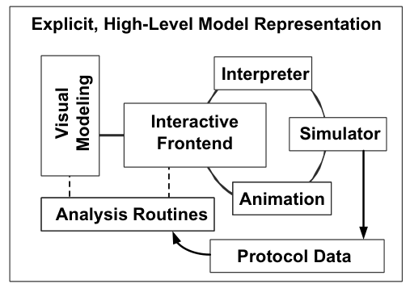
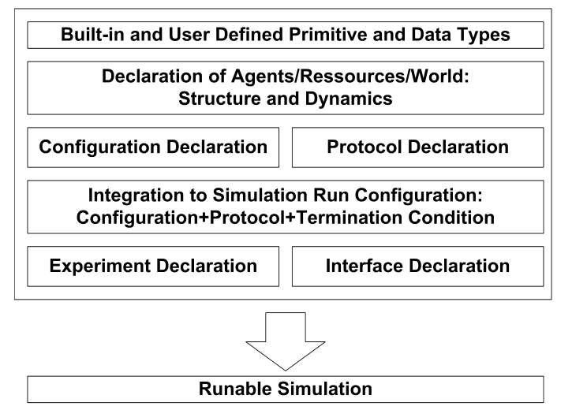
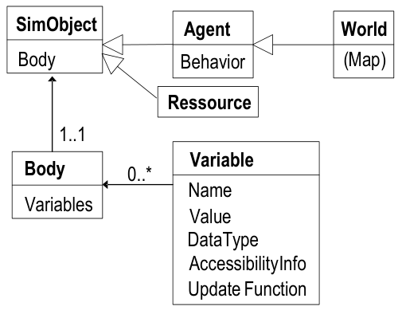
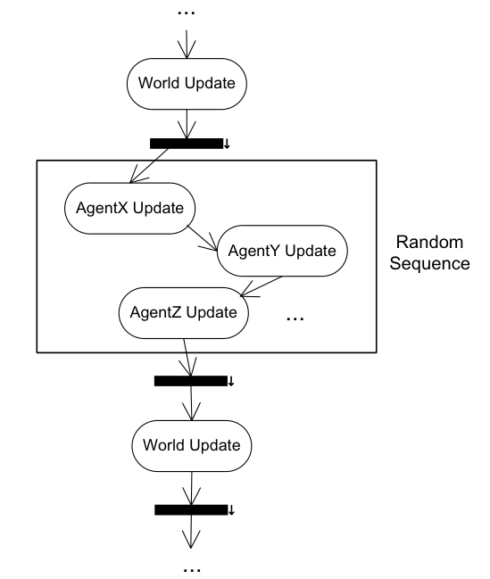

# SeSAm: Visual Programming and  Participatory Simulation for Agent-Based Models

https://multiagentsimulation.com/
---

## 16.1 Introduction

> Agent-based simulation offers a lot of advantages compared to traditional (also microscopic)
approaches, such as elegant representation of heterogeneous populations situated in hetero-
geneous environments, explicit treatment of local effects, or the possibility of formulating
flexible interaction between entities based on intelligent behavior. Agent-based simulation
is becoming more and more popular not only because of these properties. Additionally, it
provides an intuitive and direct form of modeling. Coarsely said, entities observable in the
real world can be described by entities in the virtual world. There is no abstraction step
that necessarily bridges aggregation levels as in macro-simulation.

与传统（也是微观的）方法相比，基于智能体的模拟具有许多优势，例如优雅地表示位于异质环境中的异质种群，
明确处理局部效应，或者基于智能行为在实体之间形成灵活交互的可能性。基于智能体的仿真越来越受欢迎，
不仅仅是因为这些特性。此外，它还提供了一种直观且直接的建模形式。粗略地说，在现实世界中可观察到的实体
可以用虚拟世界中的实体来描述。没有像宏观模拟那样必须桥接聚合级别的抽象步骤。

> As a result, agent-based simulation seems to demand less experience in handling com-
plex mathematics for modeling. Thus, the paradigm of agent-based modeling enables more
researchers to use simulation techniques on their own. Agent-based simulation seems to
be particularly attractive to people that did not use simulation techniques before, nor
received any training in formalizing or programming using traditional programming lan-
guages. Whether agent-based simulation can be widely applied, depends on the availability
of appropriate tools for every level of technical expertise.

因此，基于智能体的模拟似乎在处理用于建模的复杂数学方面需要较少的经验。
因此，基于智能体的建模范式使更多的研究人员能够自行使用仿真技术。
基于智能体的模拟似乎对以前没有使用过模拟技术的人特别有吸引力，
也没有接受过任何使用传统编程语言进行形式化或编程的培训。
基于智能体的仿真是否可以广泛应用，取决于每个技术专业知识级别是否有合适的工具。

> Tools supporting the implementation of agent-based simulations have been developed
since the early 1990’s. In this connection two classes of tools can be identified: class li-
braries on top of a traditional programming language (such as Swarm, www.swarm.org,
accessed June, 2008) or visual programming environments for absolute beginners (such
as AgentSheets, www.agentsheets.com, accessed June, 2008). These early tools merely sup-
ported the implementation of a multi-agent simulation. However, there are more tasks in a
simulation study than only implementing a simulation model. These other tasks, like exper-
imentation, model analysis, etc. were hardly supported. This is still true for many existing
tools, platforms and languages.

自 1990 年代初以来，已经开发了支持基于代理的模拟实施的工具。
在这方面，可以确定两类工具：传统编程语言之上的类库（例如 Swarm，www.swarm.org，2008 年 6 月访问）
或为绝对初学者提供的可视化编程环境（例如 AgentSheets，www.agentsheets.com，2008 年 6 月访问）。
这些早期工具只是支持多智能体模拟的实现。但是，仿真研究中的任务不仅仅是实现仿真模型。
这些其他任务，如经验、模型分析等，几乎不受支持。对于许多现有的工具、平台和语言来说，情况仍然如此。

> In 1995, we introduced the first version of SeSAm (Shell for Simulated Agent Systems).
By this time, SeSAm also focused on supporting implementation providing a high-level
model representation framework. As the linkage to a standard programming language was
different compared to class library-based tools, we had to note that the initial (Lisp-based)
SeSAm was not successful. The reason was mainly that model handling was too complex.
Additionally, for providing model specific add-ons for user participation, experimentation
support, etc. a SeSAm user could not fall back to the basic programming language and add
these tools to the given framework. In 2000/2001 we undertook a complete redesign and
re-implementation of SeSAm using Java, providing more appropriate user support beyond
mere implementation tasks.

1995 年，我们推出了 SeSAm （Shell for Simulated Agent Systems） 的第一个版本。
此时，SeSAm 还专注于支持实现，提供高级模型表示框架。由于与基于类库的工具相比，与标准编程语言的链接不同，
因此我们不得不注意到初始（基于 Lisp）SeSAm 并不成功。原因主要是模型处理太复杂。此外，为了为用户参与、
实验支持等提供特定于模型的附加组件，SeSAm 用户无法退回到基本编程语言并将这些工具添加到给定的框架中。
在 2000/2001 年，我们使用 Java 对 SeSAm 进行了完整的重新设计和重新实现，
提供了更合适的用户支持，而不仅仅是实现任务。

> In this chapter, we introduce SeSAm based on our experiences applying it as well as our
experience supporting others trying to do the same. The rest of the chapter will contain
three parts: at first, a short introduction to the context of human involvement into agent-
based modeling and simulation based on the identification of tasks in a simulation study.
The second part will contain an overview of the SeSAm system and how these different tasks
are supported by it. The third part will contain a short sketch of a number of (partially
interdisciplinary) projects and will discuss our future plans.

在本章中，我们根据我们应用 SeSAm 的经验以及我们支持其他人尝试做同样事情的经验来介绍 SeSAm。
本章的其余部分将包含三个部分：首先，根据模拟研究中任务的识别，简要介绍人类参与基于智能体的建模和模拟的背景。
第二部分将包含 SeSAm 系统的概述以及它如何支持这些不同的任务。第三部分将包含一些（部分跨学科）项目的简短草图，
并将讨论我们的未来计划。

## 16.2 Simulation Study and User Roles

> According to literature, only two or three types of people are typically involved in a simulation 
study: the simulation expert, the system expert, and sometimes a project manager
is mentioned as a third person. We also followed this division of responsibilities in several
projects and also in teaching simulation in interdisciplinary practicals∗. In a greater context,
reuse and maintenance of models have to be considered. This leads to finer considerations
about persons and roles involved in the development and use of simulation models, in general 
and in agent-based simulation models in particular. In the following, we sketch tasks
that may be assigned to specific persons or roles and may be supported appropriately by a
modeling and simulation platform.

根据文献，通常只有两三种类型的人参与仿真研究：仿真专家、系统专家，有时还提到项目经理作为第三人。
我们还在几个项目中遵循了这种职责分工，并在跨学科实践中教授模拟∗。在更大的背景下，必须考虑模型的重用和维护。
这导致了对仿真模型开发和使用中涉及的人员和角色的更精细的考虑，一般而言，特别是在基于智能体的仿真模型中。
在下文中，我们草拟了可以分配给特定人员或角色的任务，这些任务可能会得到建模和仿真平台的适当支持。

## 16.2.1 Tasks and User Roles

> In traditional industrial application domains of simulation – as mostly addressed in introductory 
books like [Law, 2007] – modeling and simulation experts are contracted to construct
and analyze a simulation model for a particular problem or system. There are two to three
different roles involved in such a study: The modeler, the SME “Subject Matter Expert"
and, if necessary, a project manager. A high specialization developed for those application
cases.

在仿真的传统工业应用领域（如 [Law， 2007] 等入门书籍中主要涉及）中，
建模和仿真专家被签约来构建和分析特定问题或系统的仿真模型。
此类研究涉及两到三个不同的角色：建模者、SME“主题专家"，如有必要，还包括项目经理。
为这些应用案例开发的高度专业化。

> In scientific applications such as in social sciences, physics or biology, the system experts
applied simulation for their particular research questions mostly on their own urging for a
different kind of specialized tool or highly specialized (mathematical) expertise.


> In contrast to the two latter cases a sustainable and efficient use, maintenance and reuse
of complex simulation models becomes more and more important to involve new persons
and also systematically support additional tasks. The advent of agent-based simulation
has additionally changed the situation as tasks such as experimentation may become so
demanding that additional persons are required for their execution. Also, the involvement
of human experts without formalization training may be possible in a previously unknown
way. These considerations result in the following set of tasks, in addition to the project
management. We will disregard the latter in the rest of the chapter.


> - **Design of an agent-based simulation model** is the task of developing a concept
    model of the original system that should be analyzed or tested. This step is
    impossible without expertise of the system to be modeled.
> - **Implementation of a computer simulation model** means that the concept model
    is taken and transferred to a programming language in a way that a run-able
    simulation is created.
> - **Observing and controlling** is an activity that is directly connected to implementation
    for testing, analyzing and confirming that the implemented model sufficiently
    corresponds to the conceptual model and to the original system. This is denoted
    here as a specific task, as it should be ideally done or at least supported by people
    not directly involved in model design and implementation.
> - **Observing and immersive testing** denotes another form of testing and validation
    of the implemented model. The persons responsible for these activities should be
    domain experts that can directly evaluate whether the dynamics observed on the
    macro and on the micro level are plausible.
> - **Calibration and experimentation** is a task that involves systematic and thoughtful 
    variation of parameter and input values for finally producing a valid model 
    and making the simulation runs for actual deployment of the model.
> - **Output interpretation** should not be underestimated. This task is directly related
    to the one above. Generated output is interpreted and conclusions are drawn
    as the final result of the simulation study. Also, this task requires deep domain
    knowledge.


- **基于智能体的仿真模型的设计** 是开发应分析或测试的原始系统的概念模型的任务。
  如果没有要建模的系统专业知识，此步骤是不可能的。
- **计算机模拟模型的实现** 意味着概念模型被采用并以创建可运行模拟的方式转移到编程语言中。
- **观察和控制是** 一项与实施直接相关的活动，用于测试、分析和确认实施的模型与概念模型和原始系统充分对应。
  这在这里表示为特定任务，因为理想情况下，它应该由不直接参与模型设计和实现的人员完成或至少提供支持。
- **观察和沉浸式测试** 表示对已实施模型的另一种形式的测试和验证。负责这些活动的人员应该是领域专家，
  他们可以直接评估在宏观和微观层面观察到的动态是否合理。
- **校准和实验** 是一项任务，涉及对参数和输入值进行系统和深思熟虑的更改，以最终生成有效的模型并运行模拟以实际部署模型。
- **输出解释** 不应被低估。此任务与上述任务直接相关。生成的输出被解释并得出结论作为模拟研究的最终结果。
  此外，此任务需要深厚的领域知识。

> It is quite common in many application domains for the model developer, experimenter,
  observer and manager to be one and the same person. In some applications with rather
  industrial backgrounds characterized by long-living models, contracted model development,
  etc. these roles are distributed to a number of people. A consequence can be that a person,
  who is not familiar with the model implementation interface, is responsible for experimenting. 
  Another person just wants to interactively observe the animation.

在许多应用领域中，模型开发人员、实验者、观察者和管理者是同一个人是很常见的。
在一些具有相当工业背景的应用程序中，这些角色以长寿模型、合同模型开发等为特征，
这些角色被分配给许多人。结果可能是不熟悉模型实现接口的人负责实验。
另一个人只想以交互方式观察动画。

> Before continuing with the introduction of a modeling and simulation platform, a short
discussion of user involvement and existing tools is given.

在继续介绍建模和仿真平台之前，本文简要讨论了用户参与和现有工具。

## 16.2.2 User Involvement in Agent-Based Simulation Tools

> Agent-based simulation is particularly apt for involving human users at least for two reasons.

基于代理的模拟特别适合让人类用户参与进来，至少有两个原因。

> Firstly, it forms an intuitive, direct modeling paradigm where the original system is
naturally conceptualized as a collection of actors. A modeler may take the role of such an
actor for specifying its behavior characterizing its rules from the Ego perspective. Therefore,
for conceptualizing and formulating a model no change of the modeling perspective from
micro to macro or from inside to outside the system is necessary. Thus, the direct formulation
of a model is the first reason for intensive involvement of humans that are not experts in
complex particular mathematics. This leads to new implementation frameworks derived
from concepts of visual and end-user programming. Also domain experts can be involved
in the modeling tasks more closely, as the basic model structures are more understandable
than in models based on complex mathematical constructs.

首先，它形成了一个直观、直接的建模范式，其中原始系统自然地被概念化为一组参与者。
建模者可以扮演这样一个参与者的角色，从自我的角度来指定其行为，表征其规则。
因此，要概念化和制定模型，无需将建模视角从微观更改为宏观或从系统内部更改为外部。
因此，模型的直接制定是非复杂特定数学专家的人类深入参与的第一个原因。
这导致了从可视化和最终用户编程概念派生的新实现框架。此外，领域专家可以更密切地参与建模任务，
因为基本模型结构比基于复杂数学结构的模型更容易理解。

> The second reason is also derivable from the possible inside view. Humans may interact
with agents, they may share the perspective, but also may control the model from outside.
Therefore the variety of possible interactions between human user and agent-based simulation
is higher than in macro or abstract simulations where only one level, namely the
aggregated level of observation and parameter manipulation is possible. Additionally the
richness and complexity of the agent behavior makes it interesting for a human to actually
interact with the individual agents.

第二个原因也可以从可能的内景中得出。人类可能会与代理互动，他们可能会共享视角，
但也可以从外部控制模型。因此，人类用户和基于代理的模拟之间可能的交互的种类高于宏观或抽象模拟，
后者只有一个级别，即观察和参数操作的聚合级别是可能的。
此外，代理行为的丰富性和复杂性使人类与各个代理实际交互变得有趣。

> Therefore, user involvement is a theme that has been dealt with since the early 1990’s.
A. Repenning and co-workers coined the term “participatory" theater approach which
combined interactive user interfaces with agent-based simulation [Ambach and Repenning,
1996]. Their ideas were implemented in the end-user programming tool AgentSheets where
visually specified rules for describing agent behavior could be compiled to Java programs
[Repenning et al., 2000]. The main application area of AgentSheets was in children’s games
or educatory simulations, therefore the practical usability for larger models was reduced.
The unstructured set of rules seems to be hardly scalable. Scalability of model representation
was one of the driving ideas behind SeSAm with a structured behavior representation
and regarding features of the visual programming language that enhance scalability.

因此，用户参与是自 1990 年代初以来一直在处理的主题。A. Repenning 及其同事创造了“参与式"剧院方法一词，
它将交互式用户界面与基于代理的模拟相结合 [Ambach 和 Repenning，1996]。他们的想法在最终用户编程工具 
AgentSheets 中实现，其中用于描述代理行为的可视化指定规则可以编译为 Java 程序 [Repenning et al.， 2000]。
AgentSheets 的主要应用领域是儿童游戏或教育模拟，因此降低了大型模型的实际可用性。
非结构化的规则集似乎几乎无法扩展。模型表示的可扩展性是 SeSAm 背后的驱动思想之一，
它具有结构化行为表示以及增强可扩展性的可视化编程语言的功能。

> Kidsim [Smith et al., 1994] and its sucessors were developed for a similar audience like
AgentSheets. They used programming by demonstration for implementing the behavior of
agents. These simulation environments were connected to particular domains and were only
used for interactive simulations for small children. SeSAm was planned as a powerful tool
that allows one to model a broad variety of agent-based models. Nevertheless, learning by
demonstration forms an attractive idea (see Section 16.6).

Kidsim [Smith et al.， 1994] 及其继任者是为与 AgentSheets 类似的受众开发的。
他们使用演示编程来实现代理的行为。这些模拟环境连接到特定领域，仅用于幼儿的交互式模拟。
SeSAm 被规划为一个强大的工具，允许对各种基于智能体的模型进行建模。
尽管如此，通过演示学习形成了一个有吸引力的想法（参见第 16.6 节）。

> During recent years user involvement in agent-based simulation experienced a revival
when role playing games and agent-based simulation were combined, see [Barreteau et al.,
2001] as one of the pioneering works in this area. So-called stakeholder approaches [Moss
and Edmonds, 2005] use the opportunities offered by agent-based simulation as a white-box
approach for intensifying involvement of domain experts, sponsors, etc. Recently, 
participatory involvement of humans’ playing individual agents in a multi-agent simulation were
focussed on by [Guyot and Honiden, 2006]. All these works focus on particular applications,
not on generic tools like SeSAm.

近年来，当角色扮演游戏和基于智能体的模拟相结合时，用户对基于智能体的模拟的参与经历了复兴，
参见 [Barreteau et al.， 2001] 作为该领域的开创性工作之一。
所谓的利益相关者方法 [Moss 和 Edmonds， 2005] 利用基于智能体的模拟提供的机会作为加强领域专家、
发起人等参与的白盒方法。最近，[Guyot 和 Honiden，2006 年] 关注了人类在多智能体模拟中扮演单个代理的参与性参与。
所有这些工作都集中在特定的应用程序上，而不是像 SeSAm 这样的通用工具上。

### 16.2.3 Tools for Agent-Based Simulation in General

> Tools for supporting the development of agent-based simulations have become widely available
 since the mid of 1990’s. Meanwhile a variety of tools can be found, starting from Swarm
as one of the earlier class libraries for developing agent-based simulation. Newer examples
are Repast (*repast.sourceforge.net*, accessed June, 2008) or MASON (*cs.gmu.edu/ eclab/
projects/mason/*, accessed June, 2008) which are basically both class libraries for efficient
event-based simulation. A variety of additional tools are available like GIS-data import,
class libraries for supporting the development of simulation experimentation interfaces, etc.
SeSAm, in contrast to these tools, provides a proprietary language and allows one to im-
plement simulation models without the knowledge of a traditional programming language.

自 1990 年代中期以来，支持基于代理的模拟开发的工具已广泛使用。
同时，可以找到各种工具，从 Swarm 开始，作为开发基于代理的仿真的早期类库之一。
较新的例子是 Repast（repast.sourceforge.net，2008 年 6 月访问）或 
MASON（cs.gmu.edu/ eclab/projects/mason/，2008 年 6 月访问），
它们基本上都是用于基于事件的高效仿真的类库。提供了各种附加工具，如 GIS 数据导入、
用于支持仿真实验接口开发的类库等。与这些工具相比，SeSAm 提供了一种专有语言，
并允许人们在没有传统编程语言知识的情况下实现仿真模型。

> Netlogo (*ccl.northwestern.edu/netlogo/*, accessed June, 2008) is a special, simple programming
 language initially grounded in turtle graphics that allows fast simulations. Meanwhile,
the Hubnet system (*ccl.northwestern.edu/netlogo/hubnet.html*, accessed June, 2008) enhances
 NetLogo for participatory simulations. There are two important differences - SeSAm
provides more elaborate structures for defining the agent behavior and it uses a visual 
programming language.

Netlogo（ccl.northwestern.edu/netlogo/，2008 年 6 月访问）是一种特殊的、简单的编程语言，
最初以图形为基础，允许快速模拟。同时，Hubnet 系统（ccl.northwestern.edu/netlogo/hubnet.html，
2008 年 6 月访问）增强了 NetLogo 的参与式模拟。
有两个重要的区别 - SeSAm 为定义代理行为提供了更复杂的结构，并且它使用了可视化编程语言。

> At the end of the 1990’s, there were attempts to simplify modeling by providing a higher-level
 language built upon general simulation languages, for example MAML for Swarm
[Gulyas et al., 1999], or more recently a new and promising development, Repast Simphony
(repast.sourceforge.net, accessed June, 2008). It aims at facilitating modeling and simulation
by providing appropriate user interfaces allowing the generation of Java code to GUI-based
control of simulations. In contrast to this, SeSAm models are accessible using visual interfaces
 at any stage of use. An additional – also specification-level programmed – user
simulation interface builder allows also to produce model-specific dialogs.

在 1990 年代末，有人尝试通过提供基于通用仿真语言构建的更高级别的语言来简化建模，
例如 MAML for Swarm [Gulyas et al.， 1999]，或者最近的一个新的有前途的开发项目 
Repast Simphony（repast.sourceforge.net，2008 年 6 月访问）。
它旨在通过提供适当的用户界面来促进建模和仿真，从而允许生成 Java 代码以基于GUI的仿真控制。
与此相反，SeSAm 模型可以在任何使用阶段使用可视化界面访问。一个额外的 - 也是规范级编程的 - 
用户模拟界面构建器也允许生成特定于模型的对话框。

> In addition to a survey on simulation engines for agent-based simulation [Theodoropoulos
et al., 2008], this book also contains a chapter about JAMES II [Himmelspach and R¨ohl,
2008]. This particular simulation framework separates an explicit model specification from
the executable model automatically converted to Java code.

除了对基于智能体的仿真的仿真引擎的调查 [Theodoropoulos et al.， 2008] 之外，
本书还包含关于 JAMES II 的章节 [Himmelspach 和 R ̈ohl， 2008]。
这个特定的仿真框架将显式模型规范与自动转换为 Java 代码的可执行模型分开。

> For several years, commercial tools for agent-based simulation have also been available.
An example for a general tool is AnyLogic (www.xjtek.com, accessed June, 2008). It provides
modeling support for different modeling paradigms: agent-based modeling and event-based
models as well as system dynamics models that can also be combined in one model. Although
the basic agent behavior definition is based on statecharts, most items of the modeling
interface connect directly to Java code. In SeSAm, Java code is completely hidden.

几年来，用于基于智能体的仿真的商业工具也已经面世。通用工具的一个例子是 AnyLogic（www.xjtek.com，2008 年 6 月访问）。
它为不同的建模范式提供建模支持：基于智能体的建模和基于事件的模型，以及也可以组合在一个模型中的系统动力学模型。
尽管基本代理行为定义基于状态图，但建模接口的大多数项都直接连接到 Java 代码。在 SeSAm 中，Java 代码是完全隐藏的。

> In particular domains specialized commercial tools for Agent-based simulations can be
bought. An example is SimWalk for agent-based pedestrian simulations (www.simwalk.ch,
accessed June, 2008). SeSAm also has been used for pedestrian simulation; the pedestrian
behavior can be manipulated allowing for flexible reactions to perceptions of local congestions,
etc. In SimWalk, the agent behavior is fixed, only origin and destination areas and
other input value configuration can be defined. This makes it useful for standard 
applications, yet inhibits research.

特别是，可以购买用于基于 Agent 的模拟的专用商业工具。一个例子是用于基于代理的行人模拟的 
SimWalk（www.simwalk.ch，2008 年 6 月访问）。SeSAm 也已用于行人模拟;行人的行为可以纵，
从而对当地拥堵等的感知做出灵活的反应。在 SimWalk 中，代理行为是固定的，只能定义起点和终点区域以及其他输入值配置。
这使得它对标准应用很有用，但抑制了研究。

> Platforms and programming languages for developing agent systems may also be used
for implementing agent-based simulation models. This can be done by adding a simulation
time service to an agent platform [Braubach et al., 2006], or directly using specific agent
programming languages like Jason [Bordini and H¨ubner, 2008] which is also shown in this
book. The latter offers a powerful, well-structured formal language for programming agents.
In addition to its focus on simulation, SeSAm is based on a more practical approach.

用于开发代理系统的平台和编程语言也可用于实现基于代理的仿真模型。这
可以通过向代理平台添加模拟时间服务 [Braubach et al.， 2006] 或直接使用特定的代理编程语言来完成，
如 Jason [Bordini 和 H ̈ubner， 2008]，这在本书中也有展示。
后者为编程代理提供了一种功能强大、结构良好的正式语言。除了专注于仿真之外，SeSAm 还基于一种更实用的方法。

> At the Department of Artificial Intelligence and Applied Computer Science at the 
University of W¨urzburg, we developed a modeling and simulation environment named SeSAm that
combines concepts of declarative high-level model representation and visual programming.
The initial aim behind our efforts was similar to the idea of AgentSheets of providing a tool
for beginners in modeling and programming. However, our intention was more ambitious as
we wanted to develop a scalable platform that can be used for real-world applications. Thus,
we also wanted to develop a modeling and simulation system apt for rapid-prototyping by
experts. In the remainder of this chapter, we will describe the modeling and simulation
system of SeSAm with a focus on the new developments concerning user tasks and their
support. Finally we will discuss some anecdotic, yet symptomatic experiences we made when
applying SeSAm.

在维尔茨堡大学人工智能与应用计算机科学系，我们开发了一个名为 SeSAm 的建模和仿真环境，
它结合了声明性高级模型表示和可视化编程的概念。我们努力的最初目标类似于 AgentSheets 的想法，
即为建模和编程的初学者提供工具。然而，我们的意图更加雄心勃勃，因为我们想开发一个可用于实际应用的可扩展平台。
因此，我们还希望开发一个适合专家快速原型制作的建模和仿真系统。在本章的其余部分，我们将描述 SeSAm 的建模和仿真系统，
重点介绍有关用户任务及其支持的新发展。最后，我们将讨论我们在应用 SeSAm 时所做的一些轶事但有症状的经历。


## 16.3 Core SeSAm
> In this chapter we want to describe SeSAm, a modeling and simulation environment that
was constructed to support as many of the above sketched tasks as possible. SeSAm basically
provides a platform for implementing and experimenting with agent-based simulation
models using a higher level modeling language. Starting with some core facilities, it was stepwise
enhanced to its current status. Currently SeSAm contains several components whose
relations are depicted in Figure 16.1.

在本章中，我们想描述 SeSAm，这是一个建模和仿真环境，旨在支持尽可能多的上述草图任务。
SeSAm 基本上提供了一个平台，用于使用更高级别的建模语言实现和试验基于智能体的仿真模型。
从一些核心设施开始，逐步提升到现在的状态。目前 SeSAm 包含几个组件，其关系如图 16.1 所示。

> 
> FIGURE 16.1 Overview of the SeSAm system: Based on the high-level model representation, several
modules are built that allow to implement the model and its instrumentation (“Analysis Routines") 
conveniently using visual programming (“Visual Modeling"). The model given in the representation language is
interpreted (“Interpreter") and put into a dynamic context for simulation (“Simulator"); The output data
can be automatically animated (“Animation") or stored into files for later analysis (“Protocol data"). 
Visual programming can also be used to generate specific user interfaces for the simulation runs (“Interactive
Frontend"). All these modules are based on the given model representation.
> 
> 图 16.1 SeSAm 系统概述：基于高级模型表示，构建了几个模块，
> 这些模块允许使用可视化编程（“可视化建模 / Visual Modeling"）方便地实现模型及其工具（“分析例程 / Analysis Routines"）。
> 以表示语言给出的模型被解释（“解释器 / Interpreter"）并放入动态上下文中进行模拟（“模拟器/Simulator"）;
> 输出数据可以自动进行动画处理（“动画 / Animation"）或存储到文件中以供以后分析（“协议数据/Protocol data"）。
> 可视化编程还可用于为仿真运行生成特定的用户界面（“交互式前端 / Interactive Frontend"）。所有这些模块都基于给定的模型表示。

> SeSAm is based on a specific, proprietary language for describing the elements of a
multi-agent model: from the basic elements of the model, namely the structure and dynamics of
agents and their environment to possible configurations, instrumentation and experiment
description. Due to its declarative character there is a clear separation between model and
simulator. All elements of the model description can be entered into the SeSAm system
using visual programming. There are also facilities for importing data from databases, 
tables/spreadsheets, GIS- and CAD files, etc.

SeSAm 基于一种特定的专有语言来描述多智能体模型的元素：从模型的基本元素，
即智能体的结构和动态及其环境到可能的配置、仪器和实验描述。
由于其声明性特性，模型和模拟器之间有明显的区别。模型描述的所有元素都可以使用可视化编程输入到 SeSAm 系统中。
还有一些工具用于从数据库、表格/电子表格、GIS 和 CAD 文件等导入数据。

> The model description is compiled into some corresponding, yet partially more efficient
representation that is interpreted for actually producing model dynamics in a simulation.
Due to the explicitness of the language, there are in-built facilities for animation, data
gathering and visualization based on model-specific selected protocol data. Recently, the system
has been enhanced by a tool that allows building specific user interfaces for interactive
simulation, as well as a possibility to control agents from outside the simulation. All the
modules depicted in Figure 16.1 will be discussed later in this chapter after the introduction
of the model representation language on which they are based.

模型描述被编译成一些相应的，但部分更有效的表示形式，这些表示形式被解释为在模拟中实际生成模型动力学。
由于该语言的明确性，有基于特定于模型的选定协议数据的内置动画、数据收集和可视化工具。
最近，该系统通过一种工具得到了增强，该工具允许为交互式仿真构建特定的用户界面，以及从仿真外部控制代理的可能性。
图 16.1 中描述的所有模块都将在本章后面介绍它们所基于的模型表示语言之后进行讨论。

### 16.3.1 Basic Model Representation

> The high-level modeling language of SeSAm consists of elements on different levels 
> as depicted in Figure 16.2.

SeSAm 的高级建模语言由不同级别的元素组成，如图 16.2 所示。

> 
> FIGURE 16.2 Building blocks of the SeSAm language: the atomic elements of the model representation
  are the primitives that form the basic elements of all descriptions of actions, perceptions where actual
  modifications happen. The concretely specified primitive calls are used for characterizing the dynamics of
  the agents, resources and also the world. Additionally, these entities are characterized by a structure that is
  able to capture their status. Based on this core model, additional information is integrated for specifying a
  fully functional model: Specifications of configuration (possible start situations) and of routines for collecting
  data to export in protocols. All this information is integrated into a full simulation run specification. The
  latter can be augmented by an interface declaration or several of them can be aggregated to experiments.
> 
> 图 16.2 SeSAm 语言的构建块：模型表示的原子元素是构成所有动作描述的基本元素的基元，
> 这些感知发生在实际修改的地方。具体指定的 primitive calls 用于描述代理、
> 资源以及世界的动态。此外，这些实体的特征是能够捕获其状态的结构。
> 基于此核心模型，集成了其他信息以指定功能齐全的模型：配置规范（可能的启动情况）和用于收集数据以在协议中导出的例程。
> 所有这些信息都集成到一个完整的仿真运行规范中。后者可以通过接口声明进行扩充，或者将其中的几个可以聚合到实验中。

> - *Primitives and data structures* form the basic language elements like in any other
    programming language. Primitives and data structures may be built-in or
    user-defined. The latter are saved together with the complete description as XML
    file.
> - *Static structures* are the description of the structural composition of the system:
    entity and environment classes, state variables and their domains describing the
    entities’ bodies, etc.
> - *Configuration* of the initial situations including descriptions of a number of
    instances and start values for each instance, its positions, etc.
> - *Description of dynamic reasoning* as the specification of agent and environmental
    behavior.
> - *Meta-level characterization* means basically descriptions of what to do with the
    model: experiment scripts, model instrumentation, visualization, etc.

- *基元和数据结构* 构成了基本语言元素，就像任何其他编程语言一样。 
  基元和数据结构可以是内置的，也可以是用户定义的。后者与完整描述一起保存为 XML 文件。
- *静态结构* 是对系统结构构成的描述：实体和环境类、描述实体主体的状态变量及其域等。
- "配置* 是指初始状态，包括实例数量和每个实例的起始值、其位置等的描述。
- *动态推理描述* 为代理和环境行为的规范。
- *元级表征* 基本上是指对模型处理什么的描述：实验脚本、模型检测、可视化等。

> In the remainder of this section, we will sketch the essentials of each of these language elements.

在本节的其余部分，我们将概述这些语言元素的基本要素。

#### Model Level

***Primitives, User Functions and Data Types***  
***基元、用户函数和数据类型*** 

> So-called *primitives* form the basic building blocks of the model and connect the model
to the basic programming language: internally, every primitive consists of two parts: a 
declaration part and a Java method named *execute*. The declaration part contains a structured
description of input and output argument types together with some text that describes
its functionality. This information is parsed by the SeSAm system for generating the basic
parts of the visual interface.

所谓的*基元*构成了模型的基本构建块，并将模型连接到基本编程语言：在内部，每个原语都由两部分组成：
声明部分和名为 execute 的 Java 方法。声明部分包含输入和输出参数类型的结构化描述以及一些描述其功能的文本。
此信息由 SeSAm 系统解析，以生成可视界面的基本部分。

> There are different categories of primitives:

基元有不同类别的：

> - *Action Primitives* are the actions that an agent may exert for manipulating its
    status or its environment. These primitives are connected to Java methods that
    modify the agent or its environment specified by the arguments given to the
    action. Examples are move or setVariable.
> - *Sensor Primitives* collect information from the agent’s environment and also
    from its internal state. An example is a primitive that returns a list of objects
    that the agent is able to perceive in some direction within some range,
    like observeAllObjectsInDirection.
> - *Computational Primitives* form a quite heterogeneous set of functions that provide
    means for the agents to execute more or less complex computations based
    on the sensor information and parameters of their behavioral program. An
    example is the calculation of the heading of the agent using some simple position
    mathematics. Other examples are comparison predicates, list manipulation, etc.

- *行为基元（Action Primitives）* 是代理为操纵其状态或环境而可以执行的操作。
  这些基元连接到 Java 方法，这些方法修改代理或其环境，这些环境由给定给操作的参数指定。
  例如 move 或 setVariable。
- *传感器基元（Sensor Primitives）* 从代理的环境及其内部状态收集信息。
  例如，一个基元返回一个对象列表，代理能够在某个范围内的某个方向上感知这些对象，
  例如 observeAllObjectsInDirection。
- *计算基元 （Computational Primitives）* 形成一组相当异构的函数，
  这些函数为代理提供了根据其行为程序的传感器信息和参数执行或多或少复杂计算的方法。
  一个例子是使用一些简单的位置数学计算代理的航向。其他示例包括比较谓词、列表操作等。

> We provided a set of primitives that can be shown to be Turing-complete [Oechslein, 2003].
A modeler may define complex nested calls of primitives as macros called *user primitives*.
These macros provide abstractions in the sense of model-specific functions. The following
excerpt from a SeSAm model xml file shows the definition of such a user function in a
simple predator-prey model. It contains the definition of a flee action of a prey agent
toward a shelter `simObject` that is computed in another user function addressed by calling
`UserFunction0`. The user function possesses only one argument, namely the active agent
itself. The return value is void denoting that it is an action.

我们提供了一组可以证明是图灵完备的基元 [Oechslein， 2003]。
建模者可以将基元的复杂嵌套调用定义为称为*用户基元*的宏。
这些宏提供特定于模型的函数意义上的抽象。以下摘自 SeSAm 模型 xml 文件显示了简单 
predator-prey 模型中此类用户函数的定义。它包含猎物代理对庇护所 simObject 的逃跑动作的定义，
该动作在另一个用户函数中计算，通过调用 UserFunction0 寻址。
user 函数只有一个参数，即 active agent 本身。返回值为 void，表示它是一个操作。

```xml
...
<userFunction name="Flee from predator" id="UserFunction1" external="true" expert="false" inline="true">
    <functionCall>
        <call functionName="MoveTowardsPos">
            <call functionName="GetSpatialInfo">
                <parameterID id="FunctionArgument1"/>
            </call>
            <call functionName="GetPosition">
                <call functionName="GetSpatialInfo">
                    <call userFunctionID="UserFunction0">
                        <parameterID id="FunctionArgument1"/>
                    </call>
                </call>
            </call>
            <call functionName="GetSpeed">
                <call functionName="GetSpatialInfo">
                    <parameterID id="FunctionArgument2"/>
                </call>
            </call>
        </call>
    </functionCall>
    <parameter name="ich" id="FunctionArgument1">
        <simObjectType/>
    </parameter>
    <voidType/>
</userFunction>
...
```
> The SeSAm modeling language provides a priori a set of atomic and abstract data types
ranging from boolean, numbers, etc. to lists or hashtables. Composed data types and
enumerations may be added by a modeler to provide model-specific types and abstractions in
a similar way to user primitives

SeSAm 建模语言提供了一组先验的原子和抽象数据类型，范围从布尔值、数字等到列表或哈希表。
建模者可以添加组合数据类型和枚举，以类似于用户基元的方式提供特定于模型的类型和抽象


***Structural Description***
***结构描述***

> There are different structural elements and levels built upon these basic primitives. An
overview can be found in Figure 16.3.

在这些基本基元上构建了不同的结构元素和级别。图 16.3 中提供了概述。

> 
> FIGURE 16.3
Basic structure for describing the structural building blocks of a SeSAm model: There are
three different types of entities all derived from the `simObject` class: `Resources` that represent static
objects that can be manipulated, `agents` that possess also a behavior descriptions and the world that
additionally may contain other global representations such as a map. The `simObject` structure that is
responsible for storing the current status of an entity. This status is stored in a collection of state variables
that together form the entities “body“.
>
> 图 16.3 描述 SeSAm 模型结构构建块的基本结构：有三种不同类型的实体都源自 simObject 类：
> 表示可操作的静态对象的资源、还具有行为描述的代理以及可能还包含其他全局表示（如地图）的世界。
> 负责存储实体当前状态的 simObject 结构。此状态存储在状态变量的集合中，这些变量共同构成实体 “body“。

> A multi-agent model consists here of a set of models of entities – in the terminology
of SeSAm simObjects. Their structure and behavior is described on the class description
level. Individual entities are characterized at the configuration or instance description level.
For the simulation, actual object instances are generated from these instance descriptions.
This three-level system of description allows one to separate explicitly between model and
simulation run, enabling the visual programming facilities of SeSAm (see Section 16.4.3)
and allowing one to add an additional compilation step for generating simulation entities
from instance descriptions.

多智能体模型由一组实体模型组成 – 用 SeSAm simObjects 的术语来说。
它们的结构和行为在 类描述 级别上描述。单个实体在配置或实例描述级别进行表征。
对于模拟，实际对象实例是根据这些实例描述生成的。这个三级描述系统允许在模型和仿真运行之间显式分离，
启用 SeSAm 的可视化编程工具（参见 Section 16.4.3），并允许添加额外的编译步骤，以便从实例描述生成仿真实体。

> For reasons of model clarity, there are three specific different kinds of object class 
descriptions, derived from the generic simObject class description:
> - **Agent class** descriptions form the basis for all model-specific agent classes: for
    example a Pedestrian Class or an Ant Class is basically an instance of an agent
    class description. A basic agent class description consists of a characterization of
    its body and its behavior.
> - **Resource class** descriptions are used for integrating static entities populating the
    environment of the agents. They just contain some status that may be manipulated
    and accessed by the agents.
> - **World class** descriptions are basically special agent class descriptions that contain
    global status variables or parameter. They enable formulation of some global level
    behavior. Therefore on the configuration instance level only one unique instance
    of a model-specific world class is allowed per situation (see below).

为了明确模型，有三种特定的不同类型的对象类描述，这些描述源自通用 simObject 类描述：
- **代理类**描述构成了所有特定于模型的代理类的基础：例如，Pedestrian Class 或 Ant Class 基本上是代理类描述的实例。
  基本的 agent 类描述包括其主体及其行为的特征。
- **资源类**描述用于集成填充代理环境的静态实体。它们只包含一些可能被代理操作和访问的状态。
- **World 类**描述基本上是包含全局状态变量或参数的特殊 Agent 类描述。
  它们支持制定某些全局级别的行为。因此，在配置实例级别上，每种情况只允许一个特定于模型的世界级的唯一实例（见下文）。

> All simObject class descriptions contain declarations as to how the status of their
instances is represented. In the current SeSAm version the container for all status information
or individual parameter etc. is characterized as “body". The body consists of a set of
variables and constants. A body description is associated with a class description. Thus, this
body structure also mirrors the three levels of class description, instance and actual 
entity by body description, body instance description and actual body, the latter only exists
during a simulation run.

所有 simObject 类描述都包含有关如何表示其实例状态的声明。在当前的 SeSAm 版本中，
所有状态信息或单个参数等的容器都被描述为 “body”。主体由一组变量和常量组成。
正文描述与类描述相关联。因此，此 body 结构还通过 body description、body 实例描述和实际 body 反映了类描述、
实例和实际实体的三个级别，后者仅存在于模拟运行期间。

> Variables – also on corresponding description layers – are characterized by the following
information:
> - Name of the variable
> - Data Type (boolean, number, string, list, hashtable, pointer to simObject, but
    also position, shape, image,...)
> - Characterization: configuration parameter, state variable, output variable or
    supporting variable.
> - Default initial value
> - Interface characterization denoting whether its value is perceivable or even
    manipulate for other agents

变量 – 也位于相应的描述层上 – 由以下信息表征：
- 变量的名称
- 数据类型（布尔值、数字、字符串、列表、哈希表、指向 simObject 的指针，以及位置、形状、图像,...）
- 特征：配置参数、状态变量、输出变量或支持变量。
- 默认初始值
- 界面特性，表示其值是否可感知，甚至是否为其他代理所操纵

> Variables may be grouped in so called “features“ which can be assigned to more than
one simObject class. Combined with user primitives that specifically work on those feature
variables these language elements provide common abilities to agent, resource and the world
classes. This might be useful for model elements that deal with identifiers or different types
of memory, etc. Features also form the basis of an important plugin-mechanism which will
be described in more detail in Section 16.3.3.

变量可以分组为所谓的 “特征“ ，这些 “特征“ 可以分配给多个 simObject 类。
结合专门处理这些特征变量的用户原语，这些语言元素为 agent、resource 和 world 类提供了通用功能。
这对于处理标识符或不同类型内存等的模型元素可能很有用。
功能也构成了一个重要的插件机制的基础，这将在 Section 16.3.3 中更详细地描述。

> There are several predefined features that additionally provide specific data types. The
most prominent feature-level plugins are spatial representations. The standard one is a
continuous 2d space consisting of a feature for the environment that provides a map description
at the world instance description level and a concrete map for the actual world instance, as
well as variables containing the spatial information of an entity for the agent and resource
classes on the different levels of declaration. Spatial information for the 2d continuous case
contains not only position, but also shape in form of a polygon, speed, direction and in-
formation about visualization like color, image,... This feature also encapsulates specific
primitives for spatial perception as well as several movement primitives. The treatment
of spatial information as feature has the advantage of flexibility: only entities – resources
or agents that possess the spatial information feature are positioned on the map. These
entities may be combined with non-spatial agents like abstract, non-spatial agents, for
example organizational agents. By exchanging this feature assignment, other forms of spatial
representation can be used without any changes on the platform level or even concurrently.

还有几个预定义功能，它们还提供了特定的数据类型。最突出的要素级插件是空间表示。
标准空间是一个连续的 2D 空间，由环境特征组成，该功能在世界实例描述级别提供地图描述，
为实际世界实例提供具体地图，以及包含不同声明级别上的代理和资源类的实体空间信息的变量。
2D 连续情况的空间信息不仅包含位置，还包含多边形形式的形状、速度、方向和有关可视化的信息，
如颜色、图像,...此功能还封装了用于空间感知的特定基元以及多个运动基元。
将空间信息视为特征具有灵活性的优势：只有实体 – 具有空间信息特征的资源或代理才会定位在地图上。
这些实体可以与非空间代理（如抽象、非空间代理）相结合，例如组织代理。
通过交换此要素分配，可以使用其他形式的空间表示，而无需在平台级别进行任何更改，甚至无需同时进行任何更改。

***Behavior Description***
***行为描述***

> Using the above introduced primitives, dynamics can be expressed similarly to traditional
programming languages. However, SeSAm provides language constructs for organizing the
description of behavior of agents and of the world:

使用上面介绍的基元，动态可以像传统编程语言一样表示。但是，SeSAm 提供了用于组织代理和世界行为描述的语言结构：

> The behavior description is inspired by UML activity diagrams: consisting of activity
nodes and arrows that depict transition rules between activities. Special activities are the
start and the end activity. When the behavior of the agent ends up in the end node, the
agent is deleted from the simulation. When an agent is generated, the interpretation of the
activity diagram starts at the start node.

行为描述的灵感来自 UML 活动图：由描述活动之间转换规则的活动节点和箭头组成。
特殊活动是 start 和 end 活动。当代理的行为最终出现在终端节点中时，该代理将从模拟中删除。
生成代理时，活动图的解释从起始节点开始。

> An agent (as well as the world entity) may have arbitrary many activity graphs or 
“reasoning engines” as they are called in the SeSAm terminology. This allows the modeler
formulating concurrent behaviors performed by one agent – for example defining negotiation
behavior in one reasoning engine and concurrent manipulation of the environment in
another.

代理（就是世界实体）可以具有任意数量的活动图或“推理引擎“，它们在 SeSAm 术语中称为。
这允许建模者制定由一个代理执行的并发行为 —— 例如，在一个推理引擎中定义协商行为，
在另一个推理引擎中定义环境的并发操作。

> An activity encapsulates three sequences of actions that are basically sequences nested
primitive calls: **start actions** that are performed when the activity is selected anew, **standard
actions** that are performed once every time step as long as the agent is executing that activity
and **termination actions** that are executed for cleaning up when the agent has decided to
change its activity.

一个活动封装了三个操作序列，这些操作基本上是嵌套基元调用序列：
- **start actions** 重新选择活动时启动执行的操作，
- **standard actions** 只要代理执行该活动，每个时间步执行一次的标准操作
- **termination actions** 当代理决定更改其活动时为清理而执行的终止操作。


> Rules are responsible for terminating one activity and selecting the next. They are linked
to their predecessor activity and tested every time this activity is executed by an agent. Rules
may contain arbitrarily nested function calls of primitives finally returning a boolean value
as pre-conditions and an activity as post-condition. A special kind of rule has “otherwise“
as condition which means that this rule fires if the condition of no other rule associated
with the same activity returns true. With this special rule a sequence of activities can be
enforced without detailed implementation of further conditions. Conflict resolution in the
case of more than one applicable standard rule is random selection. There are two types of
activity concerning their temporal aspects: “instant“ or “time consuming“ activities. The
basic update cycle is round-based (see Section 16.3.2). This label denotes at which activity
the rule-based selection and execution cycle stops waiting for the next update signal.

规则负责终止一个活动并选择下一个活动。它们链接到其前置活动，并在代理每次执行此活动时进行测试。
规则可以包含基元的任意嵌套函数调用，这些基元最终返回布尔值作为前提条件，并返回活动作为后置条件。
特殊类型的规则将 “else“ 作为 condition，这意味着如果与同一活动关联的没有其他规则的条件返回 true，
则会触发此规则。使用此特殊规则，可以强制执行一系列活动，而无需详细实施其他条件。
如果存在多个适用的标准规则，则冲突的解决方式是随机选择。就其时间方面而言，
有两种类型的活动：“即时“或“耗时“活动。基本更新周期是基于轮次的（请参阅 Section 16.3.2）。
此标签表示基于规则的选择和执行周期在哪个活动停止等待下一个更新信号。


> Activity graphs can become quite large and thus, without further structuring means,
hard to conceive by a human modeler. Therefore additional language-level support is given
by introducing hierarchical composition of activities. A partial graph can be replaced by a
composed activity, without any change in the interpretation of the overall activity graph.
Rules selecting an activity within this new graph are simply routed via the start node of
the partial graph. Similarly, rules selecting activities outside of the composed activity graph
are routed via the end node. Both start and end node are interpreted as instant activities
without time consumption.

活动图可能会变得非常大，因此，如果没有进一步的结构化手段，人类建模者很难想象。
因此，通过引入活动的分层组合来提供额外的语言级支持。部分图可以替换为组合活动，
而不会对整个活动图的解释发生任何变化。在此新图表中选择活动的规则只需通过部分图表的起始节点进行路由即可。
同样，选择组合活动图之外的活动的规则将通过结束节点路由。开始节点和结束节点都被解释为即时活动，不会消耗时间。

***Declaration of Situations***
***声明状况***

>As mentioned before, there is an additional description level between the agent, resource
or world class and a simulation run: descriptions of possible model configuration or
“situation" declarations as they are called in the SeSAm terminology. The description of a
situation contains a set of instance descriptions. There may be arbitrary many agent or
resource instance declarations, but only one unique instance of a world class. The reason is
obvious when keeping in mind that the world instance represents the global aspects of the
environment.

如前所述，代理、资源或世界级与模拟运行之间还有一个额外的描述级别：
可能的模型配置或 SeSAm 术语中称为“状况"声明的描述。状况描述包含一组实例描述。
可以有任意多个代理或资源实例声明，但只有一个世界级的唯一实例。
请记住，世界实例表示环境的全局方面，原因很明显。

> An instance description mainly contains – in addition to a pointer to the behavior
description – a body instance description with a set of variable instance descriptions. There
the important aspect is the individualization of initial values for the variables. In models
with explicit spatial representations, on this level the map declaration – as an instance of
the spatial feature class assigned to the world class – is available that allows for localization
of entities that possess the spatial information feature.

除了指向行为描述的指针外，实例描述还主要包含一个 body 实例描述和一组可变实例描述。
其中重要的方面是变量初始值的个性化。在具有显式空间表示的模型中，在此级别上，
地图声明（作为分配给 world 类的空间要素类的实例）可用，它允许对具有空间信息特征的实体进行定位。

> For facilitation of situation designs with many elements, we integrated groups of instances
that can be named as a group and used as a template for partial situation configurations.

为了促进具有许多元素的情境设计，我们集成了实例组，这些实例组可以命名为一个组，并用作部分情境配置的模板。

#### Experiment Description Level / 实验描述级别

> With the declaration of a situation the model itself is completely specified. However, for
being able to perform useful simulation experiments additional information has to be provided.

通过情况的声明，模型本身被完全指定。但是，为了能够执行有用的仿真实验，必须提供额外的信息。

***Declaration of Model Instrumentation***
***模型仪表生命***

>The most important point is the definition of measurements that can be taken from
the agent-based simulation. These can be variables defined in the world class, where data
may be aggregated for protocol, but also specific output variables of prominent agents.
Model instrumentation is provided from outside the model and should not be a part of
the core model. Therefore, specific measurements may be explicitly defined and added to a
situation description. The declaration of model instrumentation may contain primitive calls
for collecting the necessary information from the multi-agent system and information on
what should be done with this gathered information. Basically two options are available:
writing the data to protocol files or visualization in different forms of diagrams that animate
the changes throughout the simulation run.

最重要的一点是可以从基于智能体的模拟中获取的测量的定义。这些可以是 world class 中定义的变量，
其中数据可以针对协议进行聚合，也可以是著名代理的特定输出变量。模型插桩是从模型外部提供的，
不应成为核心模型的一部分。因此，可以明确定义具体的测量并添加到情况描述中。
模型插桩的声明可能包含用于从多代理系统收集必要信息的基元调用，以及有关如何处理这些收集到的信息的信息。
基本上有两个选项可用：将数据写入协议文件或以不同形式的图表可视化，在整个仿真运行过程中为变化添加动画效果。

***Simulation Run Definition and Experiment Declaration***
***仿真运行定义和实验声明***

> A simulation run contains not only the initial description of the situation and the
instrumentation of the run. It additionally contains the description of a condition for 
terminating the simulation run. This condition may access the simulation time or may be a 
characteristic of the complete situation, for example when all agents have been deleted.

仿真运行不仅包含情况的初始描述和运行的检测。它还包含终止模拟运行的条件的描述。
此条件可能会访问模拟时间，也可能是完整情况的特征，例如，当所有代理都已被删除时。

> Several simulation runs can be aggregated to experiments. Instead of providing some
predefined framework for describing variations of parameter values and corresponding
simulation runs, we decided to provide full programming power for experiments. It allows
scripting simulation runs with full flexibility. For this aim, primitives operating on
situation declarations, setting the random seed, generating and executing simulation runs are
provided.

可以将多个模拟运行聚合到试验中。我们决定为实验提供完整的编程功能，
而不是提供一些预定义的框架来描述参数值的变化和相应的仿真运行。
它允许以完全的灵活性编写模拟运行脚本。为此，提供了对情况声明进行操作、
设置随机种子、生成和执行仿真运行的原语。

### 16.3.2 Simulation Routine and Model Interpretation / 仿真例程和模型解释

> Up to now, we briefly sketched the full model and simulation description language used
by SeSAm. The semantics of the higher level elements are given by the interpreter, the
semantics of the primitives by the underlying Java code. There is a compilation step between
model description and simulation run for two reasons:
> 1. Clear separation between model and simulation
> 2. Possible code optimization based on techniques from compiler design, like
     constant folding, code in-lining, etc. These optimization steps are transparent for
     the user. They enable SeSAm to execute simulation runs rather fast.

到目前为止，我们简要概述了 SeSAm 使用的完整模型和仿真描述语言。
更高级别元素的语义由解释器给出，基元的语义由底层 Java 代码给出。
模型描述和仿真运行之间存在编译步骤，原因有两个：

1. 模型和仿真之间的明确分离
2. 基于编译器设计中的技术（如常量折叠、代码内联等）的可能代码优化。
   这些优化步骤对用户是透明的。它们使 SeSAm 能够相当快速地执行仿真运行。

> 
> FIGURE 16.4 Interpretation cycle of SeSAm: After an update of the unique world entity, 
> all agents are updated in a random sequence. Then, the world may again update, etc.
> 
> 图 16.4 SeSAm 的解释周期：在更新唯一世界实体后，所有代理都以随机顺序更新。然后，世界可能会再次更新，依此类推。

####  Basic Information about the Simulator / 模拟器的基本信息

> SeSAm provides a round-based simulation where the agents are updated one after the other
in a random sequence. When all agents are treated, the world entity will be updated, thus
the update of the world is the only possible synchronization point within one update round.

SeSAm 提供基于轮次的模拟，其中代理以随机顺序一个接一个地更新。
当处理所有代理时，世界实体将被更新，因此世界的更新是一轮更新中唯一可能的同步点。

> Each agent is fully updated – which means it senses its environment, evaluates its
perceptions by going further through each of its activity graphs and finally performs the scripts
associated with the current activities. The random sequence of updating the agents provides
a reduced form of virtual parallelism: although each agent is fully updated before the next
agent is tackled, the modeler cannot influence the actual sequence of updating the agents.

每个代理都是完全更新的 – 这意味着它会感知其环境，通过进一步浏览其每个活动图来评估其感知，
最后执行与当前活动相关的脚本。更新 Agent 的随机顺序提供了一种简化的虚拟并行形式：
尽管每个 Agent 在处理下一个 Agent 之前都已完全更新，但建模者无法影响更新 Agent 的实际顺序。


#### Agent Update

> There are two sources of dynamics in a multi-agent model: first, the global environment
which is explicitly modeled in SeSAm; second, from the agents with their behavior. As is
noticeable in Figure 16.3, the world can also be seen as an agent, yet with another - more
powerful - behavior repertoire as it may also access information from a global point of view.

多智能体模型中有两个动力学来源：第一，在 SeSAm 中显式建模的全局环境;
第二，来自代理及其行为。如图 16.3 所示，世界也可以被看作是一个代理，
但具有另一个 - 更强大的 - 行为库，因为它也可以从全局的角度访问信息。

> The update sequence of an agent a is the following:
> ```
> For every re in ReasoningEnginges of agent a in given order do
>     repeat until re.currentActivity is of type time-consuming
>         rules ← select rules from re.currentActivity with condition == true
>         if | rules |≥ 1
>             theRule ← getRandom(rules)
>             execute termination sequence of re.currentActivity
>             set re.currentActivity to next activity of theRule
>             execute start sequence of new re.currentActivity
>         execute action sequence of re.currentActivity
> ```
> The update cycle of the world is identical to standard agents. The main difference is that
> the world is allowed to use primitives affecting the complete system.


代理 a 的更新顺序如下：
```
For every re in ReasoningEnginges of agent a in given order do
    repeat until re.currentActivity is of type time-consuming
        rules ← select rules from re.currentActivity with condition == true
        if | rules |≥ 1
            theRule ← getRandom(rules)
            execute termination sequence of re.currentActivity
            set re.currentActivity to next activity of theRule
            execute start sequence of new re.currentActivity
        execute action sequence of re.currentActivity
```
世界的更新周期与标准代理相同。主要区别在于，允许世界使用影响整个系统的基元。


#### Properties of the Update Scheme / 更新方案的属性

> This overall update scheme has advantages and disadvantages. On the one hand its major
advantage lies in its simplicity: the procedure can be easily understood by researchers who
are not experts in distributed systems. No resolution in case of conflicting actions is 
necessary as there is no actual parallelism. On the other side, artefacts — especially when agents
are learning — are prevented by the random update. It is not the case that the exact time
for updating a particular agent is set; the modeler cannot determine the sequence of agent
update.∗

这种整体更新方案有优点也有缺点。一方面，它的主要优点在于其简单性：
非分布式系统专家的研究人员可以很容易地理解该过程。如果 action 发生冲突，则不需要解决，
因为没有实际的并行性。另一方面，手工艺品"artefacts" — 尤其是在代理学习时 — 被随机更新阻止。
更新特定代理程序的确切时间并非如此;建模器无法确定代理 Update 的顺序∗

> Obviously there are critical issues in the update sequence that a modeler must be aware
of: with the randomization of the update sequence comes an additional, potentially hidden
stochastic process that may be responsible for variations in the model output — however,
if exact reproducibility of results is needed, the random seed can be explicitly set in the
initialization of a simulation experiment.

显然，建模者必须注意更新序列中存在关键问题：随着更新序列的随机化，会带来一个额外的、可能隐藏的随机过程，
这可能会导致模型输出的变化——但是，如果需要结果的精确可重复性，可以在模拟实验的初始化中显式设置随机种子。

> Additionally the fact that one agent is updated after the other may result in different
outcomes depending on the actual update sequence. This is important in applications such
as traffic simulation with collision avoiding behavior when an agent may take the position
that was freed by another agent immediately before. Figure 16.5 illustrates this problem by
showing how the update sequence influences the result.

此外，一个代理在另一个代理之后更新这一事实可能会导致不同的结果，具体取决于实际的更新顺序。
这在具有冲突避免行为的交通模拟等应用程序中非常重要，当一个代理可以占据另一个代理之前释放的位置时。
图 16.5 通过显示 update sequence 如何影响结果来说明这个问题。

> These basic problems can be tackled on the model level by dividing one time step into
two virtual ones: one timestep in that every agent is perceiving its environment, reasoning
and the selection of an action. Then the selected actions are executed in a second loop. This
results in the fact that all agents perceive the same situation of the environment, basically
as if they perceive at the same time. We used this emulation of parallelism for simulating
cellular automata using SeSAm. However in our CA case, one agent was only allowed to
manipulate its own status avoiding any conflicts in action performance. If concurrent
modifications of the same environmental entity are possible, then conflict resolution for deciding
which action actually should be taken has to be formulated on the model level ideally in
the behavior definition of the world that is conceptualized as a global entity. Such a model
however becomes very complex.

这些基本问题可以通过将一个时间步长划分为两个虚拟时间步来解决：
一个时间步，因为每个代理都在感知其环境、推理和动作的选择。
然后，在第二个循环中执行所选操作。这导致所有代理都感知到相同的环境情况，基本上就像他们同时感知一样。
我们使用这种并行仿真来模拟使用 SeSAm 的元胞自动机。
然而，在我们的 CA 案例中，一个代理只被允许操纵自己的状态，避免了动作性能中的任何冲突。
如果可以同时修改相同的环境实体，那么决定实际应该采取哪种行动的冲突解决必须在模型级别上制定，
理想情况下是在概念化为全局实体的世界的行为定义中制定。然而，这样的模型变得非常复杂。


### 16.3.3 Plugin Mechanism for Extension / 扩展插件机制

> The language elements described above allow a clear and structured overall model
representation. However it can be quite cumbersome to formulate models just using the
default primitives and structures. Therefore a plugin mechanism was developed that allows
enhancing the language and providing additional supporting tools. In particular a plugin may
contain a set of related functionality consisting of
> 
> - Specific data types, such as a data type path or schedule
> - Feature-level add-ons, like variables added to the simObject class to which it is
    assigned, like a variable that stores the personal schedule.
> - Primitives using the plugin data types, interfaces to plugin variables or simply
    macro-like primitives as support for modeling on a higher level of abstraction
> - Tools providing helpful functionality, like importing spatial information for filling
    situation definitions, etc.
> - Plugins may also come with specific editors or panes.

上述语言元素允许清晰且结构化的整体模型表示。但是，仅使用默认基元和结构来构建模型可能非常麻烦。
因此，开发了一种插件机制，允许增强语言并提供额外的支持工具。具体而言，插件可能包含一组相关功能，包括

- 特定数据类型，例如数据类型路径或计划
- 功能级附加组件，例如添加到其分配到的 simObject 类的变量，例如存储个人日程的变量。
- 使用插件数据类型的基元、插件变量的接口或简单的类似宏的基元，以支持在更高抽象级别上进行建模
- 提供有用功能的工具，例如导入空间信息以填充情况定义等。
- 插件也可能带有特定的编辑器或窗格。

> As mentioned above, prominent plugins are responsible for spatial representations. There
is for example a plugin for 2d worlds adding a map to the world, a spatial information data
type composing position, heading and polygon-based shape representation to simObject
classes. Alternative space representations are 3d maps, graphs connecting node- and edge-
based simObjects, as well as raster and vector GIS-based representations. There are a
variety of additional plugins from primitives that establish connections to data bases to
plugins that allow generating movies from animations.

如上所述，著名的插件负责空间表示。例如，有一个用于 2D 世界的插件，用于向世界添加地图，
一个空间信息数据类型，将位置、航向和基于多边形的形状表示组成到 simObject 类。
替代空间表示包括 3D 地图、连接基于节点和边缘的 simObject 的图形，以及基于 GIS 的栅格和矢量表示。
还有各种其他插件，从建立与数据库连接的基元到允许从动画生成影片的插件。

> The plugin mechanism had been extensively used in SeSAmHospital which can be seen
as a platform for agent-based hospital simulation with a focus on examination scheduling
[Herrler, 2007]. This domain-specific simulator basically consists of SeSAm and a hierarchy
of interrelated plugins providing complex data structures like clinical path representations,
specific patient generation functionality, etc.

插件机制已在 SeSAmHospital 中广泛使用，可以看作是基于代理的医院模拟平台，
重点是检查调度 [Herrler， 2007]。这个特定于领域的模拟器基本上由 SeSAm 和相互关联的插件层次结构组成，
提供复杂的数据结构，如临床路径表示、特定患者生成功能等。

### 16.3.4 Problematic Details of the Language / 语言中有问题的细节

> Working with this language in a variety of simulation projects from simulation of bee
behavior to large shopping behavior models or pedestrian simulations, we discovered that the
language as it is now needs further improvements.

在各种仿真项目中使用这种语言，从蜜蜂行为仿真到大型购物行为模型或行人仿真，我们发现现在的语言需要进一步改进。

> The main critical point is the weak agent interface concept. The modeler may declare
appropriate variables of the agents’ body as “accessible" from outside. A second tag
denotes whether the value of the variable may be manipulated or not. This rudimentary
representation of possible interactions may be apt for implicit interaction; however explicit,
message-based communication needs additional efforts. Thus encapsulation of behavior is
hardly supported by the SeSAm language, but relies on the self-restriction of the modeler.

主要关键点是弱代理接口概念。建模者可以将代理体的适当变量声明为从外部“可访问"。
第二个标签表示是否可以操纵变量的值。这种可能的交互的基本表示可能适合于隐式交互;
无论多么明确，基于消息的通信都需要额外的努力。因此，SeSAm 语言几乎不支持行为的封装，
而是依赖于建模器的自我限制。

> Another missing concept is local, temporary variables that facilitate modularization of
behavioral description by enabling the formulation of intermediate results in computations
within an activity or a user primitive. In the current version of the language, there are
some quite tricky combinations of primitives that allow us to circumvent this restriction –
however such opportunities are just available to SeSAm experts.

另一个缺失的概念是局部临时变量，它通过在活动或用户基元中的计算中支持构建中间结果来促进行为描述的模块化。
在当前版本的语言中，有一些非常棘手的基元组合可以让我们规避这个限制——然而这样的机会只有 SeSAm 专家才能获得。

> A third drawback is the lack of a clear inheritance concept between classes that are
accessible to the modeler. The modeler may just generate a list of instances of the agent
description classes without specifying the relations between instances. Features – as mentioned
before – remedy this problem only marginally as they currently just integrate variables and
user functions. We are currently planning to enhance the features by integrating data types
and partial reasoning engines moving toward a feasible model building block concept.

第三个缺点是建模器可访问的类之间缺少明确的继承概念。建模器可能只生成代理描述类的实例列表，
而不指定实例之间的关系。如前所述，功能只能略微解决这个问题，因为它们目前只是集成变量和用户函数。
我们目前正计划通过集成数据类型和部分推理引擎来增强这些功能，朝着可行的模型构建块概念迈进。


### 16.3.5 General Aspects of Suitability / 适用性的一般方面

> Although it can be shown that the declarative language possesses the power of a general
programming language, one can easily see that it is more apt for modeling a particular kind
of system whereas others might be cumbersome to formulate. In [Kl¨ugl, 2008] three levels
of complexity of architectures for simulated agents were identified: behavior generating that
denotes mainly architectures that use planning from first principles, behavior configuring
architectures, like interpretation and instantiation of skeletal plans and finally behavior
describing architectures, like rule-based behavior descriptions.

尽管可以证明声明性语言具有通用编程语言的强大功能，但人们可以很容易地看到它更适合于对特定类型的系统进行建模，
而其他系统可能难以制定。在 [Kl ̈ugl， 2008] 中，确定了模拟代理架构的三个复杂度级别：
行为生成，主要表示使用主要原则规划的架构，
行为配置架构，如骨骼计划的解释和实例化，
最后是行为描述架构，如基于规则的行为描述。

> In general, SeSAm is particularly apt for simulations involving rather simple agents that
reside in some spatial environment and interact implicitly by manipulating the environment.
Such behavior can be easily formulated using rule-based behavior descriptions. This orig-
inates in the initial applications of SeSAm in the area of social insect simulation. Related
properties can also be found in traffic or pedestrian simulation where successful projects
have been performed. The negotiations formulated for the hospital simulations [Herrler,
2007] show that also message-based interactions can be integrated without any problem
into that frame. They involve the formulation of at least two concurrently active reasoning
engines per agent: one for the actual behavior, one for accepting and interpreting incoming
messages concurrently to the actual behavior. Therefore the overall agent model is slightly
more complex.

一般来说，SeSAm 特别适用于涉及相当简单的代理的模拟，这些代理驻留在某个空间环境中，
并通过操纵环境进行隐式交互。使用基于规则的行为描述可以很容易地表述此类行为。
这在 SeSAm 在社会性昆虫模拟领域的初步应用中起源。在已成功执行项目的交通或行人模拟中也可以找到相关属性。
为医院模拟制定的谈判 [Herrler， 2007] 表明，基于消息的交互也可以毫无问题地集成到该框架中。
它们涉及为每个代理制定至少两个并发活动的推理引擎：一个用于实际行为，
一个用于接受和解释与实际行为同时发生的传入消息。因此，整体代理模型稍微复杂一些。

> In [Rindsf¨user and Kl¨ugl, 2005] we formulated agent behavior as executing and manipu-
lating daily plans stored in state variables of the agents, instead of explicitly and directly
formulating the plan contents in the activity graphs. The model was sufficiently successful
in reproducing travelers’ daily activities, yet the representation and manipulation of such
complex data structures required careful consideration. This is due to the fact that it is not
appropriately supported by the overall system, in terms of providing plan structures and
primitives to modify these plans.

在 [Rindsf ̈user 和 Kl ̈ugl， 2005] 中，我们将代理行为定义为执行和操纵存储在代理状态变量中的日常计划，
而不是在活动图中明确和直接地制定计划内容。该模型在再现旅行者的日常活动方面足够成功，
但这种复杂数据结构的表示和操作需要仔细考虑。这是因为在提供计划结构和原语来修改这些计划方面，
它没有得到整个系统的适当支持。

> SeSAm’s range of applications has widened and experiences with more complex agent
models confirm that formulating more and more complex agent behavior becomes quite
cumbersome. Although a shortest path algorithm can be formulated without any problem
– for example for generating a path as some kind of movement plan in a network – the
integration of real behavior generating approaches is hardly possible. For planning from
first principles, operator descriptions and complex situation descriptions that characterize
goal states must be tackled. As SeSAm does not offer any form of logic-based description of
situations nor any appropriate primitive characterization based on pre- and post-conditions,
such complex architectures are basically impossible.

SeSAm 的应用范围已经扩大，使用更复杂的代理模型的经验证实，制定越来越复杂的代理行为变得相当麻烦。
尽管可以毫无问题地制定最短路径算法 - 例如，在网络中生成路径作为某种运动计划 - 但几乎不可能集成真实的行为生成方法。
对于从第一原则进行规划，必须解决表征目标状态的运算符描述和复杂情况描述。
由于 SeSAm 不提供任何形式的基于逻辑的情况描述，也不提供任何基于前条件和后条件的适当原始特征，
因此这种复杂的架构基本上是不可能的。


