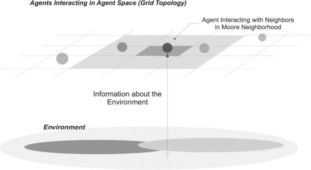
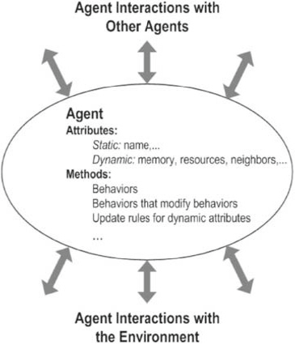
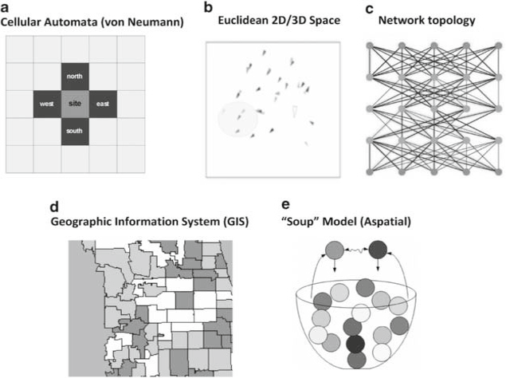

# 基于智能体的建模和仿真教程 Tutorial on agent-based modeling and simulation

> <b> CM Macal and MJ North</b>

> Center for Complex Adaptive Agent Systems Simulation, Decision & Information Sciences Division, Argonne National Laboratory, Argonne, Il, USA; and Computation Institute, The University of Chicago, Chicago, Il, USA
 
 美国伊利诺伊州阿贡市阿贡国家实验室决策与信息科学部复杂自适应智能体系统仿真中心;和芝加哥大学计算研究所，美国伊利诺伊州芝加哥

> Agent-based modeling and simulation (ABMS) is a relatively new approach to modeling systems composed of autonomous, interacting agents. Agent-based modeling is a way to model the dynamics of complex systems and complex adaptive systems. Such systems often self-organize themselves and create emergent order. Agent-based models also include models of behaviour (human or otherwise) and are used to observe the collective effects of agent behaviours and interactions. The development of agent modeling tools, the availability of micro-data, and advances in computation have made possible a growing number of agent-based applications across a variety of domains and disciplines. This article provides a brief introduction to ABMS, illustrates the main concepts and foundations, discusses some recent applications across a variety of disciplines, and identifies methods and toolkits for developing agent models.

基于智能体的建模和仿真 （ABMS） 是一种相对较新的方法，用于对由自主交互智能体组成的系统进行建模。基于智能体的建模是一种对复杂系统和复杂自适应系统的动力学进行建模的方法。这样的系统经常自我组织并创造紧急秩序。基于智能体的模型还包括行为模型（人类或其他），用于观察智能体行为和互动的集体效应。智能体建模工具的发展、微数据的可用性以及计算的进步使越来越多的基于智能体的应用成为可能，这些应用跨越了各种领域和学科。本文简要介绍了 ABMS，说明了主要概念和基础，讨论了跨各种学科的一些最新应用，并确定了开发代理模型的方法和工具包。

## 1. Introduction 

> Agent-based modeling and simulation (ABMS) is a relatively new approach to modeling complex systems composed of interacting, autonomous ‘agents’. Agents have behaviours, often described by simple rules, and interactions with other agents, which in turn influence their behaviours. By modeling agents individually, the full effects of the diversity that exists among agents in their attributes and behaviours can be observed as it gives rise to the behaviour of the system as a whole. By modeling systems from the ‘ground up’—agent-by-agent and interaction-by-interaction—self-organization can often be observed in such models. Patterns, structures, and behaviours emerge that were not explicitly programmed into the models, but arise through the agent interactions. The emphasis on modeling the heterogeneity of agents across a population and the emergence of self-organization are two of the distinguishing features of agent-based simulation as compared to other simulation techniques such as discrete-event simulation and system dynamics. Agent-based modeling offers a way to model social systems that are composed of agents who interact with and influence each other, learn from their experiences, and adapt their behaviours so they are better suited to their environment.

基于智能体的建模和仿真 （ABMS） 是一种相对较新的方法，用于对由交互式自主“智能体”组成的复杂系统进行建模。智能体的行为通常由简单的规则描述，以及与其他智能体的互动，这反过来又会影响他们的行为。通过单独对智能体进行建模，可以观察到智能体之间在属性和行为中存在的多样性的全部影响，因为它导致了整个系统的行为。通过从头开始对系统进行建模——逐个代理和逐个交互——通常可以在此类模型中观察到自组织。模式、结构和行为的出现没有明确地编程到模型中，而是通过智能体交互产生的。与其他模拟技术（如离散事件模拟和系统动力学）相比，强调对群体中智能体的异质性进行建模和自组织的出现是基于智能体的模拟的两个显着特征。基于智能体的建模提供了一种对社会系统进行建模的方法，这些社会系统由智能体组成，这些智能体相互影响和影响，从他们的经验中学习，并调整他们的行为，使他们更好地适应他们的环境。

> Applications of agent-based modeling span a broad range of areas and disciplines. Applications range from modeling agent behaviour in the stock market (Arthur et al, 1997) and supply chains (Macal, 2004a) to predicting the spread of epidemics (Bagni et al, 2002) and the threat of bio-warfare (Carley et al, 2006), from modeling the adaptive immune system (Folcik et al, 2007) to understanding consumer purchasing behaviour (North et al, 2009), from understanding the fall of ancient civilizations (Kohler et al, 2005) to modeling the engagement of forces on the battlefield (Moffat et al, 2006) or at sea (Hill et al, 2006), and many others. Some of these applications are small but elegant models, which include only the essential details of a system, and are aimed at developing insights into a social process or behaviour. Other agent-based models are large scale in nature, in which a system is modeled in great detail, meaning detailed data are used, the models have been validated, and the results are intended to inform policies and decision making. These applications have been made possible by advances in the development of specialized agent-based modeling software, new approaches to agent-based model development, the availability of data at increasing levels of granularity, and advancements in computer performance.

基于智能体的建模的应用涵盖了广泛的领域和学科。应用范围从模拟股票市场（Arthur et al， 1997）和供应链（Macal， 2004a）中的代理行为，到预测流行病的传播（Bagni et al， 2002）和生物战的威胁（Carley et al， 2006），从模拟适应性免疫系统（Folcik et al， 2007）到了解消费者的购买行为（North et al， 2009），从了解古代文明的衰落（Kohler et al， 2005）到模拟战场上的部队交战（Moffat et al， 2006）或海上（Hill et al， 2006）等等。其中一些应用程序是小而优雅的模型，仅包含系统的基本细节，旨在开发对社会过程或行为的见解。其他基于智能体的模型本质上是大规模的，其中系统被非常详细地建模，这意味着使用详细的数据，模型已经过验证，结果旨在为政策和决策提供信息。这些应用之所以成为可能，是因为基于智能体的专用建模软件的开发、基于智能体的模型开发的新方法、粒度不断提高的数据可用性以及计算机性能的进步。

> Several indicators of the growing interest in agent-based modeling include the number of conferences and workshops devoted entirely to or having tracks on agent-based modeling, the growing number of peer-reviewed publications in discipline-specific academic journals across a wide range of application areas as well as in modeling and simulation journals, the growing number of openings for people specializing in agent-based modeling, and interest on the part of funding agencies in supporting programmes that require agent-based models. For example, a perusal of the programme for a recent Winter Simulation Conference revealed that 27 papers had the word ‘agent’ in the title or abstract (see http://www.wintersim.org/pastprog.htm).

对基于智能体的建模日益增长的兴趣的几个指标包括完全致力于或跟踪基于智能体的建模的会议和研讨会的数量，在广泛的应用领域以及建模和仿真期刊的特定学科学术期刊上发表的同行评审出版物数量不断增加，越来越多的基于智能体建模的专门人员的职位空缺， 以及供资机构对支持需要基于代理的模式的计划的兴趣。例如，仔细阅读最近一次冬季模拟会议的议程发现，有27篇论文的标题或摘要中有“代理人”一词（见 http://www.wintersim.org/pastprog.htm）。

## Agent-based modeling

### 2.1 Agent-based modeling and complexity 

> ABMS can be traced to investigations into complex systems (Weisbuch, 1991), complex adaptive systems (Kauffman, 1993; Holland, 1995), and artificial life (Langton, 1989), known as ALife (see Macal (2009) for a review of the influences of investigations into artificial life on the development of agent-based modeling and the article by Heath and Hill in this issue for a review of other early influences). Complex systems consist of interacting, autonomous components; complex adaptive systems have the additional capability for agents to adapt at the individual or population levels. These collective investigations into complex systems sought to identify universal principles of such systems, such as the basis for self-organization, emergent phenomenon, and the origins of adaptation in nature. ABMS began largely as the set of ideas, techniques, and tools for implementing computational models of complex adaptive systems. Many of the early agent-based models were developed using the Swarm modeling software designed by Langton and others to model ALife (Minar et al, 1996). Initially, agent behaviours were modeled using exceedingly simple rules that still led to exceedingly complex emergent behaviours. In the past 10 years or so, available agent-based modeling software tools and development environments have expanded considerably in both numbers and capabilities.

ABMS可以追溯到对复杂系统（Weisbuch，1991），复杂自适应系统（Kauffman，1993;Holland， 1995）和人工生命（Langton， 1989），称为ALife（参见Macal （2009）对人工生命研究对基于智能体的建模发展的影响的回顾，以及Heath和Hill在本期中的文章对其他早期影响的回顾）。复杂系统由相互作用的自主组件组成;复杂的适应性系统具有代理在个体或群体水平上适应的额外能力。这些对复杂系统的集体调查试图确定这些系统的普遍原则，例如自组织的基础、涌现现象和自然界适应的起源。ABMS最初是一套用于实现复杂自适应系统计算模型的想法、技术和工具。许多早期基于智能体的模型是使用 Langton 等人设计的 Swarm 建模软件开发的，用于对 ALife 进行建模（Minar 等人，1996 年）。最初，智能体行为是使用极其简单的规则建模的，这些规则仍然导致极其复杂的紧急行为。在过去 10 年左右的时间里，可用的基于智能体的建模软件工具和开发环境在数量和功能上都得到了极大的扩展。

> Following the conventional definition of simulation, we use the term ABMS in this article to refer to both agent-based simulation, in which a dynamic and time-dependent process is modeled, and more general kinds of agent-based modeling that includes models designed to do optimization (see, eg, Olariu and Zomaya, 2006) or search (see, eg, Hill et al, 2006). For example, particle swarm optimization and ant optimization algorithms are both inspired by agent-based modeling approaches and are used to achieve an end (optimal) state rather than to investigate a dynamic process, as in a simulation.

遵循模拟的传统定义，我们在本文中使用术语ABMS来指代基于智能体的模拟，其中对动态和时间依赖的过程进行建模，以及更通用的基于智能体的建模，包括旨在进行优化的模型（参见，例如，Olariu和Zomaya，2006）或搜索（参见，例如，Hill等人， 例如，粒子群优化和蚂蚁优化算法都受到基于智能体的建模方法的启发，用于实现最终（最佳）状态，而不是像模拟那样研究动态过程。

### 2.2 Structure of an agent-based model 基于智能体模型的结构

> A typical agent-based model has three elements:
> 1. A set of agents, their attributes and behaviours.
> 2. A set of agent relationships and methods of interaction: An underlying topology of connectedness defines how and with whom agents interact.
> 3. The agents’ environment: Agents interact with their environment in addition to other agents.

典型的基于智能体的模型有三个元素：
1. 一组代理，它们的属性和行为。
2. 一组代理关系和交互方法：连接性的基础拓扑定义了代理交互的方式和对象。
3. 代理的环境：除了其他代理之外，代理还与其环境交互。

> A model developer must identify, model, and program these elements to create an agent-based model. The structure of a typical agent-based model is shown in Figure 2.1. Each of the components in Figure 2.1 is discussed in this section. A computational engine for simulating agent behaviours and agent interactions is then needed to make the model run. An agent-based modeling toolkit, programming language or other implementation provides this capability. To run an agent-based model is to have agents repeatedly execute their behaviours and interactions. This process often does, but is not necessarily modeled to, operate over a timeline, as in time-stepped, activity-based, or discrete-event simulation structures.

模型开发人员必须对这些元素进行识别、建模和编程，以创建基于代理的模型。典型的基于智能体的模型的结构如图 2.1 所示。本节将讨论图 2.1 中的每个组件。然后需要一个用于模拟智能体行为和智能体交互的计算引擎来使模型运行。基于代理的建模工具包、编程语言或其他实现提供了此功能。运行基于智能体的模型就是让智能体重复执行其行为和交互。此过程通常（但不一定建模为）在时间轴上运行，例如在时间步长、基于活动或离散事件的模拟结构中。

> Figure 2.1 The structure of a typical agent-based model, as in Sugarscape (Epstein and Axtell, 1996)
> 
> 

### 2.3 Autonomous agents / 自主代理

> The single most important defining characteristic of an agent is its capability to act autonomously, that is, to act on its own without external direction in response to situations it encounters. Agents are endowed with behaviours that allow them to make independent decisions. Typically, agents are active, initiating their actions to achieve their internal goals, rather than merely passive, reactively responding to other agents and the environment.

智能体最重要的一个定义特征是它能够自主行动，也就是说，在没有外部指导的情况下自行行动以应对它遇到的情况。代理人被赋予了能够做出独立决定的行为。通常，智能体是主动的，发起他们的行动以实现其内部目标，而不仅仅是被动的，被动地响应其他智能体和环境。

> There is no universal agreement in the literature on the precise definition of an agent beyond the essential property of autonomy. Jennings (2000) provides a computer science definition of agent that emphasizes the essential characteristic of autonomous behaviour. Some authors consider any type of independent component (software, model, individual, etc) to be an agent (Bonabeau, 2001). In this view, a component’s behaviour can range from simplistic and reactive ‘if-then’ rules to complex behaviours modeled by adaptive artificial intelligence techniques. Other authors insist that a component’s behaviour must be adaptive, able to learn and change its behaviours in response to its experiences, to be called an agent. Casti (1997) argues that agents should contain both base-level rules for behaviour and higher-level rules that are in effect ‘rules to change the rules’. The base-level rules provide more passive responses to the environment, whereas the ‘rules to change the rules’ provide more active, adaptive capabilities.

在文献中，除了自治的基本属性之外，关于代理人的精确定义没有普遍的共识。Jennings（2000）提供了智能体的计算机科学定义，强调了自主行为的基本特征。一些作者认为任何类型的独立组件（软件、模型、个人等）都是代理（Bonabeau，2001）。在这种观点中，组件的行为范围可以从简单和反应性的“如果-那么”规则到由自适应人工智能技术建模的复杂行为。其他作者坚持认为，组件的行为必须是适应性的，能够学习和改变其行为以响应其经验，才能被称为代理。Casti（1997）认为，智能体应该包含行为的基本规则和更高层次的规则，这些规则实际上是“改变规则的规则”。基本规则提供对环境的更被动响应，而“更改规则的规则”则提供更主动的自适应功能。

> From a practical modeling standpoint, based on how and why agent-models are actually built and described in applications, we consider agents to have certain essential characteristics:

从实际建模的角度来看，基于在应用程序中实际构建和描述智能体模型的方式和原因，我们认为智能体具有某些基本特征：

> - An agent is a `self-contained`, modular, and uniquely identifiable individual. The modularity requirement implies that an agent has a boundary. One can easily determine whether something is part of an agent, is not part of an agent, or is a shared attribute. Agents have attributes that allow the agents to be distinguished from and recognized by other agents.

- 代理是一个`独立的`、模块化的、唯一可识别的个体。模块化要求意味着代理具有边界。人们可以很容易地确定某物是代理的一部分，还是不是代理的一部分，或者是共享属性。代理具有允许代理与其他代理区分开来并被其他代理识别的属性。

> - An agent is `autonomous` and self-directed. An agent can function independently in its environment and in its interactions with other agents, at least over a limited range of situations that are of interest in the model. An agent has behaviours that relate information sensed by the agent to its decisions and actions. An agent’s information comes through interactions with other agents and with the environment. An agent’s behaviour can be specified by anything from simple rules to abstract models, such as neural networks or genetic programs that relate agent inputs to outputs through adaptive mechanisms.

- 代理是`自主`的和自我导向的。智能体可以在其环境中以及与其他智能体的交互中独立运行，至少在模型中感兴趣的有限范围内是这样。智能体的行为将智能体感知到的信息与其决策和行动相关联。代理的信息来自与其他代理和环境的交互。智能体的行为可以由任何内容来指定，从简单的规则到抽象的模型，例如通过自适应机制将智能体输入与输出相关联的神经网络或遗传程序。

> - An agent has a `state` that varies over time. Just as a system has a state consisting of the collection of its state variables, an agent also has a state that represents the essential variables associated with its current situation. An agent’s state consists of a set or subset of its attributes. The state of an agent-based model is the collective states of all the agents along with the state of the environment. An agent’s behaviours are conditioned on its state. As such, the richer the set of an agent’s possible states, the richer the set of behaviours that an agent can have. In an agent-based simulation, the state at any time is all the information needed to move the system from that point forward.

- 代理的 `状态` 随时间而变化。正如系统具有由其状态变量集合组成的状态一样，代理也具有表示与其当前情况相关的基本变量的状态。代理的状态由其属性的集合或子集组成。基于智能体的模型的状态是所有智能体的集合状态以及环境的状态。智能体的行为取决于其状态。因此，智能体的可能状态集越丰富，智能体可以拥有的行为集就越丰富。在基于智能体的模拟中，任何时候的状态都是将系统从该点向前移动所需的所有信息。

> - An agent is `social` having dynamic interactions with other agents that influence its behaviour. Agents have protocols for interaction with other agents, such as for communication, movement and contention for space, the capability to respond to the environment, and others. Agents have the ability to recognize and distinguish the traits of other agents.

- 智能体是具有`社交`性的，与其他智能体进行动态交互，从而影响其行为。智能体具有与其他智能体交互的协议，例如通信、移动和空间争用、对环境的响应能力等。智能体具有识别和区分其他智能体特征的能力。

> Agents may also have other useful characteristics:

代理还可能具有(一些)其他有用的特征：

> - An agent may be `adaptive`, for example, by having rules or more abstract mechanisms that modify its behaviours. An agent may have the ability to learn and adapt its behaviours based on its accumulated experiences. Learning requires some form of memory. In addition to adaptation at the individual level, populations of agents may be adaptive through the process of selection, as individuals better suited to the environment proportionately increase in numbers.

- 智能体可能具有`自适应性`，例如，通过具有规则或更抽象的机制来修改其行为。智能体可能有能力根据其积累的经验学习和调整其行为。学习需要某种形式的记忆。除了个体层面的适应外，主体种群还可以通过选择过程进行适应，因为更适合环境的个体数量成比例地增加。

> - An agent may be `goal-directed`, having goals to achieve (not necessarily objectives to maximize) with respect to its behaviours. This allows an agent to compare the outcome of its behaviours relative to its goals and adjust its responses and behaviours in future interactions.

- 智能体可能是以`目标为导向`的，在其行为方面有要实现的目标（不一定是最大化的目标）。这允许智能体将其行为的结果与其目标进行比较，并在未来的交互中调整其反应和行为。

> Agents may be `heterogeneous`. Unlike particle simulation that considers relatively homogeneous particles, such as idealized gas particles, or molecular dynamics simulations that model individual molecules and their interactions, agent simulations often consider the full range of agent diversity across a population. Agent characteristics and behaviours may vary in their extent and sophistication, how much information is considered in the agent’s decisions, the agent’s internal models of the external world, the agent’s view of the possible reactions of other agents in response to its actions, and the extent of memory of past events the agent retains and uses in making its decisions. Agents may also be endowed with different amounts of resources or accumulate different levels of resources as a result of agent interactions, further differentiating agents.

- 代理可能是`异质的`。与考虑相对均匀粒子（如理想化气体粒子）的粒子模拟或模拟单个分子及其相互作用的分子动力学模拟不同，智能体模拟通常考虑整个群体中所有智能体多样性。智能体的特征和行为可能在其程度和复杂程度、智能体的决策中考虑了多少信息、智能体对外部世界的内部模型、智能体对其他智能体对其行为的反应的可能反应的看法，以及智能体在做出决策时保留和使用的对过去事件的记忆程度。由于智能体的相互作用，智能体还可以被赋予不同数量的资源或积累不同水平的资源，从而进一步区分智能体。

> A typical agent structure is illustrated in Figure 2.2. In an agent-based model, everything associated with an agent is either an agent attribute or an agent method that operates on the agent. Agent attributes can be static, not changeable during the simulation, or dynamic, changeable as the simulation progresses. For example, a static attribute is an agent’s name; a dynamic attribute is an agent’s memory of past interactions. Agent methods include behaviours, such as rules or more abstract representations such as neural networks, which link the agent’s situation with its action or set of potential actions. An example is the method that an agent uses to identify its neighbours.

典型的智能体结构如图 2.2 所示。在基于代理的模型中，与代理关联的所有内容要么是代理属性，要么是对代理进行操作的代理方法。智能体属性可以是静态的，在模拟过程中不可更改，也可以是动态的，随着模拟的进行而改变。例如，静态属性是代理的名称;动态属性是智能体对过去交互的记忆。代理方法包括行为（如规则）或更抽象的表示（如神经网络），它们将代理的情况与其动作或一组潜在动作联系起来。例如，代理用于标识其邻居的方法。

> A theory of agent behaviour for the situations or contexts the agent encounters in the model is needed to model agent behaviour. One may begin with a normative model in which agents attempt to optimize profits, utility, etc, as a starting point for developing a simpler, more descriptive, but realistic, heuristic model of behaviour. One may also begin with a behavioural model if there is available behavioural theory and empirical data to support the application. For example, numerous theories and empirically based heuristics exist for modeling consumer shopping behaviour. These could be implemented and compared in an agent-based model. Cognitive science and related disciplines focus on agents and their social behaviours (Sun, 2006). Behavioural modeling frameworks such as BDI (Belief-Desire-Intent) combine modal and temporal logics as the basis for reactive planning and agent action selection (Wooldridge, 2000). In agent-based modeling applications in which learning is important, theories of learning by individual agents or collectives of agents become important. The field of machine learning is another source of learning algorithms for recognizing patterns in data (such as data mining) through techniques such as supervised learning, unsupervised learning, and reinforcement learning (Alpayd yn, 2004; Bishop, 2007). Genetic algorithms (Goldberg, 1989) and related techniques such as learning classifier systems (Holland et al, 2000) are also commonly used in agent-based models.

需要针对代理在模型中遇到的情境或上下文的代理行为理论来模拟代理行为。人们可以从一个规范模型开始，在这个模型中，代理人试图优化利润、效用等，作为开发一个更简单、更具描述性但现实的启发式行为模型的起点。如果有可用的行为理论和经验数据来支持该应用，也可以从行为模型开始。例如，有许多理论和基于经验的启发式方法可用于对消费者购物行为进行建模。这些可以在基于智能体的模型中实现和比较。认知科学和相关学科专注于智能体及其社会行为（Sun，2006）。行为建模框架，如BDI（信念-欲望-意图）将模态和时间逻辑结合起来，作为反应性计划和代理行动选择的基础（Wooldridge，2000）。在基于智能体的建模应用中，学习很重要，单个智能体或智能体集体的学习理论变得很重要。机器学习领域是学习算法的另一个来源，用于通过监督学习、无监督学习和强化学习等技术识别数据模式（例如数据挖掘）（Alpayd yn，2004;Bishop，2007 年）。遗传算法（Goldberg，1989）和相关技术，如学习分类器系统（Holland等人，2000）也常用于基于智能体的模型。

> Figure 2.2 A typical agent
> 
> 
 
### 2.4 Interacting agents

> Agent-based modeling concerns itself with modeling agent relationships and interactions as much as it does modeling agent behaviours. The two primary issues of modeling agent interactions are specifying who is, or could be, connected to who, and the mechanisms of the dynamics of the interactions. Both aspects must be addressed in developing agent-based models.

基于智能体的建模既关注智能体行为的建模，也关注智能体关系和交互的建模。对智能体交互进行建模的两个主要问题是指定谁与谁有关，或者可能与谁有关，以及交互动态的机制。在开发基于智能体的模型时，必须解决这两个方面。

> One of the tenets of complex systems and agent-based modeling is that only `local information` is available to an agent. Agent-based systems are decentralized systems. There is no central authority that either pushes out globally available information to all agents or controls their behaviour in an effort to optimize system performance. Agents interact with other agents, but not all agents interact directly with all the other agents all the time, just as in real-world systems. Agents typically interact with a subset of other agents, termed the agent’s neighbours. Local information is obtained from interactions with an agent’s neighbours (not any agent or all agents) and from its localized environment (not from any part of the entire environment). Generally, an agent’s set of neighbours changes rapidly as a simulation proceeds and agents move through space.

复杂系统和基于智能体的建模的原则之一是，智能体只能获得`本地信息`。基于代理的系统是去中心化系统。没有一个中央机构可以向所有代理推送全球可用的信息，或者控制他们的行为以优化系统性能。代理与其他代理交互，但并非所有代理都始终直接与所有其他代理交互，就像在现实世界的系统中一样。代理通常与其他代理的子集（称为代理的邻居）进行交互。本地信息是通过与代理的邻居（不是任何代理或所有代理）的交互以及从其本地化环境（而不是从整个环境的任何部分）获取的。通常，随着模拟的进行和智能体在空间中的移动，智能体的邻居集会迅速变化。

> How agents are connected to each other is generally termed an agent-based model’s `topology` or connectedness. Typical topologies include a spatial grid or network of nodes (agents) and links (relationships). A topology describes who transfers information to whom. In some applications, agents interact according to multiple topologies. For example, a recent agent-based pandemic model has agents interacting over a spatial grid to model physical contact as agents go through daily activities and possibly pass on infections. Agents also are members of social networks that model the likelihood of contact with relatives and friends.

代理之间的连接方式通常称为基于代理的模型的`拓扑`或连接性。典型的拓扑包括节点（代理）和链接（关系）的空间网格或网络。拓扑描述谁将信息传输给谁。在某些应用程序中，代理根据多个拓扑进行交互。例如，最近基于智能体的大流行模型让智能体通过空间网格进行交互，以模拟智能体在日常活动和可能传播感染时的身体接触。代理也是社交网络的成员，这些社交网络模拟了与亲戚和朋友联系的可能性。

> An agent’s `neighbourhood` is a general concept applicable to whatever agent spaces are defined in the model. For example, an agent could interact only with its neighbours located close-by in physical (or geographical) space as well as neighbour agents located close-by in its social space as specified by the agent’s social network.

智能体`邻居/相邻`一个通用概念，适用于模型中定义的任何智能体空间。例如，代理只能与位于物理（或地理）空间中的邻居以及位于其社交空间附近的邻居进行交互，这是由代理的社交网络指定的。

> Originally, spatial agent-based models were implemented in the form of cellular automata (CA). Conway’s Game of Life (Gardner, 1970) is a good example. CA represent agent interaction patterns and available local informa- tion by using a grid or lattice environment. The cells immediately surrounding an agent are its neighbourhood. Each cell can be interpreted as an agent that interacts with a fixed set of neighbouring cells. The cell (agent) state is either ‘on’ or ‘off’ at any time. Most early spatial agent-based models had the form of a CA. Epstein and Axtell’s Sugarscape model is an example (Epstein and Axtell, 1996). In Sugarscape, the topology was more complex than in a simple CA. Agents were mobile and able to move from cell to cell. The grid essentially became the agents’ environment. Agents were able to acquire resources from the environment that were distributed spatially across the grid.

最初，基于空间代理的模型是以单元自动机 （CA） 的形式实现的。Conway 的 Game of Life（Gardner，1970）就是一个很好的例子。CA 通过使用网格或格子环境来表示智能体交互模式和可用的本地信息。紧邻病原体的细胞是其邻域。每个细胞都可以解释为与一组固定的相邻细胞相互作用的代理。单元（代理）状态随时为“打开”或“关闭”。Epstein 和 Axtell 的 Sugarscape 模型就是一个例子（Epstein 和 Axtell，1996 年）。在 Sugarscape 中，拓扑结构比简单的 CA 更复杂。 代理是可移动的，能够从一个单元移动到另一个单元。网格基本上成为了智能体的环境。代理能够从环境中获取资源，这些资源在空间上分布在网格中。

> Other agent interaction topologies are now commonly used for modeling agent interactions (Figure 2.3). In the CA model, agents move from cell to cell on a grid and no more than a single agent occupies a cell at one time. The von Neumann ‘5-neighbour’ neighbourhood is shown in Figure 2.3a; the ‘9-neighbour’ Moore neighbourhood is also common. In the Euclidean space model, agents roam in two, three or higher dimensional spaces (Figure 2.3b). Networks allow an agent’s neighbourhood to be defined more generally. For the network topology, networks may be static or dynamic (Figure 2.3c). In static networks, links are pre-specified and do not change. For dynamic networks, links, and possibly nodes, are determined endogenously according to the mechanisms programmed in the model. In the geographic information system (GIS) topology, agents move from patch to patch over a realistic geo-spatial landscape (Figure 2.3d). In the ‘soup’, or aspatial model, agents have no location because it is not important (Figure 2.3e); pairs of agents are randomly selected for interaction and then returned to the soup as candidates for future selection. Many agent-based models include agents interacting in multiple topologies.

其他智能体交互拓扑现在通常用于对智能体交互进行建模（图 2.3）。在 CA 模型中，智能体在网格上从一个单元移动到另一个单元，并且一次不超过一个智能体占用一个单元。冯·诺依曼的“五邻”邻域如图2.3a所示;“9 个邻居”摩尔社区也很常见。在欧几里得空间模型中，智能体在二维、三维或更高维空间中漫游（图2.3b）。网络允许更普遍地定义代理的邻域。对于网络拓扑，网络可以是静态的，也可以是动态的（图 2.3c）。在静态网络中，链接是预先指定的，不会更改。对于动态网络，链路和可能的节点是根据模型中编程的机制内生确定的。在地理信息系统 （GIS） 拓扑中，代理在真实的地理空间景观上从一个 patch 移动到另一个 patch （图 2.3d）。在“soup”或空间模型中，智能体没有位置，因为它不重要（图 2.3e）;随机选择成对的代理进行交互，然后作为未来选择的候选者返回soup中。许多基于代理的模型包括在多个拓扑中交互的代理。

> Figure 2.3 Topologies for agent relationships and social interaction
> 
> 

### 2.5 Agent environment

> Agents interact with their environment and with other agents. The environment may simply be used to provide information on the spatial location of an agent relative to other agents or it may provide a rich set of geographic information, as in a GIS. An agent’s location, included as a dynamic attribute, is sometimes needed to track agents as they move across a landscape, contend for space, acquire resources, and encounter other situations. Complex environ- mental models can be used to model the agents’ environment. For example, hydrology or atmospheric dispersion models can provide point location- specific data on groundwater levels or atmospheric pollutants, respectively, which are accessible by agents. The environment may thus constrain agent actions. For example, the environment in an agent-based transportation model would include the infrastructure and capacities of the nodes and links of the road network. These capacities would create congestion effects (reduced travel speeds) and limit the number of agents moving through the transportation network at any given time.

代理与其环境和其他代理进行交互。环境可以简单地用于提供有关一个智能体相对于其他智能体的空间位置的信息，或者它可以提供一组丰富的地理信息，如在 GIS 中。有时需要智能体的位置作为动态属性包含在内，以跟踪智能体在景观中移动、争夺空间、获取资源以及遇到其他情况。复杂的环境模型可用于对智能体的环境进行建模。例如，水文或大气扩散模型可以分别提供地下水位或大气污染物的点位置特定数据，这些数据可由代理访问。因此，环境可能会限制代理行为。例如，基于智能体的交通模型中的环境将包括道路网络节点和链接的基础设施和容量。这些容量将产生拥堵效应（降低行驶速度），并限制在任何给定时间通过运输网络的代理数量。
