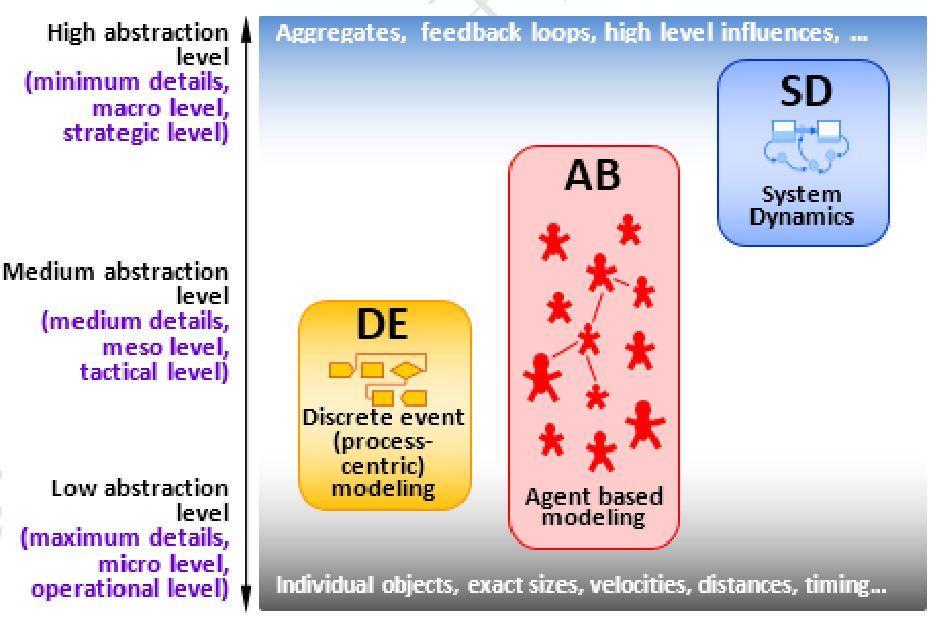
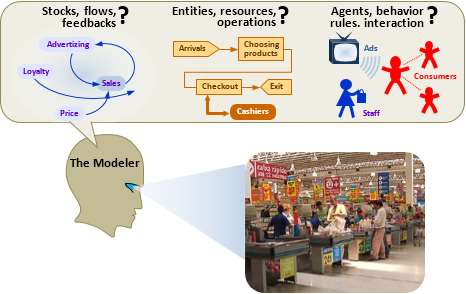

# 仿真学习

##  仿真建模方法：

现代模拟建模使用三种方法：基于离散事件、智能体和系统动力学建模。

在仿真建模中，一种方法是我们用来将真实世界系统映射到其模型的框架。用户可以将方法看作是一种语言类型或模型构建的一种“条款和条件”。这有三种方法：

- 系统动力学
- 离散事件
- 基于智能体

每个方法都为特定的抽象级别服务。

- 系统动力学假设高度抽象，通常用于战略建模。
- 离散事件建模支持中、低抽象。
- 中间是基于智能体的模型，它可以从非常详细的模型(智能体代表物理对象)到高度抽象的模型(智能体代表竞争的公司或政府)不等。

用户在仔细考虑了想要建模的系统和目标之后，用户考虑选择何种方法。

在下图中，建模者的问题将很大程度上决定他们如何建模一个超市。他们可以建立一个过程流程图，顾客是实体和员工资源，基于智能体模型，消费者智能体受到广告，沟通，和他们的交互与智能体和雇员等因素的影响，或一个反馈结构，销售与广告循环，服务质量、价格、和客户忠诚度。

用户可能还会发现，对系统的不同部分建模的最佳方法是使用不同的方法，在这些情况下，多方法模型将最好地满足用户的需求。

# 仿真三要素

## 系统仿真定义

> 以计算机和其它专用物理效应设备为工具，利用系统模型对真实或假想的系统进行试验，并借助于专家经验知识、统计数据和信息资料对试验结果进行分析研究，进而做出决策的一门综合性和试验性学科。

## 仿真三要素

- 系统
- 模型
- 仿真？？ 资源（例如计算资源）

## 三项基本活动

- 系统建模
- 仿真建模
- 仿真实验

# 离散仿真基本概念

- 实体 Entity
  - 临时实体
  - 永久实体
- 属性 attributes
  - 辅助 分类
  - 行为 描述
  - 规则 确定
- 事件 Event
  - 离散系统由事件驱动
  - 引起状态的变化
  - 事件表
- 活动 Activity 
  - 两个事件之间保持某一状态的持续过程
  - 标志系统状态转移
  - 例如： 排队，运输，上菜。。。
- 进程 Process
  - 若干有序事件+若干有序活动
  - 例如： 到达银行-> 排号-> 柜台办理业务（可能还有子进程）-> 离开
- 时钟（仿真时钟）
  - 用于表示仿真时间的变化
  - 步长（最小时间片，可能是随机的，两个相邻事件之间系统状态不会发生任何变化）
  - 推进速度具有随机性
  - 事件调度法（以事件为单位推进）、固定增量推进法（以时间为单位推进）
- 计数器（统计分析数据）counter
  - 统计系统中的有关变量（关心的数据）